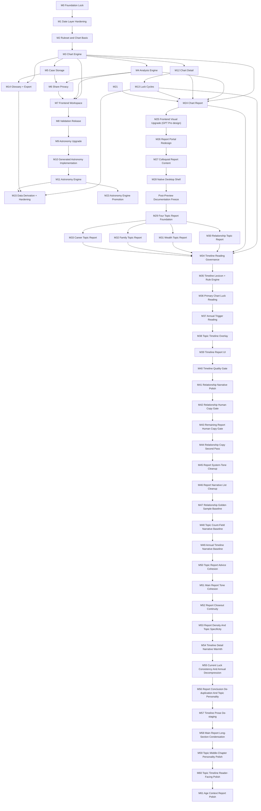

# 命轨开发里程碑总索引

> 本目录是实现之前的路线图层。它不把目标功能直接标为 supported，只定义每一阶段的进入条件、交付件、治理同步、验收门禁和禁止回退规则。

## 1. 当前基线

| 基线项 | 状态 | 证据 |
| --- | --- | --- |
| Rust 后端 + JS 前端 | accepted-current | `docs/decisions/0001-stack-and-data-source.md` |
| Android 万年历日期层 | accepted-current | `docs/decisions/0002-android-date-layer-source.md` |
| V1 研究报告 | accepted-design | `docs/decisions/0003-v1-research-governance-baseline.md` |
| RPT-004 四专项研究报告 | accepted-design | `markdown/reserch/04-topic-report-engine-governance-intake.md` |
| `ft-v1-default` 排盘规则 | target | `docs/decisions/0004-v1-calculation-ruleset-target.md` |
| 隐私与安全解释政策 | target-policy | `docs/decisions/0005-privacy-safe-interpretation-target.md` |
| 项目检查门禁 | active | `tools/check-project.ps1` |

## 2. 里程碑总览

| ID | 文件 | 目标 | 能力状态上限 |
| --- | --- | --- | --- |
| M0 | `01-milestone-00-foundation-lock.md` | 锁定当前骨架、研究、日期层和治理防线 | supported 仅限现有 API |
| M1 | `02-milestone-01-date-layer-hardening.md` | 强化 Android 日期层、规则元数据和黄金样例 | 日期查询 supported |
| M2 | `03-milestone-02-ruleset-and-chart-basis.md` | 建立 `ft-v1-default`、ChartRequest/BirthProfile/ChartBasis | chart basis restricted/planned |
| M3 | `04-milestone-03-chart-engine.md` | 实现四柱排盘、时柱、未知时辰与边界提示 | chart-create supported |
| M4 | `05-milestone-04-analysis-engine.md` | 实现藏干、十神、五行、关系摘要和安全分析输出 | analysis supported |
| M5 | `06-milestone-05-case-storage.md` | 实现案例、偏好、不可变命盘快照和存储边界 | cases/settings restricted |
| M6 | `07-milestone-06-share-privacy.md` | 实现脱敏分享、token、撤销、过期和公开视图 | share restricted |
| M7 | `08-milestone-07-frontend-workspace.md` | 建立命盘工作台、输入流程、详情、分析、日历、术语 | frontend restricted |
| M8 | `09-milestone-08-validation-release.md` | 集成验证、E2E、可访问性、发布候选和回归冻结 | release-candidate supported |
| M9 | `10-milestone-09-astronomy-upgrade.md` | 星历/天文引擎与黄金表升级路线 | astronomy preflight active; engine target |
| M10 | `45-milestone-10-generated-astronomy-implementation.md` | 真实生成星历数据、hash、对照、黄金样例和 replay 证据 | astronomy-engine target/restricted until accepted evidence |
| M11 | `67-milestone-11-astronomy-engine.md` | 实现天文学计算引擎，填充生成件真实数据，执行 Android 对照 | astronomy-engine target until replacement ADR |
| M12 | `68-milestone-12-chart-detail.md` | 实现命盘详情快照，可复现引用和审计 | chart-detail supported |
| M13 | `69-milestone-13-luck-cycles.md` | 实现大运排盘（顺逆、起运），关闭 DG-005 | luck-cycles supported |
| M14 | `70-milestone-14-glossary-export.md` | 实现术语表查询和案例导出 | glossary supported, case-export restricted |
| M15 | `71-milestone-15-data-derivation-hardening.md` | 数据衍生 + V1 加固收口，全部 planned 清零 | V1 closeout complete |
| M16 | `76-milestone-16-frontend-redesign.md` | 前端 dark 主题三栏布局重设计，宣纸底/朱砂/金线/深木盘面 | HTML+CSS+render.js replaced, all IDs preserved |
| M17 | `77-milestone-17-case-export-report.md` | 案例导出 + 分析报告（本地计算，离线） | case-export real implementation |
| M18 | `78-milestone-18-data-derivation.md` | 本地聚合衍生统计（≥5条阈值，隐私保护） | data-derivation real implementation |
| M19 | `79-milestone-19-astronomy-comparison.md` | Android vs 天文引擎对照引擎 | comparison engine framework |
| M20 | `80-milestone-20-golden-replay.md` | 黄金样例 + 重放测试（1901-2100内） | golden rows + replay |
| M21 | `81-milestone-21-deep-analysis.md` | 三命通会/子平法深层蒸馏分析 | 强弱+格局+用神卡片（3 tests） |
| M22 | `82-milestone-22-frontend-report-export.md` | 前端导出分析报告按钮（纯本地） | export button + JSON download |
| M23 | `83-milestone-23-astronomy-engine-promotion.md` | 天文引擎从 target 晋级 supported：replacement ADR + 运行时集成 + 能力晋级 | astronomy-engine supported |
| M24 | `84-milestone-24-chart-report.md` | 新增排盘口语化报告：后端内容生成（硬编码模板）+ 前端单按钮渲染 | chart-report restricted |
| M25 | `85-milestone-25-frontend-visual-upgrade.md` | 采用 GPT Pro 设计系统替换前端视觉：3 栏布局、元素色编码四柱、条形图五行、芯片十神、时间轴大运 | 无能力变化，纯视觉升级 |
| M26 | `86-milestone-26-report-portal-redesign.md` | 报告页升级为玄金星轨卷宗：封面罗盘、悬浮导航、侧栏目录、章节卡片、滚动动画、归档页尾 | 无能力变化 |
| M27 | `87-milestone-27-colloquial-report-content.md` | 零基础白话命盘报告：9 章内容全部重写为口语化，专业术语保留但附带白话解释 | 无能力变化 |
| M28 | `88-milestone-28-desktop-shell.md` | Rust 原生桌面壳：Tao 窗口 + Wry WebView，前端和后端嵌入单一可执行文件 | 无能力变化 |
| M29 | `101-milestone-29-topic-report-foundation.md` | 四专项推演公共基础：TopicReport 合约、年度引动层、2 x 2 左下入口、安全审计 | closed in LOOP-094/095；四专项 restricted |
| M30 | `102-milestone-30-relationship-topic-report.md` | 情感专项命理推演：夫妻宫、配偶星、情感表达、运年引动 | relationship-report restricted |
| M31 | `103-milestone-31-wealth-topic-report.md` | 金钱专项命理推演：正偏财、食伤生财、比劫夺财、承载能力、运年引动 | wealth-report restricted |
| M32 | `104-milestone-32-family-topic-report.md` | 家庭专项命理推演：宫位、印星、比劫、食伤、财官责任、运年引动 | family-report restricted |
| M33 | `105-milestone-33-career-topic-report.md` | 事业专项命理推演：官杀、印星、食伤、财星、格局用神、运年引动 | career-report restricted |
| M34 | `106-milestone-34-timeline-reading-governance.md` | 大运/流年解释层治理预检：DG-012、能力拆分、API 边界、score 边界和安全解释口径 | closed by LOOP-099; ADR 0022 permits M35 internal foundation only |
| M35 | `107-milestone-35-timeline-lexicon-rule-engine.md` | 组合式 timeline 词典和规则引擎：信号、证据、白话解释、规则版本 | closed by LOOP-099 as internal foundation; no public route/UI/capability |
| M36 | `108-milestone-36-primary-chart-luck-reading.md` | 主盘大运阶段解释：当前大运、十年背景、原局关系、白话说明 | closed by LOOP-100; luck-reading restricted |
| M37 | `109-milestone-37-annual-trigger-reading.md` | 指定年份引动解释：显式 year、原局关系、当前大运叠加 | closed by LOOP-101; annual-trigger-reading restricted |
| M38 | `110-milestone-38-topic-timeline-overlay.md` | 四专项大运流年叠加：共享 timeline signal 投射到情感、金钱、家庭、事业 | closed by LOOP-102; topic-timeline-reading restricted |
| M39 | `111-milestone-39-timeline-report-ui.md` | 大运/流年解释报告 UI：工作台短摘要、主盘和四专项完整报告页 | closed by LOOP-103; UI only, no capability change |
| M40 | `112-milestone-40-timeline-quality-gate-closeout.md` | 大运/流年解释质量门禁和 closeout：golden samples、禁用词、no score、no overclaim | closed by LOOP-104; closeout only, no supported promotion |
| M41 | `120-milestone-41-relationship-report-narrative-polish.md` | 情感专项报告叙事打磨：六块正文、开头一次提醒、年度情感引动合并、证据折叠保留 | closed by LOOP-109; no capability change |
| M42 | `122-milestone-42-relationship-report-human-copy-gate.md` | 情感专项真实输出再打磨：压下标记、筛选、提取等机器口吻，锁住命理师式表达 | closed by LOOP-110; no capability change |
| M43 | `124-milestone-43-remaining-report-human-copy-gate.md` | 主盘、金钱、家庭、事业真实输出再打磨：清除内部英文、等号证据和机器口吻 | closed by LOOP-111; no capability change |
| M44 | `126-milestone-44-relationship-copy-second-pass.md` | 情感专项真实输出二次门禁：消除固定开头，合冲刑害术语引号化，锁住同类回归 | closed by LOOP-112; no capability change |
| M45 | `128-milestone-45-report-system-tone-cleanup.md` | 五份真实报告系统口吻清理：主盘算法/系统/评分口吻、四专项计数式摘要、大运标签粘连统一纳入门禁 | closed by LOOP-113; no capability change |
| M46 | `130-milestone-46-report-narrative-list-cleanup.md` | 五份真实报告清单口吻叙事化：年度引动锚点清单、专题十条/五条统计、出现几处计数台账统一纳入门禁 | closed by LOOP-114; no capability change |
| M47 | `132-milestone-47-relationship-golden-sample-baseline.md` | 情感报告黄金样例基线：伴侣星、表达和安全感计数字段转成关系质感叙事，禁止落点式字段回退 | closed by LOOP-115; no capability change |
| M48 | `134-milestone-48-topic-count-field-narrative-baseline.md` | 三专项计数字段叙事基线：金钱、家庭、事业十神落点字段转成专题气质解释，禁止结构字段回退 | closed by LOOP-116; no capability change |
| M49 | `136-milestone-49-annual-timeline-narrative-baseline.md` | 年度/大运流年叙事基线：主盘年度引动与三专项大运流年从清单证据改成连贯读盘顺序 | closed by LOOP-117; no capability change |
| M50 | `138-milestone-50-topic-report-advice-cohesion.md` | 三专项解盘凝聚：金钱、家庭、事业从说明书口吻改成总断、专题入口、年度节奏和关键词结论 | closed by LOOP-118; no capability change |
| M51 | `140-milestone-51-main-report-tone-cohesion.md` | 主盘报告语气凝聚：主盘章节从教学说明改成读盘正文，十神摘要从计数台账改成结构信号 | closed by LOOP-119; no capability change |
| M52 | `142-milestone-52-report-closeout-continuity.md` | 报告收束连续性：主盘旧列表/排序口吻压成读盘语气，金钱、家庭、事业大运流年置于结论前并以专题结论收尾 | closed by LOOP-120; no capability change |
| M53 | `144-milestone-53-report-density-topic-specificity.md` | 报告密度与专题化：主盘五行解释合并为分组读法，金钱、家庭、事业时间段改成贴题建议 | closed by LOOP-121; no capability change |
| M54 | `146-milestone-54-timeline-detail-narrative-warmth.md` | 时间细节叙事暖化：主盘年度引动与三专项大运流年从层次清单改成年度节奏读法 | closed by LOOP-122; no capability change |
| M55 | `148-milestone-55-current-luck-consistency-and-annual-decompression.md` | 当前大运口径一致与年度段落拆解：专题报告使用真实起运上下文和选定年份当前大运，年度证据拆成可读段落 | closed by LOOP-123; no capability change |
| M56 | `150-milestone-56-report-conclusion-de-duplication.md` | 报告结论去复读与切面个性化：压缩情感结论复述，金钱/家庭/事业结论改成贴题收束 | closed by LOOP-124; no capability change |
| M57 | `152-milestone-57-timeline-prose-de-staging.md` | 时间线正文去舞台化：主盘年度引动与三专项大运流年压下教学式“台前/先露出”口吻 | closed by LOOP-125; no capability change |
| M58 | `154-milestone-58-main-report-long-section-condensation.md` | 主盘长段压缩：十神、大运、年度引动保留证据 trace，但可见正文从教材式长段压成读盘摘要 | closed by LOOP-126; no capability change |
| M59 | `156-milestone-59-topic-middle-chapter-personality-polish.md` | 三专项中段个性化：金钱、家庭、事业中段从术语教材改为贴题读盘，并锁住旧标签回退 | closed by LOOP-127; no capability change |
| M60 | `158-milestone-60-topic-timeline-reader-facing-polish.md` | 三专项大运流年读者口吻：金钱、家庭、事业专题时间段从层级说明改成直接读 2026 年专题节奏 | closed by LOOP-128; no capability change |
| M61 | `160-milestone-61-age-context-report-polish.md` | 年龄语境报告打磨：2025/2026 早年样本不再按成人恋爱、收入、岗位或职业结果读法呈现 | closed by LOOP-129; no capability change |

**M0-M28 closed as `v1.0.0-preview`. 用户已取消功能边界锁；M29-M33 已纳入 post-preview 规划边界并完成四专项 restricted 实现。LOOP-096 完成四专题白话化硬化，LOOP-097 完成工作台结构信号摘要与完整专项报告页分层。LOOP-098 已采纳大运/流年重型优化方案并铺设 M34-M40。LOOP-099 通过 ADR 0022 关闭 DG-012，并完成 M35 内部 timeline foundation。LOOP-100 完成 M36 主盘大运解释：`luck-reading` 通过 `/api/charts/report?reading_year=YYYY` 作为 restricted 能力承载；LOOP-101 完成 M37 年度引动解释：`annual-trigger-reading` 通过 `/api/charts/report?year=YYYY` 作为 restricted 能力承载；LOOP-102 完成 M38 四专项大运流年叠加：`topic-timeline-reading` 通过 `/api/charts/topic-report?topic=...&year=YYYY` 作为 restricted 能力承载；LOOP-103 完成 M39 timeline report UI，只改展示层和可读性，不新增 capability；LOOP-104 完成 M40 timeline quality gate closeout，新增 forbidden/no-score/no-overclaim/性能边界回归测试但不新增能力；LOOP-105 完成前端质量修正：重新起盘清空旧专项栏，可见内部英文标识转中文；LOOP-106 完成 timeline 词典文案质量门禁；LOOP-107 完成大规模 timeline 词典优化，扩充 28 个组合式词典条目并加严词典原文/生成文案门禁；LOOP-108 完成报告级强约束，把主盘报告与四专项完整报告最终 API 正文纳入同一 public response 文案门禁；LOOP-109 完成 M41 情感专项报告叙事打磨，限定单一切面、六块正文、不改变能力状态；LOOP-110 完成 M42 情感专项真实输出再打磨，继续只处理 `relationship-report` 的机器口吻；LOOP-111 完成 M43 主盘、金钱、家庭、事业真实输出文案门禁，五份 assembled report 样本均为 0 禁用命中、0 ASCII word；LOOP-112 完成 M44 情感专项真实输出二次门禁，消除固定开头并将合冲刑害类术语引号化；LOOP-113 完成 M45 五份真实报告系统口吻清理，压下主盘算法/系统/评分口吻、四专项计数式摘要和大运标签粘连；LOOP-114 完成 M46 五份真实报告清单口吻叙事化，压下年度引动锚点清单、专题时间线统计和“出现几处”台账；LOOP-115 完成 M47 情感报告黄金样例基线，情感伴侣星、表达和安全感摘要不再露出 `不作主线` / `有一处落点` 等计数字段；LOOP-116 完成 M48 三专项计数字段叙事基线，金钱、家庭、事业把十神落点字段转成专题气质解释；LOOP-117 完成 M49 年度/大运流年叙事基线，主盘和三专项年度段从清单证据改成连贯读盘顺序；LOOP-118 完成 M50 三专项解盘凝聚，金钱/家庭/事业改成总断、专题入口和关键词结论；LOOP-119 完成 M51 主盘报告语气凝聚，主盘章节从教学说明改成读盘正文，十神摘要从计数台账改成结构信号；LOOP-120 完成 M52 报告收束连续性，主盘旧列表/排序口吻继续压实，金钱/家庭/事业的大运流年置于结论前并由专题结论收尾；LOOP-121 完成 M53 报告密度与专题化，主盘五行解释合并为分组读法，金钱/家庭/事业时间段改成 `落到2026年` 的专题建议；LOOP-122 完成 M54 时间细节叙事暖化，主盘年度引动和三专项大运流年改成年度节奏读法；LOOP-123 完成 M55 当前大运口径一致与年度段落拆解，专题报告改用真实起运上下文和选定年份当前大运；LOOP-124 完成 M56 报告结论去复读与切面个性化，情感结论压缩复述，金钱/家庭/事业结论改成贴题收束；LOOP-125 完成 M57 时间线正文去舞台化，主盘年度引动与三专项大运流年压下 `年度本身先露出的`、`推到台前`、`不是罗列符号` 等教学式句子；LOOP-126 完成 M58 主盘长段压缩，主盘十神、大运、年度引动保留证据 trace 但可见正文压成读盘摘要；LOOP-127 完成 M59 三专项中段个性化，金钱、家庭、事业中段从术语教材改为贴题读盘；LOOP-128 完成 M60 三专项大运流年读者口吻，压下 `从「...」专项来看`、`十神与五行这一层`、`本段把它作为阶段背景参考` 等旧 scaffolding；LOOP-129 完成 M61 年龄语境报告打磨，2025/2026 早年样本不再按成人恋爱、收入、投资、岗位或职业结果读法呈现。raw `luck-cycles` 仍保持纯计算。当前 post-preview 运行时为 10 supported、14 restricted、0 planned。**

## 3. 横向治理文件

| 文件 | 作用 |
| --- | --- |
| `90-decision-gates.md` | 所有未决问题的决策门，未关门前不得静默实现 |
| `91-anti-regression-and-governance-lock.md` | 防回退、防治理脱钩、防 supported 误标的硬规则 |
| `92-risk-register.md` | S0/P1/P2 风险台账和缓解路径 |
| `93-capability-promotion-ledger.md` | 能力从 planned 到 supported 的证据清单 |
| `94-closeout-evidence-template.md` | 每个里程碑关闭时必须提交的证据模板 |
| `95-recursive-development-protocol.md` | 递归式开发函数、游标字段、暂停条件和 goal run 条件 |
| `96-recursive-cursor.md` | 当前递归游标，记录状态、范围、门禁和下一步 |
| `97-loop-closeout-log.md` | 每轮递归的结构化返回值和恢复依据 |
| `98-recursive-loop-runbook.md` | 每轮递归的可执行操作手册 |
| `99-milestone-01-preflight-dry-run.md` | M1 的递归预检样例和下一轮推荐切片 |
| `100-recursive-scale-and-goal-readiness.md` | 递归规模优化、goal_run readiness audit 和升级条件 |
| `11-milestone-01-closeout-readiness.md` | M1 closeout 前的证据清单和 milestone_loop 输入 |
| `12-milestone-01-closeout.md` | M1 milestone_loop 正式关闭证据 |
| `13-milestone-02-preflight.md` | M2 milestone_loop 预检和最大稳定切片 |
| `14-milestone-02-closeout.md` | M2 milestone_loop 正式关闭证据 |
| `15-milestone-03-preflight.md` | M3 chart-engine 预检和最大稳定切片 |
| `16-milestone-03-closeout.md` | M3 milestone_loop 正式关闭证据 |
| `17-milestone-04-preflight.md` | M4 analysis-engine 预检和最大稳定切片 |
| `18-milestone-04-closeout.md` | M4 milestone_loop 正式关闭证据 |
| `19-milestone-05-preflight.md` | M5 case-storage 预检和本地易失存储切片 |
| `20-milestone-05-closeout.md` | M5 milestone_loop 正式关闭证据 |
| `21-milestone-06-preflight.md` | M6 share-privacy 预检和本地易失分享切片 |
| `22-milestone-06-closeout.md` | M6 milestone_loop 正式关闭证据 |
| `23-milestone-07-preflight.md` | M7 frontend-workspace 预检和工作台切片 |
| `24-milestone-07-closeout.md` | M7 milestone_loop 正式关闭证据 |
| `25-milestone-08-preflight.md` | M8 validation-release 预检和 release freeze 切片 |
| `26-milestone-08-closeout.md` | M8 milestone_loop 正式关闭证据 |
| `27-milestone-09-preflight.md` | M9 astronomy-upgrade 预检和并行引擎策略 |
| `28-milestone-09-source-availability.md` | M9 源栈可用性探针证据 |
| `29-milestone-09-manifest-draft.md` | M9 generated manifest 草案证据 |
| `30-milestone-09-generation-plan.md` | M9 generated artifact shape 和命令草案证据 |
| `31-milestone-09-generator-dry-run.md` | M9 generator dry-run 骨架证据 |
| `32-milestone-09-comparison-golden-replay-plan.md` | M9 Android 对照、黄金样例和 replay policy 计划证据 |
| `33-milestone-09-comparison-dry-run.md` | M9 comparison dry-run 骨架证据 |
| `34-milestone-09-golden-dry-run.md` | M9 golden-case dry-run 骨架证据 |
| `35-milestone-09-replay-policy-dry-run.md` | M9 replay-policy dry-run 骨架证据 |
| `36-milestone-09-pre-closeout-audit.md` | M9 full closeout blocked / preflight ready 审计证据 |
| `37-milestone-09-generated-data-implementation-plan.md` | M9 generated-data implementation planning 证据 |
| `38-milestone-09-generator-contract.md` | M9 generator contract 证据 |
| `39-milestone-09-source-adapter-contract.md` | M9 source adapter contract 证据 |
| `40-milestone-09-artifact-writer-dry-run.md` | M9 artifact writer dry-run 证据 |
| `41-milestone-09-comparison-runner-dry-run.md` | M9 comparison runner dry-run 证据 |
| `42-milestone-09-golden-row-readiness.md` | M9 golden-row materialization readiness 证据 |
| `43-milestone-09-replay-test-readiness.md` | M9 replay-test materialization readiness 证据 |
| `44-milestone-09-preflight-closeout.md` | M9 preflight-only closeout 证据 |
| `45-milestone-10-generated-astronomy-implementation.md` | M10 generated astronomy implementation 里程碑 |
| `46-milestone-10-generator-entry.md` | M10 guarded generator implementation entry 证据 |
| `47-milestone-10-source-snapshot-boundary.md` | M10 source snapshot manifest boundary 证据 |
| `48-milestone-10-source-snapshot-manifest.md` | M10 source snapshot manifest metadata 证据 |
| `49-milestone-10-source-payload-policy.md` | M10 source payload materialization policy 证据 |
| `50-milestone-10-source-payload-schemas.md` | M10 per-source payload schema-only 证据 |
| `51-milestone-10-source-capture-procedure.md` | M10 source capture procedure-only 证据 |
| `52-milestone-10-first-source-payload-decision.md` | M10 first source payload materialization decision-only 证据 |
| `53-milestone-10-selected-source-payload-preflight.md` | M10 selected-source payload materialization preflight-only 证据 |
| `54-milestone-10-selected-source-payload-materialization.md` | M10 selected-source payload materialization 证据 |
| `55-milestone-10-remaining-source-payload-strategy.md` | M10 remaining source payload strategy-decision-only 证据 |
| `56-milestone-10-selected-iau-sofa-payload-preflight.md` | M10 selected IAU SOFA payload materialization preflight-only evidence |
| `57-milestone-10-selected-iau-sofa-payload-materialization.md` | M10 selected IAU SOFA payload materialization evidence |
| `58-milestone-10-post-iau-remaining-source-payload-strategy.md` | M10 post-IAU remaining source payload strategy-decision-only evidence |
| `59-milestone-10-selected-jpl-horizons-payload-preflight.md` | M10 selected JPL Horizons payload materialization preflight-only evidence |
| `60-milestone-10-selected-jpl-horizons-payload-materialization.md` | M10 selected JPL Horizons validation-query snapshot boundary payload materialization evidence |
| `61-milestone-10-selected-gb-t-payload-preflight.md` | M10 selected GB/T 33661 rule-reference payload materialization preflight-only evidence |
| `62-milestone-10-selected-gb-t-payload-materialization.md` | M10 selected GB/T 33661 rule-reference boundary payload materialization evidence |
| `63-milestone-10-generated-artifact-materialization-preflight.md` | M10 generated astronomy artifact materialization preflight evidence |
| `64-milestone-10-generated-artifact-materialization.md` | M10 generated astronomy artifact materialization evidence |
| `66-milestone-10-closeout.md` | M10 generated astronomy implementation closeout evidence |
| `67-milestone-11-astronomy-engine.md` | M11 astronomy engine implementation 里程碑 |
| `68-milestone-12-chart-detail.md` | M12 chart detail snapshot 里程碑 |
| `69-milestone-13-luck-cycles.md` | M13 luck cycles 里程碑 |
| `70-milestone-14-glossary-export.md` | M14 glossary and case export 里程碑 |
| `71-milestone-15-data-derivation-hardening.md` | M15 data derivation and V1 hardening 里程碑 |
| `72-milestone-12-closeout.md` | M12 chart detail closeout evidence |
| `73-milestone-13-closeout.md` | M13 luck cycles closeout evidence |
| `74-milestone-14-closeout.md` | M14 glossary and case export closeout evidence |
| `75-milestone-15-closeout.md` | M15 data derivation + V1 final closeout evidence |
| `76-milestone-16-frontend-redesign.md` | M16 frontend redesign evidence |
| `77-milestone-17-case-export-report.md` | M17 case export report evidence |
| `78-milestone-18-data-derivation.md` | M18 data derivation completion evidence |
| `79-milestone-19-astronomy-comparison.md` | M19 astronomy comparison evidence |
| `80-milestone-20-golden-replay.md` | M20 golden replay evidence |
| `81-milestone-21-deep-analysis.md` | M21 deep analysis evidence |
| `82-milestone-22-frontend-report-export.md` | M22 frontend report export evidence |
| `83-milestone-23-astronomy-engine-promotion.md` | M23 astronomy engine promotion evidence |
| `84-milestone-24-chart-report.md` | M24 chart report evidence |
| `85-milestone-25-frontend-visual-upgrade.md` | M25 frontend visual upgrade evidence |
| `86-milestone-26-report-portal-redesign.md` | M26 report portal redesign evidence |
| `87-milestone-27-colloquial-report-content.md` | M27 colloquial report content evidence |
| `88-milestone-28-desktop-shell.md` | M28 native desktop shell evidence |
| `89-post-preview-documentation-freeze.md` | Post-preview boundary freeze and four-slice intake rule |
| `101-milestone-29-topic-report-foundation.md` | M29 four topic report foundation |
| `102-milestone-30-relationship-topic-report.md` | M30 relationship topic report |
| `103-milestone-31-wealth-topic-report.md` | M31 wealth topic report |
| `104-milestone-32-family-topic-report.md` | M32 family topic report |
| `105-milestone-33-career-topic-report.md` | M33 career topic report |
| `106-milestone-34-timeline-reading-governance.md` | M34 timeline reading governance and DG-012 preflight |
| `107-milestone-35-timeline-lexicon-rule-engine.md` | M35 timeline lexicon and rule engine |
| `108-milestone-36-primary-chart-luck-reading.md` | M36 primary chart luck reading |
| `109-milestone-37-annual-trigger-reading.md` | M37 annual trigger reading |
| `110-milestone-38-topic-timeline-overlay.md` | M38 topic timeline overlay |
| `111-milestone-39-timeline-report-ui.md` | M39 timeline report UI |
| `112-milestone-40-timeline-quality-gate-closeout.md` | M40 timeline quality gate and closeout |
| `113-milestone-34-closeout-readiness.md` | M34 DG-012 closeout readiness evidence |
| `114-milestone-35-closeout.md` | M35 internal timeline lexicon and rule-engine closeout |
| `115-milestone-36-closeout.md` | M36 primary chart luck reading closeout |
| `116-milestone-37-closeout.md` | M37 annual trigger reading closeout |
| `117-milestone-38-closeout.md` | M38 topic timeline overlay closeout |
| `118-milestone-39-closeout.md` | M39 timeline report UI closeout |
| `119-milestone-40-closeout.md` | M40 timeline quality gate closeout |
| `120-milestone-41-relationship-report-narrative-polish.md` | M41 relationship report narrative polish |
| `121-milestone-41-closeout.md` | M41 relationship report narrative polish closeout |
| `122-milestone-42-relationship-report-human-copy-gate.md` | M42 relationship report human copy gate |
| `123-milestone-42-closeout.md` | M42 relationship report human copy closeout |
| `124-milestone-43-remaining-report-human-copy-gate.md` | M43 remaining report human copy gate |
| `125-milestone-43-closeout.md` | M43 remaining report human copy closeout |
| `126-milestone-44-relationship-copy-second-pass.md` | M44 relationship copy second-pass gate |
| `127-milestone-44-closeout.md` | M44 relationship copy second-pass closeout |
| `128-milestone-45-report-system-tone-cleanup.md` | M45 report system-tone cleanup gate |
| `129-milestone-45-closeout.md` | M45 report system-tone cleanup closeout |
| `130-milestone-46-report-narrative-list-cleanup.md` | M46 report narrative list cleanup gate |
| `131-milestone-46-closeout.md` | M46 report narrative list cleanup closeout |
| `132-milestone-47-relationship-golden-sample-baseline.md` | M47 relationship golden sample baseline |
| `133-milestone-47-closeout.md` | M47 relationship golden sample closeout |
| `134-milestone-48-topic-count-field-narrative-baseline.md` | M48 topic count-field narrative baseline |
| `135-milestone-48-closeout.md` | M48 topic count-field narrative closeout |
| `136-milestone-49-annual-timeline-narrative-baseline.md` | M49 annual timeline narrative baseline |
| `137-milestone-49-closeout.md` | M49 annual timeline narrative closeout |
| `138-milestone-50-topic-report-advice-cohesion.md` | M50 topic report advice cohesion |
| `139-milestone-50-closeout.md` | M50 topic report advice cohesion closeout |
| `140-milestone-51-main-report-tone-cohesion.md` | M51 main report tone cohesion |
| `141-milestone-51-closeout.md` | M51 main report tone cohesion closeout |
| `142-milestone-52-report-closeout-continuity.md` | M52 report closeout continuity |
| `143-milestone-52-closeout.md` | M52 report closeout continuity closeout |
| `144-milestone-53-report-density-topic-specificity.md` | M53 report density and topic specificity |
| `145-milestone-53-closeout.md` | M53 report density and topic specificity closeout |
| `146-milestone-54-timeline-detail-narrative-warmth.md` | M54 timeline detail narrative warmth |
| `147-milestone-54-closeout.md` | M54 timeline detail narrative warmth closeout |
| `148-milestone-55-current-luck-consistency-and-annual-decompression.md` | M55 current luck consistency and annual decompression |
| `149-milestone-55-closeout.md` | M55 current luck consistency and annual decompression closeout |
| `150-milestone-56-report-conclusion-de-duplication.md` | M56 report conclusion de-duplication and topic personality |
| `151-milestone-56-closeout.md` | M56 report conclusion de-duplication and topic personality closeout |
| `152-milestone-57-timeline-prose-de-staging.md` | M57 timeline prose de-staging |
| `153-milestone-57-closeout.md` | M57 timeline prose de-staging closeout |
| `154-milestone-58-main-report-long-section-condensation.md` | M58 main report long-section condensation |
| `155-milestone-58-closeout.md` | M58 main report long-section condensation closeout |
| `156-milestone-59-topic-middle-chapter-personality-polish.md` | M59 topic middle-chapter personality polish |
| `157-milestone-59-closeout.md` | M59 topic middle-chapter personality polish closeout |
| `158-milestone-60-topic-timeline-reader-facing-polish.md` | M60 topic timeline reader-facing polish |
| `159-milestone-60-closeout.md` | M60 topic timeline reader-facing polish closeout |
| `160-milestone-61-age-context-report-polish.md` | M61 age context report polish |
| `161-milestone-61-closeout.md` | M61 age context report polish closeout |

## 4. 依赖顺序

## 5. 不变量

- 研究目标不等于 supported 能力。
- 所有 supported 能力必须有 Rust 真源、API 表面、测试证据和 capability 声明。
- 任何日期层、排盘、分析、分享能力都必须携带规则/版本/边界元数据。
- 不得删除 Android 三柱边界样例，除非 ADR 登记更强替代黄金样例。
- 不得通过前端文案绕过后端能力状态。
- 不得为了实现进度降低日志、隐私、分享脱敏或安全解释规则。
- 里程碑关闭前必须同步工程树、模块树、标准矩阵、流程矩阵和能力晋级台账。
- M9 只允许作为 preflight 里程碑关闭；真实生成数据、hash、对照、黄金样例、replay 和运行时集成必须进入 M10 或后续里程碑。
- M23/M24 是 V1 preview 的最终功能能力切面。M25-M28 只做视觉、内容、报告门户和桌面封装，不新增 capability。`v1.0.0-preview` 发布事实保持不变。
- 用户已取消 post-preview 功能边界锁，并授权四个新功能切面进入规划边界：情感、金钱、家庭、事业。M29-M33 已完成后，四专项均进入 restricted；后续扩展仍不得绕过 M29 公共基础、DG-011、安全审计、模块树和能力台账。
- 四专项报告的状态上限为 restricted。即使实现完成，也必须保留免责声明、规则元数据、非确定性表达和 forbidden-claim audit。
- 大运/流年解释层必须从 M34-M40 进入，且不得改写 M13 `luck-cycles` raw supported 语义；`luck-reading` 已在 M36 通过 chart-report carrier restricted 暴露；`annual-trigger-reading` 已在 M37 通过显式 `year` 的 chart-report carrier restricted 暴露；`topic-timeline-reading` 已在 M38 通过四专项 topic-report carrier restricted 暴露；M39 只关闭 UI/readability；M40 只关闭质量门禁和治理证据，不改变 capability 状态；LOOP-106/LOOP-107 只关闭词典文案与组合式词典质量门禁；LOOP-108 只关闭主盘/四专项最终报告正文的可见文案强约束；M41-M61 只打磨 `relationship-report` 或报告可见正文质量，不改变 capability 状态；这些能力上限均为 restricted；`score_internal` 和 0-100 运势分不得公开。

## 6. 执行协议

1. 开始任一里程碑前，读取本索引、对应里程碑文件、`90-decision-gates.md`、`91-anti-regression-and-governance-lock.md`。
2. 开始任一递归循环前，读取 `95-recursive-development-protocol.md`、`96-recursive-cursor.md`、`100-recursive-scale-and-goal-readiness.md` 和上一轮 `97-loop-closeout-log.md`。
3. 如果有未关闭决策门影响本阶段，不得实现相关代码；只能补决策或保持 planned。
4. 实现时先更新 proposal/影响范围，再动代码。
5. 每个能力只在 `93-capability-promotion-ledger.md` 条件齐备后晋级。
6. 关闭里程碑必须使用 `94-closeout-evidence-template.md` 记录证据；M1 关闭前先读取 `11-milestone-01-closeout-readiness.md`。
7. 关闭每轮递归必须写入 loop closeout，并更新 recursive cursor。

## 7. Recursive Development

当前递归状态以 `96-recursive-cursor.md` 为准。用户敲定方案前，游标保持 `design_only`，不得推进业务代码。用户开始要求单轮推进后，递归粒度默认为单个 work package；流程成熟后再升级为 milestone loop 或 goal run。
