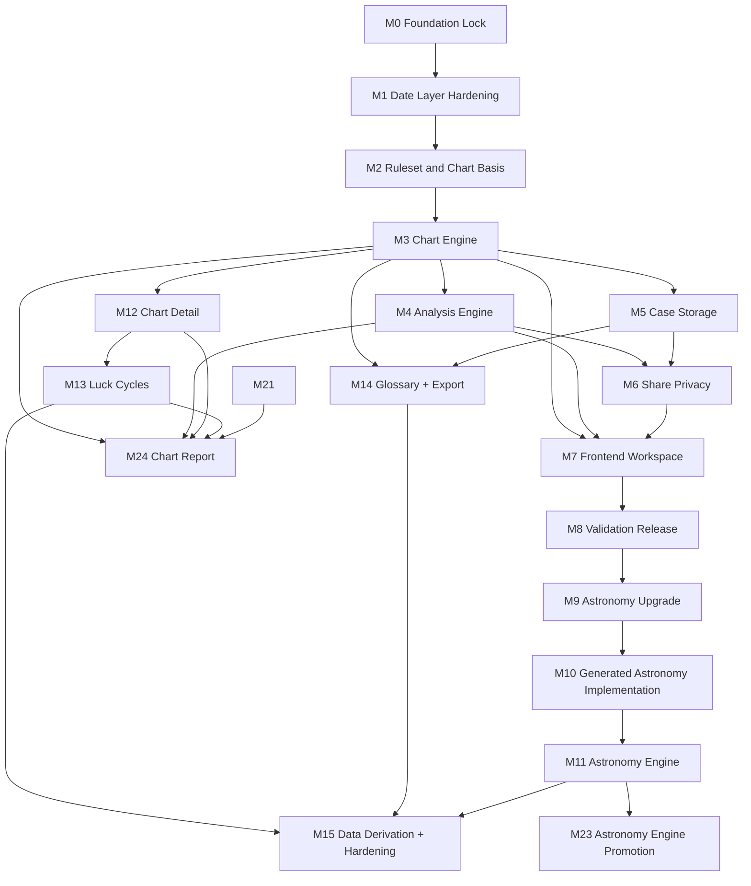

# 命轨开发里程碑总索引

> 本目录是实现之前的路线图层。它不把目标功能直接标为 supported，只定义每一阶段的进入条件、交付件、治理同步、验收门禁和禁止回退规则。

## 1. 当前基线

| 基线项 | 状态 | 证据 |
| --- | --- | --- |
| Rust 后端 + JS 前端 | accepted-current | `docs/decisions/0001-stack-and-data-source.md` |
| Android 万年历日期层 | accepted-current | `docs/decisions/0002-android-date-layer-source.md` |
| V1 研究报告 | accepted-design | `docs/decisions/0003-v1-research-governance-baseline.md` |
| `ft-v1-default` 排盘规则 | target | `docs/decisions/0004-v1-calculation-ruleset-target.md` |
| 隐私与安全解释政策 | target-policy | `docs/decisions/0005-privacy-safe-interpretation-target.md` |
| 项目检查门禁 | active | `tools/check-project.ps1` |

## 2. 里程碑总览

| ID | 文件 | 目标 | 能力状态上限 |
| --- | --- | --- | --- |
| M0 | `01-milestone-00-foundation-lock.md` | 锁定当前骨架、研究、日期层和治理防线 | supported 仅限现有 API |
| M1 | `02-milestone-01-date-layer-hardening.md` | 强化 Android 日期层、规则元数据和黄金样例 | 日期查询 supported |
| M2 | `03-milestone-02-ruleset-and-chart-basis.md` | 建立 `ft-v1-default`、ChartRequest/BirthProfile/ChartBasis | chart basis restricted/planned |
| M3 | `04-milestone-03-chart-engine.md` | 实现四柱排盘、时柱、未知时辰与边界提示 | chart-create supported |
| M4 | `05-milestone-04-analysis-engine.md` | 实现藏干、十神、五行、关系摘要和安全分析输出 | analysis supported |
| M5 | `06-milestone-05-case-storage.md` | 实现案例、偏好、不可变命盘快照和存储边界 | cases/settings restricted |
| M6 | `07-milestone-06-share-privacy.md` | 实现脱敏分享、token、撤销、过期和公开视图 | share restricted |
| M7 | `08-milestone-07-frontend-workspace.md` | 建立命盘工作台、输入流程、详情、分析、日历、术语 | frontend restricted |
| M8 | `09-milestone-08-validation-release.md` | 集成验证、E2E、可访问性、发布候选和回归冻结 | release-candidate supported |
| M9 | `10-milestone-09-astronomy-upgrade.md` | 星历/天文引擎与黄金表升级路线 | astronomy preflight active; engine target |
| M10 | `45-milestone-10-generated-astronomy-implementation.md` | 真实生成星历数据、hash、对照、黄金样例和 replay 证据 | astronomy-engine target/restricted until accepted evidence |
| M11 | `67-milestone-11-astronomy-engine.md` | 实现天文学计算引擎，填充生成件真实数据，执行 Android 对照 | astronomy-engine target until replacement ADR |
| M12 | `68-milestone-12-chart-detail.md` | 实现命盘详情快照，可复现引用和审计 | chart-detail supported |
| M13 | `69-milestone-13-luck-cycles.md` | 实现大运排盘（顺逆、起运），关闭 DG-005 | luck-cycles supported |
| M14 | `70-milestone-14-glossary-export.md` | 实现术语表查询和案例导出 | glossary supported, case-export restricted |
| M15 | `71-milestone-15-data-derivation-hardening.md` | 数据衍生 + V1 加固收口，全部 planned 清零 | V1 closeout complete |
| M16 | `76-milestone-16-frontend-redesign.md` | 前端 dark 主题三栏布局重设计，宣纸底/朱砂/金线/深木盘面 | HTML+CSS+render.js replaced, all IDs preserved |
| M17 | `77-milestone-17-case-export-report.md` | 案例导出 + 分析报告（本地计算，离线） | case-export real implementation |
| M18 | `78-milestone-18-data-derivation.md` | 本地聚合衍生统计（≥5条阈值，隐私保护） | data-derivation real implementation |
| M19 | `79-milestone-19-astronomy-comparison.md` | Android vs 天文引擎对照引擎 | comparison engine framework |
| M20 | `80-milestone-20-golden-replay.md` | 黄金样例 + 重放测试（1901-2100内） | golden rows + replay |
| M21 | `81-milestone-21-deep-analysis.md` | 三命通会/子平法深层蒸馏分析 | 强弱+格局+用神卡片（3 tests） |
| M22 | `82-milestone-22-frontend-report-export.md` | 前端导出分析报告按钮（纯本地） | export button + JSON download |
| M23 | `83-milestone-23-astronomy-engine-promotion.md` | 天文引擎从 target 晋级 supported：replacement ADR + 运行时集成 + 能力晋级 | astronomy-engine supported |
| M24 | `84-milestone-24-chart-report.md` | 新增排盘口语化报告：后端内容生成（硬编码模板）+ 前端单按钮渲染 | chart-report restricted |

**All milestones M0-M24 closed. 86 Rust + 10 frontend tests pass. 10 supported, 7 restricted, 0 target, 0 planned. 边界已锁定。**

## 3. 横向治理文件

| 文件 | 作用 |
| --- | --- |
| `90-decision-gates.md` | 所有未决问题的决策门，未关门前不得静默实现 |
| `91-anti-regression-and-governance-lock.md` | 防回退、防治理脱钩、防 supported 误标的硬规则 |
| `92-risk-register.md` | S0/P1/P2 风险台账和缓解路径 |
| `93-capability-promotion-ledger.md` | 能力从 planned 到 supported 的证据清单 |
| `94-closeout-evidence-template.md` | 每个里程碑关闭时必须提交的证据模板 |
| `95-recursive-development-protocol.md` | 递归式开发函数、游标字段、暂停条件和 goal run 条件 |
| `96-recursive-cursor.md` | 当前递归游标，记录状态、范围、门禁和下一步 |
| `97-loop-closeout-log.md` | 每轮递归的结构化返回值和恢复依据 |
| `98-recursive-loop-runbook.md` | 每轮递归的可执行操作手册 |
| `99-milestone-01-preflight-dry-run.md` | M1 的递归预检样例和下一轮推荐切片 |
| `100-recursive-scale-and-goal-readiness.md` | 递归规模优化、goal_run readiness audit 和升级条件 |
| `11-milestone-01-closeout-readiness.md` | M1 closeout 前的证据清单和 milestone_loop 输入 |
| `12-milestone-01-closeout.md` | M1 milestone_loop 正式关闭证据 |
| `13-milestone-02-preflight.md` | M2 milestone_loop 预检和最大稳定切片 |
| `14-milestone-02-closeout.md` | M2 milestone_loop 正式关闭证据 |
| `15-milestone-03-preflight.md` | M3 chart-engine 预检和最大稳定切片 |
| `16-milestone-03-closeout.md` | M3 milestone_loop 正式关闭证据 |
| `17-milestone-04-preflight.md` | M4 analysis-engine 预检和最大稳定切片 |
| `18-milestone-04-closeout.md` | M4 milestone_loop 正式关闭证据 |
| `19-milestone-05-preflight.md` | M5 case-storage 预检和本地易失存储切片 |
| `20-milestone-05-closeout.md` | M5 milestone_loop 正式关闭证据 |
| `21-milestone-06-preflight.md` | M6 share-privacy 预检和本地易失分享切片 |
| `22-milestone-06-closeout.md` | M6 milestone_loop 正式关闭证据 |
| `23-milestone-07-preflight.md` | M7 frontend-workspace 预检和工作台切片 |
| `24-milestone-07-closeout.md` | M7 milestone_loop 正式关闭证据 |
| `25-milestone-08-preflight.md` | M8 validation-release 预检和 release freeze 切片 |
| `26-milestone-08-closeout.md` | M8 milestone_loop 正式关闭证据 |
| `27-milestone-09-preflight.md` | M9 astronomy-upgrade 预检和并行引擎策略 |
| `28-milestone-09-source-availability.md` | M9 源栈可用性探针证据 |
| `29-milestone-09-manifest-draft.md` | M9 generated manifest 草案证据 |
| `30-milestone-09-generation-plan.md` | M9 generated artifact shape 和命令草案证据 |
| `31-milestone-09-generator-dry-run.md` | M9 generator dry-run 骨架证据 |
| `32-milestone-09-comparison-golden-replay-plan.md` | M9 Android 对照、黄金样例和 replay policy 计划证据 |
| `33-milestone-09-comparison-dry-run.md` | M9 comparison dry-run 骨架证据 |
| `34-milestone-09-golden-dry-run.md` | M9 golden-case dry-run 骨架证据 |
| `35-milestone-09-replay-policy-dry-run.md` | M9 replay-policy dry-run 骨架证据 |
| `36-milestone-09-pre-closeout-audit.md` | M9 full closeout blocked / preflight ready 审计证据 |
| `37-milestone-09-generated-data-implementation-plan.md` | M9 generated-data implementation planning 证据 |
| `38-milestone-09-generator-contract.md` | M9 generator contract 证据 |
| `39-milestone-09-source-adapter-contract.md` | M9 source adapter contract 证据 |
| `40-milestone-09-artifact-writer-dry-run.md` | M9 artifact writer dry-run 证据 |
| `41-milestone-09-comparison-runner-dry-run.md` | M9 comparison runner dry-run 证据 |
| `42-milestone-09-golden-row-readiness.md` | M9 golden-row materialization readiness 证据 |
| `43-milestone-09-replay-test-readiness.md` | M9 replay-test materialization readiness 证据 |
| `44-milestone-09-preflight-closeout.md` | M9 preflight-only closeout 证据 |
| `45-milestone-10-generated-astronomy-implementation.md` | M10 generated astronomy implementation 里程碑 |
| `46-milestone-10-generator-entry.md` | M10 guarded generator implementation entry 证据 |
| `47-milestone-10-source-snapshot-boundary.md` | M10 source snapshot manifest boundary 证据 |
| `48-milestone-10-source-snapshot-manifest.md` | M10 source snapshot manifest metadata 证据 |
| `49-milestone-10-source-payload-policy.md` | M10 source payload materialization policy 证据 |
| `50-milestone-10-source-payload-schemas.md` | M10 per-source payload schema-only 证据 |
| `51-milestone-10-source-capture-procedure.md` | M10 source capture procedure-only 证据 |
| `52-milestone-10-first-source-payload-decision.md` | M10 first source payload materialization decision-only 证据 |
| `53-milestone-10-selected-source-payload-preflight.md` | M10 selected-source payload materialization preflight-only 证据 |
| `54-milestone-10-selected-source-payload-materialization.md` | M10 selected-source payload materialization 证据 |
| `55-milestone-10-remaining-source-payload-strategy.md` | M10 remaining source payload strategy-decision-only 证据 |
| `56-milestone-10-selected-iau-sofa-payload-preflight.md` | M10 selected IAU SOFA payload materialization preflight-only evidence |
| `57-milestone-10-selected-iau-sofa-payload-materialization.md` | M10 selected IAU SOFA payload materialization evidence |
| `58-milestone-10-post-iau-remaining-source-payload-strategy.md` | M10 post-IAU remaining source payload strategy-decision-only evidence |
| `59-milestone-10-selected-jpl-horizons-payload-preflight.md` | M10 selected JPL Horizons payload materialization preflight-only evidence |
| `60-milestone-10-selected-jpl-horizons-payload-materialization.md` | M10 selected JPL Horizons validation-query snapshot boundary payload materialization evidence |
| `61-milestone-10-selected-gb-t-payload-preflight.md` | M10 selected GB/T 33661 rule-reference payload materialization preflight-only evidence |
| `62-milestone-10-selected-gb-t-payload-materialization.md` | M10 selected GB/T 33661 rule-reference boundary payload materialization evidence |
| `63-milestone-10-generated-artifact-materialization-preflight.md` | M10 generated astronomy artifact materialization preflight evidence |
| `64-milestone-10-generated-artifact-materialization.md` | M10 generated astronomy artifact materialization evidence |
| `66-milestone-10-closeout.md` | M10 generated astronomy implementation closeout evidence |
| `67-milestone-11-astronomy-engine.md` | M11 astronomy engine implementation 里程碑 |
| `68-milestone-12-chart-detail.md` | M12 chart detail snapshot 里程碑 |
| `69-milestone-13-luck-cycles.md` | M13 luck cycles 里程碑 |
| `70-milestone-14-glossary-export.md` | M14 glossary and case export 里程碑 |
| `71-milestone-15-data-derivation-hardening.md` | M15 data derivation and V1 hardening 里程碑 |
| `72-milestone-12-closeout.md` | M12 chart detail closeout evidence |
| `73-milestone-13-closeout.md` | M13 luck cycles closeout evidence |
| `74-milestone-14-closeout.md` | M14 glossary and case export closeout evidence |
| `75-milestone-15-closeout.md` | M15 data derivation + V1 final closeout evidence |

## 4. 依赖顺序

## 5. 不变量

- 研究目标不等于 supported 能力。
- 所有 supported 能力必须有 Rust 真源、API 表面、测试证据和 capability 声明。
- 任何日期层、排盘、分析、分享能力都必须携带规则/版本/边界元数据。
- 不得删除 Android 三柱边界样例，除非 ADR 登记更强替代黄金样例。
- 不得通过前端文案绕过后端能力状态。
- 不得为了实现进度降低日志、隐私、分享脱敏或安全解释规则。
- 里程碑关闭前必须同步工程树、模块树、标准矩阵、流程矩阵和能力晋级台账。
- M9 只允许作为 preflight 里程碑关闭；真实生成数据、hash、对照、黄金样例、replay 和运行时集成必须进入 M10 或后续里程碑。
- M23/M24 是 V1 最终能力切面。M23 交付后 `astronomy-engine` 晋级 supported；M24 交付后 `chart-report` 保持 restricted。两个里程碑关闭后，能力矩阵锁死，不再受理功能性新增需求。此后只允许治理同步、缺陷修复、性能优化和已有能力的 restricted→supported 晋级。

## 6. 执行协议

1. 开始任一里程碑前，读取本索引、对应里程碑文件、`90-decision-gates.md`、`91-anti-regression-and-governance-lock.md`。
2. 开始任一递归循环前，读取 `95-recursive-development-protocol.md`、`96-recursive-cursor.md`、`100-recursive-scale-and-goal-readiness.md` 和上一轮 `97-loop-closeout-log.md`。
3. 如果有未关闭决策门影响本阶段，不得实现相关代码；只能补决策或保持 planned。
4. 实现时先更新 proposal/影响范围，再动代码。
5. 每个能力只在 `93-capability-promotion-ledger.md` 条件齐备后晋级。
6. 关闭里程碑必须使用 `94-closeout-evidence-template.md` 记录证据；M1 关闭前先读取 `11-milestone-01-closeout-readiness.md`。
7. 关闭每轮递归必须写入 loop closeout，并更新 recursive cursor。

## 7. Recursive Development

当前递归状态以 `96-recursive-cursor.md` 为准。用户敲定方案前，游标保持 `design_only`，不得推进业务代码。用户开始要求单轮推进后，递归粒度默认为单个 work package；流程成熟后再升级为 milestone loop 或 goal run。
