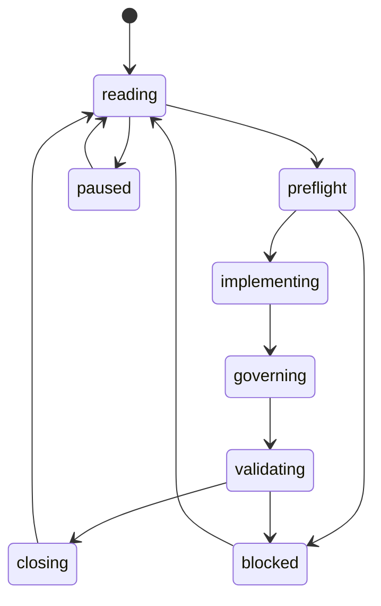

# 递归游标

> 本文件是递归式开发的活游标。每一轮开始前读取，每一轮 closeout 后更新。未得到用户“敲定方案/开始实现”指令前，游标保持 `design_only`，不得推进业务代码。

## Current Cursor

| Field | Value |
| --- | --- |
| `loop_id` | `LOOP-130` |
| `mode` | `single_loop` |
| `current_milestone` | awaiting next user-selected scope after M61 closeout |
| `current_work_package` | LOOP-129 closed M61 age context report polish. Next loop must start from regenerated real report samples and preserve M47 relationship golden sample, M48 topic count-field baseline, M49 annual/timeline narrative baseline, M50 wealth/family/career advice-cohesion baseline, M51 main-report tone-cohesion baseline, M52 report closeout-continuity baseline, M53 density/topic-specificity baseline, M54 timeline-detail warmth baseline, M55 current-luck consistency baseline, M56 conclusion de-duplication baseline, M57 timeline prose de-staging baseline, M58 main-report long-section condensation baseline, M59 topic middle-chapter personality baseline, M60 topic timeline reader-facing baseline, and M61 age-context protection before touching deeper report copy. |
| `state` | `m61_age_context_report_polish_closed` |
| `allowed_scope` | Read current samples/governance, choose next quality slice, or open a new milestone/decision gate for capability expansion. |
| `forbidden_scope` | 禁止在未另开里程碑和 ADR 的情况下把 `luck-reading`、`annual-trigger-reading` 或 `topic-timeline-reading` 晋级 supported；禁止改写 `GET /api/luck/cycles` raw supported 语义；禁止静默默认 API 年份；禁止公开 `score_internal`、0-100 运势分或排序分；禁止宣称完整流月、流日、择日、每日推送或事件预测；禁止把四专项 timeline overlay 包装成金融、婚恋、亲属命运或职业结果断言；情感报告允许低风险关系节奏建议，但不得输出确定性婚恋事件、伴侣身份或高风险现实决策。 |
| `active_decision_gates` | DG-001 through DG-012 closed for current implemented scope; new post-M40 scope must open/close its own gate if it expands capability |
| `active_locks` | LOCK-001 through LOCK-012 active; ADR 0022 permits restricted timeline readings, while supported promotion, raw-route mutation, scores, and full flow-month/day claims remain locked |
| `capability_delta` | V1 preview runtime remains 10 supported, 7 restricted. Post-preview current runtime is 10 supported, 14 restricted, 0 planned. LOOP-100 promotes `luck-reading`; LOOP-101 promotes `annual-trigger-reading`; LOOP-102 promotes `topic-timeline-reading`, all as restricted only. LOOP-103 changes UI only and adds no capability. LOOP-104 closes quality gates only and adds no capability. LOOP-105 fixes frontend stale state/localization only and adds no capability. LOOP-106 adds lexicon-copy quality gates only and adds no capability. LOOP-107 expands dictionary/copy-density gates only and adds no capability. LOOP-108 adds final report body visible-copy gates only and adds no capability. LOOP-109 polishes relationship-report narrative only and adds no capability. LOOP-110 adds relationship-report real-output human-copy gates only and adds no capability. LOOP-111 adds main/wealth/family/career real-output human-copy gates only and adds no capability. LOOP-112 adds relationship-copy second-pass gates only and adds no capability. LOOP-113 adds five-report system-tone cleanup only and adds no capability. LOOP-114 adds five-report narrative-list cleanup only and adds no capability. LOOP-115 adds relationship golden-sample copy gates only and adds no capability. LOOP-116 adds wealth/family/career count-field narrative gates only and adds no capability. LOOP-117 adds annual/timeline narrative gates only and adds no capability. LOOP-118 adds wealth/family/career advice-cohesion copy gates only and adds no capability. LOOP-119 adds main-report tone-cohesion copy gates only and adds no capability. LOOP-120 adds report closeout-continuity copy/order gates only and adds no capability. LOOP-121 adds report density/topic-specificity copy gates only and adds no capability. LOOP-122 adds timeline-detail narrative warmth gates only and adds no capability. LOOP-123 adds current-luck consistency and annual-decompression gates only and adds no capability. LOOP-124 adds conclusion de-duplication and topic-personality gates only and adds no capability. LOOP-125 adds timeline prose de-staging gates only and adds no capability. LOOP-126 adds main-report long-section condensation gates only and adds no capability. LOOP-127 adds wealth/family/career middle-chapter personality gates only and adds no capability. LOOP-128 adds wealth/family/career topic-timeline reader-facing gates only and adds no capability. LOOP-129 adds age-context report-copy gates only and adds no capability. |
| `required_governance_sync` | Next loop must sync roadmap index/README, risk register, capability ledger, module/full trees, cursor, and closeout log before final closeout; no capability status change is allowed without a new milestone and decision gate |
| `validation_commands` | `cargo test -- --nocapture`; `npm.cmd run check --prefix frontend`; `powershell -NoProfile -ExecutionPolicy Bypass -File tools/check-project.ps1`; `cargo check -p minggui-desktop` |
| `last_green_gate` | LOOP-129 closed M61 with real samples regenerated from one consistent profile: `main.txt`, `relationship.txt`, `wealth.txt`, `family.txt`, and `career.txt`. Four topic JSON samples returned audit `passed`; M61 sample scan confirmed early-stage anchors present and adult-context regression phrases absent. Gates passed so far: `cargo fmt`; `cargo test topic_report -- --nocapture`; M61 sample scan. Final broad gates are recorded in `97-loop-closeout-log.md#loop-129`. |
| `last_closeout` | `markdown/20-roadmap/161-milestone-61-closeout.md` and `markdown/20-roadmap/97-loop-closeout-log.md#loop-129` |
| `next_resume_instruction` | 若用户要求继续开发，先读取 `161-milestone-61-closeout.md`、`93-capability-promotion-ledger.md`、`92-risk-register.md`、`00-roadmap-index.md`、`97-loop-closeout-log.md#loop-129` 和当前游标。下一步若继续报告优化，必须先重新生成并审读真实样本；情感报告必须保持 M41 六块正文、M42/M44/M47/M56/M57/M58 门禁、非复读开头、合冲刑害术语引号化、压缩结论复述和无 `不作主线` / `有一处落点` 计数字段；金钱、家庭、事业必须保持 M48-M61 基线，十神线索应翻译成专题气质解释，中段不得回到 `财星分正财和偏财`、`传统上会把`、`印星在家庭专项里主要看`、`官杀代表责任`、`技能表达：`、`同辈边界：` 等术语教材口吻；大运流年章节应位于 `结论` 前并以贴题专题结论收尾，专题时间段应保持直接读 2026 年专题节奏和选定年份 `当前大运` 口径，不得回到 `从「金钱」专项来看`、`从「家庭」专项来看`、`从「事业」专项来看`、`把2026年放进`、`十神与五行这一层`、`五行相处的方式提示`、`藏干、原局位置和当前大运合到一起时`、`藏干、宫位关系和当前大运合到一起时`、`本段把它作为阶段背景参考`、`这里看的不是单点事件`、`年度线索要回到`、`大运首段`、固定 `年龄段约为1至10岁` / `约在 1 至 10 岁`、`参与这组结构`、`这组结构说明`、`日常读法`、`日常看`、`这些牵动提醒您`、`2026年的时间气候`、`先从这些层次落下去看`、`先看天干`、`再看五行关系`、`在这份金钱专项里`、`在这份家庭专项里`、`在这份事业专项里` 或 `在同一张桌上慢慢理清`；早年样本必须保持 M61 年龄语境保护，不得回到 `如果目前单身`、`若已有关系`、`工作场景`、`现实职位高低`、`长期经营`、`现实回报`、`可交付`、`团队边界` 或成人恋爱、收入、投资、岗位、职业结果读法；主盘报告必须保持 M51-M58 直接读盘、收束连续、五行分组、年度段落拆解、时间线去舞台化和长段压缩，不得回到 `这一章看的是`、`这一章先把`、`读这一章时`、`这条线已经进入命盘视野`、`这条十神线索`、`命理结构上，当前阶段大运` 等机器式解释；五份报告必须保持 M43/M45/M46 禁止内部英文、pipe-form 证据、等号证据、半角年龄段、可见后端变量、算法/系统/评分口吻、计数表式摘要、阿拉伯序号式大运标签、锚点清单、时间线统计和 `出现几处` 台账；若扩展 timeline 能力，必须另开里程碑和 ADR，不得污染 raw `luck-cycles`、不得公开 score、不得新增 supported capability。 |

## Cursor Update Rules

- `loop_id` 每轮递增，格式为 `LOOP-001`。
- `mode` 只能按 `design_only -> single_loop -> milestone_loop -> goal_run` 方向升级；降级可随时发生。
- `current_work_package` 必须指向一个明确 WP、流程任务或 blocked reason。
- `capability_delta` 默认为 `none`；任何 planned/restricted/supported 变化必须同步 `93-capability-promotion-ledger.md`。
- `last_green_gate` 必须记录完整门禁通过时间或明确 `not run`。
- `next_resume_instruction` 必须足够具体，使下一轮无需猜测。

## Cursor State Machine

## Mode Upgrade Criteria

| From | To | Required evidence |
| --- | --- | --- |
| `design_only` | `single_loop` | 用户发出敲定方案/开始单轮推进指令 |
| `single_loop` | `milestone_loop` | 连续 3 次 LOOP closeout 成功，且无 S0 |
| `milestone_loop` | `goal_run` | 用户显式要求开启 goal，并确认流程成熟 |

## Manual Override Rule

用户的新指令始终可以暂停、缩小、重置或降级递归游标。任何 override 必须写入 closeout log。
