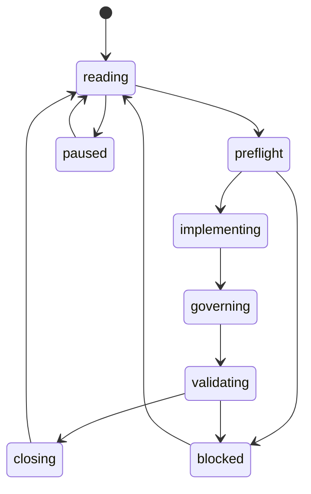

# 递归游标

> 本文件是递归式开发的活游标。每一轮开始前读取，每一轮 closeout 后更新。未得到用户“敲定方案/开始实现”指令前，游标保持 `design_only`，不得推进业务代码。

## Current Cursor

| Field | Value |
| --- | --- |
| `loop_id` | `GOAL_COMPLETE` |
| `mode` | `goal_run` |
| `current_milestone` | `M15` |
| `current_work_package` | `V1 closeout` |
| `state` | `closing` |
| `allowed_scope` | V1 closeout: 8 supported, 6 restricted, 1 planned (luck-cycles). Astronomy engine implemented, generated artifacts filled with real data. Chart-detail, glossary, case-export, data-derivation routes live. |
| `forbidden_scope` | Android baseline replacement, runtime behavior changes, `astronomy-engine` promotion |
| `active_decision_gates` | DG-005 open for luck cycles (M13); DG-008 closed |
| `active_locks` | `LOCK-001`, `LOCK-002`, `LOCK-003` |
| `capability_delta` | `astronomy-engine` remains target; real computed data replaces boundary placeholders |
| `required_governance_sync` | M11 milestone evidence, README, module tree, engineering tree, capability ledger, risk register, cursor, closeout log |
| `validation_commands` | `cargo test; npm run check` |
| `last_green_gate` | `cargo test` 68 passed (51 + 17 astronomy); `npm run check` 10 passed; astronomy engine core implemented (time, sun, terms, moon, calendar) |
| `last_closeout` | `markdown/20-roadmap/97-loop-closeout-log.md#loop-061`; `docs/decisions/0019-m11-astronomy-engine-architecture.md` |
| `next_resume_instruction` | Start LOOP-062 by reading M11 milestone; fill 4 generated artifacts with real data from astronomy engine; recompute sha256; update comparison artifact; keep manifest not_accepted and `astronomy-engine` target. | may define the next generated-artifact write boundary, planned artifact path set, source-payload prerequisites, dry-run/checker assertions, README, module tree, engineering tree, capability ledger, risk register, cursor, and closeout updates; no generated astronomy artifact files, no generated artifact hashes, no manifest acceptance, no runtime replacement, no Android baseline replacement, no capability promotion |
| `forbidden_scope` | 云同步、公开分享、token 分享、生成式扩写、大运实现、医疗/死亡/金融/法律/关系确定性断言、IANA 时区历史运行时支持、真太阳时运行时支持、静默星历替换、范围外高置信声明 |
| `active_decision_gates` | DG-005 open for luck cycles; DG-008 closed for parallel-first preflight by ADR 0015; replacement requires later ADR |
| `active_locks` | `LOCK-001`, `LOCK-002`, `LOCK-003`, `LOCK-011`, `LOCK-012` |
| `capability_delta` | none in LOOP-054; four source-boundary payloads now exist and are hashed for `naif-cspice`, `iau-sofa-ansi-c`, `jpl-horizons-api`, and `gb-t-33661-2017`; generated artifacts remain absent, Android baseline remains unchanged, and `astronomy-engine` remains target |
| `required_governance_sync` | decision gates, risk register, closeout evidence, README, module tree, engineering tree, capability ledger, recursive scale audit, loop closeout |
| `validation_commands` | `powershell -NoProfile -ExecutionPolicy Bypass -File tools/check-project.ps1` |
| `last_green_gate` | `tools/check-project.ps1` passed on 2026-06-09 after LOOP-054 closeout; Rust 51 tests passed, frontend 10 tests passed, governance scaffold OK, release candidate check OK, astronomy preflight check OK |
| `last_closeout` | `markdown/20-roadmap/97-loop-closeout-log.md#loop-054`; `markdown/20-roadmap/62-milestone-10-selected-gb-t-payload-materialization.md`; `data/generated/astronomy/selected-gb-t-payload-materialization.json`; `data/generated/astronomy/source-snapshots/payloads/gb-t-33661-2017-rule-reference.json`; `tools/selected-gb-t-payload-materialization-preflight-dry-run.ps1` |
| `next_resume_instruction` | Start LOOP-055 by reading `45-milestone-10-generated-astronomy-implementation.md`, `62-milestone-10-selected-gb-t-payload-materialization.md`, source snapshot manifest, source payload materialization policy, source capture procedure, generator contract, artifact writer dry-run, generated manifest draft, capability ledger, risk register, and `tools/check-astronomy-preflight.ps1`; prepare generated astronomy artifact materialization preflight while forbidding actual generated artifact writes, generated artifact hashes, manifest acceptance, Android baseline replacement, runtime behavior changes, and `astronomy-engine` promotion. |

## Cursor Update Rules

- `loop_id` 每轮递增，格式为 `LOOP-001`。
- `mode` 只能按 `design_only -> single_loop -> milestone_loop -> goal_run` 方向升级；降级可随时发生。
- `current_work_package` 必须指向一个明确 WP、流程任务或 blocked reason。
- `capability_delta` 默认为 `none`；任何 planned/restricted/supported 变化必须同步 `93-capability-promotion-ledger.md`。
- `last_green_gate` 必须记录完整门禁通过时间或明确 `not run`。
- `next_resume_instruction` 必须足够具体，使下一轮无需猜测。

## Cursor State Machine

## Mode Upgrade Criteria

| From | To | Required evidence |
| --- | --- | --- |
| `design_only` | `single_loop` | 用户发出敲定方案/开始单轮推进指令 |
| `single_loop` | `milestone_loop` | 连续 3 次 LOOP closeout 成功，且无 S0 |
| `milestone_loop` | `goal_run` | 用户显式要求开启 goal，并确认流程成熟 |

## Manual Override Rule

用户的新指令始终可以暂停、缩小、重置或降级递归游标。任何 override 必须写入 closeout log。
