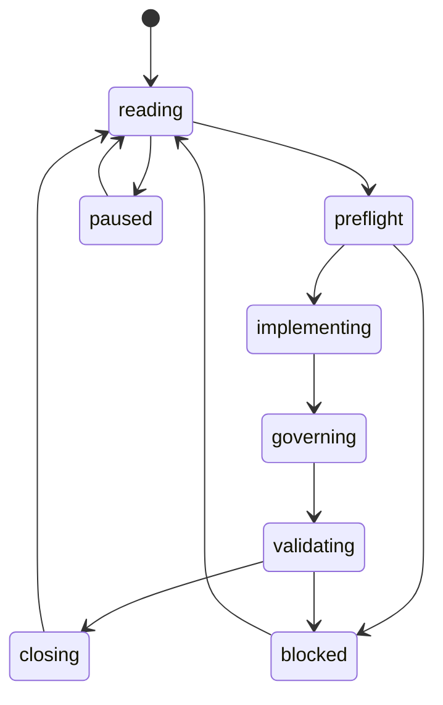

# 递归游标

> 本文件是递归式开发的活游标。每一轮开始前读取，每一轮 closeout 后更新。未得到用户“敲定方案/开始实现”指令前，游标保持 `design_only`，不得推进业务代码。

## Current Cursor

| Field | Value |
| --- | --- |
| `loop_id` | `LOOP-089` |
| `mode` | `design_only` |
| `current_milestone` | `—` |
| `current_work_package` | `—` |
| `state` | `closing` |
| `allowed_scope` | M0-M27 全部关闭。Final matrix: 10 supported, 7 restricted, 0 target, 0 planned。边界锁定。 |
| `forbidden_scope` | 任何功能性新增需求 |
| `active_decision_gates` | All 10 closed |
| `active_locks` | All satisfied |
| `capability_delta` | Final: 10 supported, 7 restricted, 0 target, 0 planned |
| `required_governance_sync` | Complete — M26/M27 milestone files + roadmap index + cursor + closeout log |
| `validation_commands` | `cargo test --lib 86 passed; npm run check 10 passed` |
| `last_green_gate` | Governance OK, 86 Rust + 10 frontend |
| `last_closeout` | `markdown/20-roadmap/97-loop-closeout-log.md#loop-088` |
| `next_resume_instruction` | 无。M0-M27 全部完成。边界锁定。回归保护：`cargo test` + `npm run check`。

## Cursor Update Rules

- `loop_id` 每轮递增，格式为 `LOOP-001`。
- `mode` 只能按 `design_only -> single_loop -> milestone_loop -> goal_run` 方向升级；降级可随时发生。
- `current_work_package` 必须指向一个明确 WP、流程任务或 blocked reason。
- `capability_delta` 默认为 `none`；任何 planned/restricted/supported 变化必须同步 `93-capability-promotion-ledger.md`。
- `last_green_gate` 必须记录完整门禁通过时间或明确 `not run`。
- `next_resume_instruction` 必须足够具体，使下一轮无需猜测。

## Cursor State Machine

## Mode Upgrade Criteria

| From | To | Required evidence |
| --- | --- | --- |
| `design_only` | `single_loop` | 用户发出敲定方案/开始单轮推进指令 |
| `single_loop` | `milestone_loop` | 连续 3 次 LOOP closeout 成功，且无 S0 |
| `milestone_loop` | `goal_run` | 用户显式要求开启 goal，并确认流程成熟 |

## Manual Override Rule

用户的新指令始终可以暂停、缩小、重置或降级递归游标。任何 override 必须写入 closeout log。
