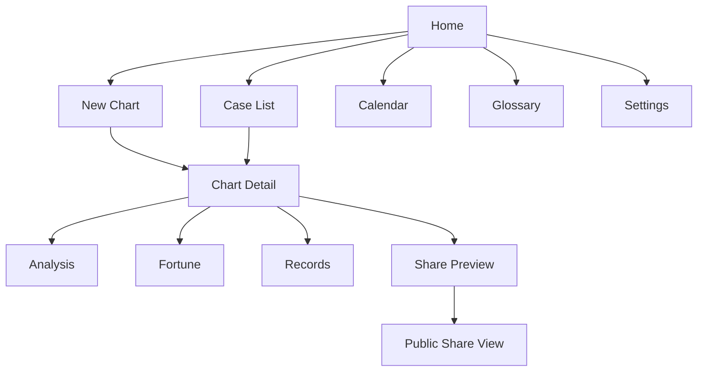
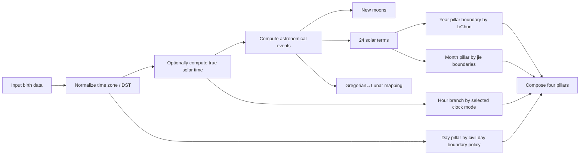
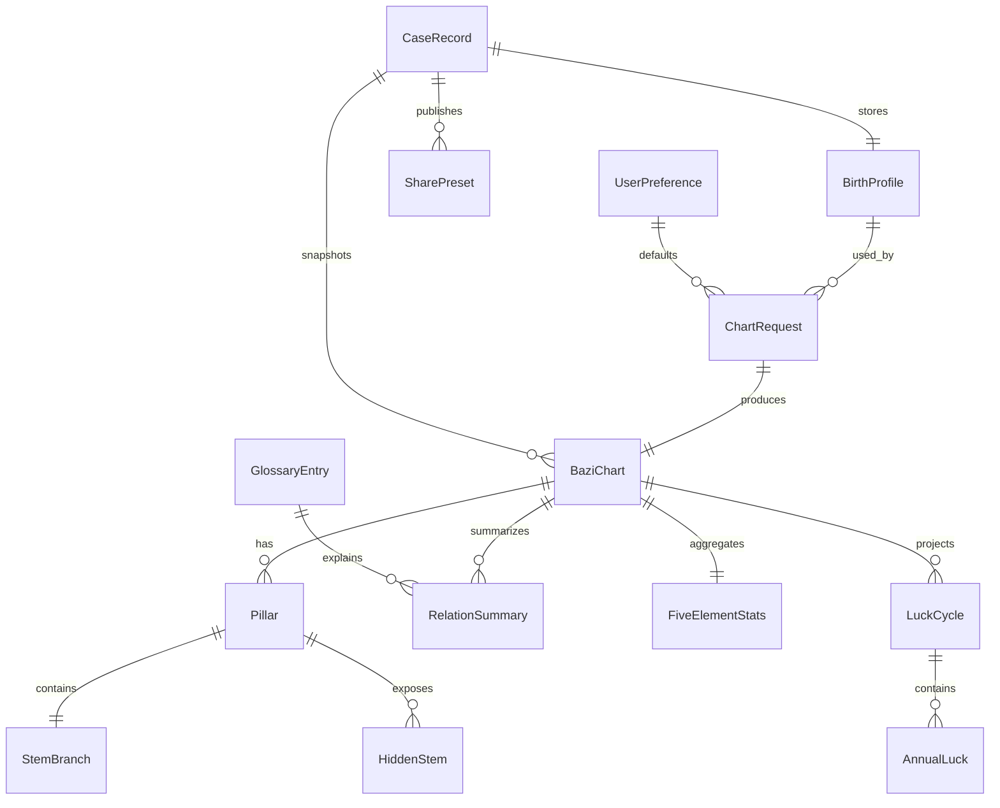

# Fate-Track V1 Design Report

## Executive summary

**Fate-Track** should launch as a free, privacy-aware BaZi web app whose V1 value is not “everything metaphysical,” but a **clean, trustworthy, inspectable calculation and reading workflow**: precise chart input, transparent pillar derivation, understandable Five Elements and Ten Gods analysis, usable luck-cycle views, case management, safe sharing, and a practical calendar/glossary layer. The uploaded QuantPilot-style materials suggest a top-down, comprehensive feature-tree structure that connects product surface, data objects, core engines, and governance; the full tree below mirrors that style for Fate-Track. fileciteturn0file0 fileciteturn0file1

For calendrical correctness, the backend should treat **astronomy as the source of truth**. Modern Chinese calendar rules are standardized in **GB/T 33661–2017**, which formalizes use of modern astronomical models, UTC+8 for the standard Chinese calendar, month-11/winter-solstice anchoring, and the leap-month rule based on months without a principal term. The 24 solar terms are defined by the Sun’s ecliptic longitude in 15° increments, with Lìchūn at 315° and Dōngzhì at 270°. For BaZi specifically, month pillars are best modeled as **solar-term months** and year-pillar rollover should default to **Lìchūn mode**, while explicitly exposing this as a user-visible convention because “Chinese calendar year” and “BaZi year boundary” are not the same concept. citeturn34search1turn34search3turn34search5turn32search2turn12search0turn12search2turn16search2

On architecture, the strongest V1 backend choice is **Axum** with a domain-centered service layer and a separate astronomy/calendar engine module. The key design principle is to keep the **calendar engine deterministic, test-heavy, and independently versioned**, because nearly every downstream feature depends on it. For astronomical foundations, the most defensible reference stack is **IAU SOFA** for standards-based time/astronomy routines and **JPL/NAIF-style ephemeris workflows** for high-confidence solar/lunar event timing; The Astronomical Almanac and JPL DE/Horizons are appropriate high-priority validation references. citeturn40search0turn39search2turn39search6turn39search0turn40search3

The biggest product risk is not frontend polish; it is **silent ambiguity**. V1 should therefore surface, not hide, the following toggles and warnings: time zone source, DST handling, true-solar-time adjustment, day-boundary policy for Zi hour, unknown birth hour mode, and the chosen start-age convention for DaYun. Where schools differ, Fate-Track should compute one documented default and show the convention used.

## Product scope and full feature tree

The tree below is intentionally exhaustive for V1 planning, with P-level markings for prioritization.

```text
Fate-Track
├─ Product foundation
│  ├─ Positioning
│  │  ├─ Free BaZi / Four Pillars web app
│  │  ├─ Privacy-aware, no mandatory monetization layer
│  │  ├─ Transparent calculations and glossary-first UX
│  │  └─ Mobile-first, share-safe output
│  ├─ Personas
│  │  ├─ Curious beginner
│  │  ├─ Repeat self-reader
│  │  ├─ Semi-professional consultant
│  │  └─ Research / comparison user
│  └─ Core principles
│     ├─ Calculation transparency
│     ├─ Configurable conventions
│     ├─ No absolute harmful claims
│     └─ Case portability and safe sharing
├─ User-facing surfaces
│  ├─ Home
│  │  ├─ Value proposition
│  │  ├─ Start new chart
│  │  ├─ Continue recent cases
│  │  ├─ Calendar shortcut
│  │  └─ Glossary shortcut
│  ├─ New chart
│  │  ├─ Input mode switch
│  │  │  ├─ Gregorian input
│  │  │  ├─ Lunar input
│  │  │  └─ Unknown hour mode
│  │  ├─ Birth place and time zone
│  │  ├─ Sex / display preferences
│  │  ├─ True solar time option
│  │  ├─ Day-boundary policy
│  │  └─ Preview calculation
│  ├─ Chart detail
│  │  ├─ Overview header
│  │  │  ├─ Four pillars
│  │  │  ├─ Lunar/solar conversion
│  │  │  ├─ Time-zone / convention badges
│  │  │  └─ Share / save actions
│  │  ├─ Analysis tab
│  │  │  ├─ Day Master card
│  │  │  ├─ Five Elements chart
│  │  │  ├─ Ten Gods summary
│  │  │  ├─ Hidden stems
│  │  │  ├─ Seasonal strength
│  │  │  ├─ Combination / clash summaries
│  │  │  └─ Glossary-linked explanations
│  │  ├─ Fortune tab
│  │  │  ├─ DaYun overview
│  │  │  ├─ Annual Luck list
│  │  │  ├─ Optional monthly drill-down
│  │  │  ├─ Start-age and direction note
│  │  │  └─ Timeline visualization
│  │  └─ Records tab
│  │     ├─ Case notes
│  │     ├─ Tags
│  │     ├─ Snapshots
│  │     └─ Share presets
│  ├─ Case list
│  │  ├─ Search
│  │  ├─ Filters
│  │  ├─ Duplicate / archive / delete
│  │  └─ Compare entry point
│  ├─ Share preview
│  │  ├─ Redaction controls
│  │  ├─ Public tokenized link
│  │  ├─ Expiry / revoke
│  │  └─ Printable share view
│  ├─ Calendar
│  │  ├─ Day view
│  │  ├─ Month view
│  │  ├─ 24 solar terms
│  │  ├─ Lunar date mapping
│  │  └─ Huangli basics
│  ├─ Settings
│  │  ├─ Locale / language
│  │  ├─ Metadata display controls
│  │  ├─ Default calculation conventions
│  │  ├─ Privacy defaults
│  │  └─ Data export/import
│  └─ Glossary
│     ├─ A–Z / category browse
│     ├─ Inline backlinks from charts
│     ├─ Related terms
│     └─ Disclaimer and methodology
├─ Core engines
│  ├─ Calendar engine
│  │  ├─ Gregorian ↔ Lunar conversion
│  │  ├─ Leap-month handling
│  │  ├─ 24 solar term computation
│  │  ├─ Sexagenary year/month/day/hour
│  │  ├─ Time-zone and DST normalization
│  │  └─ True solar time adjustment
│  ├─ BaZi engine
│  │  ├─ Pillar derivation
│  │  ├─ Hidden stems
│  │  ├─ Ten Gods derivation
│  │  ├─ Five Elements scoring
│  │  ├─ Relation summary extraction
│  │  └─ Luck-cycle generation
│  ├─ Safety / copy engine
│  │  ├─ Tone constraints
│  │  ├─ Forbidden claim filtering
│  │  ├─ Risk-warning insertion
│  │  └─ Share redaction
│  └─ Persistence engine
│     ├─ Case storage
│     ├─ Preferences
│     ├─ Share tokens
│     └─ Glossary content
├─ Data objects
│  ├─ BirthProfile
│  ├─ ChartRequest
│  ├─ BaziChart
│  ├─ Pillar
│  ├─ StemBranch
│  ├─ HiddenStem
│  ├─ TenGod
│  ├─ FiveElementStats
│  ├─ RelationSummary
│  ├─ LuckCycle
│  ├─ AnnualLuck
│  ├─ CaseRecord
│  ├─ SharePreset
│  ├─ UserPreference
│  └─ GlossaryEntry
├─ Quality system
│  ├─ Deterministic regression suite
│  ├─ Solar-term boundary tests
│  ├─ Leap-month edge tests
│  ├─ Unknown-hour scenario tests
│  ├─ Snapshot tests for share redaction
│  └─ Accessibility test matrix
└─ Governance
   ├─ Explicit non-goals
   ├─ Convention versioning
   ├─ Data-retention policy
   └─ Change log for algorithm revisions
```

### User personas and user stories

The **curious beginner** wants to enter a birth time, see the four pillars, and understand “what this chart says” in normal language without technical overload. Their success condition is immediate legibility, with expandable detail only when requested.

The **repeat self-reader** wants to save their own chart, revisit annual luck, compare calendar dates, and learn gradually through glossary links. Their success condition is continuity and clear convention badges so repeated readings do not appear to “change mysteriously.”

The **semi-professional consultant** wants to store multiple cases, add notes, generate a sanitized share link, and retrieve old charts quickly. Their success condition is case organization, share-safe output, and enough calculation auditability to trust the tool in client conversations.

The **research/comparison user** wants to reconcile different almanacs or apps, especially around boundary dates, leap months, true solar time, or uncertain hour. Their success condition is explicit convention disclosure and reproducible calculations.

Representative user stories:

| Persona | User story | Priority |
|---|---|---|
| Beginner | As a new user, I want to input either Gregorian or lunar birth data and get a chart preview before saving. | MVP |
| Beginner | As a new user, I want plain-English cards explaining Day Master, Five Elements, and Ten Gods. | MVP |
| Repeat user | As a repeat user, I want to save multiple cases and re-open them later. | P0 |
| Consultant | As a consultant, I want to create a redacted share link that hides exact birth details. | P0 |
| Research user | As a research user, I want to see which convention was used for year boundary, hour boundary, time zone, and true solar time. | P0 |
| Research user | As a research user, I want unknown-hour mode to show multiple candidate hour charts instead of pretending certainty. | P1 |
| Repeat user | As a repeat user, I want DaYun and annual luck shown in a timeline with start age and direction. | P0 |
| All | As a user, I want glossary links everywhere I encounter jargon. | P0 |
| All | As a user, I want calendar and solar-term lookup without leaving the app. | P1 |
| Consultant | As a consultant, I want export/import for cases and preferences. | P2 |

### MVP, P0, P1, P2

**MVP** should include: home, new chart, chart detail overview, analysis cards, four pillars, hidden stems, Five Elements and Ten Gods summaries, DaYun overview, annual luck list, case save/load, glossary basics, settings for core conventions, and tokenized redacted sharing.

**P0** should add: lunar/Gregorian dual input, calendar lookup, Huangli-lite day view, explicit convention badges, archive/delete/duplicate case actions, chart notes, share revocation, unknown-hour handling, mobile chart layouts, and accessible chart visualizations.

**P1** should add: monthly luck drill-down, compare mode between two cases or between two convention settings, richer glossary graph, export/import, print layout, and more guided educational onboarding.

**P2** should add: advanced compare matrices, batch case management, optional local-only/offline bundle, advanced practitioner toggles, share analytics, and richer editorial content.

### Page inventory and wireframe-level breakdown

| Route | Page | Core blocks | Notes |
|---|---|---|---|
| `/` | Home | hero, recent cases, quick actions, glossary/calendar cards | lightweight landing |
| `/charts/new` | New Chart | input form, convention drawer, preview panel | highest-friction page; needs strong validation |
| `/charts/:id` | Chart Detail | header + tabs | primary working surface |
| `/charts/:id/analysis` | Analysis tab | pillars, hidden stems, element balance, ten gods, relation notes | default tab |
| `/charts/:id/fortune` | Fortune tab | DaYun, years, optional months, chart timeline | chronology-heavy |
| `/charts/:id/records` | Records tab | notes, tags, snapshots, share presets | user-generated content |
| `/cases` | Case List | search, filters, list/grid, bulk actions | consultant workflow |
| `/share/:token` | Share Preview/Public View | redacted chart, safe cards, disclaimer | no editing |
| `/calendar` | Calendar | month/day switch, solar terms, lunar mapping | utility surface |
| `/settings` | Settings | defaults, privacy, locale, calculations | should expose conventions clearly |
| `/glossary` | Glossary | search, categories, term page, related terms | education layer |

A compact wireframe-level sitemap:



## BaZi chronology and algorithm specification

### What must be treated as the source of truth

For calendrical conversion, V1 should treat the **modern astronomical Chinese calendar rules** as the canonical baseline for lunar-date computation: lunisolar months begin on astronomical new moons; the month containing **Dōngzhì** is month 11; if there are 13 lunar months between consecutive month-11 anchors, the **first month without a principal term** becomes the leap month; and official modern Chinese calendar computation uses **UTC+8 / 120°E** as the standard-time baseline. The modern PRC standard is **GB/T 33661–2017**, which formalizes use of modern astronomy and high precision. citeturn15search0turn34search1turn34search3turn34search5

For BaZi pillar derivation, Fate-Track should distinguish **calendar conversion** from **astrological pillar rollover**. The 24 solar terms are spaced every **15° of apparent solar longitude**, with **Lìchūn at 315°** and **Dōngzhì at 270°**. In BaZi practice and mainstream Four Pillars software, the **year pillar typically rolls over at Lìchūn**, not at lunar new year, while month pillars follow **solar-term months** rather than lunar months. citeturn32search2turn6view0turn12search0turn12search2turn16search2

### Implementable algorithm pipeline

A practical, backend-safe sequence is:



The recommended low-level implementation is:

1. Parse the request into a normalized `ChartRequest`.
2. Resolve an IANA time zone where possible. Store both the original local timestamp and its UTC form.
3. If `true_solar_time = on`, transform from legal civil time to **local apparent solar time** using longitude correction and the equation of time:  
   `apparent_solar_time = standard_local_time + 4 min × (longitude - zone_central_meridian) + equation_of_time`.  
   The 4-minutes-per-degree relation follows local mean time geometry; equation of time is the difference between apparent and mean solar time. citeturn19search2turn19search1turn19search0
4. Compute or look up solar-longitude crossing instants for the 24 terms. If you build the astronomical engine directly, use standards-based routines and high-precision ephemerides; **SOFA**, **The Astronomical Almanac**, and **JPL DE/Horizons / SPICE-class workflows** are the right validation tier. citeturn40search0turn39search2turn39search6turn39search0turn40search3
5. For Gregorian↔Lunar conversion in “Chinese calendar mode,” use the month-11 / winter-solstice / leap-month rules from the standard. citeturn15search0turn34search3
6. Determine the **year pillar** by comparing the birth instant to the local-time instant of **Lìchūn**. Before Lìchūn, use the previous sexagenary year; at or after Lìchūn, use the new one. citeturn12search0turn16search2
7. Determine the **month pillar branch** by solar-term segment, using **jie boundaries**:
   - 寅 month: Lìchūn → Jīngzhé
   - 卯 month: Jīngzhé → Qīngmíng
   - 辰 month: Qīngmíng → Lìxià
   - … continuing sequentially through 丑 month.  
   This is the standard sexagenary month model used for astrological month naming. citeturn12search2
8. Determine the **month pillar stem** from the year stem group:
   - 甲/己 year → 丙寅 starts the cycle
   - 乙/庚 year → 戊寅
   - 丙/辛 year → 庚寅
   - 丁/壬 year → 壬寅
   - 戊/癸 year → 甲寅  
   Then advance one stem per month. citeturn12search2
9. Determine the **day pillar** from a continuous day count. A robust implementation is to compute the **Julian Day Number** for the chosen day boundary and map it to the 60-day cycle via a fixed anchor constant. In practice, this should be implemented as a pure deterministic function plus a locked regression set.
10. Determine the **hour branch** from 2-hour bins:
    - 子 23:00–01:00
    - 丑 01:00–03:00
    - …
    - 亥 21:00–23:00. citeturn31search2turn17search4
11. Determine the **hour stem** from the day stem group:
    - 甲/己 day: 子 hour starts at 甲
    - 乙/庚 day: 子 hour starts at 丙
    - 丙/辛 day: 子 hour starts at 戊
    - 丁/壬 day: 子 hour starts at 庚
    - 戊/癸 day: 子 hour starts at 壬. citeturn31search2turn17search4
12. Emit the chart together with **calculation metadata**: time zone, DST normalization, true-solar-time switch, year-boundary mode, day-boundary mode, and algorithm version.

### Boundary policies Fate-Track should expose explicitly

V1 should not hide the following choices:

| Policy | Recommended default | Why |
|---|---|---|
| Year boundary | `LiChun` | Best fit for BaZi apps; differs from lunar-new-year calendar year |
| Month boundary | `SolarTermsJie` | Month pillars are solar months, not lunar months |
| Day boundary | `Midnight` | Easiest to explain; deterministic |
| Alternative day boundary | `ZiStart2300` | Needed because some schools treat Zi hour as day rollover |
| Hour clock | `CivilLocalTime` | Best default for ordinary users |
| Optional hour clock | `TrueSolarTime` | Important for advanced users and border cases |
| Lunar conversion baseline | `ChineseCalendarUTC+8` | Matches Chinese standard/calendar publishing rules |
| Global birth handling | `BirthplaceTZID for display and pillar comparison` | Necessary for worldwide input; document clearly |

### Leap month handling and edge cases

The leap-month rule is simple to state but failure-prone in code. The correct abstraction is: **lunar intercalation belongs to calendar conversion, not directly to the BaZi month pillar**, because BaZi months are determined by solar terms. A leap lunar month therefore affects displayed lunar dates and Huangli/calendar utilities, but not the rule that chart month pillars follow solar-term segments. citeturn15search0turn34search3turn12search2

Critical edge cases for V1:

| Edge case | What can break | Required behavior |
|---|---|---|
| Birth during hours around Lìchūn | Year/month rollover discrepancy | Compare against exact term instant, not date-only heuristics |
| Birth during month-jie boundary | Wrong month pillar | Use exact solar longitude crossing, not “around Mar 6” shortcuts |
| Leap month display | Confusing lunar month labels | Show `is_leap_month` explicitly; keep pillar derivation independent |
| 2033–2034 calendar anomaly years | Wrong leap-month placement | Maintain regression vectors against published calendars and standard references; do not derive with simplified lookup tables alone | 
| DST regions | Wrong local-clock input | Preserve entered civil date/time and normalize via TZDB |
| Longitude far from zone meridian | Hour-branch drift | Surface true-solar-time option and show difference from civil time |
| Unknown or approximate hour | False precision | Disable definitive hour-based claims; render scenario set |

The **2033 problem** is a mandatory regression area because it is the classic modern Chinese-calendar anomaly involving unusual principal-term / leap-month interactions. citeturn15search3turn20search1

### Test vectors and regression samples

The table below is suitable for automated regression. These are **default-convention** vectors: year boundary by Lìchūn, month by solar-term month, day boundary at midnight, hour from civil local time in UTC+8.

| Input | Expected pillars | Why it matters |
|---|---|---|
| 2023-01-22 12:00 UTC+8 | 壬寅年 癸丑月 庚辰日 壬午时 | Lunar New Year day, but still before Lìchūn in BaZi year logic |
| 2024-02-10 12:00 UTC+8 | 甲辰年 丙寅月 甲辰日 庚午时 | Common modern reference case after Lìchūn and after CNY |
| 2025-01-29 12:00 UTC+8 | 甲辰年 丁丑月 戊戌日 戊午时 | New lunar year but still pre-Lìchūn under BaZi year logic |
| 2025-02-10 12:00 UTC+8 | 乙巳年 戊寅月 庚戌日 壬午时 | Post-Lìchūn rollover into new BaZi year |
| 2033 anomaly-year calendar cases | Must match published standard calendar tables | Ensures leap-month correctness in non-trivial years |

For boundary tests, add **paired assertions**:

- `t = LiChun - 1 second` uses previous year pillar.
- `t = LiChun exact` and `t = LiChun + 1 second` use new year pillar.
- Same structure for each monthly `jie` boundary.
- Same birth moment under `CivilLocalTime` vs `TrueSolarTime` should show whether the hour branch changes.
- Same birth moment under `Midnight` vs `ZiStart2300` should show whether the day/hour combination changes.

### Prioritized reference sources

**Highest priority, authoritative**
- GB/T 33661–2017 and explanatory materials for modern Chinese calendar rules. citeturn34search1turn34search3turn34search5
- The Astronomical Almanac. citeturn39search2
- IAU SOFA routines for standards-based astronomical/time computations. citeturn40search0
- JPL DE / Horizons / SPICE-class ephemerides for solar-lunar event timing and validation. citeturn39search6turn39search0turn40search3

**Important calendrical references**
- Helmer Aslaksen’s work on Chinese calendar rules, widely cited in modern calendrical explanations. citeturn15search0turn17search3
- Historical/academic concordance works such as *Calendrical Calculations* and Hazelton’s Sino-Western calendar tables for long-range validation contexts. citeturn31search6turn31search3

**Pragmatic open-source comparator set**
- Useful comparator candidates for cross-checking implementation outputs include **sxtwl**, **6tail/lunar-java**, **6tail/lunar-python**, and **EastAsiaCalendars**. These are best treated as **validation comparators**, not ultimate authorities, and any discrepancies should be resolved in favor of the standard/astronomical references above.

## Domain data model and schema catalog

### Entity relationship overview



### Privacy classification

Use four levels across the model:

- **Public**: safe to show to anyone, e.g. glossary text.
- **Share-safe**: derived content safe for redacted share links.
- **Private**: user-scoped content, usually not shared by default.
- **Sensitive**: direct identifying or birth-specific data that can re-identify a person.

### Core input and preference entities

#### BirthProfile

| Field | Type | Constraints | Privacy |
|---|---|---|---|
| `id` | `uuid` | required | Private |
| `display_name` | `string` | 1–120 chars | Private |
| `subject_type` | `enum(self, other, unnamed)` | required | Private |
| `birth_calendar_type` | `enum(gregorian, lunar)` | required | Private |
| `birth_date` | `date` | required if known | Sensitive |
| `birth_time_local` | `time?` | nullable for unknown hour | Sensitive |
| `birth_time_precision` | `enum(exact, approximate, unknown)` | required | Private |
| `birth_timezone` | `string` | IANA TZ preferred | Sensitive |
| `birth_utc_offset_minutes` | `i16` | derived snapshot | Private |
| `birth_longitude` | `decimal(8,5)?` | nullable if unavailable | Sensitive |
| `birth_latitude` | `decimal(8,5)?` | nullable if unavailable | Sensitive |
| `location_label` | `string?` | human-readable | Sensitive |
| `sex_for_luck_rule` | `enum(male, female, unspecified)` | configurable | Sensitive |
| `notes` | `string?` | max 10k | Private |
| `created_at` | `datetime` | required | Private |
| `updated_at` | `datetime` | required | Private |

```json
{
  "id": "4a85e570-a4b0-4520-9817-a1e3e2f89edf",
  "display_name": "Alice",
  "subject_type": "self",
  "birth_calendar_type": "gregorian",
  "birth_date": "2024-02-10",
  "birth_time_local": "12:00:00",
  "birth_time_precision": "exact",
  "birth_timezone": "Asia/Shanghai",
  "birth_utc_offset_minutes": 480,
  "birth_longitude": 121.4737,
  "birth_latitude": 31.2304,
  "location_label": "Shanghai",
  "sex_for_luck_rule": "female",
  "notes": "Family-recorded birth time.",
  "created_at": "2026-06-08T09:00:00Z",
  "updated_at": "2026-06-08T09:00:00Z"
}
```

#### ChartRequest

| Field | Type | Constraints | Privacy |
|---|---|---|---|
| `id` | `uuid` | required | Private |
| `birth_profile_id` | `uuid?` | nullable for preview | Private |
| `input_mode` | `enum(gregorian, lunar)` | required | Private |
| `year_boundary_policy` | `enum(li_chun, lunar_new_year)` | required | Private |
| `month_boundary_policy` | `enum(solar_jie)` | required | Private |
| `day_boundary_policy` | `enum(midnight, zi_start_2300)` | required | Private |
| `hour_clock_policy` | `enum(civil, true_solar)` | required | Private |
| `timezone_resolution_policy` | `enum(profile_tz, explicit_tz, utc_plus_8)` | required | Private |
| `include_monthly_luck` | `bool` | default false | Private |
| `unknown_hour_strategy` | `enum(disable_hour, generate_candidates)` | required | Private |
| `algorithm_version` | `string` | required | Share-safe |

```json
{
  "id": "123ffc53-a960-4722-8f81-58b60f22bc35",
  "birth_profile_id": "4a85e570-a4b0-4520-9817-a1e3e2f89edf",
  "input_mode": "gregorian",
  "year_boundary_policy": "li_chun",
  "month_boundary_policy": "solar_jie",
  "day_boundary_policy": "midnight",
  "hour_clock_policy": "civil",
  "timezone_resolution_policy": "profile_tz",
  "include_monthly_luck": false,
  "unknown_hour_strategy": "disable_hour",
  "algorithm_version": "ft-cal-1.0.0"
}
```

#### UserPreference

| Field | Type | Constraints | Privacy |
|---|---|---|---|
| `id` | `uuid` | required | Private |
| `locale` | `string` | e.g. `en-US` | Private |
| `theme` | `enum(system, light, dark)` | required | Private |
| `default_year_boundary_policy` | `enum(...)` | required | Private |
| `default_day_boundary_policy` | `enum(...)` | required | Private |
| `default_hour_clock_policy` | `enum(...)` | required | Private |
| `default_share_redaction_level` | `enum(full, medium, minimal)` | required | Private |
| `show_glossary_inline` | `bool` | default true | Private |
| `show_hidden_stems_by_default` | `bool` | default false | Private |

```json
{
  "id": "6d8a9fa8-c558-44b8-a9a1-e4f3b6f9c384",
  "locale": "en-US",
  "theme": "system",
  "default_year_boundary_policy": "li_chun",
  "default_day_boundary_policy": "midnight",
  "default_hour_clock_policy": "civil",
  "default_share_redaction_level": "medium",
  "show_glossary_inline": true,
  "show_hidden_stems_by_default": false
}
```

### Computed chart entities

#### StemBranch

| Field | Type | Constraints | Privacy |
|---|---|---|---|
| `stem` | `enum(甲..癸)` | required | Share-safe |
| `branch` | `enum(子..亥)` | required | Share-safe |
| `stem_element` | `enum(wood, fire, earth, metal, water)` | required | Share-safe |
| `stem_yin_yang` | `enum(yang, yin)` | required | Share-safe |
| `branch_element` | `enum(...)` | required | Share-safe |
| `index60` | `u8` | 1–60 | Share-safe |

```json
{
  "stem": "甲",
  "branch": "辰",
  "stem_element": "wood",
  "stem_yin_yang": "yang",
  "branch_element": "earth",
  "index60": 41
}
```

#### HiddenStem

| Field | Type | Constraints | Privacy |
|---|---|---|---|
| `branch` | `enum(子..亥)` | required | Share-safe |
| `stem` | `enum(甲..癸)` | required | Share-safe |
| `weight` | `decimal(4,3)` | 0–1 | Share-safe |
| `ten_god_to_day_master` | `enum(TenGod)` | derived | Share-safe |

```json
{
  "branch": "辰",
  "stem": "乙",
  "weight": 0.300,
  "ten_god_to_day_master": "rob_wealth"
}
```

#### TenGod

This is best implemented as an enum plus metadata table, not a freestanding heavily normalized entity.

| Field | Type | Constraints | Privacy |
|---|---|---|---|
| `code` | `enum(friend, rob_wealth, eating_god, hurting_officer, indirect_wealth, direct_wealth, seven_killings, direct_officer, indirect_resource, direct_resource)` | required | Share-safe |
| `label_en` | `string` | required | Public |
| `polarity_rule` | `string` | derived rule documentation | Public |

```json
{
  "code": "direct_officer",
  "label_en": "Direct Officer",
  "polarity_rule": "countering element with opposite polarity to Day Master"
}
```

#### Pillar

| Field | Type | Constraints | Privacy |
|---|---|---|---|
| `kind` | `enum(year, month, day, hour)` | required | Share-safe |
| `stem_branch` | `StemBranch` | required | Share-safe |
| `branch_hidden_stems` | `HiddenStem[]` | 0..3 conventional | Share-safe |
| `nayin` | `string?` | optional V1 display | Share-safe |
| `boundary_metadata` | `object?` | include term used / day-boundary notes | Private |

```json
{
  "kind": "day",
  "stem_branch": {
    "stem": "甲",
    "branch": "辰",
    "stem_element": "wood",
    "stem_yin_yang": "yang",
    "branch_element": "earth",
    "index60": 41
  },
  "branch_hidden_stems": [
    {"branch": "辰", "stem": "乙", "weight": 0.300, "ten_god_to_day_master": "rob_wealth"},
    {"branch": "辰", "stem": "戊", "weight": 0.500, "ten_god_to_day_master": "indirect_wealth"},
    {"branch": "辰", "stem": "癸", "weight": 0.200, "ten_god_to_day_master": "direct_resource"}
  ],
  "nayin": null,
  "boundary_metadata": {"day_boundary_policy": "midnight"}
}
```

#### FiveElementStats

| Field | Type | Constraints | Privacy |
|---|---|---|---|
| `wood` | `decimal(6,3)` | non-negative | Share-safe |
| `fire` | `decimal(6,3)` | non-negative | Share-safe |
| `earth` | `decimal(6,3)` | non-negative | Share-safe |
| `metal` | `decimal(6,3)` | non-negative | Share-safe |
| `water` | `decimal(6,3)` | non-negative | Share-safe |
| `normalized` | `bool` | required | Share-safe |
| `day_master_strength_score` | `i16` | recommended range -100..100 | Share-safe |
| `seasonal_support_score` | `i16` | recommended range -100..100 | Share-safe |

```json
{
  "wood": 2.7,
  "fire": 1.2,
  "earth": 2.1,
  "metal": 0.8,
  "water": 1.5,
  "normalized": false,
  "day_master_strength_score": 18,
  "seasonal_support_score": 24
}
```

#### RelationSummary

| Field | Type | Constraints | Privacy |
|---|---|---|---|
| `code` | `string` | stable key | Share-safe |
| `category` | `enum(combination, clash, punishment, harm, seasonal, structure)` | required | Share-safe |
| `severity` | `enum(info, mild, medium, strong)` | required | Share-safe |
| `description` | `string` | generated / curated | Share-safe |
| `evidence` | `string[]` | references to pillars/stems | Share-safe |

```json
{
  "code": "branch_clash_demo",
  "category": "clash",
  "severity": "mild",
  "description": "A visible branch interaction is present and may make some themes more changeable than stable.",
  "evidence": ["year.branch", "annual_luck.branch"]
}
```

#### BaziChart

| Field | Type | Constraints | Privacy |
|---|---|---|---|
| `id` | `uuid` | required | Private |
| `request_id` | `uuid` | required | Private |
| `birth_profile_snapshot` | `object` | immutable snapshot | Sensitive |
| `year_pillar` | `Pillar` | required | Share-safe |
| `month_pillar` | `Pillar` | required | Share-safe |
| `day_pillar` | `Pillar` | required | Share-safe |
| `hour_pillar` | `Pillar?` | nullable | Share-safe |
| `five_element_stats` | `FiveElementStats` | required | Share-safe |
| `ten_god_matrix` | `object` | structured derived view | Share-safe |
| `relation_summaries` | `RelationSummary[]` | derived | Share-safe |
| `calculation_metadata` | `object` | required | Private |
| `disclaimer_block` | `string` | required | Public |

```json
{
  "id": "63c58ed5-f88b-4d44-aba8-bb7126270d5c",
  "request_id": "123ffc53-a960-4722-8f81-58b60f22bc35",
  "birth_profile_snapshot": {
    "birth_date": "2024-02-10",
    "birth_time_local": "12:00:00",
    "birth_timezone": "Asia/Shanghai",
    "birth_longitude": 121.4737
  },
  "year_pillar": {"kind": "year", "stem_branch": {"stem": "甲", "branch": "辰", "stem_element": "wood", "stem_yin_yang": "yang", "branch_element": "earth", "index60": 41}, "branch_hidden_stems": [], "nayin": null, "boundary_metadata": {"year_boundary_policy": "li_chun"}},
  "month_pillar": {"kind": "month", "stem_branch": {"stem": "丙", "branch": "寅", "stem_element": "fire", "stem_yin_yang": "yang", "branch_element": "wood", "index60": 3}, "branch_hidden_stems": [], "nayin": null, "boundary_metadata": {"month_boundary_policy": "solar_jie"}},
  "day_pillar": {"kind": "day", "stem_branch": {"stem": "甲", "branch": "辰", "stem_element": "wood", "stem_yin_yang": "yang", "branch_element": "earth", "index60": 41}, "branch_hidden_stems": [], "nayin": null, "boundary_metadata": {"day_boundary_policy": "midnight"}},
  "hour_pillar": {"kind": "hour", "stem_branch": {"stem": "庚", "branch": "午", "stem_element": "metal", "stem_yin_yang": "yang", "branch_element": "fire", "index60": 7}, "branch_hidden_stems": [], "nayin": null, "boundary_metadata": {"hour_clock_policy": "civil"}},
  "five_element_stats": {"wood": 2.7, "fire": 1.2, "earth": 2.1, "metal": 0.8, "water": 1.5, "normalized": false, "day_master_strength_score": 18, "seasonal_support_score": 24},
  "ten_god_matrix": {"day_master": "甲", "visible_stems": {"year": "rob_wealth", "month": "eating_god", "hour": "seven_killings"}},
  "relation_summaries": [],
  "calculation_metadata": {"algorithm_version": "ft-cal-1.0.0", "true_solar_time": false},
  "disclaimer_block": "Interpretive content is for reflection and learning, not medical, legal, or financial advice."
}
```

### Luck, cases, sharing, glossary

#### LuckCycle

| Field | Type | Constraints | Privacy |
|---|---|---|---|
| `index` | `u8` | 1-based | Share-safe |
| `start_age_years` | `decimal(4,2)` | non-negative | Share-safe |
| `start_at` | `date?` | nullable if age-only mode | Share-safe |
| `end_age_years` | `decimal(4,2)` | > start | Share-safe |
| `stem_branch` | `StemBranch` | required | Share-safe |
| `direction` | `enum(forward, backward)` | required | Share-safe |
| `derivation_notes` | `object` | rule metadata | Private |

```json
{
  "index": 1,
  "start_age_years": 6.67,
  "start_at": "2030-10-10",
  "end_age_years": 16.66,
  "stem_branch": {"stem": "丁", "branch": "卯", "stem_element": "fire", "stem_yin_yang": "yin", "branch_element": "wood", "index60": 4},
  "direction": "forward",
  "derivation_notes": {"rule": "documented-v1-default"}
}
```

#### AnnualLuck

| Field | Type | Constraints | Privacy |
|---|---|---|---|
| `gregorian_year` | `i32` | required | Share-safe |
| `year_pillar` | `StemBranch` | required | Share-safe |
| `active_luck_cycle_index` | `u8` | required | Share-safe |
| `monthly_items` | `object[]?` | optional P1 | Share-safe |
| `summary_cards` | `string[]` | generated | Share-safe |

```json
{
  "gregorian_year": 2032,
  "year_pillar": {"stem": "壬", "branch": "子", "stem_element": "water", "stem_yin_yang": "yang", "branch_element": "water", "index60": 49},
  "active_luck_cycle_index": 1,
  "monthly_items": null,
  "summary_cards": [
    "Water themes are more prominent this year.",
    "Interactions with natal month branch should be checked together with the active 10-year cycle."
  ]
}
```

#### CaseRecord

| Field | Type | Constraints | Privacy |
|---|---|---|---|
| `id` | `uuid` | required | Private |
| `title` | `string` | 1–120 chars | Private |
| `birth_profile_id` | `uuid` | required | Sensitive |
| `latest_chart_id` | `uuid` | required | Private |
| `tags` | `string[]` | max 30 | Private |
| `notes` | `string?` | max 20k | Private |
| `archived` | `bool` | default false | Private |
| `created_at` | `datetime` | required | Private |

```json
{
  "id": "478b6b8c-0d8b-435c-ae2d-ab9c11e03ab7",
  "title": "Alice main chart",
  "birth_profile_id": "4a85e570-a4b0-4520-9817-a1e3e2f89edf",
  "latest_chart_id": "63c58ed5-f88b-4d44-aba8-bb7126270d5c",
  "tags": ["self", "baseline"],
  "notes": "Use this as the main reference chart.",
  "archived": false,
  "created_at": "2026-06-08T09:03:00Z"
}
```

#### SharePreset

| Field | Type | Constraints | Privacy |
|---|---|---|---|
| `id` | `uuid` | required | Private |
| `case_record_id` | `uuid` | required | Private |
| `redaction_level` | `enum(full, medium, minimal)` | required | Private |
| `hide_exact_birth_time` | `bool` | default true | Private |
| `hide_location` | `bool` | default true | Private |
| `hide_notes` | `bool` | default true | Private |
| `share_token` | `string` | unique | Sensitive |
| `expires_at` | `datetime?` | nullable | Private |
| `revoked_at` | `datetime?` | nullable | Private |

```json
{
  "id": "5bcf7ea8-9d20-4d28-aacb-ee249e04d77e",
  "case_record_id": "478b6b8c-0d8b-435c-ae2d-ab9c11e03ab7",
  "redaction_level": "medium",
  "hide_exact_birth_time": true,
  "hide_location": true,
  "hide_notes": true,
  "share_token": "ft_s_2pJ6u8M8jJkQa",
  "expires_at": "2026-07-08T00:00:00Z",
  "revoked_at": null
}
```

#### GlossaryEntry

| Field | Type | Constraints | Privacy |
|---|---|---|---|
| `slug` | `string` | unique | Public |
| `term` | `string` | required | Public |
| `category` | `enum(calendar, bazi, five_elements, ten_gods, fortune, relations)` | required | Public |
| `summary` | `string` | required | Public |
| `body_markdown` | `string` | required | Public |
| `related_slugs` | `string[]` | optional | Public |
| `source_note` | `string?` | optional | Public |

```json
{
  "slug": "li-chun",
  "term": "Li Chun",
  "category": "calendar",
  "summary": "The solar term marking the beginning of spring and the usual BaZi rollover point for the year pillar.",
  "body_markdown": "Li Chun occurs when the Sun reaches apparent ecliptic longitude 315°.",
  "related_slugs": ["solar-terms", "year-pillar"],
  "source_note": "Calendrical reference"
}
```

## Backend architecture and API

### Recommended Rust architecture

**Recommendation: Axum.**

The main reason is organizational, not ideological: Fate-Track is a **typed, JSON-heavy, request/response web application with strong extractor, middleware, and testability needs**. Axum fits a clean boundary between HTTP layer and domain services, which matters more here than squeezing out stylistic gains. Use **Axum + Tokio + tower-http**, and keep the calendar engine isolated from web concerns.

Recommended workspace layout:

```text
fate-track/
├─ crates/
│  ├─ ft-api            # Axum routes, DTOs, auth/session hooks, error -> HTTP mapping
│  ├─ ft-domain         # core entities, enums, value objects, traits
│  ├─ ft-calendar       # astronomy, Gregorian↔Lunar, solar terms, pillars
│  ├─ ft-analysis       # Five Elements, Ten Gods, relation summaries, luck cycles
│  ├─ ft-repo           # persistence abstractions + SQL implementation
│  ├─ ft-service        # orchestration / use-cases
│  ├─ ft-share          # redaction + share token logic
│  ├─ ft-glossary       # glossary retrieval and indexing
│  └─ ft-testkit        # fixtures, golden vectors, helpers
└─ apps/
   └─ server
```

### Key traits and interfaces

Core traits should be small and deterministic.

```rust
pub trait CalendarEngine {
    fn gregorian_to_lunar(&self, input: GregorianInput) -> Result<LunarDate, CalendarError>;
    fn lunar_to_gregorian(&self, input: LunarInput) -> Result<GregorianDate, CalendarError>;
    fn solar_terms_for_year(&self, year: i32, tz: TzPolicy) -> Result<Vec<SolarTermInstant>, CalendarError>;
    fn four_pillars(&self, req: &ChartRequest) -> Result<FourPillarsResult, CalendarError>;
}

pub trait AnalysisEngine {
    fn five_elements(&self, chart: &BaziChart) -> FiveElementStats;
    fn ten_gods(&self, chart: &BaziChart) -> TenGodMatrix;
    fn relations(&self, chart: &BaziChart) -> Vec<RelationSummary>;
    fn luck_cycles(&self, chart: &BaziChart, cfg: LuckRuleConfig) -> Vec<LuckCycle>;
    fn annual_luck(&self, chart: &BaziChart, years: RangeInclusive<i32>) -> Vec<AnnualLuck>;
}

pub trait CaseRepository {
    fn save_case(&self, case: CaseRecord) -> Result<CaseRecord, RepoError>;
    fn get_case(&self, id: Uuid) -> Result<Option<CaseRecord>, RepoError>;
    fn list_cases(&self, filter: CaseFilter) -> Result<Vec<CaseRecord>, RepoError>;
}
```

### Error model

Use a layered error model:

- `ValidationError`: bad date, impossible lunar input, unsupported range, invalid TZ.
- `CalendarError`: astronomical failure, ambiguous boundary, out-of-range ephemeris.
- `AnalysisError`: impossible chart state, missing day master, unsupported unknown-hour mode.
- `RepoError`: DB / serialization / concurrency.
- `ShareError`: token failure, revoked share, over-redaction config mismatch.
- `AppError`: top-level enum implementing `IntoResponse`.

Every chart response should include a `calculation_warnings[]` array so the UI can show “birth hour unknown,” “true solar time changed hour branch,” or “exact term boundary proximity.”

### Persistence and service layering

Minimal storage design for V1:

- PostgreSQL for cases, shares, preferences, glossary metadata.
- JSONB for chart snapshots and calculation metadata.
- Read-through cache for glossary entries and solar-term tables if you use precomputed yearly data.

Recommended service/use-case layer:

- `PreviewChartService`
- `CreateChartService`
- `GetChartDetailService`
- `GenerateLuckService`
- `SaveCaseService`
- `CreateShareService`
- `RevokeShareService`
- `CalendarLookupService`

### API surface

| Method | Path | Purpose |
|---|---|---|
| `POST` | `/api/v1/charts/preview` | compute chart without persistence |
| `POST` | `/api/v1/charts` | create persisted chart/case |
| `GET` | `/api/v1/charts/{id}` | fetch chart detail |
| `POST` | `/api/v1/charts/{id}/luck` | expand annual/monthly luck |
| `GET` | `/api/v1/cases` | list/search cases |
| `POST` | `/api/v1/cases` | create or save case |
| `PATCH` | `/api/v1/cases/{id}` | update title/tags/notes/archive state |
| `POST` | `/api/v1/shares` | create share preset |
| `POST` | `/api/v1/shares/{id}/revoke` | revoke share |
| `GET` | `/api/v1/public/shares/{token}` | public redacted view |
| `GET` | `/api/v1/calendar/day` | calendar lookup by date |
| `GET` | `/api/v1/glossary` | list glossary entries |
| `GET` | `/api/v1/glossary/{slug}` | get glossary term |
| `GET` / `PUT` | `/api/v1/preferences` | user defaults |

### Testing strategy

The testing pyramid should be unusually heavy at the engine layer.

- **Unit tests** for stem/branch math, time normalization, boundary policies.
- **Golden regression tests** for multi-year solar-term and leap-month vectors.
- **Snapshot tests** for public share redaction.
- **Property tests** for round-trip Gregorian↔Lunar conversion in supported ranges.
- **Integration tests** for route→service→repo orchestration.
- **Contract tests** ensuring API DTO stability and glossary links in chart cards.
- **Accessibility tests** at the frontend, but backed by deterministic API fixtures.

The calendar engine should maintain a versioned folder like:

```text
tests/golden/
├─ solar_terms/
├─ conversion/
├─ year_boundary/
├─ month_boundary/
├─ unknown_hour/
└─ anomaly_2033/
```

## Frontend information architecture and interaction design

### IA and page structure

The frontend should be **document-oriented**, not “dashboard-y.” The primary object is a **chart**, and every navigation path should converge on “open a chart and inspect it.”

Recommended major components:

| Area | Components |
|---|---|
| Global | app shell, top nav, breadcrumb, toast, modal, glossary drawer |
| Home | hero CTA, recent-case cards, quick actions |
| New Chart | date input, time input, lunar/Gregorian switch, TZ picker, convention drawer, preview card |
| Chart Header | title, badges, save/share actions, calc metadata pill row |
| Analysis | pillar cards, hidden-stem popovers, Five Elements radar/bar chart, Ten Gods chips, glossary inline tooltips |
| Fortune | DaYun rail, yearly table, timeline scrubber, optional monthly accordion |
| Records | notes editor, tag picker, snapshots, share preset cards |
| Calendar | month grid, day pane, solar-term markers, lunar overlay |
| Settings | segmented preferences panels |
| Glossary | search box, term list, article body, related terms |

### Mobile layout rules

On mobile, the new-chart form should become a **single-column stepper**:

1. date/calendar type
2. time / unknown hour
3. location and time zone
4. advanced conventions
5. preview

Chart detail on mobile should use a **sticky summary ribbon** showing the four pillars, while each analysis component collapses into cards. The Fortune tab should switch from a full-width table to a **horizontal decade rail + vertical year list**.

### Accessibility requirements

V1 should meet WCAG-oriented expectations:

- keyboard navigable forms and tabs
- visible focus states
- no meaning encoded by color alone in element charts
- chart summaries readable without charts
- glossary tooltips accessible by keyboard and screen reader
- share preview printable and high-contrast
- all algorithm badges textual, not icon-only

### Acceptance criteria

A concise acceptance set for V1:

| Feature | Acceptance criterion |
|---|---|
| New chart | User can create chart from Gregorian or lunar input and sees validation before submit |
| Pillars | Chart detail always displays four pillars or explicitly shows hour unavailable/uncertain |
| Convention transparency | UI displays year boundary, day boundary, hour clock, and time zone used |
| Five Elements | Analysis tab shows element totals plus one plain-language summary card |
| Ten Gods | Analysis tab shows visible-stem Ten Gods and links to glossary explanations |
| DaYun | Fortune tab shows direction, start age, and 10-year cycles |
| Annual luck | User can browse annual luck items for a configurable year range |
| Cases | User can save, rename, tag, archive, duplicate, and reopen a case |
| Sharing | User can create a tokenized redacted share and revoke it |
| Calendar | User can inspect day/month calendar with lunar mapping and solar terms |
| Glossary | Every major jargon label in chart view links to a glossary entry |
| Safety | Generated copy contains disclaimer and avoids forbidden absolute claims |

### Explicit non-goals

V1 should **not** include:

- payment, subscriptions, or paid content
- community feed, comments, or social network features
- real-time chat reading assistant
- automated matchmaking, marriage scoring, or “compatibility certainty”
- medical, legal, fertility, or death prediction claims
- feng shui, Zi Wei Dou Shu, tarot, I Ching, or multi-system divination bundles
- full practitioner CRM, invoicing, or scheduling suite
- long-range “all schools supported” convention matrix
- unbounded historical calendar support before the validated engine range

## Analysis expression, luck-cycle UX, and safe interpretation

### Structured expression for Five Elements and Ten Gods

V1 analysis should be **computable first, narrative second**. The backend should emit structured metrics such as:

| Metric | Meaning |
|---|---|
| `day_master_strength_score` | combined support / drain / control estimate |
| `seasonal_support_score` | whether the month branch/season supports the Day Master |
| `element_totals_raw` | weighted contribution totals across visible stems + hidden stems |
| `element_totals_normalized` | percentage version for charts |
| `ten_god_visible_counts` | visible-stem counts by Ten God |
| `ten_god_weighted_scores` | optional weighted hidden+visible score |
| `root_presence` | whether Day Master is rooted in branches |
| `control_balance_score` | whether controlling / generating relations are heavily skewed |
| `relation_flags` | present combinations/clashes/punishments/harms |

This supports card-style UI such as:

- **Day Master**
- **Element balance**
- **Ten Gods exposure**
- **Seasonal environment**
- **Chart interaction notes**
- **Fortune interaction notes**

### Sample card-style output

**Day Master**  
“Your Day Master is **Jia Wood**. In this chart it appears moderately supported rather than weak. The seasonal context gives it some foundation, but Earth and Water are also prominent, so balancing themes matter more than pure expansion.”

**Element balance**  
“Wood and Earth are the most visible elements. Metal is comparatively lighter, which means control/structure themes should be discussed carefully and in context rather than overstated.”

**Ten Gods exposure**  
“The chart shows visible **Output** and **Officer/Killing** signals. In plain terms, expression and external structure are both active themes, so interpretation should focus on how those forces interact rather than reducing the chart to one label.”

### Safety language and forbidden claims

Fate-Track should always append protective wording such as:

> “This reading is interpretive and educational. It does not diagnose health, predict legal outcomes, guarantee relationship events, or replace professional advice.”

Prohibited output classes for V1:

- “You will get cancer,” “you will die early,” “you are infertile”
- criminality, abuse, or infidelity stated as certainty
- guaranteed marriage/divorce dates
- guaranteed wealth/loss outcomes
- any claim framed as diagnosis or legal/financial instruction

Instead, use bounded phrasing:

- “This period may feel more demanding or changeable.”
- “This chart can be read as emphasizing structure/responsibility themes.”
- “If birth hour is uncertain, hour-dependent conclusions should be treated as provisional.”

### Luck-cycle algorithm flow and UX

Because DaYun conventions vary by school, V1 should choose **one documented default** and expose it in metadata. The implementation should therefore separate **rule selection** from **rule execution**.

Recommended V1 flow:

1. Determine direction (`forward` or `backward`) from a documented rule set.
2. Determine the relevant boundary solar term relative to birth moment.
3. Convert the elapsed interval between birth and the boundary into start age using the chosen formula.
4. Generate 10-year stem-branch cycles by stepping forward or backward through sexagenary months.
5. Map annual luck by Gregorian year and local Lìchūn rollover.
6. Optionally map monthly luck later as a P1 extension.

V1 should explicitly label the luck engine with something like:

- `LuckRuleProfile = "V1 default conventional profile"`
- help text: “Direction and start-age conventions vary by tradition; this chart uses the documented Fate-Track default.”

Suggested Fortune-tab presentation:

- horizontal decade rail
- selected decade opens right-side or below-detail card
- year list under active decade
- badges for clash/combine with natal chart
- note showing start age, start date, and rule profile

### Reference shortlist and limitations

The most authoritative sources for Fate-Track’s calendar core are the modern Chinese calendar standard and explanatory materials, the Astronomical Almanac, IAU SOFA, and JPL ephemeris tooling. The core calendar facts used here — solar-term longitude spacing, modern Chinese leap-month rules, UTC+8 standard-time baseline, and Lìchūn/Dōngzhì longitudes — are supported by those references and secondary summaries used here for access. citeturn34search1turn34search3turn34search5turn32search2turn39search2turn40search0turn39search6turn39search0turn40search3

Open-source BaZi/calendar libraries are useful as comparison targets, but they should remain **secondary validation tools**. If they disagree with standard-based calculations near boundaries, the product should favor the standard/astronomical pipeline and document the difference.

### Open questions and limitations

Some areas still require explicit product-policy decisions rather than pretending there is one universal tradition:

- the exact **DaYun direction/start-age convention** to ship in V1
- whether `Midnight` or `ZiStart2300` is the default day-boundary policy
- whether non-China births should default to **birthplace local time** or offer a visible **UTC+8 comparison mode**
- whether V1’s validated range is, for example, **1900–2100** or wider
- which open-source comparator libraries will be formally included in CI for regression cross-checking

Those are design decisions, not blockers, as long as Fate-Track publishes them clearly in its calculation metadata and help text.