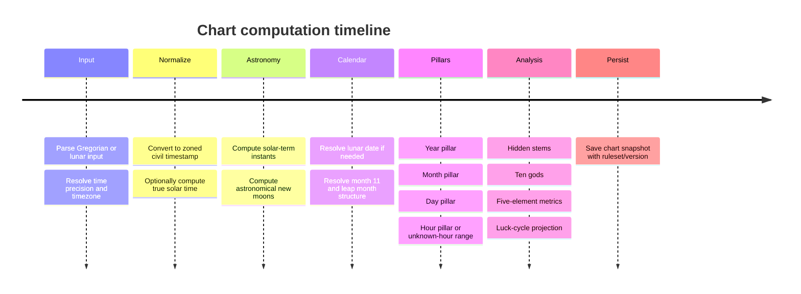
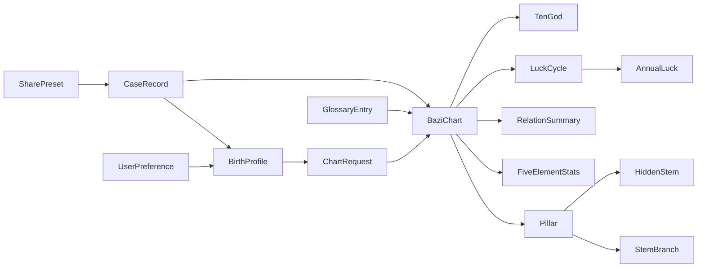

# Fate-Track V1 Product Spec and Engineering Plan

## Executive summary

Fate-Track should launch as a **free, accuracy-first Bazi web application** with a deliberately narrow V1 promise: reliable chart construction, restrained structured analysis, usable case management, safe redacted sharing, and a practical Chinese-calendar helper. The uploaded project materials already frame the product around “free charting, analysis, records, sharing, and calendar” and indicate a full-inventory design style inspired by QuantPilot’s feature-tree approach; that is the right product-management posture for this project because calendrical edge cases and interpretation-scope drift are the two main sources of V1 risk. fileciteturn0file0 fileciteturn0file1

The highest-leverage engineering decision is to treat chart generation as a **deterministic calendrical service with versioned rulesets**, not as a UI convenience. East Asian solar terms are defined by the Sun’s ecliptic longitude, and official/authoritative astronomical sources suitable for implementation exist: NASA/JPL Horizons provides high-accuracy ephemerides, JPL recommends DE440 for general use, NAOJ explicitly defines the 24 solar terms by solar longitude, and NREL’s Solar Position Algorithm gives a reproducible procedure for time-scale handling and equation-of-time calculations. Secondary summaries of the current Chinese calendar standard state that the winter-solstice month is month 11, that leap-month assignment follows the month-without-major-term rule, and that UTC+8 is the civil reference used for the modern Chinese calendar. citeturn18view0turn18view1turn34view2turn38view0turn12search2

For the Rust backend, the best fit is **Axum**. Its official docs emphasize ergonomics, modularity, predictable error handling, extractors, and direct reuse of the Tower middleware ecosystem; that combination matches a service that will start small but likely grow into calendrical computation, saved cases, public-share links, glossary endpoints, and eventually more advanced rule variants. Actix Web remains a strong alternative if the team prioritizes a more batteries-included framework and very high throughput, while Warp is elegant for smaller composable services but its filter-oriented style becomes harder to read as business APIs expand. citeturn16view0turn17view0turn17view3turn17view4

The key product-policy recommendation is that Fate-Track V1 should **compute richly and speak cautiously**. The analysis layer should expose measurable structure—element distribution, visible/hidden stems, ten-god distribution, seasonal support, combinations/clashes, and luck-cycle overlays—while avoiding deterministic life claims, diagnosis, or extended counseling. From a trust and compliance perspective, birth data and derived charts should be treated as sensitive personal data; logging of raw birth details, share tokens, access tokens, or high-sensitivity identifiers should be prohibited or masked, per OWASP and NIST guidance. citeturn23view2turn26view1turn27view1

## Product scope and functional inventory

### Product position and full feature tree

The recommended V1 scope follows a **rooted, exhaustive feature tree** rather than a loose backlog. That mirrors the structural discipline suggested by the uploaded QuantPilot-style full tree and is especially important here because Bazi apps often fail through hidden convention choices rather than missing widgets. fileciteturn0file0 fileciteturn0file1

```text
Fate-Track
├─ Entry
│  ├─ Home
│  ├─ New chart CTA
│  ├─ Feature overview
│  └─ Disclaimer and glossary entry points
├─ Charting
│  ├─ Birth input
│  │  ├─ Gregorian input
│  │  ├─ Lunar input
│  │  ├─ Leap-month support
│  │  ├─ Precise time / approximate time / unknown time
│  │  ├─ Time zone
│  │  ├─ Birth location optional
│  │  └─ True solar time toggle
│  ├─ Calendar assist
│  │  ├─ Solar↔lunar conversion
│  │  ├─ Solar terms lookup
│  │  ├─ Gan-Zhi date lookup
│  │  └─ Boundary warnings
│  └─ Chart generation
│     ├─ Four pillars
│     ├─ Hidden stems
│     ├─ Ten gods
│     ├─ Five elements
│     ├─ NaYin optional display
│     └─ Rule/version echo
├─ Chart detail
│  ├─ Summary tab
│  ├─ Pillars tab
│  ├─ Five elements & ten gods tab
│  ├─ Relations / combinations / clashes tab
│  ├─ Luck cycles tab
│  ├─ Save to case
│  └─ Share preview
├─ Cases
│  ├─ Case list
│  ├─ Search / filter / tag
│  ├─ Case detail
│  ├─ Notes
│  ├─ Archive / delete
│  └─ Share presets
├─ Calendar
│  ├─ Almanac day query
│  ├─ Lunar month view
│  ├─ Solar term list
│  └─ Gan-Zhi day/hour aid
├─ Glossary
│  ├─ Term index
│  ├─ In-context chips
│  └─ Linked detail page
├─ Settings
│  ├─ Locale
│  ├─ Display preferences
│  ├─ Ruleset preferences
│  ├─ Privacy defaults
│  └─ Share defaults
└─ Platform
   ├─ REST API
   ├─ Deterministic chart engine
   ├─ Saved records
   ├─ Redacted share snapshots
   ├─ Observability without sensitive logging
   └─ Golden-test validation
```

### User personas

| Persona | Need | V1 implications |
|---|---|---|
| Curious self-service user | Wants a chart quickly, may not know whether birth time is exact | Input flow must support exact / approximate / unknown time, explain boundary effects, and avoid jargon-heavy output |
| Privacy-conscious recorder | Wants to save cases and revisit later without exposing raw birth details | Saved cases, local labels/aliases, redacted sharing, strict privacy defaults |
| Semi-professional practitioner / content creator | Wants deterministic charts, glossary-backed terminology, and shareable snapshots | Ruleset/version echo, calendar helper, structured cards, share preview, case notes |

### Core user stories

A first-time user can enter birth data in Gregorian form, or in lunar form including leap month, and receive a clearly labeled chart with the active ruleset and any uncertainty flags.

A user born near **Lìchūn** or another solar-term boundary can see exactly why the chart changed, including the relevant boundary instant and whether civil time or true solar time was used. Lìchūn is the first solar term and is defined at solar longitude 315°; authoritative examples show the 2024 boundary at **2024-02-04 08:27 UTC** and the 2026 boundary at **2026-02-03 20:02 UTC**, making boundary transparency a real product requirement rather than a nice-to-have. citeturn34view2turn31view0

A user without a known birth hour can still generate a partial chart and see which conclusions are stable across all twelve double-hours, rather than being forced into a false hour value.

A user can save a chart as a case, add notes and tags, and publish a **redacted share snapshot** that removes name and exact-identifying details by default.

A user can open the calendar helper to convert between solar and lunar dates, inspect solar terms, and validate a Gan-Zhi date before creating a chart.

### Scope by delivery tier

| Tier | Included |
|---|---|
| MVP | Home, new chart form, Gregorian input, exact/unknown hour, four pillars, hidden stems, five-element summary, ten-god summary, case save, basic glossary, disclaimer |
| P0 | Lunar input with leap month, time zone selection, optional true solar time, boundary explanation card, luck cycles basic view, share preview with redaction, calendar/day query, settings persistence |
| P1 | Case search/filter/tagging, approximate-time mode, stable-vs-variant summary for unknown hour, annual luck overlay, export JSON/image, glossary deep-link chips, comparison of civil vs true-solar-time hour result |
| P2 | Multi-chart compare, flow-month layer, advanced school toggles, admin glossary editor, offline cache, localization beyond en/zh, public collections/community |

### Page inventory

| Route | Page | Purpose | Key states |
|---|---|---|---|
| `/` | Home | Entry, trust framing, quick start | default, loading, degraded API |
| `/new` | New Chart | Birth input and chart creation | pristine, validating, boundary warning, submit error |
| `/chart/:id` | Chart Detail | Unified chart workspace | loading, partial chart, full chart, deleted |
| `/chart/:id/analysis` | Analysis Tab | Five elements, ten gods, structured cards | stable, unknown-hour aggregate |
| `/chart/:id/luck` | Luck Tab | Decadal/annual luck display | exact, approximate-range |
| `/chart/:id/records` | Record Tab | Save state, notes, metadata | unsaved, saved, archived |
| `/cases` | Case List | Browse saved records | empty, filtered, archived |
| `/cases/:id` | Case Detail | Notes, tags, chart link, share presets | read, edit, deleted |
| `/share/:token` | Share Preview | Public redacted snapshot | valid, expired, revoked |
| `/calendar` | Almanac / Calendar | Solar-lunar conversion, term/daily lookup | day query, month view, invalid lunar date |
| `/settings` | Settings | Preferences and privacy defaults | default, saved, reset |
| `/glossary` | Glossary Index | Search terms | search results, empty |
| `/glossary/:slug` | Glossary Detail | Term explanation | normal, missing |

### UI form field inventory

The calendrical model requires more explicit fields than ordinary forms because time-zone and precision choices materially affect output. JPL, IANA, and NREL all reinforce that historical time data, time scales, and ephemeris calculations are not interchangeable shortcuts. citeturn18view0turn21view0turn38view0

| Form | Fields |
|---|---|
| New Chart | input_mode, calendar_type, gregorian_date, gregorian_time, lunar_year, lunar_month, lunar_day, lunar_is_leap_month, time_precision, timezone_id, birth_location_name, longitude, latitude, use_true_solar_time, sex, chart_label, notes_optional |
| Case Edit | case_title, alias, tags[], notes_markdown, pinned, archived |
| Share Preset | preset_name, redact_name, redact_exact_time, redact_location, redact_notes, show_true_solar_time, show_luck, expires_at_optional |
| Calendar Query | solar_date or lunar_date, is_leap_month, timezone_id, query_kind |
| Settings | locale, theme, default_timezone, default_true_solar_time, default_time_precision_mode, default_redaction_profile, glossary_inline, analysis_tone |

### Acceptance criteria

| Area | Acceptance criterion |
|---|---|
| Input | User can create a chart from Gregorian input or lunar input with leap-month selection |
| Boundary clarity | If birth time is near a solar-term boundary, UI shows the exact boundary instant and the before/after implication |
| Ruleset reproducibility | Every chart response includes `ruleset_id`, `algo_version`, `timezone_used`, and `true_solar_time_applied` |
| Unknown hour | Unknown hour does not fabricate an hour pillar; chart renders with `hour_status = unknown` and variant-aware analysis |
| Calendar helper | User can query solar↔lunar conversion and see solar terms for the relevant day/month |
| Sharing | Public share page never exposes raw internal IDs, private notes, exact hidden fields, or mutable private case state |
| Cases | User can save, edit, tag, archive, and delete cases |
| Analysis language | Output avoids deterministic or harmful life claims and uses short, structured, non-judgmental wording |
| Accessibility | All major functionality is usable by keyboard and screen reader labeling is present for controls and regions |
| Performance | Cached/common chart reads feel instantaneous; chart creation and detail should remain comfortably interactive on mobile networks |
| Error handling | Invalid lunar dates, impossible leap-month selections, and unsupported timezone histories produce actionable error copy |

### Explicit non-goals

V1 should **not** aim to be a paid consultation platform, a chat-based fortune-telling service, a social network, a compatibility/marriage service, a “one true school” of Bazi, a medical/legal/financial advice product, or a native mobile app. It should also avoid flow-month/day/hour interpretation, user-generated public content, AI counseling, and professional back-office tooling in V1.

## Bazi algorithm and calendrical specification

### Rule choices for V1

The robust way to implement Bazi is to separate **astronomical facts** from **astrological conventions**. Astronomical facts include solar-term instants, conjunction/new-moon instants, time-zone histories, and day boundaries. Conventions include whether the year pillar changes at lunar new year or Lìchūn, whether the day changes at 00:00 or 23:00 by school, whether true solar time affects only hour pillar or the full chart, and which luck-cycle school is the default. Solar terms are formally defined by solar longitude, and authoritative references explicitly tie them to leap-month assignment in lunisolar calendars. Secondary summaries of the PRC standard indicate that the modern Chinese calendar sets month 11 as the month containing the winter solstice and uses the no-major-term leap-month rule under UTC+8. citeturn34view2turn12search2

**Recommended V1 defaults**

| Topic | Recommended default | Why |
|---|---|---|
| Year pillar boundary | Lìchūn | Matches common Bazi practice and avoids mismatch between astrology users and civil lunar-year expectations |
| Display of lunar year | Also show lunar-new-year label as reference, but do not drive year pillar from it | Reduces user confusion |
| Month pillar boundary | Solar-term intervals beginning at Lìchūn | Standard astrological month convention |
| Day boundary | 00:00 local civil date by default; optional advanced toggle for “Zi-beginning” school | Keeps default understandable but preserves extensibility |
| Hour pillar | Double-hour (`子时` 23:00–01:00 etc.) using selected time basis | Aligns with sexagenary hour mapping |
| Time basis | Civil time by default; optional true solar time | Lets mainstream users start simple |
| Unknown hour | Null hour pillar with stability analysis across 12 hours | Safer than forced imputation |
| Lunar conversion | Chinese-calendar model under UTC+8 civil reference | Matches the current standard summary |

### Implementable algorithm pipeline



### Astronomical foundation

For production accuracy, use an ephemeris-based engine rather than approximated date tables alone. JPL Horizons provides high-accuracy ephemerides and JPL recommends DE440 for general use; NREL SPA gives a step-by-step computational procedure and notes how to relate UTC, UT, TAI, and TT. NREL also states that UTC is held within 0.9 seconds of UT by leap seconds, while IANA’s tz database is the correct source for civil time-zone histories and daylight-saving changes. citeturn18view0turn18view1turn38view0turn21view0

**Implementation recommendation**

1. Accept input as either:
   - Gregorian local date/time + timezone ID, or
   - Lunar date + leap-month flag + optional time + timezone ID.
2. Resolve timezone via IANA tzdb history, not a fixed offset string alone.
3. Convert civil timestamp to UTC.
4. If true solar time is enabled and longitude is available:
   - compute equation of time,
   - compute longitude correction relative to timezone meridian,
   - derive local apparent solar time,
   - use that for hour-boundary logic and optionally expose both civil and true-solar timestamps.
5. Compute solar terms by solving for solar longitude `λ = k * 15°` for `k = 0..23`.
6. Compute conjunctions/new moons from apparent geocentric longitudes of Sun and Moon.
7. Build Chinese calendar month structure:
   - identify the lunar month containing winter solstice as month 11,
   - assign subsequent months,
   - mark as leap the first lunar month without a major solar term.
8. Resolve the Bazi pillars according to the active ruleset.
9. Persist chart with the exact `algo_version` and `ruleset_id`.

### Solar and lunar conversion

A V1 Rust service should not hard-code a 1901–2100 lookup table as the only source of truth, even if it uses a table for performance. The correct model is:

- **Source of truth**: ephemeris-derived solar terms and conjunctions.
- **Operational optimization**: precomputed golden tables for 1901–2100 generated from the same engine and shipped with hash/versioning.

This hybrid strategy gives deterministic reproducibility while preserving a principled derivation path.

### Leap-month handling

The critical product rule is that leap month is a property of the **lunar calendar month sequence**, not of the Bazi month pillar. A user entering “lunar leap fourth month” is specifying a civil/traditional lunar date, but the month pillar still comes from solar-term intervals, not from the lunar month label.

This distinction should be made explicit in UI copy:
- “Lunar date was used to recover the civil timestamp.”
- “Month pillar is based on solar terms.”

### Year pillar

Lìchūn is the first solar term, defined at solar longitude 315°. Authoritative examples show:
- **2024 Lìchūn** at `2024-02-04 08:27 UTC`
- **2026 Lìchūn** at `2026-02-03 20:02 UTC` citeturn34view2turn31view0

For a China/Taiwan user, the practical boundary is therefore:
- 2024: `2024-02-04 16:27` CST/TST-equivalent civil-zone baseline
- 2026: `2026-02-04 04:02` CST/TST-equivalent civil-zone baseline

**Algorithm**
- Compute the exact Lìchūn instant for the relevant year in the active time basis.
- If birth instant `< Lìchūn`, use previous sexagenary year.
- Else use current sexagenary year.

**Important UI behavior**
If birth date is the same calendar day as Lìchūn, the UI should show **time-of-day boundary sensitivity**, not just “on/after Feb 4.” That is mandatory.

### Month pillar

NAOJ defines each solar term by solar longitude, and the sexagenary-month tradition maps the months across solar-term windows. Secondary calendrical references and sexagenary examples show the astrological sequence:
- 寅月: Lìchūn → Jīngzhé
- 卯月: Jīngzhé → Qīngmíng
- 辰月: Qīngmíng → Lìxià
… and so on through 丑月: Xiǎohán → Lìchūn. The month stems follow a five-group mapping from the year stem: in 甲/己 years, the 寅 month starts at 丙寅; in 乙/庚 years, 戊寅; in 丙/辛 years, 庚寅; in 丁/壬 years, 壬寅; in 戊/癸 years, 甲寅. citeturn34view2turn42view1turn42view2

**Algorithm**
1. Determine which solar-term interval contains the birth instant.
2. Assign month branch by interval:
   - 寅 at Lìchūn,
   - 卯 at Jīngzhé,
   - 辰 at Qīngmíng,
   - …,
   - 丑 at Xiǎohán.
3. Derive month stem from year stem group and month index.

**Boundary example**
Qīngmíng is the fifth solar term and is defined at solar longitude 15°. JPL-based examples show **2024 Qīngmíng** at `2024-04-04 07:02 UTC`, i.e. `2024-04-04 15:02` China/Taiwan local standard time. So:
- `2024-04-04 15:01:59` local → still 卯 month
- `2024-04-04 15:02:00` local → 辰 month citeturn33view0

### Day pillar

Sexagenary day count is continuous and historically stable; modern conversion can be implemented from a Julian Day Number anchor rather than lookup tables. Authoritative sexagenary examples give known anchors such as:
- **1912-02-18 = 甲子 day**
- **1949-10-01 = 甲子 day** citeturn43view0

**Recommended algorithm**
1. Convert the active date boundary to a local calendar date:
   - default: local civil date at 00:00 boundary,
   - optional alt rule: day rolls at 23:00.
2. Convert that local date to JDN.
3. Choose an anchor JDN with known sexagenary value, e.g. a Jiazi day.
4. Compute:
   - `cycle_index = mod(jdn - anchor_jdn, 60)`
5. Map index to heavenly stem / earthly branch.

This approach is easy to unit-test and avoids century-table logic in runtime code.

### Hour pillar

Sexagenary hours use the traditional double-hour system:
- 子时 23:00–01:00
- 丑时 01:00–03:00
- …
- 亥时 21:00–23:00. Authoritative summary tables preserve this mapping and show the corresponding 5-day stem cycle for deriving hour stems from the day stem. citeturn42view3

**Algorithm**
1. Determine the hour branch from the active time basis:
   - civil time or true solar time.
2. Map day stem to one of five stem groups.
3. Use the group-specific twelve-hour sequence to derive hour stem.

**Recommended product safeguard**
If true solar time shifts the birth across a double-hour boundary, show both:
- “Civil-time hour pillar”
- “True-solar-time hour pillar”

Do not silently replace one with the other.

### Time zones and true solar time

Time-zone handling cannot use a fixed-country offset because legal time histories change, sometimes with little notice; IANA explicitly documents that governments change time-zone and daylight-saving rules and that tzdb exists to capture those histories. NREL further distinguishes UTC, UT, and TT for solar-position computation, which matters if you compute exact solar terms or equation-of-time corrections yourself. citeturn21view0turn38view0

**Recommended V1 behavior**
- Require an IANA timezone ID if the user provides clock time.
- Allow a fixed-offset fallback only with a warning: “historical timezone accuracy reduced.”
- True solar time should be **optional** and **location-dependent**.
- If longitude is missing, disable true solar time and explain why.

**Product policy**
Use true solar time to refine **hour-pillar resolution** first. Do not let it silently reshape year/month/day pillars unless that behavior is explicitly selected by the ruleset.

### Unknown-hour handling

V1 should support three modes:

| Mode | Stored meaning | Output behavior |
|---|---|---|
| exact | clock time trusted | normal chart |
| approximate | time available but low confidence | compute likely hour, mark low confidence |
| unknown | no reliable hour | no hour pillar; compute a 12-hour sensitivity summary |

For `unknown`, return:
- year/month/day pillars,
- twelve possible hour pillars,
- stable metrics across all 12,
- unstable metrics flagged as “hour-sensitive.”

This is the cleanest way to avoid pseudo-precision.

### Edge cases to treat as first-class

| Edge case | Required behavior |
|---|---|
| Birth exactly at solar-term instant | Document inclusive rule, e.g. `timestamp >= boundary → next pillar` |
| Birth within same civil day as Lìchūn/Qīngmíng/etc. | Show exact local boundary time |
| Leap-month lunar input | Validate against generated month structure; reject impossible leap month |
| Historical timezone ambiguity | Store timezone source and resolved offset |
| Missing longitude with true solar time on | Reject or auto-disable with explanation |
| Unknown hour | No fabricated hour pillar |
| 23:00 school toggle | Recompute day/hour pillars and echo rule choice |
| 2033-like leap-month anomalies | Validate against golden tables, not hand-made assumptions |

### High-confidence test vectors

The following vectors are strong candidates for the initial golden suite because they are either directly supported by authoritative/traceable references or are boundary cases derived from them.

| Category | Input | Expected result |
|---|---|---|
| Year boundary | `2024-02-04 16:26:59 Asia/Shanghai` | still previous sexagenary year in Lìchūn-based ruleset |
| Year boundary | `2024-02-04 16:27:00 Asia/Shanghai` | switches to 甲辰 year |
| Year boundary | `2026-02-04 04:01:59 Asia/Shanghai` | still previous year |
| Year boundary | `2026-02-04 04:02:00 Asia/Shanghai` | switches to new year |
| Month boundary | `2024-04-04 15:01:59 Asia/Shanghai` | still 卯 month |
| Month boundary | `2024-04-04 15:02:00 Asia/Shanghai` | switches to 辰 month |
| Day anchor | `1912-02-18` | 甲子 day |
| Day anchor | `1949-10-01` | 甲子 day |
| Hour mapping | any known 甲/己 day at `23:30` | 甲子 hour |
| Unknown hour | date without time | hour pillar null + sensitivity aggregate |

### Open questions and limitations for the algorithm layer

A direct copy of the primary PRC standard text was not retrieved in this research pass, so the Chinese national-standard rules above rely partly on reputable secondary summaries rather than a line-by-line read of GB/T 33661-2017. That is sufficient for V1 design, but not for final golden-table generation, which should be validated against the primary text or an official implementation/proclamation source. citeturn12search2turn9search0

Luck-cycle rules vary materially by school. V1 should therefore treat them as a **configurable ruleset choice** and echo that choice in every computed result.

## Domain model and API contract

### Domain model principles

The model should distinguish four things that many Bazi apps collapse together:

1. **Input facts**: what the user entered.
2. **Normalization facts**: what timestamp/location/calendar interpretation the system resolved.
3. **Derived chart facts**: the computed pillars and statistics.
4. **Presentation artifacts**: notes, sharing presets, UI preferences, glossary content.

That separation is what makes reproducibility, privacy, and future ruleset changes manageable.

### Entity relationship model



### Privacy levels

| Code | Meaning |
|---|---|
| public | safe for anonymous read |
| user_private | tied to a user/device but low sensitivity |
| sensitive_personal | direct or quasi-direct personal data |
| sensitive_derived | derived astrology/chart data that can still re-identify or profile a person |
| share_redacted | approved public snapshot only |

### Entity field specifications

#### BirthProfile

| Field | Type | Constraints | Privacy |
|---|---|---|---|
| `birth_profile_id` | UUID | required | sensitive_personal |
| `display_name` | string \| null | max 80 | sensitive_personal |
| `alias` | string \| null | max 80 | user_private |
| `sex` | enum(`female`,`male`,`other`,`unspecified`) | required by selected ruleset or nullable | sensitive_personal |
| `calendar_input_type` | enum(`gregorian`,`lunar`) | required | sensitive_personal |
| `gregorian_date` | date \| null | valid ISO date | sensitive_personal |
| `gregorian_time` | time \| null | nullable when unknown | sensitive_personal |
| `lunar_year` | int \| null | 1–9999 or proleptic support decision | sensitive_personal |
| `lunar_month` | int \| null | 1–12 | sensitive_personal |
| `lunar_day` | int \| null | 1–30 | sensitive_personal |
| `lunar_is_leap_month` | bool \| null | only when lunar input | sensitive_personal |
| `time_precision` | enum(`exact`,`approximate`,`unknown`) | required | sensitive_personal |
| `timezone_id` | string | IANA TZ ID preferred | sensitive_personal |
| `birth_location_name` | string \| null | max 120 | sensitive_personal |
| `longitude` | decimal(8,5) \| null | -180..180 | sensitive_personal |
| `latitude` | decimal(8,5) \| null | -90..90 | sensitive_personal |
| `source_note` | string \| null | max 500 | user_private |
| `created_at` | datetime | server set | user_private |
| `updated_at` | datetime | server set | user_private |

#### ChartRequest

| Field | Type | Constraints | Privacy |
|---|---|---|---|
| `chart_request_id` | UUID | required | sensitive_derived |
| `birth_profile_id` | UUID | required | sensitive_derived |
| `ruleset_id` | string | e.g. `ft-v1-default` | sensitive_derived |
| `algo_version` | string | semver or git hash | sensitive_derived |
| `use_true_solar_time` | bool | required | sensitive_derived |
| `day_boundary_mode` | enum(`midnight`,`zi_start`) | required | sensitive_derived |
| `resolve_timezone_history` | bool | default true | sensitive_derived |
| `request_locale` | string | BCP-47 | user_private |
| `requested_at` | datetime | server set | user_private |

#### StemBranch

| Field | Type | Constraints | Privacy |
|---|---|---|---|
| `stem` | enum(甲..癸) | required | sensitive_derived |
| `branch` | enum(子..亥) | required | sensitive_derived |
| `stem_index` | int | 1–10 | sensitive_derived |
| `branch_index` | int | 1–12 | sensitive_derived |
| `label_zh` | string | derived | sensitive_derived |
| `label_en` | string | derived | sensitive_derived |

#### HiddenStem

| Field | Type | Constraints | Privacy |
|---|---|---|---|
| `stem` | enum(甲..癸) | required | sensitive_derived |
| `weight` | decimal(4,3) | 0–1 | sensitive_derived |
| `source_branch` | enum(子..亥) | required | sensitive_derived |
| `ten_god_to_day_master` | string \| null | derived | sensitive_derived |

#### Pillar

| Field | Type | Constraints | Privacy |
|---|---|---|---|
| `kind` | enum(`year`,`month`,`day`,`hour`) | required | sensitive_derived |
| `stem_branch` | `StemBranch` | required | sensitive_derived |
| `hidden_stems` | `HiddenStem[]` | branch-specific | sensitive_derived |
| `nayin` | string \| null | optional display | sensitive_derived |
| `is_estimated` | bool | true for approximate/unknown projections | sensitive_derived |
| `confidence` | decimal(4,3) | 0–1 | sensitive_derived |

#### TenGod

| Field | Type | Constraints | Privacy |
|---|---|---|---|
| `code` | enum | system-defined | sensitive_derived |
| `label` | string | localized | sensitive_derived |
| `count_visible` | int | >= 0 | sensitive_derived |
| `count_hidden` | int | >= 0 | sensitive_derived |
| `score` | decimal(6,2) | normalized metric | sensitive_derived |

#### FiveElementStats

| Field | Type | Constraints | Privacy |
|---|---|---|---|
| `wood` | decimal(6,2) | >=0 | sensitive_derived |
| `fire` | decimal(6,2) | >=0 | sensitive_derived |
| `earth` | decimal(6,2) | >=0 | sensitive_derived |
| `metal` | decimal(6,2) | >=0 | sensitive_derived |
| `water` | decimal(6,2) | >=0 | sensitive_derived |
| `normalization_basis` | enum(`count`,`weighted`,`seasonal_weighted`) | required | sensitive_derived |
| `strongest_element` | enum | derived | sensitive_derived |
| `weakest_element` | enum | derived | sensitive_derived |
| `missing_elements` | enum[] | derived | sensitive_derived |
| `day_master_support_index` | decimal(6,2) | derived | sensitive_derived |

#### RelationSummary

| Field | Type | Constraints | Privacy |
|---|---|---|---|
| `stems_combinations` | array | optional | sensitive_derived |
| `stems_clashes` | array | optional | sensitive_derived |
| `branches_combinations` | array | optional | sensitive_derived |
| `branches_clashes` | array | optional | sensitive_derived |
| `punishments` | array | optional | sensitive_derived |
| `harms` | array | optional | sensitive_derived |
| `seasonal_context` | string | short label | sensitive_derived |

#### LuckCycle

| Field | Type | Constraints | Privacy |
|---|---|---|---|
| `cycle_index` | int | 1..N | sensitive_derived |
| `stem_branch` | `StemBranch` | required | sensitive_derived |
| `start_age` | decimal(5,2) | >=0 | sensitive_derived |
| `end_age` | decimal(5,2) | > start_age | sensitive_derived |
| `start_date` | date \| null | if computed | sensitive_derived |
| `end_date` | date \| null | if computed | sensitive_derived |
| `direction` | enum(`forward`,`reverse`) | required | sensitive_derived |
| `ruleset_note` | string | compact explanation | sensitive_derived |

#### AnnualLuck

| Field | Type | Constraints | Privacy |
|---|---|---|---|
| `gregorian_year` | int | required | sensitive_derived |
| `stem_branch` | `StemBranch` | required | sensitive_derived |
| `inside_cycle_index` | int | required | sensitive_derived |
| `summary_flags` | string[] | optional | sensitive_derived |

#### BaziChart

| Field | Type | Constraints | Privacy |
|---|---|---|---|
| `chart_id` | UUID | required | sensitive_derived |
| `chart_request_id` | UUID | required | sensitive_derived |
| `birth_profile_id` | UUID | required | sensitive_derived |
| `resolved_timestamp_local` | datetime | required unless unknown time | sensitive_derived |
| `resolved_timestamp_utc` | datetime | nullable if no time | sensitive_derived |
| `resolved_true_solar_time` | datetime \| null | optional | sensitive_derived |
| `resolved_timezone_offset_minutes` | int | required when time known | sensitive_derived |
| `year_pillar` | `Pillar` | required | sensitive_derived |
| `month_pillar` | `Pillar` | required | sensitive_derived |
| `day_pillar` | `Pillar` | required | sensitive_derived |
| `hour_pillar` | `Pillar \| null` | null when unknown | sensitive_derived |
| `hour_status` | enum(`exact`,`approximate`,`unknown`,`variant_range`) | required | sensitive_derived |
| `five_elements` | `FiveElementStats` | required | sensitive_derived |
| `ten_gods` | `TenGod[]` | required | sensitive_derived |
| `relation_summary` | `RelationSummary` | required | sensitive_derived |
| `luck_cycles` | `LuckCycle[]` | optional in lightweight read | sensitive_derived |
| `annual_luck_preview` | `AnnualLuck[]` | optional | sensitive_derived |
| `ruleset_id` | string | required | sensitive_derived |
| `algo_version` | string | required | sensitive_derived |
| `created_at` | datetime | server set | user_private |

#### CaseRecord

| Field | Type | Constraints | Privacy |
|---|---|---|---|
| `case_id` | UUID | required | sensitive_personal |
| `birth_profile_id` | UUID | required | sensitive_personal |
| `latest_chart_id` | UUID | required | sensitive_derived |
| `title` | string | max 120 | user_private |
| `tags` | string[] | max 20 tags | user_private |
| `notes_markdown` | string \| null | max policy-defined size | sensitive_personal |
| `is_archived` | bool | default false | user_private |
| `created_at` | datetime | server set | user_private |
| `updated_at` | datetime | server set | user_private |

#### SharePreset

| Field | Type | Constraints | Privacy |
|---|---|---|---|
| `share_preset_id` | UUID | required | user_private |
| `case_id` | UUID | required | user_private |
| `name` | string | max 80 | user_private |
| `redact_name` | bool | required | user_private |
| `redact_exact_time` | bool | required | user_private |
| `redact_location` | bool | required | user_private |
| `include_notes` | bool | required | user_private |
| `include_luck` | bool | required | user_private |
| `expires_at` | datetime \| null | optional | user_private |
| `share_token_hash` | string \| null | stored hashed only | sensitive_derived |

#### UserPreference

| Field | Type | Constraints | Privacy |
|---|---|---|---|
| `preference_id` | UUID | required | user_private |
| `locale` | string | BCP-47 | user_private |
| `theme` | enum(`light`,`dark`,`system`) | required | user_private |
| `default_timezone_id` | string | IANA ID | user_private |
| `default_true_solar_time` | bool | required | user_private |
| `default_redaction_profile` | string | required | user_private |
| `glossary_inline` | bool | required | user_private |
| `analysis_tone` | enum(`compact`,`standard`) | required | user_private |

#### GlossaryEntry

| Field | Type | Constraints | Privacy |
|---|---|---|---|
| `glossary_entry_id` | UUID | required | public |
| `slug` | string | unique | public |
| `term_zh` | string | required | public |
| `term_en` | string | required | public |
| `short_definition` | string | max 240 | public |
| `long_definition_md` | string | max policy-defined size | public |
| `related_terms` | string[] | optional | public |
| `status` | enum(`published`,`draft`) | required | public/draft internal |

### JSON examples

#### BirthProfile

```json
{
  "birth_profile_id": "b1c5ef24-0b62-4e55-9cd9-6625f1041c38",
  "display_name": "Han",
  "alias": "Case A",
  "sex": "male",
  "calendar_input_type": "gregorian",
  "gregorian_date": "2024-02-04",
  "gregorian_time": "16:26:00",
  "time_precision": "exact",
  "timezone_id": "Asia/Shanghai",
  "birth_location_name": "Shanghai",
  "longitude": 121.47370,
  "latitude": 31.23040,
  "source_note": "Family record"
}
```

#### ChartRequest

```json
{
  "chart_request_id": "6c86599f-0283-4e52-a2f2-fbaa4be16824",
  "birth_profile_id": "b1c5ef24-0b62-4e55-9cd9-6625f1041c38",
  "ruleset_id": "ft-v1-default",
  "algo_version": "1.0.0",
  "use_true_solar_time": false,
  "day_boundary_mode": "midnight",
  "resolve_timezone_history": true,
  "request_locale": "en-US"
}
```

#### BaziChart

```json
{
  "chart_id": "81be65c0-b813-4a27-9da8-4f7cf0ad66fb",
  "chart_request_id": "6c86599f-0283-4e52-a2f2-fbaa4be16824",
  "birth_profile_id": "b1c5ef24-0b62-4e55-9cd9-6625f1041c38",
  "resolved_timestamp_local": "2024-02-04T16:26:00+08:00",
  "resolved_timestamp_utc": "2024-02-04T08:26:00Z",
  "resolved_true_solar_time": null,
  "resolved_timezone_offset_minutes": 480,
  "ruleset_id": "ft-v1-default",
  "algo_version": "1.0.0",
  "year_pillar": { "kind": "year", "stem_branch": { "stem": "癸", "branch": "卯" } },
  "month_pillar": { "kind": "month", "stem_branch": { "stem": "乙", "branch": "丑" } },
  "day_pillar": { "kind": "day", "stem_branch": { "stem": "甲", "branch": "子" } },
  "hour_pillar": { "kind": "hour", "stem_branch": { "stem": "甲", "branch": "申" } },
  "hour_status": "exact",
  "five_elements": {
    "wood": 2.4,
    "fire": 0.8,
    "earth": 1.9,
    "metal": 1.1,
    "water": 2.0,
    "normalization_basis": "seasonal_weighted",
    "strongest_element": "wood",
    "weakest_element": "fire",
    "missing_elements": []
  },
  "ten_gods": [
    { "code": "friend", "label": "Friend", "count_visible": 1, "count_hidden": 2, "score": 2.3 }
  ],
  "relation_summary": {
    "stems_combinations": [],
    "stems_clashes": [],
    "branches_combinations": ["子丑合"],
    "branches_clashes": [],
    "punishments": [],
    "harms": [],
    "seasonal_context": "late winter"
  }
}
```

#### CaseRecord

```json
{
  "case_id": "7ca7fd9c-b261-4245-b991-07293b0b7b67",
  "birth_profile_id": "b1c5ef24-0b62-4e55-9cd9-6625f1041c38",
  "latest_chart_id": "81be65c0-b813-4a27-9da8-4f7cf0ad66fb",
  "title": "Han near LiChun boundary",
  "tags": ["boundary", "demo"],
  "notes_markdown": "Birth time is close to LiChun; verify civil vs true solar time.",
  "is_archived": false
}
```

#### SharePreset

```json
{
  "share_preset_id": "a829b4d8-ab86-4870-b859-817aa2d087b8",
  "case_id": "7ca7fd9c-b261-4245-b991-07293b0b7b67",
  "name": "Public redacted",
  "redact_name": true,
  "redact_exact_time": true,
  "redact_location": true,
  "include_notes": false,
  "include_luck": true,
  "expires_at": "2026-12-31T23:59:59Z"
}
```

#### UserPreference

```json
{
  "preference_id": "2d9c10e4-ec19-4808-b2ea-08d2f8dc3621",
  "locale": "en-US",
  "theme": "system",
  "default_timezone_id": "Asia/Taipei",
  "default_true_solar_time": false,
  "default_redaction_profile": "public_redacted",
  "glossary_inline": true,
  "analysis_tone": "compact"
}
```

#### GlossaryEntry

```json
{
  "glossary_entry_id": "8aef86f3-3b4d-47c8-89e1-0ba6d643ce12",
  "slug": "ten-gods",
  "term_zh": "十神",
  "term_en": "Ten Gods",
  "short_definition": "A relational classification between the day master and other stems.",
  "long_definition_md": "Ten Gods describe structural relationships in traditional Bazi analysis. Fate-Track uses them as descriptive categories, not deterministic judgments.",
  "related_terms": ["day-master", "five-elements"],
  "status": "published"
}
```

### REST API routes

| Method | Route | Purpose |
|---|---|---|
| GET | `/api/v1/health` | service health/version |
| GET | `/api/v1/calendar/lunar` | solar→lunar conversion |
| GET | `/api/v1/calendar/solar` | lunar→solar conversion |
| GET | `/api/v1/calendar/solar-terms` | solar terms by year/date range |
| GET | `/api/v1/calendar/day` | consolidated day query: lunar date, Gan-Zhi, solar term |
| POST | `/api/v1/charts` | create chart |
| GET | `/api/v1/charts/{chart_id}` | chart detail |
| GET | `/api/v1/charts/{chart_id}/analysis` | structured analysis snapshot |
| GET | `/api/v1/charts/{chart_id}/luck` | decadal and annual luck data |
| GET | `/api/v1/cases` | list cases |
| POST | `/api/v1/cases` | create case |
| GET | `/api/v1/cases/{case_id}` | case detail |
| PATCH | `/api/v1/cases/{case_id}` | update case |
| DELETE | `/api/v1/cases/{case_id}` | hard delete / archive policy decision |
| POST | `/api/v1/shares` | create share snapshot |
| GET | `/api/v1/shares/{share_id}` | private share metadata |
| GET | `/share/{token}` | public preview page or JSON preview endpoint |
| GET | `/api/v1/settings` | read preferences |
| PATCH | `/api/v1/settings` | update preferences |
| GET | `/api/v1/glossary` | glossary search/index |
| GET | `/api/v1/glossary/{slug}` | glossary detail |

### Example request and response contracts

#### Create chart

```json
POST /api/v1/charts
{
  "birth_profile": {
    "sex": "male",
    "calendar_input_type": "gregorian",
    "gregorian_date": "2024-02-04",
    "gregorian_time": "16:26:00",
    "time_precision": "exact",
    "timezone_id": "Asia/Shanghai",
    "birth_location_name": "Shanghai",
    "longitude": 121.4737,
    "latitude": 31.2304
  },
  "options": {
    "ruleset_id": "ft-v1-default",
    "use_true_solar_time": false,
    "day_boundary_mode": "midnight"
  }
}
```

```json
201 Created
{
  "chart_id": "81be65c0-b813-4a27-9da8-4f7cf0ad66fb",
  "ruleset_id": "ft-v1-default",
  "algo_version": "1.0.0",
  "warnings": [
    {
      "code": "NEAR_SOLAR_TERM_BOUNDARY",
      "message": "Birth time is within 5 minutes of LiChun."
    }
  ],
  "links": {
    "self": "/api/v1/charts/81be65c0-b813-4a27-9da8-4f7cf0ad66fb",
    "analysis": "/api/v1/charts/81be65c0-b813-4a27-9da8-4f7cf0ad66fb/analysis",
    "luck": "/api/v1/charts/81be65c0-b813-4a27-9da8-4f7cf0ad66fb/luck"
  }
}
```

#### Analysis snapshot

```json
GET /api/v1/charts/{chart_id}/analysis
{
  "chart_id": "81be65c0-b813-4a27-9da8-4f7cf0ad66fb",
  "summary_cards": [
    {
      "card_type": "day_master_context",
      "title": "Day Master Context",
      "facts": ["Wood is relatively supported", "Late-winter seasonal influence is present"],
      "sensitivity": "low"
    }
  ],
  "metrics": {
    "five_element_distribution": {
      "wood": 2.4,
      "fire": 0.8,
      "earth": 1.9,
      "metal": 1.1,
      "water": 2.0
    },
    "ten_god_scores": [
      { "code": "friend", "score": 2.3 }
    ]
  },
  "disclaimer": {
    "short": "Traditional-astrology interpretation for reflection and entertainment; not factual advice."
  }
}
```

#### Luck endpoint

```json
GET /api/v1/charts/{chart_id}/luck
{
  "chart_id": "81be65c0-b813-4a27-9da8-4f7cf0ad66fb",
  "ruleset_id": "ft-v1-default",
  "direction": "forward",
  "start_age_basis": {
    "method": "configured_ruleset",
    "elapsed_to_boundary_days": 12.3
  },
  "cycles": [
    {
      "cycle_index": 1,
      "stem_branch": { "stem": "丁", "branch": "卯" },
      "start_age": 4.1,
      "end_age": 14.1
    }
  ],
  "annual_preview": [
    { "gregorian_year": 2026, "stem_branch": { "stem": "丙", "branch": "午" } }
  ]
}
```

### Error model and compatibility rules

**Error envelope**

```json
{
  "error": {
    "code": "INVALID_LUNAR_DATE",
    "message": "The specified lunar leap month does not exist in the resolved year.",
    "details": {
      "field": "lunar_is_leap_month"
    },
    "trace_id": "req_01J..."
  }
}
```

**Recommended error codes**
- `INVALID_DATETIME`
- `INVALID_LUNAR_DATE`
- `UNSUPPORTED_TIMEZONE`
- `BOUNDARY_AMBIGUITY`
- `RULESET_NOT_SUPPORTED`
- `CHART_NOT_FOUND`
- `CASE_NOT_FOUND`
- `SHARE_NOT_FOUND`
- `SHARE_EXPIRED`
- `VALIDATION_ERROR`
- `RATE_LIMITED`
- `INTERNAL_ERROR`

**Versioning**
- URI version at `/api/v1/...`
- additive fields only within V1
- never repurpose enum meanings
- every chart response echoes `ruleset_id` and `algo_version`
- persisted charts remain reproducible even after later engine changes

## Backend architecture

### Framework recommendation

Axum is the strongest default for Fate-Track. Official docs describe it as an HTTP routing and request-handling library focused on **ergonomics and modularity**, with extractors, predictable error handling, and direct reuse of the Tower ecosystem for middleware such as tracing, timeouts, compression, and authorization. That combination is particularly attractive for a service whose complicated parts are in pure-domain computation rather than in HTTP trickery. Actix Web remains attractive for teams that prefer a more batteries-included framework and value its performance profile and built-in feature set; Warp’s filter system is elegant and composable, but its endpoint composition tends to become opaque in larger application domains. citeturn16view0turn17view0turn17view4

### Recommended workspace layout

```text
fate-track/
├─ crates/
│  ├─ ft-api/               # Axum adapters, routing, DTOs, middleware
│  ├─ ft-app/               # service layer / use cases
│  ├─ ft-domain/            # entities, value objects, enums, rule IDs
│  ├─ ft-calendar/          # solar terms, lunar conversion, JDN, timezone helpers
│  ├─ ft-analysis/          # five elements, ten gods, relation summaries
│  ├─ ft-luck/              # luck-cycle rules and projections
│  ├─ ft-storage/           # repository impls, DB mapping
│  ├─ ft-share/             # redaction + public snapshot serialization
│  ├─ ft-config/            # config loading / feature flags / secrets interface
│  ├─ ft-observability/     # tracing, metrics, audit-safe logging
│  └─ ft-testkit/           # golden fixtures, helpers, fake repos, factory data
├─ apps/
│  └─ server/               # binary crate
└─ migrations/
```

### Layering

| Layer | Responsibility | Must avoid |
|---|---|---|
| `ft-domain` | pure business types and ruleset IDs | DB concerns, web concerns |
| `ft-calendar` | deterministic calendrical math | HTTP and persistence |
| `ft-analysis` / `ft-luck` | derived metrics, summaries, projections | UI copy that is too presentation-specific |
| `ft-app` | orchestrates use cases across modules | framework-specific extractors |
| `ft-storage` | repositories and database adapters | domain math |
| `ft-api` | routing, validation, DTO mapping, response envelopes | business logic |

### Key traits

```rust
pub trait CalendarEngine {
    fn solar_to_lunar(&self, input: SolarQuery) -> Result<LunarDateResolved, CalendarError>;
    fn lunar_to_solar(&self, input: LunarQuery) -> Result<SolarDateResolved, CalendarError>;
    fn solar_terms_in_range(&self, range: DateRange, tz: Tz) -> Result<Vec<SolarTermInstant>, CalendarError>;
    fn compute_chart_basis(&self, req: ChartRequest) -> Result<ChartBasis, CalendarError>;
}

pub trait BaziEngine {
    fn compute_chart(&self, basis: ChartBasis) -> Result<BaziChart, BaziError>;
}

pub trait AnalysisEngine {
    fn snapshot(&self, chart: &BaziChart) -> Result<AnalysisSnapshot, AnalysisError>;
}

pub trait LuckEngine {
    fn compute(&self, chart: &BaziChart, ruleset: LuckRuleSet) -> Result<LuckResult, LuckError>;
}

pub trait CaseRepository {
    fn create(&self, cmd: CreateCase) -> Result<CaseRecord, RepoError>;
    fn get(&self, case_id: Uuid) -> Result<Option<CaseRecord>, RepoError>;
    fn list(&self, query: CaseQuery) -> Result<Vec<CaseRecord>, RepoError>;
    fn update(&self, cmd: UpdateCase) -> Result<CaseRecord, RepoError>;
    fn delete(&self, case_id: Uuid) -> Result<(), RepoError>;
}
```

### Error strategy

Use **typed internal errors** with `thiserror`, rolled into a stable API envelope at the boundary. Keep three tiers:

- `DomainError`: invalid school/ruleset logic, impossible pillar derivation
- `InfraError`: DB, clock, encryption, network, serialization
- `AppError`: user-facing mapped error with HTTP status and code

This prevents a common failure mode in astrology apps where low-level calendrical ambiguity is flattened into a generic “something went wrong.”

### Data layer recommendation

Start with a relational store for cases/settings/glossary/share metadata and JSON columns for chart snapshots if needed. The chart engine itself should remain pure and deterministic, so persisted chart snapshots should be stored as immutable versioned artifacts rather than re-derived on every read whenever possible.

Suggested storage split:
- relational tables for `case_record`, `birth_profile`, `share_preset`, `user_preference`, `glossary_entry`
- immutable JSON snapshot for `bazi_chart_v1`
- optional generated index columns for queryable fields like `year_pillar`, `day_master`, tag arrays

### Service-layer use cases

| Use case | Service |
|---|---|
| create chart | `ChartService::create_chart` |
| get chart detail | `ChartQueryService::get_chart` |
| analysis snapshot | `AnalysisService::get_snapshot` |
| luck cycles | `LuckService::get_cycles` |
| convert calendar date | `CalendarService::convert` |
| manage case | `CaseService` |
| create share | `ShareService::create_snapshot` |
| load glossary | `GlossaryService` |
| update settings | `PreferenceService` |

### Testing strategy

Testing must center on **golden calendrical correctness**. The backend should carry:
- unit tests for pure formulae,
- golden tests for solar-term boundaries and known day anchors,
- property tests for 60-cycle wraparound,
- snapshot tests for analysis-card structure,
- repository integration tests,
- HTTP contract tests against the Axum router. JPL/NAOJ/NREL provide the right external grounding for the golden calendrical layer; IANA tzdb is mandatory for timezone regression cases. citeturn18view0turn34view2turn38view0turn21view0

## Frontend IA and structured analysis outputs

### Frontend architecture and page wireframes

The frontend should be organized as a **single app with a chart workspace**, not as disconnected pages. That minimizes repeated state normalization and makes boundary warnings, glossary chips, and save/share actions available everywhere.

**Recommended route hierarchy**

```text
App
├─ Home
├─ NewChartPage
│  ├─ InputModeSwitch
│  ├─ DateInput / LunarInput
│  ├─ TimePrecisionSelector
│  ├─ TimezoneSelector
│  ├─ LocationFields
│  ├─ RuleOptions
│  └─ PreviewBoundaryAlert
├─ ChartWorkspace
│  ├─ HeaderSummary
│  ├─ Tabs
│  │  ├─ Overview
│  │  ├─ Pillars
│  │  ├─ Analysis
│  │  ├─ Luck
│  │  └─ Record
│  └─ GlossaryDrawer
├─ CaseListPage
├─ CaseDetailPage
├─ SharePreviewPage
├─ CalendarPage
├─ SettingsPage
└─ GlossaryPage
```

### Component inventory

| Component | Purpose |
|---|---|
| `GregorianDateTimeInput` | exact civil timestamp input |
| `LunarDateInput` | lunar year/month/day with leap-month toggle |
| `TimePrecisionSelector` | exact / approximate / unknown |
| `TimezoneSelector` | IANA timezone selection |
| `TrueSolarTimeToggle` | optional advanced setting |
| `BoundaryAlertCard` | communicates near-term boundary risk |
| `PillarCard` | one pillar with stem/branch/hidden stems |
| `ElementDistributionCard` | visual five-element summary |
| `TenGodSummaryCard` | compact distribution metrics |
| `SensitivityCard` | unknown-hour stability |
| `LuckTimeline` | decade bands + annual overlays |
| `CaseMetaPanel` | save/edit/archive state |
| `ShareRedactionPanel` | preview of public fields |
| `GlossaryChip` | in-context term explainer |
| `CalendarDayCard` | solar/lunar/Gan-Zhi day summary |

### Interaction states

| State | UI behavior |
|---|---|
| loading | skeleton cards, not spinner-only |
| invalid lunar input | inline message at month/day/leap controls |
| near boundary | sticky warning card with exact local instant |
| unknown hour | hour pillar panel replaced by sensitivity module |
| no cases | empty-state CTA to create first case |
| share expired | public page with non-revealing expiration message |
| glossary unavailable | fallback tooltip text only |
| offline/degraded | read cached chart details, disable new computation |

### Mobile layout notes

On mobile, the chart workspace should use:
- a sticky compact header with key pillars,
- horizontally scrollable tabs,
- stacked cards instead of multi-column comparisons,
- bottom-sheet glossary,
- collapsed luck timeline with “expand annual list” trigger.

The new-chart form should keep the **time precision selector** above detailed time inputs so users can disable irrelevant controls early.

### Accessibility requirements

WCAG 2.2 frames accessibility around the four principles **perceivable, operable, understandable, and robust**. It also requires keyboard accessibility and freedom from keyboard traps, while the WAI-ARIA APG provides concrete guidance for naming, landmarks, patterns, and keyboard support for interactive widgets. Fate-Track should therefore require keyboard-only completion of chart creation, accessible names/descriptions for all toggles and summary regions, correctly labeled tablists, and landmark regions for page sections. citeturn22view0turn22view1turn22view2turn22view3turn22view4

**Minimum accessibility bar**
- All functionality available from keyboard
- No keyboard traps
- Tab/tabpanel semantics or accessible equivalents
- Programmatic names for icon-only buttons
- Language of page and terms properly set
- Charts and metric bars have text alternatives
- Sufficient focus visibility and contrast
- Motion-free fallback for timeline interactions

### Structured Five Elements and Ten Gods output

The analysis layer should be **card-based, metric-backed, and non-deterministic**.

#### Computable metrics

| Metric | Definition |
|---|---|
| `element_score_by_source` | visible stems, hidden stems, seasonal weighting |
| `day_master_support_index` | supporting vs draining/controlling balance |
| `ten_god_visible_count` | visible stems classified relative to day master |
| `ten_god_total_score` | visible + hidden weighted score |
| `seasonal_context` | month-branch seasonal framing |
| `combination_flags` | stem/branch combinations present |
| `clash_flags` | stem/branch clash presence |
| `missing_element_flags` | absent/near-absent elements |
| `hour_sensitivity` | variance when hour is unknown |
| `luck_overlay_highlights` | decadal/annual interaction tags |

#### Recommended card structure

| Card type | Contents |
|---|---|
| Composition | top two elements, weakest element, normalization basis |
| Day Master Context | support index, seasonal context, short neutral summary |
| Ten Gods | top visible and hidden relational categories |
| Structural Interactions | combinations, clashes, punishments/harms if present |
| Sensitivity | “stable” vs “hour-sensitive” flags |
| Luck Overlay | current/selected cycle interaction flags |

#### Risk-warning copy

Use fixed microcopy such as:

> This output describes traditional Bazi structure in a compact, non-deterministic way. It is for reflection and entertainment, not a statement of fact, prediction certainty, or personal advice.

> If your birth time is approximate or near a solar-term boundary, some results may change.

#### Forbidden absolute-claim phrases

Do not generate:
- “You are destined to…”
- “You will definitely…”
- “This chart guarantees wealth.”
- “This means divorce is certain.”
- “You must avoid pregnancy/marriage/investment in year X.”
- “This proves illness / mental disorder / criminal tendency.”
- “Your fate cannot change.”
- any death-timing, disease diagnosis, or coercive prescription

#### Example output

> **Composition**: Wood and Water are relatively prominent in this chart, while Fire is less represented.  
> **Day Master Context**: The day master appears moderately supported in a late-winter seasonal context.  
> **Ten Gods**: Friend and Resource categories are more visible than output-oriented categories in the current structure.  
> **Sensitivity**: These summary points are stable if the birth hour is unknown; hour-specific relationship flags may vary.  
> **Reminder**: This is a traditional descriptive model, not a factual assessment or recommendation.

### Luck cycles V1

Luck-cycle implementation is one of the few places where school divergence is large enough that V1 should explicitly expose a `luck_ruleset_id`.

**Recommended V1 design**
- Support **one default ruleset** and make the engine pluggable.
- Compute:
  - direction (`forward` / `reverse`)
  - start-age basis and derived age
  - ten decadal cycles
  - selected annual overlays
- Exclude flow-month from P0 because it multiplies complexity in both algorithm explanation and mobile UI density.

**Default product behavior**
- Show the exact basis used to derive start age.
- If birth time is unknown, return a **start-age range** if the ruleset depends on birth moment granularity.
- Label every result with the active luck ruleset.

**UI suggestion**
- horizontal decade timeline
- tap a decade to open annual list
- show current decade by age and calendar year
- keep annual luck summary compact: stem-branch, flags, no long prose by default

**Boundary samples to test**
- birth a few minutes before and after Lìchūn
- birth with unknown hour
- birth with longitude present vs absent under true solar time mode
- charts near a direction-rule boundary by sex/year-stem grouping
- charts with start age close to 0 or 1 year

## Privacy, security, disclaimers, and validation plan

### Sensitive data classification

Birth date, birth time, birthplace, timezone history, and exact chart outputs should be treated as **sensitive personal or sensitive derived data** because they are identifying and inference-rich. NIST SP 800-53 integrates privacy controls into the broader control catalog and includes a dedicated **PII Processing and Transparency** control family; OWASP’s logging guidance explicitly says logs should not directly record sensitive personal data, access tokens, session IDs, or data above the logging system’s allowed classification. citeturn27view0turn23view2

### Storage and encryption

**Recommended policy**
- TLS for all network traffic
- at-rest encryption for database volumes at minimum
- application-level encryption for the most sensitive fields if server-side persistence is enabled
- share tokens stored only as hashes
- secrets separated from app config
- row ownership based on opaque user/device identity if no formal auth exists yet

### Logging prohibitions

OWASP recommends excluding or masking session IDs, access tokens, sensitive personal data, passwords, database connection strings, encryption keys, and data of higher classification than the logging system may store. It also recommends secure transport for log shipping and restricted access to logs. Fate-Track should therefore prohibit raw logging of:
- birth timestamps,
- raw birth locations,
- share tokens,
- request bodies for chart creation,
- private notes,
- exact chart JSON,
- DB credentials or secrets. citeturn23view2turn26view1

### Retention and deletion

**Recommended V1 policy**
- Cases retained until user deletes them
- Hard delete available for cases and birth profiles
- Share snapshots revocable immediately
- Expired shares become unreadable without exposing whether the underlying case still exists
- Backup retention documented separately and disclosed in privacy copy

If auth is deferred, do not imply account portability that does not exist. State whether data is tied to browser/device token, anonymous session, or optional user ID.

### Sharing and de-sensitization rules

Public share pages should default to:
- alias or empty name
- no exact birth minute unless user explicitly includes it
- no exact coordinates
- no private notes
- immutable snapshot, not a live view of current private case state
- `noindex` / non-discoverable public page
- random high-entropy token

### User-facing disclaimer text

**Recommended short disclaimer**

> Fate-Track provides traditional Bazi charting and structured interpretation for reflection and entertainment. It does not provide medical, legal, financial, mental-health, or other professional advice. Results may vary based on birth-time certainty, time-zone history, solar-term boundaries, and selected calculation rules.

**Recommended boundary disclaimer**

> If your birth is close to a solar-term boundary or your birth time is uncertain, chart details may change under different valid conventions.

### Validation plan

The validation stack should be built around **golden data, boundary tests, and regression visibility**.

#### Golden dataset design

Create a frozen golden dataset for 1901–2100 containing:
- solar-term instants by UTC and UTC+8-local date
- new-moon instants and derived lunar month structure
- month 11 identification
- leap-month labeling
- known day-pillar anchors
- selected hour-boundary probes

Use a single generating engine so the table and runtime stay coherent. JPL Horizons/DE440, NREL SPA-style time handling, and IANA tzdb are the strongest basis for this pipeline. citeturn18view0turn18view1turn38view0turn21view0

#### Backend test categories

| Category | Examples |
|---|---|
| Solar-term boundary | 2024/2026 Lìchūn, 2024 Qīngmíng |
| Leap-month | 2020 leap-month year, 2033 anomaly set |
| Pre/post CNY vs pre/post Lìchūn | Jan/Feb edge cases |
| Day cycle | known Jiazi anchors and +60 day wraparound |
| Hour cycle | all 12 double-hours, true-solar-time shift across boundary |
| Timezone history | historical offset changes in selected regions |
| Unknown hour | stability aggregation correctness |
| Share redaction | token cannot reconstruct private case data |

#### Frontend E2E

Use UI E2E tests for:
- exact-time chart flow
- unknown-hour flow
- lunar leap-month validation
- boundary warning card
- share preview redaction
- screen-reader labels on tabs/forms
- keyboard-only chart creation

#### Example CI commands

```bash
cargo fmt --all --check
cargo clippy --workspace --all-targets -- -D warnings
cargo test --workspace
cargo test -p ft-calendar golden_
cargo test -p ft-api api_contract_
pnpm lint
pnpm test
pnpm e2e
```

#### Data regression workflow

1. Generate golden tables from the calendrical engine.
2. Hash and commit them with `algo_version`.
3. Run diff-aware regression tests in CI.
4. If ephemeris/tzdb updates change output, bump `algo_version` and preserve previous chart reproducibility.
5. Re-run representative UI snapshots after any ruleset or glossary wording change.

### Open questions and limitations

The luck-cycle section of this report is intentionally ruleset-oriented rather than school-dogmatic because schools differ enough that hard-coding one interpretation without product labeling would be misleading.

A direct official copy of the PRC national standard text was not retrieved in this pass, so some Chinese-calendar rule statements rely on reputable secondary summaries. Before finalizing the 1901–2100 golden dataset, validate against the primary standard text or an official promulgation dataset.

Post-2050 examples were not expanded into a full exact-boundary vector set in this pass; for implementation, that is acceptable because V1 should generate and freeze its own authoritative golden tables from the chosen ephemeris pipeline.

## Prioritized references

### Primary and official references

- **NASA/JPL Horizons System** — high-accuracy ephemerides and API/manual entry point. citeturn18view0
- **JPL Planetary and Lunar Ephemerides** — DE440 recommended for general use. citeturn18view1
- **NAOJ Glossary on 24 Solar Terms** — official concise definitions of solar terms by solar longitude and their role in lunisolar calendars. citeturn34view2
- **NREL Solar Position Algorithm for Solar Radiation Applications** — practical implementation guide for time scales, equation of time, and solar-position computation. citeturn38view0turn39view0turn39view3
- **IANA Time Zone Database overview** — official background on civil time histories and updates. citeturn21view0
- **W3C WCAG 2.2** — accessibility principles and keyboard requirements. citeturn22view0turn22view1turn22view2turn22view3
- **WAI-ARIA Authoring Practices Guide** — accessible patterns, names, landmarks, keyboard support. citeturn22view4
- **OWASP Logging Cheat Sheet** — logging exclusions and sanitization requirements. citeturn23view2
- **NIST SP 800-53 Rev. 5** — integrated security/privacy controls and PII-oriented control family. citeturn25view0turn27view0
- **NIST SP 800-92** — log-management guidance. citeturn26view1
- **Axum official docs** — ergonomics, modularity, extractors, error handling, shared state. citeturn16view0
- **Actix Web official site** — framework characteristics and performance/feature stance. citeturn17view0
- **Warp official docs** — composable filter system and testing utilities. citeturn17view4

### High-value secondary references for domain implementation

- **Lìchūn page with JPL-based date tables** — useful for boundary regression vectors, especially 2024–2030. citeturn31view0
- **Qīngmíng page with JPL-based date tables** — useful for month-boundary regression vectors. citeturn33view0
- **Sexagenary cycle reference material** — useful for month-stem mappings, day anchors, and hour tables. citeturn42view2turn42view3turn43view0
- **Secondary summary of GB/T 33661-2017 and calendar-standard rules** — useful as a pointer, but should still be checked against the primary text during final golden-table preparation. citeturn12search2turn9search0

### Project-specific source materials

- **Uploaded README for Fate-Track scope framing**. fileciteturn0file1
- **Uploaded QuantPilot-style full feature tree inspiration**. fileciteturn0file0