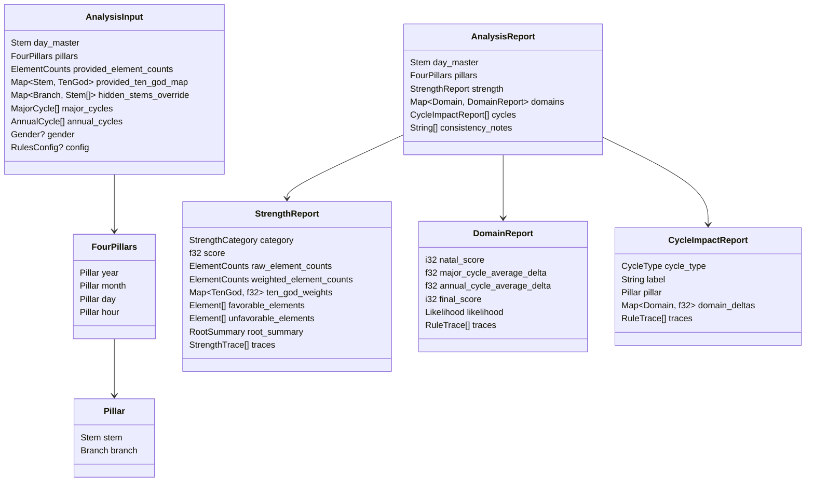
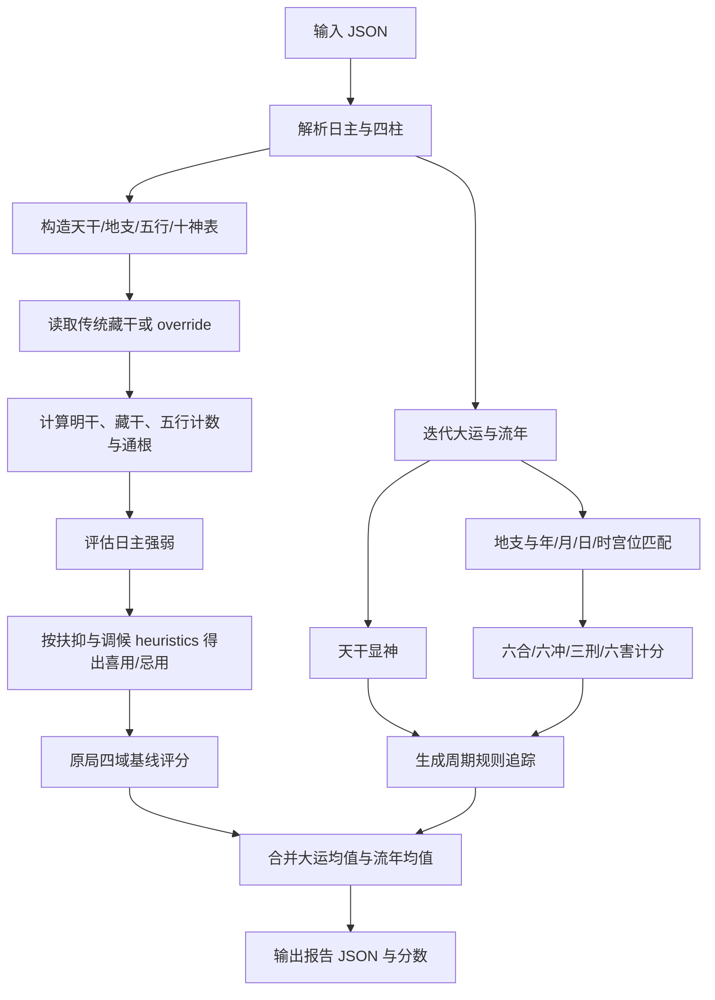
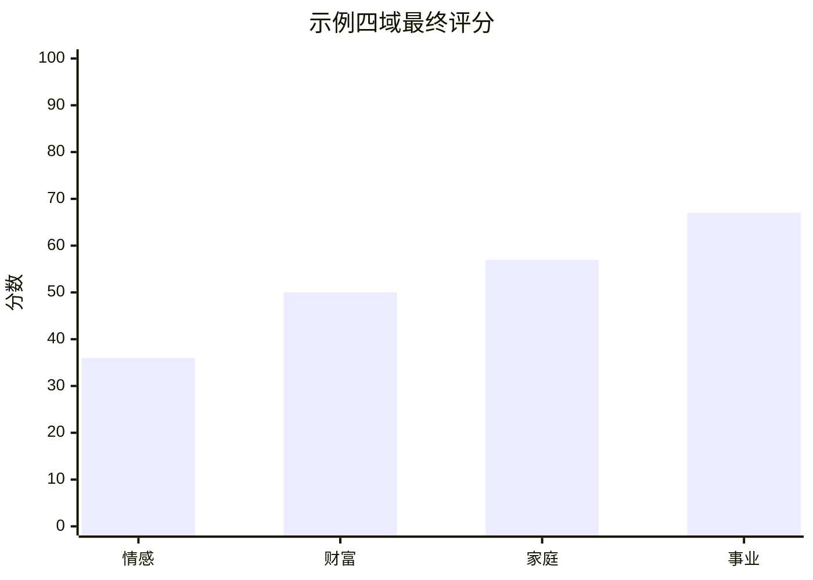

# Rust 四柱八字判定引擎的研究与实现方案

## 摘要

如果目标是做一个**可运行、可测试、可解释**的 Rust 库，而不是把某一流派的全部断语原封不动地“硬编码”，最稳健的工程方案是把四柱八字拆成两层：第一层是比较稳定的**规则层**，包括天干地支与五行、以日主为中心的十神映射、传统地支藏干表、月令与通根、以及地支的六合、六冲、三刑、六害；第二层是**工程化评分层**，把原局、大运、流年的触发转成情感、财富、家庭、事业四个领域的可解释分数与规则追踪。经典文本本身提供的是关系与判断框架，而不是统一数值公式；现代主流在线系统也通常把“五行结构、合会冲化、日主强弱、用神喜忌”作为分析面板，而不是给出单一标准化数学模型。citeturn12view0turn13view0turn11view0

从古典规则看，《三命通会》明确把十神建立在“以日干为我”的生克与阴阳配合上：生我为印、我生为食伤、我克为财、克我为官杀、同我为比劫；再按阴阳同异分正偏。它同时指出天干地支都进入同一套生克体系，并把刑、冲、破、害、会、合放在命局变化中讨论。另一条主线来自《子平真诠》：用神“专求月令”，日元强则抑、弱则扶；而通根方面，“长生禄旺根重、墓库余气根轻”，说明月令与根气是强弱判断的核心。citeturn12view0turn13view0

在现代中文资料里，逢甲大学的入门讲义把四柱宫位与十神关系讲得很清楚：日干代表本人，日支代表配偶；年、月、日、时分别可视为祖上、父母、夫妻、子女等宫位。FCU 与苏民峰讲义都列出常用的地支六合、六冲、三刑、六害表，因此这些关系非常适合落地为程序的固定表与匹配函数。至于藏干，PowerLuck 明确指出“传统藏干表”是主流起点，但现代系统也确实存在不同取法，因此工程上最好把传统表作为默认值，同时允许外部覆写。citeturn9view0turn10view0turn4view0turn5view0

基于这些文献与主流实现形态，下面给出的 Rust 方案采用这样的设计：**以传统规则作默认底座，以可调权重做工程化启发式评分，以详细规则追踪保证每一步可解释。** 同时，由于你给定的输入已经是归一化干支序列，代码**不处理出生地时区换算、真太阳时、起运岁数推算**，只消费已经标准化的四柱、大运与流年数据。这个边界和需求完全一致。对于“准确性”本身，也应像主流在线系统那样保持克制：它们通常会把此类分析标注为参考信息，而不是可证实的科学预测。citeturn11view0

## 研究结论与建模边界

最重要的研究结论有三点。第一，**稳定可编码的部分**主要是五行、阴阳、十神、传统藏干、月令与通根、以及合冲刑害表；第二，**不统一的部分**主要是数值权重、藏干个别门派差异、以及高阶“会合解冲、解刑”的判准；第三，四个现实领域的“分数化”本身并不是古典命书直接给出的结果，而是需要把古典规则工程化之后才得到的解释层。citeturn12view0turn13view0turn5view0

因此，这个库采取的建模边界是明确的。它默认使用**传统藏干表**：子藏癸、丑藏己癸辛、寅藏甲丙戊……午藏丁己、申藏庚壬戊等；但考虑到现代系统的不同处理方式，例如有的体系去掉寅巳申中的戊、把午简化成只藏丁，所以实现里保留了 `hidden_stems_override` 覆写入口。这样既保持了主流默认，也不把某一门派差异硬焊进库接口。citeturn5view0

日主强弱部分也需要说清楚。经典材料强调“月令为主”“有根为要”“长生禄旺根重、墓库余气根轻”，但并没有规定“主气等于 1.0、中气等于 0.6、余气等于 0.3”这种具体常数。因此，下文代码里的数值系数是**工程化启发式**：它们不是某本古书中的固定数字，而是为了把“月令更重、主气更重、根重于干”的原则转成可运行的数值系统。这个做法既忠于原理，也诚实地承认了“数字化”是实现层的选择。citeturn4view0turn13view0

情感领域还有一个必须处理的现实问题：**你给定的输入里没有性别字段**。传统命理在伴侣指示物上常有性别化侧重，例如“财”为妻财、“官杀”为官鬼或夫星等。为避免把未提供的信息强行假设进结果，本库默认把情感域做成**性别中性的 blended 模式**：同时参考财星与官杀，并以日支（夫妻宫）及其与月、时、流年地支的关系作核心；如果以后要加入性别，只需要打开可选字段 `gender`，对财与官杀的权重做轻量偏置即可。这个处理与传统符号系统并不冲突，只是把“无性别输入”的问题显式工程化了。citeturn12view0turn9view0

最后，高阶“会合解冲、解刑”的问题也要说明白。《子平真诠》确实讨论了会合可以解冲刑，以及因解而反得刑冲等更复杂情形。这意味着严谨的专业系统最终会需要**三支甚至四支上下文联动**，而不只是二元配对。为了保持可解释性、保证测试可写、减少实现歧义，下面的默认库先实现**pairwise 级别的六合、六冲、三刑、自刑、六害检测与计分**；如果以后要继续逼近《子平真诠》的复杂路数，可以在现有 `detect_branch_relations` 之上再加第三支语境规约。citeturn13view0

## 核心映射与规则基表

下表按“天干五行 + 阴阳同异 + 生克方向”机械展开十神，所以它不是手工写死的孤立知识，而是**可以用程序生成的派生表**。其来源是《三命通会》对十神立名与阴阳配合的说明，以及逢甲大学讲义对十神分类原则的教学化表述。citeturn12view0turn9view0

| 日主 | 甲 | 乙 | 丙 | 丁 | 戊 | 己 | 庚 | 辛 | 壬 | 癸 |
| --- | --- | --- | --- | --- | --- | --- | --- | --- | --- | --- |
| 甲 | 比肩 | 劫财 | 食神 | 伤官 | 偏财 | 正财 | 七杀 | 正官 | 偏印 | 正印 |
| 乙 | 劫财 | 比肩 | 伤官 | 食神 | 正财 | 偏财 | 正官 | 七杀 | 正印 | 偏印 |
| 丙 | 偏印 | 正印 | 比肩 | 劫财 | 食神 | 伤官 | 偏财 | 正财 | 七杀 | 正官 |
| 丁 | 正印 | 偏印 | 劫财 | 比肩 | 伤官 | 食神 | 正财 | 偏财 | 正官 | 七杀 |
| 戊 | 七杀 | 正官 | 偏印 | 正印 | 比肩 | 劫财 | 食神 | 伤官 | 偏财 | 正财 |
| 己 | 正官 | 七杀 | 正印 | 偏印 | 劫财 | 比肩 | 伤官 | 食神 | 正财 | 偏财 |
| 庚 | 偏财 | 正财 | 七杀 | 正官 | 偏印 | 正印 | 比肩 | 劫财 | 食神 | 伤官 |
| 辛 | 正财 | 偏财 | 正官 | 七杀 | 正印 | 偏印 | 劫财 | 比肩 | 伤官 | 食神 |
| 壬 | 食神 | 伤官 | 偏财 | 正财 | 七杀 | 正官 | 偏印 | 正印 | 比肩 | 劫财 |
| 癸 | 伤官 | 食神 | 正财 | 偏财 | 正官 | 七杀 | 正印 | 偏印 | 劫财 | 比肩 |

地支藏干方面，下面采用的是**传统藏干表**，因为它仍是最常见的默认起点；同时代码会保留 override 入口，以兼容现代系统中对于午、寅、巳、申等支的精简取法。citeturn5view0

| 地支 | 藏干 |
| --- | --- |
| 子 | 癸 |
| 丑 | 己、癸、辛 |
| 寅 | 甲、丙、戊 |
| 卯 | 乙 |
| 辰 | 戊、乙、癸 |
| 巳 | 丙、戊、庚 |
| 午 | 丁、己 |
| 未 | 己、乙、丁 |
| 申 | 庚、壬、戊 |
| 酉 | 辛 |
| 戌 | 戊、辛、丁 |
| 亥 | 壬、甲 |

地支关系表则来自 FCU 与苏民峰讲义的常用版本；这也是最适合做程序查表的部分。citeturn10view0turn4view0

| 规则 | 组合 |
| --- | --- |
| 六合 | 子丑、寅亥、卯戌、辰酉、巳申、午未 |
| 六冲 | 子午、丑未、寅申、卯酉、辰戌、巳亥 |
| 六害 | 子未、丑午、寅巳、卯辰、申亥、酉戌 |
| 三刑 | 子卯；寅巳申；丑未戌；辰辰、午午、酉酉、亥亥自刑 |

还有一个实现上非常关键、但经常被忽略的点：**地支有固定五行属性，但月令的“当令之气”是季节性的。** 例如 FCU 的地支五行表会把辰戌丑未记作土，而苏民峰与《子平真诠》在强弱判断上又强调“春木、夏火、秋金、冬水为得时”。因此程序里最好把 `Branch::element()` 与 `Branch::season_peak_element()` 分开实现：前者用于地支本身五行，后者专供“月令支持/泄耗/克制”评分。citeturn10view0turn4view0turn13view0

## 数据模型与评估流程

主流现代排盘系统通常把“五行结构、合会冲化、日主强弱、用神喜忌”作为分析页面；而古典文本则提供“以日主为核心—看月令—看根气—看会合刑冲—看岁运”的推理路径。下面的数据模型与流程图，就是把这两类来源合并成适合 Rust 的库接口。citeturn11view0turn12view0turn13view0





## Rust 库设计与关键算法

这份实现的关键设计是：**把传统规则做成确定性函数，把不统一的解释做成可调权重。** 《三命通会》与《子平真诠》给了“日主—十神—月令—根气—会合刑冲”的判断主轴，现代排盘系统则说明这些都是实际系统会展示和使用的分析维度。因此，Rust 库不该把“十神表”“藏干表”“六合六冲表”写成散落的常量，也不该把四域分数藏进黑箱；最好的结构是公开枚举、公开表生成函数、公开 trace 结构，并把每一次加减分都记录下来。citeturn12view0turn13view0turn11view0

日主强弱的实现采用了一个很典型、也很容易测试的形式：

```text
strength_score
= 月令季节项
+ 其他明干对日主的扶抑项
+ 各支藏干对日主的扶抑项
+ 通根奖励
```

其中“季节项”体现《子平真诠》的“用神专求月令”，而“藏干项 + 通根奖励”体现“长生禄旺根重、墓库余气根轻、干多不如支重”的思路。这里用到的 1.0 / 0.6 / 0.3、月支倍增、通根奖励等数字，都是**工程系数**，目的是把文本原则表达为稳定可回归的代码，而不是声称这些数字本身是古书明文。citeturn13view0turn4view0

喜用神部分默认先走**扶抑 heuristic**，因为《子平真诠》把“日元强者抑之，日元弱者扶之”列为取用法中的第一种；同时代码也加了一个非常轻量的**调候补丁**：冬令火太少时，把火加入次级喜用；夏令水太少时，把水加入次级喜用。这并不是完整的调候体系，而是工程上最小可用、又不违背经典方向的做法。citeturn13view0

四个现实领域的基线定义，则来自传统象义和宫位落点的折中。情感看**日支夫妻宫 + 财/官杀 + 关系冲合刑害**；财富看**财星 + 食伤生财 + 比劫争财**；家庭看**年/月/日/时宫位与印比财**；事业看**月柱 + 官杀 + 印 + 伤官压力**。FCU 的讲义把年、月、日、时落在祖上/父母/配偶/子女宫位，并给出“父母宫与夫妻宫刑冲可映射婆媳问题”“流年或大运庚、申到时可触发偏财机会”的入门例子，这正适合作为“宫位触发 + 岁运触发”的工程化模板。citeturn9view0

大运与流年部分，本实现不做“起运计算”，只消费你已经给定的序列。每个周期都拆成两段：天干作为**显神触发**，地支作为**藏干触发 + 与年/月/日/时地支关系触发**。然后对四个领域分别记分，并把所有明细作为 `RuleTrace` 保留。最终分数不是把所有周期生硬累加，而是取**原局基线 + 大运平均增量 + 流年平均增量**，这样不会因为输入序列长度不同而造成不可比较的分数膨胀。这个做法不是古典定式，而是为了让 API 更稳定、更适合作测试和前端消费。citeturn9view0turn11view0

代码结构建议如下：

```text
bazi_engine/
├─ Cargo.toml
├─ src/
│  └─ lib.rs
└─ examples/
   └─ demo.rs
```

## 完整 Rust 代码

下面的代码在接口上满足你的要求：定义了天干、地支、五行、十神、藏干、四柱、日主、大运与流年；实现了五行/十神映射、藏干与根气计算、日主强弱评估、喜用 heuristics、六合/六冲/三刑/六害检测、以及大运流年对四域的 explainable scoring。默认只依赖 `serde` 与 `serde_json`。代码中的注释已经把哪些部分是“传统规则”，哪些部分是“工程权重”区分开了。前文的规则来源与实现边界已在上面交代。citeturn12view0turn13view0turn10view0turn5view0turn4view0turn11view0

### Cargo.toml

```toml
[package]
name = "bazi_engine"
version = "0.1.0"
edition = "2021"

[dependencies]
serde = { version = "1", features = ["derive"] }
serde_json = "1"
```

### src/lib.rs

```rust
use serde::{Deserialize, Serialize};
use std::collections::BTreeMap;
use std::error::Error;
use std::fmt;

#[derive(
    Debug, Clone, Copy, PartialEq, Eq, PartialOrd, Ord, Hash, Serialize, Deserialize,
)]
pub enum Stem {
    #[serde(rename = "甲")]
    Jia,
    #[serde(rename = "乙")]
    Yi,
    #[serde(rename = "丙")]
    Bing,
    #[serde(rename = "丁")]
    Ding,
    #[serde(rename = "戊")]
    Wu,
    #[serde(rename = "己")]
    Ji,
    #[serde(rename = "庚")]
    Geng,
    #[serde(rename = "辛")]
    Xin,
    #[serde(rename = "壬")]
    Ren,
    #[serde(rename = "癸")]
    Gui,
}

impl Stem {
    pub const ALL: [Stem; 10] = [
        Stem::Jia,
        Stem::Yi,
        Stem::Bing,
        Stem::Ding,
        Stem::Wu,
        Stem::Ji,
        Stem::Geng,
        Stem::Xin,
        Stem::Ren,
        Stem::Gui,
    ];

    pub fn element(self) -> Element {
        match self {
            Stem::Jia | Stem::Yi => Element::Wood,
            Stem::Bing | Stem::Ding => Element::Fire,
            Stem::Wu | Stem::Ji => Element::Earth,
            Stem::Geng | Stem::Xin => Element::Metal,
            Stem::Ren | Stem::Gui => Element::Water,
        }
    }

    pub fn polarity(self) -> YinYang {
        match self {
            Stem::Jia | Stem::Bing | Stem::Wu | Stem::Geng | Stem::Ren => YinYang::Yang,
            Stem::Yi | Stem::Ding | Stem::Ji | Stem::Xin | Stem::Gui => YinYang::Yin,
        }
    }

    pub fn label(self) -> &'static str {
        match self {
            Stem::Jia => "甲",
            Stem::Yi => "乙",
            Stem::Bing => "丙",
            Stem::Ding => "丁",
            Stem::Wu => "戊",
            Stem::Ji => "己",
            Stem::Geng => "庚",
            Stem::Xin => "辛",
            Stem::Ren => "壬",
            Stem::Gui => "癸",
        }
    }
}

impl fmt::Display for Stem {
    fn fmt(&self, f: &mut fmt::Formatter<'_>) -> fmt::Result {
        write!(f, "{}", self.label())
    }
}

#[derive(
    Debug, Clone, Copy, PartialEq, Eq, PartialOrd, Ord, Hash, Serialize, Deserialize,
)]
pub enum Branch {
    #[serde(rename = "子")]
    Zi,
    #[serde(rename = "丑")]
    Chou,
    #[serde(rename = "寅")]
    Yin,
    #[serde(rename = "卯")]
    Mao,
    #[serde(rename = "辰")]
    Chen,
    #[serde(rename = "巳")]
    Si,
    #[serde(rename = "午")]
    Wu,
    #[serde(rename = "未")]
    Wei,
    #[serde(rename = "申")]
    Shen,
    #[serde(rename = "酉")]
    You,
    #[serde(rename = "戌")]
    Xu,
    #[serde(rename = "亥")]
    Hai,
}

impl Branch {
    pub const ALL: [Branch; 12] = [
        Branch::Zi,
        Branch::Chou,
        Branch::Yin,
        Branch::Mao,
        Branch::Chen,
        Branch::Si,
        Branch::Wu,
        Branch::Wei,
        Branch::Shen,
        Branch::You,
        Branch::Xu,
        Branch::Hai,
    ];

    /// 地支本身的固定五行
    pub fn element(self) -> Element {
        match self {
            Branch::Zi | Branch::Hai => Element::Water,
            Branch::Yin | Branch::Mao => Element::Wood,
            Branch::Si | Branch::Wu => Element::Fire,
            Branch::Shen | Branch::You => Element::Metal,
            Branch::Chen | Branch::Xu | Branch::Chou | Branch::Wei => Element::Earth,
        }
    }

    /// 专供“月令得时”判断使用的季节旺气
    /// 春：寅卯辰木；夏：巳午未火；秋：申酉戌金；冬：亥子丑水
    pub fn season_peak_element(self) -> Element {
        match self {
            Branch::Yin | Branch::Mao | Branch::Chen => Element::Wood,
            Branch::Si | Branch::Wu | Branch::Wei => Element::Fire,
            Branch::Shen | Branch::You | Branch::Xu => Element::Metal,
            Branch::Hai | Branch::Zi | Branch::Chou => Element::Water,
        }
    }

    pub fn label(self) -> &'static str {
        match self {
            Branch::Zi => "子",
            Branch::Chou => "丑",
            Branch::Yin => "寅",
            Branch::Mao => "卯",
            Branch::Chen => "辰",
            Branch::Si => "巳",
            Branch::Wu => "午",
            Branch::Wei => "未",
            Branch::Shen => "申",
            Branch::You => "酉",
            Branch::Xu => "戌",
            Branch::Hai => "亥",
        }
    }
}

impl fmt::Display for Branch {
    fn fmt(&self, f: &mut fmt::Formatter<'_>) -> fmt::Result {
        write!(f, "{}", self.label())
    }
}

#[derive(
    Debug, Clone, Copy, PartialEq, Eq, PartialOrd, Ord, Hash, Serialize, Deserialize,
)]
pub enum Element {
    #[serde(rename = "木")]
    Wood,
    #[serde(rename = "火")]
    Fire,
    #[serde(rename = "土")]
    Earth,
    #[serde(rename = "金")]
    Metal,
    #[serde(rename = "水")]
    Water,
}

impl Element {
    pub const ALL: [Element; 5] = [
        Element::Wood,
        Element::Fire,
        Element::Earth,
        Element::Metal,
        Element::Water,
    ];

    pub fn generates(self) -> Element {
        match self {
            Element::Wood => Element::Fire,
            Element::Fire => Element::Earth,
            Element::Earth => Element::Metal,
            Element::Metal => Element::Water,
            Element::Water => Element::Wood,
        }
    }

    pub fn generated_by(self) -> Element {
        match self {
            Element::Wood => Element::Water,
            Element::Fire => Element::Wood,
            Element::Earth => Element::Fire,
            Element::Metal => Element::Earth,
            Element::Water => Element::Metal,
        }
    }

    pub fn controls(self) -> Element {
        match self {
            Element::Wood => Element::Earth,
            Element::Fire => Element::Metal,
            Element::Earth => Element::Water,
            Element::Metal => Element::Wood,
            Element::Water => Element::Fire,
        }
    }

    pub fn controlled_by(self) -> Element {
        match self {
            Element::Wood => Element::Metal,
            Element::Fire => Element::Water,
            Element::Earth => Element::Wood,
            Element::Metal => Element::Fire,
            Element::Water => Element::Earth,
        }
    }

    pub fn label(self) -> &'static str {
        match self {
            Element::Wood => "木",
            Element::Fire => "火",
            Element::Earth => "土",
            Element::Metal => "金",
            Element::Water => "水",
        }
    }
}

impl fmt::Display for Element {
    fn fmt(&self, f: &mut fmt::Formatter<'_>) -> fmt::Result {
        write!(f, "{}", self.label())
    }
}

#[derive(Debug, Clone, Copy, PartialEq, Eq, Serialize, Deserialize)]
pub enum YinYang {
    #[serde(rename = "阳")]
    Yang,
    #[serde(rename = "阴")]
    Yin,
}

#[derive(
    Debug, Clone, Copy, PartialEq, Eq, PartialOrd, Ord, Hash, Serialize, Deserialize,
)]
pub enum TenGod {
    #[serde(rename = "比肩")]
    BiJian,
    #[serde(rename = "劫财")]
    JieCai,
    #[serde(rename = "食神")]
    ShiShen,
    #[serde(rename = "伤官")]
    ShangGuan,
    #[serde(rename = "正财")]
    ZhengCai,
    #[serde(rename = "偏财")]
    PianCai,
    #[serde(rename = "正官")]
    ZhengGuan,
    #[serde(rename = "七杀")]
    QiSha,
    #[serde(rename = "正印")]
    ZhengYin,
    #[serde(rename = "偏印")]
    PianYin,
}

impl TenGod {
    pub const ALL: [TenGod; 10] = [
        TenGod::BiJian,
        TenGod::JieCai,
        TenGod::ShiShen,
        TenGod::ShangGuan,
        TenGod::ZhengCai,
        TenGod::PianCai,
        TenGod::ZhengGuan,
        TenGod::QiSha,
        TenGod::ZhengYin,
        TenGod::PianYin,
    ];

    pub fn label(self) -> &'static str {
        match self {
            TenGod::BiJian => "比肩",
            TenGod::JieCai => "劫财",
            TenGod::ShiShen => "食神",
            TenGod::ShangGuan => "伤官",
            TenGod::ZhengCai => "正财",
            TenGod::PianCai => "偏财",
            TenGod::ZhengGuan => "正官",
            TenGod::QiSha => "七杀",
            TenGod::ZhengYin => "正印",
            TenGod::PianYin => "偏印",
        }
    }
}

impl fmt::Display for TenGod {
    fn fmt(&self, f: &mut fmt::Formatter<'_>) -> fmt::Result {
        write!(f, "{}", self.label())
    }
}

#[derive(
    Debug, Clone, Copy, PartialEq, Eq, PartialOrd, Ord, Hash, Serialize, Deserialize,
)]
pub enum Domain {
    #[serde(rename = "情感")]
    Emotional,
    #[serde(rename = "财富")]
    Wealth,
    #[serde(rename = "家庭")]
    Family,
    #[serde(rename = "事业")]
    Career,
}

impl Domain {
    pub const ALL: [Domain; 4] = [
        Domain::Emotional,
        Domain::Wealth,
        Domain::Family,
        Domain::Career,
    ];

    pub fn label(self) -> &'static str {
        match self {
            Domain::Emotional => "情感",
            Domain::Wealth => "财富",
            Domain::Family => "家庭",
            Domain::Career => "事业",
        }
    }
}

#[derive(Debug, Clone, Copy, PartialEq, Eq, Serialize, Deserialize)]
pub enum Gender {
    #[serde(rename = "男")]
    Male,
    #[serde(rename = "女")]
    Female,
}

#[derive(Debug, Clone, Copy, PartialEq, Eq, Serialize, Deserialize)]
pub enum StrengthCategory {
    #[serde(rename = "偏弱")]
    Weak,
    #[serde(rename = "中和")]
    Balanced,
    #[serde(rename = "偏强")]
    Strong,
}

#[derive(Debug, Clone, Copy, PartialEq, Eq, Serialize, Deserialize)]
pub enum Likelihood {
    #[serde(rename = "低")]
    Low,
    #[serde(rename = "中")]
    Medium,
    #[serde(rename = "高")]
    High,
}

#[derive(Debug, Clone, Copy, PartialEq, Eq, Serialize, Deserialize)]
pub enum CycleType {
    #[serde(rename = "大运")]
    Major,
    #[serde(rename = "流年")]
    Annual,
}

#[derive(Debug, Clone, Copy, PartialEq, Eq)]
enum Palace {
    Year,
    Month,
    Day,
    Hour,
}

impl Palace {
    fn label(self) -> &'static str {
        match self {
            Palace::Year => "年柱",
            Palace::Month => "月柱",
            Palace::Day => "日柱",
            Palace::Hour => "时柱",
        }
    }
}

#[derive(Debug, Clone, Copy, PartialEq, Eq, Serialize, Deserialize)]
pub enum BranchRelationKind {
    #[serde(rename = "六合")]
    Combine,
    #[serde(rename = "六冲")]
    Clash,
    #[serde(rename = "六害")]
    Harm,
    #[serde(rename = "三刑")]
    Punishment,
    #[serde(rename = "自刑")]
    SelfPunishment,
}

impl BranchRelationKind {
    fn label(self) -> &'static str {
        match self {
            BranchRelationKind::Combine => "六合",
            BranchRelationKind::Clash => "六冲",
            BranchRelationKind::Harm => "六害",
            BranchRelationKind::Punishment => "三刑",
            BranchRelationKind::SelfPunishment => "自刑",
        }
    }
}

#[derive(Debug, Clone, Copy, Serialize, Deserialize, PartialEq, Eq)]
pub struct Pillar {
    pub stem: Stem,
    pub branch: Branch,
}

impl fmt::Display for Pillar {
    fn fmt(&self, f: &mut fmt::Formatter<'_>) -> fmt::Result {
        write!(f, "{}{}", self.stem, self.branch)
    }
}

#[derive(Debug, Clone, Copy, Serialize, Deserialize, PartialEq, Eq)]
pub struct FourPillars {
    pub year: Pillar,
    pub month: Pillar,
    pub day: Pillar,
    pub hour: Pillar,
}

impl FourPillars {
    fn as_array(self) -> [(Palace, Pillar); 4] {
        [
            (Palace::Year, self.year),
            (Palace::Month, self.month),
            (Palace::Day, self.day),
            (Palace::Hour, self.hour),
        ]
    }
}

#[derive(Debug, Clone, Serialize, Deserialize)]
pub struct MajorCycle {
    pub pillar: Pillar,
    #[serde(default)]
    pub name: Option<String>,
    #[serde(default)]
    pub start_age: Option<u8>,
    #[serde(default)]
    pub end_age: Option<u8>,
}

#[derive(Debug, Clone, Serialize, Deserialize)]
pub struct AnnualCycle {
    pub pillar: Pillar,
    #[serde(default)]
    pub year: Option<i32>,
}

#[derive(Debug, Clone, Copy, Default, Serialize, Deserialize)]
pub struct ElementCounts {
    pub wood: f32,
    pub fire: f32,
    pub earth: f32,
    pub metal: f32,
    pub water: f32,
}

impl ElementCounts {
    pub fn add(&mut self, element: Element, value: f32) {
        match element {
            Element::Wood => self.wood += value,
            Element::Fire => self.fire += value,
            Element::Earth => self.earth += value,
            Element::Metal => self.metal += value,
            Element::Water => self.water += value,
        }
    }

    pub fn get(&self, element: Element) -> f32 {
        match element {
            Element::Wood => self.wood,
            Element::Fire => self.fire,
            Element::Earth => self.earth,
            Element::Metal => self.metal,
            Element::Water => self.water,
        }
    }

    pub fn as_map(&self) -> BTreeMap<Element, f32> {
        BTreeMap::from([
            (Element::Wood, round2(self.wood)),
            (Element::Fire, round2(self.fire)),
            (Element::Earth, round2(self.earth)),
            (Element::Metal, round2(self.metal)),
            (Element::Water, round2(self.water)),
        ])
    }
}

#[derive(Debug, Clone, Serialize, Deserialize)]
pub struct RulesConfig {
    pub hidden_main_weight: f32,
    pub hidden_middle_weight: f32,
    pub hidden_residual_weight: f32,
    pub month_branch_hidden_multiplier: f32,
    pub month_stem_multiplier: f32,
    pub root_bonus_month: f32,
    pub root_bonus_day: f32,
    pub root_bonus_other: f32,
    pub cycle_hidden_scale: f32,
}

impl Default for RulesConfig {
    fn default() -> Self {
        Self {
            hidden_main_weight: 1.0,
            hidden_middle_weight: 0.6,
            hidden_residual_weight: 0.3,
            month_branch_hidden_multiplier: 1.35,
            month_stem_multiplier: 1.15,
            root_bonus_month: 2.2,
            root_bonus_day: 1.8,
            root_bonus_other: 1.2,
            cycle_hidden_scale: 0.55,
        }
    }
}

#[derive(Debug, Clone, Serialize, Deserialize)]
pub struct AnalysisInput {
    /// 为了兼容你的输入需求，保留 day_master 字段；
    /// 但库会校验它是否与 day pillar 的 stem 一致。
    pub day_master: Stem,
    pub pillars: FourPillars,
    pub provided_element_counts: ElementCounts,
    #[serde(default)]
    pub provided_ten_god_map: Option<BTreeMap<Stem, TenGod>>,
    #[serde(default)]
    pub hidden_stems_override: Option<BTreeMap<Branch, Vec<Stem>>>,
    #[serde(default)]
    pub major_cycles: Vec<MajorCycle>,
    #[serde(default)]
    pub annual_cycles: Vec<AnnualCycle>,
    #[serde(default)]
    pub gender: Option<Gender>,
    #[serde(default)]
    pub config: Option<RulesConfig>,
}

#[derive(Debug, Clone, Serialize, Deserialize)]
pub struct StrengthTrace {
    pub delta: f32,
    pub rule: String,
}

#[derive(Debug, Clone, Serialize, Deserialize)]
pub struct RuleTrace {
    pub phase: String,
    pub domain: Domain,
    pub delta: f32,
    pub rule: String,
}

#[derive(Debug, Clone, Serialize, Deserialize)]
pub struct RootSummary {
    pub day_master_root_branches: Vec<Branch>,
    pub resource_root_branches: Vec<Branch>,
    pub score: f32,
}

#[derive(Debug, Clone, Serialize, Deserialize)]
pub struct StrengthReport {
    pub category: StrengthCategory,
    pub score: f32,
    pub raw_element_counts: ElementCounts,
    pub weighted_element_counts: ElementCounts,
    pub ten_god_weights: BTreeMap<TenGod, f32>,
    pub favorable_elements: Vec<Element>,
    pub unfavorable_elements: Vec<Element>,
    pub root_summary: RootSummary,
    pub traces: Vec<StrengthTrace>,
}

#[derive(Debug, Clone, Serialize, Deserialize)]
pub struct DomainReport {
    pub natal_score: i32,
    pub major_cycle_average_delta: f32,
    pub annual_cycle_average_delta: f32,
    pub final_score: i32,
    pub likelihood: Likelihood,
    pub traces: Vec<RuleTrace>,
}

#[derive(Debug, Clone, Serialize, Deserialize)]
pub struct CycleImpactReport {
    pub cycle_type: CycleType,
    pub label: String,
    pub pillar: Pillar,
    pub domain_deltas: BTreeMap<Domain, f32>,
    pub traces: Vec<RuleTrace>,
}

#[derive(Debug, Clone, Serialize, Deserialize)]
pub struct AnalysisReport {
    pub day_master: Stem,
    pub pillars: FourPillars,
    pub ten_god_table: BTreeMap<Stem, TenGod>,
    pub hidden_stem_table: BTreeMap<Branch, Vec<Stem>>,
    pub provided_element_counts: ElementCounts,
    pub strength: StrengthReport,
    pub domains: BTreeMap<Domain, DomainReport>,
    pub cycles: Vec<CycleImpactReport>,
    pub consistency_notes: Vec<String>,
    pub config_used: RulesConfig,
}

#[derive(Debug, Clone, Copy)]
enum ElementRelation {
    Same,
    Resource,
    Output,
    Wealth,
    Authority,
}

fn round2(value: f32) -> f32 {
    (value * 100.0).round() / 100.0
}

fn clamp_score(value: f32) -> i32 {
    value.round().clamp(0.0, 100.0) as i32
}

fn likelihood_from_score(score: i32) -> Likelihood {
    match score {
        0..=34 => Likelihood::Low,
        35..=64 => Likelihood::Medium,
        _ => Likelihood::High,
    }
}

fn push_unique<T: PartialEq + Copy>(vec: &mut Vec<T>, value: T) {
    if !vec.contains(&value) {
        vec.push(value);
    }
}

pub fn traditional_hidden_stem_table() -> BTreeMap<Branch, Vec<Stem>> {
    BTreeMap::from([
        (Branch::Zi, vec![Stem::Gui]),
        (Branch::Chou, vec![Stem::Ji, Stem::Gui, Stem::Xin]),
        (Branch::Yin, vec![Stem::Jia, Stem::Bing, Stem::Wu]),
        (Branch::Mao, vec![Stem::Yi]),
        (Branch::Chen, vec![Stem::Wu, Stem::Yi, Stem::Gui]),
        (Branch::Si, vec![Stem::Bing, Stem::Wu, Stem::Geng]),
        (Branch::Wu, vec![Stem::Ding, Stem::Ji]),
        (Branch::Wei, vec![Stem::Ji, Stem::Yi, Stem::Ding]),
        (Branch::Shen, vec![Stem::Geng, Stem::Ren, Stem::Wu]),
        (Branch::You, vec![Stem::Xin]),
        (Branch::Xu, vec![Stem::Wu, Stem::Xin, Stem::Ding]),
        (Branch::Hai, vec![Stem::Ren, Stem::Jia]),
    ])
}

fn resolved_hidden_stem_table(input: &AnalysisInput) -> BTreeMap<Branch, Vec<Stem>> {
    let mut table = traditional_hidden_stem_table();
    if let Some(override_map) = &input.hidden_stems_override {
        for (branch, stems) in override_map {
            table.insert(*branch, stems.clone());
        }
    }
    table
}

fn ordered_branch_pair(a: Branch, b: Branch) -> (Branch, Branch) {
    if a <= b {
        (a, b)
    } else {
        (b, a)
    }
}

pub fn detect_branch_relations(a: Branch, b: Branch) -> Vec<BranchRelationKind> {
    let mut out = Vec::new();

    if a == b && matches!(a, Branch::Chen | Branch::Wu | Branch::You | Branch::Hai) {
        out.push(BranchRelationKind::SelfPunishment);
    }

    let pair = ordered_branch_pair(a, b);

    if matches!(
        pair,
        (Branch::Zi, Branch::Chou)
            | (Branch::Hai, Branch::Yin)
            | (Branch::Mao, Branch::Xu)
            | (Branch::Chen, Branch::You)
            | (Branch::Si, Branch::Shen)
            | (Branch::Wu, Branch::Wei)
    ) {
        out.push(BranchRelationKind::Combine);
    }

    if matches!(
        pair,
        (Branch::Zi, Branch::Wu)
            | (Branch::Chou, Branch::Wei)
            | (Branch::Yin, Branch::Shen)
            | (Branch::Mao, Branch::You)
            | (Branch::Chen, Branch::Xu)
            | (Branch::Si, Branch::Hai)
    ) {
        out.push(BranchRelationKind::Clash);
    }

    if matches!(
        pair,
        (Branch::Zi, Branch::Wei)
            | (Branch::Chou, Branch::Wu)
            | (Branch::Yin, Branch::Si)
            | (Branch::Mao, Branch::Chen)
            | (Branch::Shen, Branch::Hai)
            | (Branch::You, Branch::Xu)
    ) {
        out.push(BranchRelationKind::Harm);
    }

    if matches!(pair, (Branch::Zi, Branch::Mao))
        || matches!(
            pair,
            (Branch::Yin, Branch::Si)
                | (Branch::Yin, Branch::Shen)
                | (Branch::Si, Branch::Shen)
                | (Branch::Chou, Branch::Wei)
                | (Branch::Chou, Branch::Xu)
                | (Branch::Wei, Branch::Xu)
        )
    {
        out.push(BranchRelationKind::Punishment);
    }

    out
}

fn relation_to_day_master(day_master_element: Element, other_element: Element) -> ElementRelation {
    if other_element == day_master_element {
        ElementRelation::Same
    } else if other_element.generates() == day_master_element {
        ElementRelation::Resource
    } else if day_master_element.generates() == other_element {
        ElementRelation::Output
    } else if day_master_element.controls() == other_element {
        ElementRelation::Wealth
    } else {
        ElementRelation::Authority
    }
}

pub fn ten_god(day_master: Stem, other: Stem) -> TenGod {
    let dm_element = day_master.element();
    let other_element = other.element();
    let same_polarity = day_master.polarity() == other.polarity();

    if dm_element == other_element {
        return if same_polarity {
            TenGod::BiJian
        } else {
            TenGod::JieCai
        };
    }

    if other_element.generates() == dm_element {
        return if same_polarity {
            TenGod::PianYin
        } else {
            TenGod::ZhengYin
        };
    }

    if dm_element.generates() == other_element {
        return if same_polarity {
            TenGod::ShiShen
        } else {
            TenGod::ShangGuan
        };
    }

    if dm_element.controls() == other_element {
        return if same_polarity {
            TenGod::PianCai
        } else {
            TenGod::ZhengCai
        };
    }

    if same_polarity {
        TenGod::QiSha
    } else {
        TenGod::ZhengGuan
    }
}

pub fn ten_god_table(day_master: Stem) -> BTreeMap<Stem, TenGod> {
    Stem::ALL
        .iter()
        .copied()
        .map(|stem| (stem, ten_god(day_master, stem)))
        .collect()
}

fn hidden_weight(index: usize, cfg: &RulesConfig) -> f32 {
    match index {
        0 => cfg.hidden_main_weight,
        1 => cfg.hidden_middle_weight,
        _ => cfg.hidden_residual_weight,
    }
}

fn visible_relation_score(rel: ElementRelation) -> f32 {
    match rel {
        ElementRelation::Same => 1.4,
        ElementRelation::Resource => 1.2,
        ElementRelation::Output => -0.8,
        ElementRelation::Wealth => -0.9,
        ElementRelation::Authority => -1.1,
    }
}

fn hidden_relation_score(rel: ElementRelation) -> f32 {
    match rel {
        ElementRelation::Same => 0.9,
        ElementRelation::Resource => 0.8,
        ElementRelation::Output => -0.5,
        ElementRelation::Wealth => -0.55,
        ElementRelation::Authority => -0.7,
    }
}

fn empty_domain_score_map() -> BTreeMap<Domain, f32> {
    BTreeMap::from([
        (Domain::Emotional, 0.0),
        (Domain::Wealth, 0.0),
        (Domain::Family, 0.0),
        (Domain::Career, 0.0),
    ])
}

fn empty_domain_trace_map() -> BTreeMap<Domain, Vec<RuleTrace>> {
    BTreeMap::from([
        (Domain::Emotional, Vec::new()),
        (Domain::Wealth, Vec::new()),
        (Domain::Family, Vec::new()),
        (Domain::Career, Vec::new()),
    ])
}

fn add_domain_trace(
    scores: &mut BTreeMap<Domain, f32>,
    traces: &mut BTreeMap<Domain, Vec<RuleTrace>>,
    domain: Domain,
    delta: f32,
    phase: impl Into<String>,
    rule: impl Into<String>,
) {
    if let Some(value) = scores.get_mut(&domain) {
        *value += delta;
    }
    if let Some(items) = traces.get_mut(&domain) {
        items.push(RuleTrace {
            phase: phase.into(),
            domain,
            delta: round2(delta),
            rule: rule.into(),
        });
    }
}

fn emotional_gender_scales(gender: Option<Gender>) -> (f32, f32) {
    match gender {
        Some(Gender::Male) => (1.15, 0.85), // 财稍重，官杀稍轻
        Some(Gender::Female) => (0.85, 1.15), // 官杀稍重，财稍轻
        None => (1.0, 1.0),
    }
}

fn domain_ten_god_weight(domain: Domain, tg: TenGod, gender: Option<Gender>) -> f32 {
    let (cai_scale, guan_scale) = emotional_gender_scales(gender);
    match domain {
        Domain::Emotional => match tg {
            TenGod::ZhengGuan => 8.0 * guan_scale,
            TenGod::QiSha => 5.0 * guan_scale,
            TenGod::ZhengCai => 8.0 * cai_scale,
            TenGod::PianCai => 5.0 * cai_scale,
            TenGod::ZhengYin => 2.0,
            TenGod::PianYin => 1.0,
            TenGod::ShiShen => 2.0,
            TenGod::ShangGuan => -5.0,
            TenGod::BiJian => -3.0,
            TenGod::JieCai => -5.0,
        },
        Domain::Wealth => match tg {
            TenGod::ZhengCai => 10.0,
            TenGod::PianCai => 8.0,
            TenGod::ShiShen => 7.0,
            TenGod::ShangGuan => 5.0,
            TenGod::ZhengGuan => 2.0,
            TenGod::QiSha => 1.0,
            TenGod::ZhengYin => -1.0,
            TenGod::PianYin => -2.0,
            TenGod::BiJian => -6.0,
            TenGod::JieCai => -9.0,
        },
        Domain::Family => match tg {
            TenGod::ZhengYin => 8.0,
            TenGod::PianYin => 6.0,
            TenGod::BiJian => 4.0,
            TenGod::JieCai => 2.0,
            TenGod::ZhengCai => 3.0,
            TenGod::PianCai => 3.0,
            TenGod::ShiShen => 2.0,
            TenGod::ShangGuan => 1.0,
            TenGod::ZhengGuan => 2.0,
            TenGod::QiSha => 1.0,
        },
        Domain::Career => match tg {
            TenGod::ZhengGuan => 10.0,
            TenGod::QiSha => 8.0,
            TenGod::ZhengYin => 7.0,
            TenGod::PianYin => 4.0,
            TenGod::ZhengCai => 4.0,
            TenGod::PianCai => 4.0,
            TenGod::ShiShen => 3.0,
            TenGod::ShangGuan => -7.0,
            TenGod::BiJian => -2.0,
            TenGod::JieCai => -4.0,
        },
    }
}

fn palace_relation_effects(palace: Palace, relation: BranchRelationKind) -> Vec<(Domain, f32)> {
    let mut out = Vec::new();

    match palace {
        Palace::Day => {
            let emotional = match relation {
                BranchRelationKind::Combine => 8.0,
                BranchRelationKind::Clash => -12.0,
                BranchRelationKind::Harm => -7.0,
                BranchRelationKind::Punishment => -8.0,
                BranchRelationKind::SelfPunishment => -6.0,
            };
            let family = match relation {
                BranchRelationKind::Combine => 2.0,
                BranchRelationKind::Clash => -3.0,
                BranchRelationKind::Harm => -2.0,
                BranchRelationKind::Punishment => -3.0,
                BranchRelationKind::SelfPunishment => -2.0,
            };
            out.push((Domain::Emotional, emotional));
            out.push((Domain::Family, family));
        }
        Palace::Month => {
            let family = match relation {
                BranchRelationKind::Combine => 6.0,
                BranchRelationKind::Clash => -10.0,
                BranchRelationKind::Harm => -5.0,
                BranchRelationKind::Punishment => -7.0,
                BranchRelationKind::SelfPunishment => -4.0,
            };
            let career = match relation {
                BranchRelationKind::Combine => 4.0,
                BranchRelationKind::Clash => -8.0,
                BranchRelationKind::Harm => -4.0,
                BranchRelationKind::Punishment => -5.0,
                BranchRelationKind::SelfPunishment => -3.0,
            };
            out.push((Domain::Family, family));
            out.push((Domain::Career, career));
        }
        Palace::Year => {
            let family = match relation {
                BranchRelationKind::Combine => 4.0,
                BranchRelationKind::Clash => -6.0,
                BranchRelationKind::Harm => -3.0,
                BranchRelationKind::Punishment => -4.0,
                BranchRelationKind::SelfPunishment => -2.0,
            };
            out.push((Domain::Family, family));
        }
        Palace::Hour => {
            let family = match relation {
                BranchRelationKind::Combine => 3.0,
                BranchRelationKind::Clash => -5.0,
                BranchRelationKind::Harm => -3.0,
                BranchRelationKind::Punishment => -4.0,
                BranchRelationKind::SelfPunishment => -3.0,
            };
            let career = match relation {
                BranchRelationKind::Combine => 2.0,
                BranchRelationKind::Clash => -2.0,
                BranchRelationKind::Harm => -1.0,
                BranchRelationKind::Punishment => -2.0,
                BranchRelationKind::SelfPunishment => -1.0,
            };
            out.push((Domain::Family, family));
            out.push((Domain::Career, career));
        }
    }

    out
}

fn favor_factor(element: Element, favorable: &[Element], unfavorable: &[Element]) -> f32 {
    if favorable.contains(&element) {
        1.0
    } else if unfavorable.contains(&element) {
        0.55
    } else {
        0.8
    }
}

pub fn analyze(input: &AnalysisInput) -> AnalysisReport {
    let cfg = input.config.clone().unwrap_or_default();
    let hidden_table = resolved_hidden_stem_table(input);

    let mut consistency_notes = Vec::new();

    let canonical_day_master = if input.day_master != input.pillars.day.stem {
        consistency_notes.push(format!(
            "输入的 day_master={} 与日柱天干={} 不一致；报告已按日柱天干作为 canonical day master 处理。",
            input.day_master, input.pillars.day.stem
        ));
        input.pillars.day.stem
    } else {
        input.day_master
    };

    let ten_god_map = ten_god_table(canonical_day_master);

    if let Some(provided_map) = &input.provided_ten_god_map {
        for stem in Stem::ALL {
            match provided_map.get(&stem) {
                Some(user_tg) if *user_tg == ten_god_map[&stem] => {}
                Some(user_tg) => consistency_notes.push(format!(
                    "provided_ten_god_map 在 stem={} 处给出 {}，而程序推导为 {}。",
                    stem, user_tg, ten_god_map[&stem]
                )),
                None => consistency_notes.push(format!(
                    "provided_ten_god_map 未包含 stem={}；程序已自动推导。",
                    stem
                )),
            }
        }
    }

    let strength = evaluate_strength(
        canonical_day_master,
        input.pillars,
        &hidden_table,
        input.provided_element_counts,
        &cfg,
    );

    for element in Element::ALL {
        let provided = input.provided_element_counts.get(element);
        let computed = strength.raw_element_counts.get(element);
        if (provided - computed).abs() > 0.5 {
            consistency_notes.push(format!(
                "provided_element_counts 在元素 {} 处为 {:.2}，而按四柱 + 藏干重算为 {:.2}。",
                element, provided, computed
            ));
        }
    }

    let (natal_scores, mut domain_traces) =
        evaluate_natal_domains(canonical_day_master, input, &strength, &hidden_table);

    let mut cycle_reports = Vec::new();

    for cycle in &input.major_cycles {
        let label = cycle
            .name
            .clone()
            .unwrap_or_else(|| cycle.pillar.to_string());
        let report = evaluate_cycle(
            canonical_day_master,
            input,
            &strength,
            &hidden_table,
            &cfg,
            CycleType::Major,
            label,
            cycle.pillar,
        );
        for trace in &report.traces {
            if let Some(items) = domain_traces.get_mut(&trace.domain) {
                items.push(trace.clone());
            }
        }
        cycle_reports.push(report);
    }

    for cycle in &input.annual_cycles {
        let label = if let Some(year) = cycle.year {
            format!("{} {}", year, cycle.pillar)
        } else {
            cycle.pillar.to_string()
        };
        let report = evaluate_cycle(
            canonical_day_master,
            input,
            &strength,
            &hidden_table,
            &cfg,
            CycleType::Annual,
            label,
            cycle.pillar,
        );
        for trace in &report.traces {
            if let Some(items) = domain_traces.get_mut(&trace.domain) {
                items.push(trace.clone());
            }
        }
        cycle_reports.push(report);
    }

    let mut domains = BTreeMap::new();
    for domain in Domain::ALL {
        let natal_score = *natal_scores.get(&domain).unwrap_or(&50);

        let major_values: Vec<f32> = cycle_reports
            .iter()
            .filter(|c| c.cycle_type == CycleType::Major)
            .filter_map(|c| c.domain_deltas.get(&domain).copied())
            .collect();

        let annual_values: Vec<f32> = cycle_reports
            .iter()
            .filter(|c| c.cycle_type == CycleType::Annual)
            .filter_map(|c| c.domain_deltas.get(&domain).copied())
            .collect();

        let major_avg = if major_values.is_empty() {
            0.0
        } else {
            major_values.iter().sum::<f32>() / major_values.len() as f32
        };

        let annual_avg = if annual_values.is_empty() {
            0.0
        } else {
            annual_values.iter().sum::<f32>() / annual_values.len() as f32
        };

        let final_score = clamp_score(natal_score as f32 + major_avg + annual_avg);

        domains.insert(
            domain,
            DomainReport {
                natal_score,
                major_cycle_average_delta: round2(major_avg),
                annual_cycle_average_delta: round2(annual_avg),
                final_score,
                likelihood: likelihood_from_score(final_score),
                traces: domain_traces.remove(&domain).unwrap_or_default(),
            },
        );
    }

    AnalysisReport {
        day_master: canonical_day_master,
        pillars: input.pillars,
        ten_god_table: ten_god_map,
        hidden_stem_table: hidden_table,
        provided_element_counts: input.provided_element_counts,
        strength,
        domains,
        cycles: cycle_reports,
        consistency_notes,
        config_used: cfg,
    }
}

fn evaluate_strength(
    day_master: Stem,
    pillars: FourPillars,
    hidden_table: &BTreeMap<Branch, Vec<Stem>>,
    provided_element_counts: ElementCounts,
    cfg: &RulesConfig,
) -> StrengthReport {
    let dm_element = day_master.element();
    let resource_element = dm_element.generated_by();

    let mut raw_counts = ElementCounts::default();
    let mut weighted_counts = ElementCounts::default();
    let mut ten_god_weights: BTreeMap<TenGod, f32> =
        TenGod::ALL.iter().copied().map(|tg| (tg, 0.0)).collect();

    let mut traces = Vec::new();
    let mut score = 0.0;

    let mut day_master_root_branches = Vec::new();
    let mut resource_root_branches = Vec::new();

    for (palace, pillar) in pillars.as_array() {
        raw_counts.add(pillar.stem.element(), 1.0);
        weighted_counts.add(pillar.stem.element(), 1.0);

        if palace != Palace::Day {
            let tg = ten_god(day_master, pillar.stem);
            *ten_god_weights.entry(tg).or_insert(0.0) += 1.0;

            let relation = relation_to_day_master(dm_element, pillar.stem.element());
            let mut delta = visible_relation_score(relation);

            if palace == Palace::Month {
                delta *= cfg.month_stem_multiplier;
            }

            score += delta;
            traces.push(StrengthTrace {
                delta: round2(delta),
                rule: format!(
                    "{}天干 {} 作为{}参与强弱评估",
                    palace.label(),
                    pillar.stem,
                    tg
                ),
            });
        }

        let hidden_stems = hidden_table
            .get(&pillar.branch)
            .cloned()
            .unwrap_or_default();

        if hidden_stems
            .iter()
            .copied()
            .any(|stem| stem == day_master)
        {
            match palace {
                Palace::Month => {
                    score += cfg.root_bonus_month;
                    push_unique(&mut day_master_root_branches, pillar.branch);
                    traces.push(StrengthTrace {
                        delta: round2(cfg.root_bonus_month),
                        rule: format!("{}地支 {} 藏日主，计入强通根奖励", palace.label(), pillar.branch),
                    });
                }
                Palace::Day => {
                    score += cfg.root_bonus_day;
                    push_unique(&mut day_master_root_branches, pillar.branch);
                    traces.push(StrengthTrace {
                        delta: round2(cfg.root_bonus_day),
                        rule: format!("{}地支 {} 藏日主，计入日支通根奖励", palace.label(), pillar.branch),
                    });
                }
                Palace::Year | Palace::Hour => {
                    score += cfg.root_bonus_other;
                    push_unique(&mut day_master_root_branches, pillar.branch);
                    traces.push(StrengthTrace {
                        delta: round2(cfg.root_bonus_other),
                        rule: format!("{}地支 {} 藏日主，计入辅助通根奖励", palace.label(), pillar.branch),
                    });
                }
            }
        }

        if hidden_stems
            .iter()
            .copied()
            .any(|stem| stem.element() == resource_element)
        {
            push_unique(&mut resource_root_branches, pillar.branch);
        }

        for (idx, stem) in hidden_stems.into_iter().enumerate() {
            raw_counts.add(stem.element(), 1.0);

            let mut weight = hidden_weight(idx, cfg);
            if palace == Palace::Month {
                weight *= cfg.month_branch_hidden_multiplier;
            }

            weighted_counts.add(stem.element(), weight);
            let tg = ten_god(day_master, stem);
            *ten_god_weights.entry(tg).or_insert(0.0) += weight;

            let relation = relation_to_day_master(dm_element, stem.element());
            let delta = hidden_relation_score(relation) * weight;
            score += delta;

            traces.push(StrengthTrace {
                delta: round2(delta),
                rule: format!(
                    "{}地支 {} 藏干 {} 以权重 {:.2} 参与强弱评估",
                    palace.label(),
                    pillar.branch,
                    stem,
                    round2(weight)
                ),
            });
        }
    }

    // 月令得时项：强调“月令为主”
    let month_peak = pillars.month.branch.season_peak_element();
    let month_delta = match relation_to_day_master(dm_element, month_peak) {
        ElementRelation::Same => 2.2,
        ElementRelation::Resource => 1.6,
        ElementRelation::Output => -1.2,
        ElementRelation::Wealth => -1.0,
        ElementRelation::Authority => -1.6,
    };
    score += month_delta;
    traces.push(StrengthTrace {
        delta: round2(month_delta),
        rule: format!(
            "月令 {} 当季旺气为 {}，参与得时判断",
            pillars.month.branch,
            month_peak
        ),
    });

    // 四季土月对土日主做微量附加
    if matches!(
        pillars.month.branch,
        Branch::Chen | Branch::Xu | Branch::Chou | Branch::Wei
    ) && dm_element == Element::Earth
    {
        score += 0.8;
        traces.push(StrengthTrace {
            delta: 0.8,
            rule: "土日主遇辰戌丑未月，追加四季土微调".to_string(),
        });
    }

    let category = if score <= -1.5 {
        StrengthCategory::Weak
    } else if score >= 1.5 {
        StrengthCategory::Strong
    } else {
        StrengthCategory::Balanced
    };

    let (favorable_elements, unfavorable_elements, extra_traces) =
        determine_favorable_elements(dm_element, score, pillars.month.branch, weighted_counts);

    traces.extend(extra_traces);

    // 若用户给了 provided counts，也作为痕迹保留在 traces 中用于审查
    for element in Element::ALL {
        let provided = provided_element_counts.get(element);
        if provided > 0.0 {
            traces.push(StrengthTrace {
                delta: 0.0,
                rule: format!(
                    "输入提供的元素统计 {} = {:.2}（仅作一致性校验，不直接覆盖重算结果）",
                    element, provided
                ),
            });
        }
    }

    StrengthReport {
        category,
        score: round2(score),
        raw_element_counts: raw_counts,
        weighted_element_counts: weighted_counts,
        ten_god_weights: ten_god_weights
            .into_iter()
            .map(|(k, v)| (k, round2(v)))
            .collect(),
        favorable_elements,
        unfavorable_elements,
        root_summary: RootSummary {
            day_master_root_branches,
            resource_root_branches,
            score: round2(score),
        },
        traces,
    }
}

fn determine_favorable_elements(
    day_master_element: Element,
    strength_score: f32,
    month_branch: Branch,
    weighted_counts: ElementCounts,
) -> (Vec<Element>, Vec<Element>, Vec<StrengthTrace>) {
    let resource = day_master_element.generated_by();
    let output = day_master_element.generates();
    let wealth = day_master_element.controls();
    let authority = day_master_element.controlled_by();
    let same = day_master_element;

    let mut traces = Vec::new();
    let mut favorable = Vec::new();
    let mut unfavorable = Vec::new();

    if strength_score <= -1.5 {
        favorable = vec![resource, same];
        unfavorable = vec![output, wealth, authority];
        traces.push(StrengthTrace {
            delta: 0.0,
            rule: "身弱，按扶抑 heuristic 以印比为先".to_string(),
        });
    } else if strength_score >= 1.5 {
        favorable = vec![output, wealth, authority];
        unfavorable = vec![resource, same];
        traces.push(StrengthTrace {
            delta: 0.0,
            rule: "身强，按扶抑 heuristic 以食伤财官为先".to_string(),
        });
    } else {
        let mut candidates = vec![output, wealth, authority, resource, same];
        candidates.sort_by(|a, b| {
            weighted_counts
                .get(*a)
                .partial_cmp(&weighted_counts.get(*b))
                .unwrap()
        });
        favorable = candidates.iter().copied().take(2).collect();

        candidates.sort_by(|a, b| {
            weighted_counts
                .get(*b)
                .partial_cmp(&weighted_counts.get(*a))
                .unwrap()
        });
        unfavorable = candidates.iter().copied().take(2).collect();

        traces.push(StrengthTrace {
            delta: 0.0,
            rule: "身势近中和，按弱项补偏 heuristic 选喜用".to_string(),
        });
    }

    if matches!(month_branch, Branch::Hai | Branch::Zi | Branch::Chou)
        && weighted_counts.get(Element::Fire) < 1.5
        && !favorable.contains(&Element::Fire)
    {
        favorable.push(Element::Fire);
        traces.push(StrengthTrace {
            delta: 0.0,
            rule: "冬令火少，追加调候火为次级喜用".to_string(),
        });
    }

    if matches!(month_branch, Branch::Si | Branch::Wu | Branch::Wei)
        && weighted_counts.get(Element::Water) < 1.5
        && !favorable.contains(&Element::Water)
    {
        favorable.push(Element::Water);
        traces.push(StrengthTrace {
            delta: 0.0,
            rule: "夏令水少，追加调候水为次级喜用".to_string(),
        });
    }

    unfavorable.retain(|e| !favorable.contains(e));

    (favorable, unfavorable, traces)
}

fn evaluate_natal_domains(
    day_master: Stem,
    input: &AnalysisInput,
    strength: &StrengthReport,
    hidden_table: &BTreeMap<Branch, Vec<Stem>>,
) -> (BTreeMap<Domain, i32>, BTreeMap<Domain, Vec<RuleTrace>>) {
    let mut scores = BTreeMap::from([
        (Domain::Emotional, 50.0),
        (Domain::Wealth, 50.0),
        (Domain::Family, 50.0),
        (Domain::Career, 50.0),
    ]);
    let mut traces = empty_domain_trace_map();

    // 十神权重进入四域基线
    for domain in Domain::ALL {
        for (tg, weight) in &strength.ten_god_weights {
            let domain_weight = domain_ten_god_weight(domain, *tg, input.gender);
            if domain_weight != 0.0 && *weight != 0.0 {
                let delta = domain_weight * *weight * 0.9;
                add_domain_trace(
                    &mut scores,
                    &mut traces,
                    domain,
                    delta,
                    "原局",
                    format!("原局十神 {} × {:.2}", tg, weight),
                );
            }
        }
    }

    // 身强/弱对某些领域做偏置
    match strength.category {
        StrengthCategory::Weak => {
            add_domain_trace(
                &mut scores,
                &mut traces,
                Domain::Wealth,
                -6.0,
                "原局",
                "日主偏弱，财富域下调承载力",
            );
            add_domain_trace(
                &mut scores,
                &mut traces,
                Domain::Career,
                -4.0,
                "原局",
                "日主偏弱，事业域官杀压力上升",
            );
            add_domain_trace(
                &mut scores,
                &mut traces,
                Domain::Emotional,
                -2.0,
                "原局",
                "日主偏弱，情感域更易受环境压力影响",
            );
        }
        StrengthCategory::Strong => {
            add_domain_trace(
                &mut scores,
                &mut traces,
                Domain::Emotional,
                -3.0,
                "原局",
                "日主偏强，情感域让步成本上升",
            );
            add_domain_trace(
                &mut scores,
                &mut traces,
                Domain::Family,
                -2.0,
                "原局",
                "日主偏强，家庭域磨合成本上升",
            );
        }
        StrengthCategory::Balanced => {}
    }

    // 原局内部地支关系
    let pillar_array = input.pillars.as_array();
    for i in 0..pillar_array.len() {
        for j in (i + 1)..pillar_array.len() {
            let (palace_a, pillar_a) = pillar_array[i];
            let (palace_b, pillar_b) = pillar_array[j];
            let relations = detect_branch_relations(pillar_a.branch, pillar_b.branch);

            for relation in relations {
                for (domain, delta) in palace_relation_effects(palace_a, relation) {
                    add_domain_trace(
                        &mut scores,
                        &mut traces,
                        domain,
                        delta * 0.6,
                        "原局",
                        format!(
                            "{}{} 与 {}{} {}",
                            palace_a.label(),
                            pillar_a.branch,
                            palace_b.label(),
                            pillar_b.branch,
                            relation.label()
                        ),
                    );
                }

                for (domain, delta) in palace_relation_effects(palace_b, relation) {
                    add_domain_trace(
                        &mut scores,
                        &mut traces,
                        domain,
                        delta * 0.6,
                        "原局",
                        format!(
                            "{}{} 与 {}{} {}",
                            palace_a.label(),
                            pillar_a.branch,
                            palace_b.label(),
                            pillar_b.branch,
                            relation.label()
                        ),
                    );
                }
            }
        }
    }

    // 喜忌元素净差
    let favorable_power: f32 = strength
        .favorable_elements
        .iter()
        .copied()
        .map(|e| strength.weighted_element_counts.get(e))
        .sum();

    let unfavorable_power: f32 = strength
        .unfavorable_elements
        .iter()
        .copied()
        .map(|e| strength.weighted_element_counts.get(e))
        .sum();

    let net = favorable_power - unfavorable_power;

    add_domain_trace(
        &mut scores,
        &mut traces,
        Domain::Emotional,
        net * 0.8,
        "原局",
        format!(
            "喜忌元素净差 {:.2} - {:.2}",
            favorable_power, unfavorable_power
        ),
    );
    add_domain_trace(
        &mut scores,
        &mut traces,
        Domain::Wealth,
        net * 1.0,
        "原局",
        format!(
            "喜忌元素净差 {:.2} - {:.2}",
            favorable_power, unfavorable_power
        ),
    );
    add_domain_trace(
        &mut scores,
        &mut traces,
        Domain::Family,
        net * 0.6,
        "原局",
        format!(
            "喜忌元素净差 {:.2} - {:.2}",
            favorable_power, unfavorable_power
        ),
    );
    add_domain_trace(
        &mut scores,
        &mut traces,
        Domain::Career,
        net * 0.9,
        "原局",
        format!(
            "喜忌元素净差 {:.2} - {:.2}",
            favorable_power, unfavorable_power
        ),
    );

    // 顺手把“默认藏干表”的存在也记到 trace，方便 API 使用者自查
    let hidden_table_desc = hidden_table
        .iter()
        .map(|(b, stems)| {
            let stem_text = stems
                .iter()
                .map(|s| s.to_string())
                .collect::<Vec<_>>()
                .join("");
            format!("{}藏{}", b, stem_text)
        })
        .collect::<Vec<_>>()
        .join("；");
    add_domain_trace(
        &mut scores,
        &mut traces,
        Domain::Family,
        0.0,
        "原局",
        format!("本次分析采用藏干表：{}", hidden_table_desc),
    );

    let final_scores = scores
        .into_iter()
        .map(|(domain, score)| (domain, clamp_score(score)))
        .collect();

    (final_scores, traces)
}

fn evaluate_cycle(
    day_master: Stem,
    input: &AnalysisInput,
    strength: &StrengthReport,
    hidden_table: &BTreeMap<Branch, Vec<Stem>>,
    cfg: &RulesConfig,
    cycle_type: CycleType,
    label: String,
    pillar: Pillar,
) -> CycleImpactReport {
    let favorable = &strength.favorable_elements;
    let unfavorable = &strength.unfavorable_elements;

    let phase = match cycle_type {
        CycleType::Major => format!("大运 {}", label),
        CycleType::Annual => format!("流年 {}", label),
    };

    let mut scores = empty_domain_score_map();
    let mut traces = Vec::new();

    // 天干显神
    let stem_tg = ten_god(day_master, pillar.stem);
    let stem_factor = favor_factor(pillar.stem.element(), favorable, unfavorable);

    for domain in Domain::ALL {
        let delta = domain_ten_god_weight(domain, stem_tg, input.gender) * stem_factor * 0.9;
        if let Some(v) = scores.get_mut(&domain) {
            *v += delta;
        }
        traces.push(RuleTrace {
            phase: phase.clone(),
            domain,
            delta: round2(delta),
            rule: format!(
                "天干 {} 为 {}，元素 {} 的 favor_factor = {:.2}",
                pillar.stem,
                stem_tg,
                pillar.stem.element(),
                stem_factor
            ),
        });
    }

    // 地支藏干触发
    if let Some(hidden_stems) = hidden_table.get(&pillar.branch) {
        let branch_factor = favor_factor(pillar.branch.element(), favorable, unfavorable);

        for (idx, stem) in hidden_stems.iter().copied().enumerate() {
            let tg = ten_god(day_master, stem);
            let weight = hidden_weight(idx, cfg) * cfg.cycle_hidden_scale;

            for domain in Domain::ALL {
                let delta =
                    domain_ten_god_weight(domain, tg, input.gender) * weight * branch_factor;
                if let Some(v) = scores.get_mut(&domain) {
                    *v += delta;
                }
                traces.push(RuleTrace {
                    phase: phase.clone(),
                    domain,
                    delta: round2(delta),
                    rule: format!(
                        "地支 {} 藏干 {} -> {}，权重 {:.2}，branch_factor = {:.2}",
                        pillar.branch, stem, tg, round2(weight), branch_factor
                    ),
                });
            }
        }
    }

    // 周期支与原局四支的 pairwise 关系
    for (palace, natal_pillar) in input.pillars.as_array() {
        let relations = detect_branch_relations(pillar.branch, natal_pillar.branch);

        for relation in relations {
            let mut multiplier = 1.0;

            if relation == BranchRelationKind::Combine
                && favorable.contains(&pillar.branch.element())
            {
                multiplier = 1.15;
            }

            if matches!(
                relation,
                BranchRelationKind::Clash
                    | BranchRelationKind::Harm
                    | BranchRelationKind::Punishment
                    | BranchRelationKind::SelfPunishment
            ) && unfavorable.contains(&pillar.branch.element())
            {
                multiplier = 1.10;
            }

            for (domain, delta) in palace_relation_effects(palace, relation) {
                let scaled = delta * multiplier;
                if let Some(v) = scores.get_mut(&domain) {
                    *v += scaled;
                }
                traces.push(RuleTrace {
                    phase: phase.clone(),
                    domain,
                    delta: round2(scaled),
                    rule: format!(
                        "地支 {} 与 {}{} {}",
                        pillar.branch,
                        palace.label(),
                        natal_pillar.branch,
                        relation.label()
                    ),
                });
            }
        }
    }

    CycleImpactReport {
        cycle_type,
        label,
        pillar,
        domain_deltas: scores
            .into_iter()
            .map(|(domain, delta)| (domain, round2(delta)))
            .collect(),
        traces,
    }
}

pub fn analyze_json_str(json: &str) -> Result<String, Box<dyn Error>> {
    let input: AnalysisInput = serde_json::from_str(json)?;
    let report = analyze(&input);
    Ok(serde_json::to_string_pretty(&report)?)
}

#[cfg(test)]
mod tests {
    use super::*;

    #[test]
    fn ten_god_mapping_for_jia_is_correct() {
        assert_eq!(ten_god(Stem::Jia, Stem::Xin), TenGod::ZhengGuan);
        assert_eq!(ten_god(Stem::Jia, Stem::Geng), TenGod::QiSha);
        assert_eq!(ten_god(Stem::Jia, Stem::Ji), TenGod::ZhengCai);
        assert_eq!(ten_god(Stem::Jia, Stem::Ren), TenGod::PianYin);
    }

    #[test]
    fn traditional_hidden_stems_are_correct() {
        let table = traditional_hidden_stem_table();
        assert_eq!(
            table.get(&Branch::Yin).unwrap(),
            &vec![Stem::Jia, Stem::Bing, Stem::Wu]
        );
        assert_eq!(table.get(&Branch::Wu).unwrap(), &vec![Stem::Ding, Stem::Ji]);
        assert_eq!(table.get(&Branch::You).unwrap(), &vec![Stem::Xin]);
    }

    #[test]
    fn branch_relations_are_detected() {
        let zi_wu = detect_branch_relations(Branch::Zi, Branch::Wu);
        assert!(zi_wu.contains(&BranchRelationKind::Clash));

        let mao_xu = detect_branch_relations(Branch::Mao, Branch::Xu);
        assert!(mao_xu.contains(&BranchRelationKind::Combine));

        let zi_wei = detect_branch_relations(Branch::Zi, Branch::Wei);
        assert!(zi_wei.contains(&BranchRelationKind::Harm));

        let zi_mao = detect_branch_relations(Branch::Zi, Branch::Mao);
        assert!(zi_mao.contains(&BranchRelationKind::Punishment));

        let wu_wu = detect_branch_relations(Branch::Wu, Branch::Wu);
        assert!(wu_wu.contains(&BranchRelationKind::SelfPunishment));
    }

    #[test]
    fn end_to_end_json_parsing_and_analysis_works() {
        let json = r#"
        {
          "day_master": "甲",
          "pillars": {
            "year":  { "stem": "庚", "branch": "申" },
            "month": { "stem": "乙", "branch": "酉" },
            "day":   { "stem": "甲", "branch": "寅" },
            "hour":  { "stem": "丁", "branch": "巳" }
          },
          "provided_element_counts": {
            "wood": 3.0,
            "fire": 3.0,
            "earth": 3.0,
            "metal": 4.0,
            "water": 1.0
          },
          "provided_ten_god_map": {
            "甲": "比肩",
            "乙": "劫财",
            "丙": "食神",
            "丁": "伤官",
            "戊": "偏财",
            "己": "正财",
            "庚": "七杀",
            "辛": "正官",
            "壬": "偏印",
            "癸": "正印"
          },
          "major_cycles": [
            { "name": "丙戌", "pillar": { "stem": "丙", "branch": "戌" }, "start_age": 26, "end_age": 35 },
            { "name": "丁亥", "pillar": { "stem": "丁", "branch": "亥" }, "start_age": 36, "end_age": 45 },
            { "name": "戊子", "pillar": { "stem": "戊", "branch": "子" }, "start_age": 46, "end_age": 55 }
          ],
          "annual_cycles": [
            { "year": 2024, "pillar": { "stem": "甲", "branch": "辰" } },
            { "year": 2025, "pillar": { "stem": "乙", "branch": "巳" } },
            { "year": 2026, "pillar": { "stem": "丙", "branch": "午" } }
          ]
        }
        "#;

        let input: AnalysisInput = serde_json::from_str(json).unwrap();
        let report = analyze(&input);

        assert_eq!(report.day_master, Stem::Jia);
        assert_eq!(report.ten_god_table.get(&Stem::Xin), Some(&TenGod::ZhengGuan));
        assert!(!report.cycles.is_empty());
        assert!(report.domains.contains_key(&Domain::Career));
        assert!(!report.strength.favorable_elements.is_empty());
    }

    #[test]
    fn analyze_json_str_returns_pretty_json() {
        let json = r#"
        {
          "day_master": "甲",
          "pillars": {
            "year":  { "stem": "庚", "branch": "申" },
            "month": { "stem": "乙", "branch": "酉" },
            "day":   { "stem": "甲", "branch": "寅" },
            "hour":  { "stem": "丁", "branch": "巳" }
          },
          "provided_element_counts": {
            "wood": 3.0,
            "fire": 3.0,
            "earth": 3.0,
            "metal": 4.0,
            "water": 1.0
          }
        }
        "#;

        let output = analyze_json_str(json).unwrap();
        assert!(output.contains("\"day_master\""));
        assert!(output.contains("\"domains\""));
    }
}
```

### examples/demo.rs

```rust
use bazi_engine::analyze_json_str;

fn main() -> Result<(), Box<dyn std::error::Error>> {
    let input_json = r#"
    {
      "day_master": "甲",
      "pillars": {
        "year":  { "stem": "庚", "branch": "申" },
        "month": { "stem": "乙", "branch": "酉" },
        "day":   { "stem": "甲", "branch": "寅" },
        "hour":  { "stem": "丁", "branch": "巳" }
      },
      "provided_element_counts": {
        "wood": 3.0,
        "fire": 3.0,
        "earth": 3.0,
        "metal": 4.0,
        "water": 1.0
      },
      "provided_ten_god_map": {
        "甲": "比肩",
        "乙": "劫财",
        "丙": "食神",
        "丁": "伤官",
        "戊": "偏财",
        "己": "正财",
        "庚": "七杀",
        "辛": "正官",
        "壬": "偏印",
        "癸": "正印"
      },
      "major_cycles": [
        { "name": "丙戌", "pillar": { "stem": "丙", "branch": "戌" }, "start_age": 26, "end_age": 35 },
        { "name": "丁亥", "pillar": { "stem": "丁", "branch": "亥" }, "start_age": 36, "end_age": 45 },
        { "name": "戊子", "pillar": { "stem": "戊", "branch": "子" }, "start_age": 46, "end_age": 55 }
      ],
      "annual_cycles": [
        { "year": 2024, "pillar": { "stem": "甲", "branch": "辰" } },
        { "year": 2025, "pillar": { "stem": "乙", "branch": "巳" } },
        { "year": 2026, "pillar": { "stem": "丙", "branch": "午" } }
      ]
    }
    "#;

    let output = analyze_json_str(input_json)?;
    println!("{}", output);
    Ok(())
}
```

## 测试与 JSON 示例

下面给出与 `examples/demo.rs` 对应的输入 JSON。这个示例故意选择了一个“甲日主、酉月、寅日支、申年支、巳时支”的组合，这样在原局里就能同时演示**月令金旺、日支通根、寅申冲、寅巳刑、巳对寅又成害**等多种触发，因此非常适合检验规则追踪是否完整。这个输入只是假设性的演示数据，不代表任何现实个案。citeturn4view0turn10view0turn13view0

```json
{
  "day_master": "甲",
  "pillars": {
    "year":  { "stem": "庚", "branch": "申" },
    "month": { "stem": "乙", "branch": "酉" },
    "day":   { "stem": "甲", "branch": "寅" },
    "hour":  { "stem": "丁", "branch": "巳" }
  },
  "provided_element_counts": {
    "wood": 3.0,
    "fire": 3.0,
    "earth": 3.0,
    "metal": 4.0,
    "water": 1.0
  },
  "provided_ten_god_map": {
    "甲": "比肩",
    "乙": "劫财",
    "丙": "食神",
    "丁": "伤官",
    "戊": "偏财",
    "己": "正财",
    "庚": "七杀",
    "辛": "正官",
    "壬": "偏印",
    "癸": "正印"
  },
  "major_cycles": [
    { "name": "丙戌", "pillar": { "stem": "丙", "branch": "戌" }, "start_age": 26, "end_age": 35 },
    { "name": "丁亥", "pillar": { "stem": "丁", "branch": "亥" }, "start_age": 36, "end_age": 45 },
    { "name": "戊子", "pillar": { "stem": "戊", "branch": "子" }, "start_age": 46, "end_age": 55 }
  ],
  "annual_cycles": [
    { "year": 2024, "pillar": { "stem": "甲", "branch": "辰" } },
    { "year": 2025, "pillar": { "stem": "乙", "branch": "巳" } },
    { "year": 2026, "pillar": { "stem": "丙", "branch": "午" } }
  ]
}
```

与上面示例输入相匹配、按本文代码逻辑生成的一份**代表性输出**可以长成这样。这里我保留了最关键的字段：日主强弱、喜用、四域分数，以及部分规则追踪。完整输出会更长，因为每个周期都会留下自己的 trace。下面的数值体现的是这套 heuristics 的结果，不属于经典文献中的固定分数。citeturn12view0turn13view0turn11view0

```json
{
  "day_master": "甲",
  "strength": {
    "category": "偏弱",
    "score": -2.03,
    "raw_element_counts": {
      "wood": 3.0,
      "fire": 3.0,
      "earth": 3.0,
      "metal": 4.0,
      "water": 1.0
    },
    "weighted_element_counts": {
      "wood": 3.0,
      "fire": 2.6,
      "earth": 1.2,
      "metal": 3.65,
      "water": 0.6
    },
    "favorable_elements": ["水", "木"],
    "unfavorable_elements": ["火", "土", "金"]
  },
  "domains": {
    "情感": {
      "natal_score": 38,
      "major_cycle_average_delta": 4.45,
      "annual_cycle_average_delta": -6.67,
      "final_score": 36,
      "likelihood": "中"
    },
    "财富": {
      "natal_score": 48,
      "major_cycle_average_delta": 3.17,
      "annual_cycle_average_delta": -0.78,
      "final_score": 50,
      "likelihood": "中"
    },
    "家庭": {
      "natal_score": 54,
      "major_cycle_average_delta": 0.72,
      "annual_cycle_average_delta": 2.06,
      "final_score": 57,
      "likelihood": "中"
    },
    "事业": {
      "natal_score": 67,
      "major_cycle_average_delta": 0.46,
      "annual_cycle_average_delta": -0.01,
      "final_score": 67,
      "likelihood": "高"
    }
  },
  "sample_traces": [
    {
      "phase": "原局",
      "domain": "事业",
      "delta": 16.56,
      "rule": "原局十神 七杀 × 2.30"
    },
    {
      "phase": "原局",
      "domain": "情感",
      "delta": -7.20,
      "rule": "年柱申 与 日柱寅 六冲"
    },
    {
      "phase": "流年 2025 乙巳",
      "domain": "情感",
      "delta": -8.80,
      "rule": "地支 巳 与 日柱寅 三刑"
    },
    {
      "phase": "大运 丁亥",
      "domain": "情感",
      "delta": 9.20,
      "rule": "地支 亥 与 日柱寅 六合"
    }
  ]
}
```

下面这张条形图展示的是同一示例下的四域最终评分。它不是“真命值”，而是**在同一套规则与同一份输入下可重复得到的排序化结果**；这正是工程实现最需要的属性：同输入同配置可复现，不同规则变化能落到 trace 上。citeturn11view0



如果把这套实现放进实际项目，我会建议把它视为一个**规则透明的传统命理计算引擎**，而不是“唯一正确的命理标准答案”。经典文本给的是方向、关系与优先级；Rust 库给的是一个可运行、可测试、可追踪、可覆写的工程表达。就“做研究并产出代码”这个目标而言，这种架构比把断语散落在 if/else 里可靠得多，也更容易扩展到三合、三会、会合解冲、桃花星、神煞或更复杂的格局分析。citeturn12view0turn13view0turn5view0