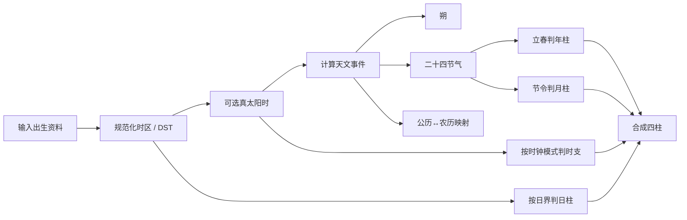
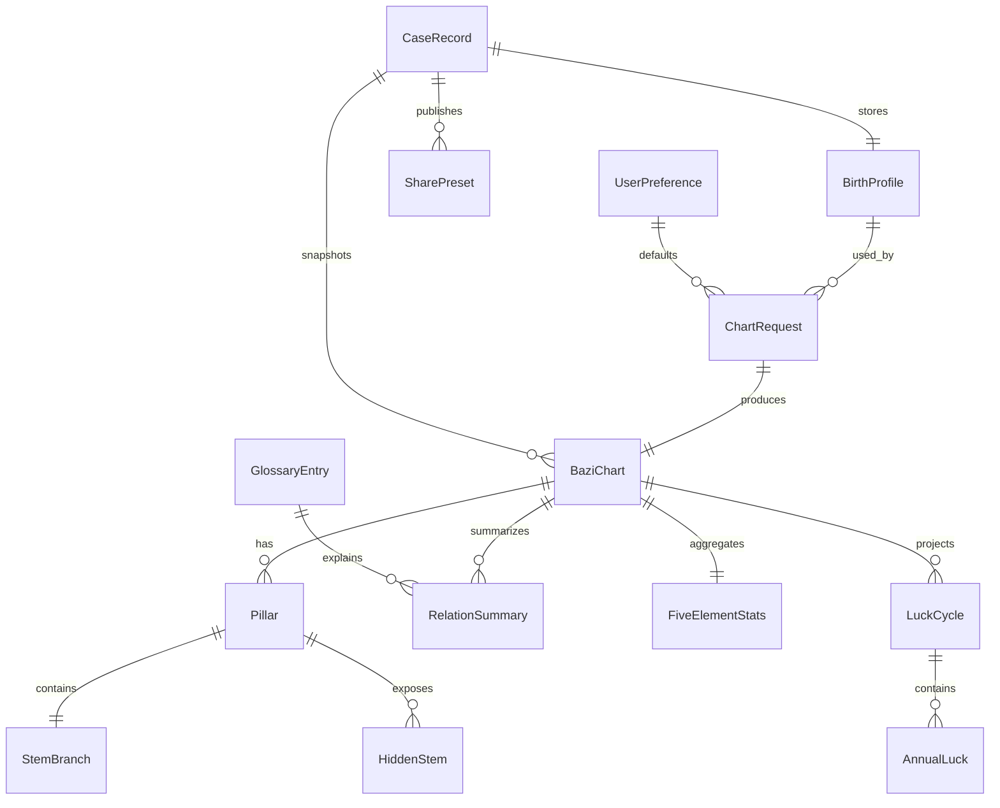

# Fate-Track V1 设计报告（中文译文）

> 来源文件：`markdown/reserch/Fate-Track V1 Design Report.md`
>
> 处理口径：本译文保留原报告章节结构、关键表格、算法规则、架构建议和风险边界；英文报告中的外部引用标记按原样保留，后续引用真伪与优先级由研究纳入台账和 ADR 统一治理。

## 执行摘要

Fate-Track 应以一个免费、重视隐私的八字 Web 应用启动。V1 的价值不应是“覆盖一切玄学功能”，而应是一条干净、可信、可检查的计算与阅读流程：精确录入命盘信息，透明展示四柱推导，给出可理解的五行与十神分析，提供可用的大运视图、案例管理、安全分享，以及实用的万年历与术语层。原报告认为，项目应采用类似 QuantPilot 的自顶向下全量树结构，把产品界面、数据对象、核心引擎和治理体系连接起来。

历法正确性方面，报告建议后端长期应把现代天文计算作为真源。现代中国历法规则可追溯到 GB/T 33661-2017：使用现代天文模型，以 UTC+8 为标准中国历法基准，以冬至所在月锚定十一月，并根据“无中气月”确定闰月。二十四节气由太阳黄经每 15 度定义一次，立春为 315 度，冬至为 270 度。八字排盘应明确区分“农历年”与“八字年界”：V1 默认年柱按立春切换，月柱按节气月切换，并把这些约定作为用户可见规则展示。

架构方面，报告建议 V1 后端采用 Axum，并把领域服务层与独立的天文/历法引擎分离。核心原则是：历法引擎必须确定性强、测试密集、版本可追踪，因为几乎所有后续功能都依赖它。天文基础长期可参考 IAU SOFA、JPL/NAIF 风格星历流程、The Astronomical Almanac、JPL DE/Horizons 等。

最大的产品风险不是前端视觉，而是“静默歧义”。V1 必须显式展示或记录以下选择：时区来源、DST 处理、真太阳时、子时换日策略、未知出生时辰策略、大运起运规则。存在流派差异时，Fate-Track 应先实现一个文档化默认规则，并在结果中显示采用的约定。

## 产品范围与全量功能树

报告把 V1 规划为一棵完整功能树，并用优先级标注规划边界。

```text
Fate-Track
├─ 产品基础
│  ├─ 定位
│  │  ├─ 免费八字 / 四柱 Web 应用
│  │  ├─ 隐私友好，无强制商业层
│  │  ├─ 计算透明，术语优先
│  │  └─ 移动优先，分享安全
│  ├─ 用户画像
│  │  ├─ 好奇初学者
│  │  ├─ 反复自查用户
│  │  ├─ 半专业咨询者
│  │  └─ 研究 / 对照用户
│  └─ 核心原则
│     ├─ 计算透明
│     ├─ 约定可配置
│     ├─ 不输出绝对有害断言
│     └─ 案例可迁移，分享可脱敏
├─ 用户可见界面
│  ├─ 首页
│  ├─ 新建命盘
│  ├─ 命盘详情
│  ├─ 案例列表
│  ├─ 分享预览
│  ├─ 万年历
│  ├─ 设置
│  └─ 术语
├─ 核心引擎
│  ├─ 历法引擎
│  ├─ 八字引擎
│  ├─ 安全文案引擎
│  └─ 持久化引擎
├─ 数据对象
│  ├─ BirthProfile
│  ├─ ChartRequest
│  ├─ BaziChart
│  ├─ Pillar
│  ├─ StemBranch
│  ├─ HiddenStem
│  ├─ TenGod
│  ├─ FiveElementStats
│  ├─ RelationSummary
│  ├─ LuckCycle
│  ├─ AnnualLuck
│  ├─ CaseRecord
│  ├─ SharePreset
│  ├─ UserPreference
│  └─ GlossaryEntry
├─ 质量系统
│  ├─ 确定性回归测试
│  ├─ 节气边界测试
│  ├─ 闰月边界测试
│  ├─ 未知时辰场景测试
│  ├─ 分享脱敏快照测试
│  └─ 可访问性测试矩阵
└─ 治理
   ├─ 明确非目标
   ├─ 规则版本化
   ├─ 数据保留策略
   └─ 算法修订变更日志
```

### 用户画像与用户故事

| 用户画像 | 核心诉求 | 成功条件 |
| --- | --- | --- |
| 好奇初学者 | 输入出生时间，看到四柱，并用普通语言理解结果 | 结果立即可读，细节可展开 |
| 反复自查用户 | 保存自己的命盘、复看年度运势、对照日期 | 结果连续稳定，约定徽标清晰 |
| 半专业咨询者 | 保存多个案例、记录备注、生成脱敏分享链接 | 案例组织、分享安全、计算可审计 |
| 研究 / 对照用户 | 对照不同万年历或 App，尤其关注边界日 | 明确显示规则约定，可复算 |

代表性用户故事：

| 角色 | 用户故事 | 优先级 |
| --- | --- | --- |
| 初学者 | 输入公历或农历出生资料，保存前先看到命盘预览 | MVP |
| 初学者 | 用简明卡片理解日主、五行、十神 | MVP |
| 反复用户 | 保存多个案例并重新打开 | P0 |
| 咨询者 | 生成隐藏精确出生资料的分享链接 | P0 |
| 研究用户 | 看到年界、日界、时区、真太阳时等规则 | P0 |
| 研究用户 | 出生时辰未知时显示多个候选时柱，而不是假装确定 | P1 |
| 所有用户 | 术语处处可跳转解释 | P0 |
| 所有用户 | 可在应用内查询万年历和节气 | P1 |

### MVP、P0、P1、P2

MVP 应包括：首页、新建命盘、命盘详情总览、分析卡、四柱、藏干、五行与十神摘要、大运概览、流年列表、案例保存/加载、基础术语、核心规则设置、可脱敏分享。

P0 应补充：公历/农历双输入、万年历查询、轻量黄历日视图、规则徽标、案例归档/删除/复制、命盘备注、分享撤销、未知时辰处理、移动端命盘布局、可访问图表。

P1 应补充：流月下钻、双案例或双规则比较、术语图谱、导入/导出、打印布局、更强教育引导。

P2 应补充：高级比较矩阵、批量案例管理、本地离线包、高级流派开关、分享分析、更多编辑内容。

### 页面清单

| 路由 | 页面 | 核心区块 | 备注 |
| --- | --- | --- | --- |
| `/` | 首页 | 入口、最近案例、快捷动作、术语/日历卡片 | 轻量入口 |
| `/charts/new` | 新建命盘 | 输入表单、规则抽屉、预览面板 | 摩擦最高，需要强校验 |
| `/charts/:id` | 命盘详情 | 头部 + Tabs | 核心工作台 |
| `/charts/:id/analysis` | 分析 Tab | 四柱、藏干、五行、十神、关系提示 | 默认 Tab |
| `/charts/:id/fortune` | 运势 Tab | 大运、流年、流月、时间线 | 时间密集 |
| `/charts/:id/records` | 记录 Tab | 备注、标签、快照、分享预设 | 用户内容 |
| `/cases` | 案例列表 | 搜索、过滤、列表、批量动作 | 咨询者工作流 |
| `/share/:token` | 分享视图 | 脱敏命盘、安全卡片、免责声明 | 不允许编辑 |
| `/calendar` | 万年历 | 月/日切换、节气、农历映射 | 工具面 |
| `/settings` | 设置 | 默认值、隐私、语言、计算规则 | 显示规则约定 |
| `/glossary` | 术语 | 搜索、分类、术语详情、相关词 | 教育层 |

## 八字时间线与算法规格

### 真源口径

历法转换的 V1 长期基准应为现代天文中国历法规则：朔决定农历月首；冬至所在农历月为十一月；两个连续十一月锚点之间若有 13 个朔月，则第一个不含中气的月为闰月；现代中国历法按 UTC+8/东经 120 度标准时计算。八字排盘必须把历法转换与命盘边界分开：农历年不是八字年界，八字年柱通常按立春切换；八字月柱按节气月，不按农历月。

### 可实现算法流程



低层实现建议：

1. 把请求解析为标准化 `ChartRequest`。
2. 尽可能解析 IANA 时区，同时保存原本地时间和 UTC 形式。
3. 若启用 `true_solar_time`，根据经度修正与时间方程计算地方视太阳时。
4. 计算或查找二十四节气的太阳黄经跨越时刻。
5. 公历/农历转换使用十一月锚定、冬至、无中气置闰规则。
6. 年柱按出生时刻与立春时刻比较：立春前用上一干支年，立春及之后用新干支年。
7. 月柱地支按节令区间确定：寅月为立春到惊蛰，卯月为惊蛰到清明，依次到丑月。
8. 月干按年干组确定：甲己年丙寅起、乙庚年戊寅起、丙辛年庚寅起、丁壬年壬寅起、戊癸年甲寅起。
9. 日柱从连续日数推导，建议使用 JDN + 固定甲子锚点。
10. 时支按双小时段确定，时干按日干组“五鼠遁”确定。
11. 输出命盘时必须附带计算元数据：时区、DST、真太阳时、年界、日界、算法版本。

### 必须显式展示的边界策略

| 策略 | 建议默认值 | 原因 |
| --- | --- | --- |
| 年界 | `LiChun` | 更符合八字实践；不同于农历春节 |
| 月界 | `SolarTermsJie` | 月柱是节气月，不是农历月 |
| 日界 | `Midnight` | 最容易解释且确定性强 |
| 备选日界 | `ZiStart2300` | 部分流派需要 |
| 时钟 | `CivilLocalTime` | 普通用户默认可理解 |
| 可选时钟 | `TrueSolarTime` | 高级用户和边界案例需要 |
| 农历基准 | `ChineseCalendarUTC+8` | 符合现代中国历法发布口径 |

### 闰月与边界案例

闰月属于民用农历转换，不直接决定八字月柱。农历闰四月会影响“显示的农历日期”，但月柱仍由节气区间决定。V1 必须覆盖下列边界：

| 边界 | 风险 | 必需行为 |
| --- | --- | --- |
| 立春前后出生 | 年/月柱错位 | 比较精确节气时刻，不能只看日期 |
| 节令交界 | 月柱错误 | 使用精确太阳黄经跨越时刻 |
| 闰月显示 | 农历月名混淆 | 显示 `is_leap_month`，排盘独立于农历月名 |
| 2033/2034 异常 | 闰月位置错误 | 使用标准历法和黄金样例回归 |
| DST 地区 | 本地输入解释错误 | 保留民用时间并用 TZDB 规范化 |
| 经度远离时区中央经线 | 时支可能漂移 | 显示真太阳时选项和差异 |
| 未知/近似时辰 | 伪精确 | 禁止确定性小时结论，显示候选集 |

### 回归样例

报告建议的默认约定样例：

| 输入 | 期望四柱 | 意义 |
| --- | --- | --- |
| `2023-01-22 12:00 UTC+8` | 壬寅年 癸丑月 庚辰日 壬午时 | 春节当天但立春前 |
| `2024-02-10 12:00 UTC+8` | 甲辰年 丙寅月 甲辰日 庚午时 | 立春与春节后 |
| `2025-01-29 12:00 UTC+8` | 甲辰年 丁丑月 戊戌日 戊午时 | 农历新年但立春前 |
| `2025-02-10 12:00 UTC+8` | 乙巳年 戊寅月 庚戌日 壬午时 | 立春后 |

边界测试需成对覆盖：立春前一秒、立春时刻、立春后一秒；每个节令边界同理；民用时与真太阳时对比；午夜换日与子初换日对比。

### 参考优先级

最高优先级：GB/T 33661-2017、The Astronomical Almanac、IAU SOFA、JPL DE/Horizons/SPICE 风格星历。

重要历法参考：Helmer Aslaksen 的中国历法研究、Calendrical Calculations、Hazelton 中西历表。

实用开源对照：sxtwl、6tail/lunar-java、6tail/lunar-python、EastAsiaCalendars。它们应作为验证对照，而不是最终权威。

## 领域数据模型与 Schema

### 实体关系



### 隐私分级

| 等级 | 含义 |
| --- | --- |
| Public | 可匿名公开，如术语文本 |
| Share-safe | 经脱敏后可用于分享链接 |
| Private | 用户范围内内容，默认不分享 |
| Sensitive | 可识别个人或出生信息的敏感数据 |

### 核心实体

| 实体 | 治理要点 |
| --- | --- |
| `BirthProfile` | 保存出生历法、日期、时间精度、时区、经纬度、地点、性别、备注；出生时间和地点为 Sensitive |
| `ChartRequest` | 保存输入模式、年界、月界、日界、时钟策略、时区策略、未知时辰策略、算法版本 |
| `UserPreference` | 保存语言、主题、默认规则、默认脱敏等级、术语展示偏好 |
| `StemBranch` | 干、支、五行、阴阳、六十甲子序号 |
| `HiddenStem` | 地支藏干、权重、相对日主十神 |
| `TenGod` | 建议实现为枚举和元数据表，不宜过度数据库化 |
| `Pillar` | 年/月/日/时柱，包含干支、藏干、纳音、边界元数据 |
| `FiveElementStats` | 五行数值、标准化标志、日主强弱分、季节支持分 |
| `RelationSummary` | 合、冲、刑、害、季节、格局等结构化提示 |
| `BaziChart` | 不可变命盘快照，必须包含计算元数据和免责声明 |
| `LuckCycle` / `AnnualLuck` | 大运和流年结果，必须携带规则元数据 |
| `CaseRecord` | 案例标题、出生资料引用、最新命盘、标签、备注、归档状态 |
| `SharePreset` | 脱敏等级、隐藏字段、分享 token、过期与撤销 |
| `GlossaryEntry` | 术语 slug、术语、分类、摘要、正文、相关术语和来源说明 |

## 后端架构与 API

### Rust 架构建议

报告推荐 Axum。核心理由是 Fate-Track 是类型化、JSON 密集、需要强 extractor、middleware 和可测试性的服务；复杂部分在纯领域计算，而不是 HTTP 技巧。

目标 workspace：

```text
fate-track/
├─ crates/
│  ├─ ft-api
│  ├─ ft-domain
│  ├─ ft-calendar
│  ├─ ft-analysis
│  ├─ ft-repo
│  ├─ ft-service
│  ├─ ft-share
│  ├─ ft-glossary
│  └─ ft-testkit
└─ apps/
   └─ server
```

### 核心接口

建议小而确定性的 trait：

```rust
pub trait CalendarEngine {
    fn gregorian_to_lunar(&self, input: GregorianInput) -> Result<LunarDate, CalendarError>;
    fn lunar_to_gregorian(&self, input: LunarInput) -> Result<GregorianDate, CalendarError>;
    fn solar_terms_for_year(&self, year: i32, tz: TzPolicy) -> Result<Vec<SolarTermInstant>, CalendarError>;
    fn four_pillars(&self, req: &ChartRequest) -> Result<FourPillarsResult, CalendarError>;
}
```

还应拆分 `AnalysisEngine`、`CaseRepository`、分享服务、术语服务和持久化服务。

### 错误模型

错误层级包括：

| 错误 | 含义 |
| --- | --- |
| `ValidationError` | 日期错误、闰月不存在、时区不支持 |
| `CalendarError` | 天文计算失败、边界歧义、星历范围外 |
| `AnalysisError` | 命盘状态缺失、日主缺失、未知时辰策略不支持 |
| `RepoError` | 数据库、序列化、并发问题 |
| `ShareError` | token、撤销、脱敏配置错误 |
| `AppError` | 顶层 HTTP 映射 |

每个命盘响应应包含 `calculation_warnings[]`，让前端展示“出生时辰未知”“真太阳时改变时柱”“接近节气边界”等提示。

### 持久化和服务层

V1 最小存储建议：

- PostgreSQL 保存案例、分享、偏好和术语元数据。
- JSONB 保存命盘快照和计算元数据。
- 对术语、节气年表等可读数据使用只读缓存。

推荐 use-case 服务：`PreviewChartService`、`CreateChartService`、`GetChartDetailService`、`GenerateLuckService`、`SaveCaseService`、`CreateShareService`、`RevokeShareService`、`CalendarLookupService`。

### 目标 API

| 方法 | 路径 | 用途 |
| --- | --- | --- |
| `POST` | `/api/v1/charts/preview` | 计算但不持久化 |
| `POST` | `/api/v1/charts` | 创建持久化命盘/案例 |
| `GET` | `/api/v1/charts/{id}` | 命盘详情 |
| `POST` | `/api/v1/charts/{id}/luck` | 展开大运/流年 |
| `GET` | `/api/v1/cases` | 列表/搜索案例 |
| `POST` | `/api/v1/cases` | 创建或保存案例 |
| `PATCH` | `/api/v1/cases/{id}` | 更新标题/标签/备注/归档 |
| `POST` | `/api/v1/shares` | 创建分享预设 |
| `POST` | `/api/v1/shares/{id}/revoke` | 撤销分享 |
| `GET` | `/api/v1/public/shares/{token}` | 公开脱敏视图 |
| `GET` | `/api/v1/calendar/day` | 日期查询 |
| `GET` | `/api/v1/glossary` | 术语列表 |
| `GET` | `/api/v1/glossary/{slug}` | 术语详情 |
| `GET` / `PUT` | `/api/v1/preferences` | 用户默认值 |

### 测试策略

引擎层测试应特别重：

- 天干地支、时间规范化、边界策略单元测试。
- 多年节气与闰月黄金样例。
- 分享脱敏快照测试。
- 公历/农历往返属性测试。
- 路由、服务、仓储集成测试。
- API DTO 合约测试。
- 前端可访问性测试。

建议黄金测试目录：

```text
tests/golden/
├─ solar_terms/
├─ conversion/
├─ year_boundary/
├─ month_boundary/
├─ unknown_hour/
└─ anomaly_2033/
```

## 前端信息架构与交互设计

前端应是“文档/命盘工作台”而非泛仪表盘。主对象是命盘，所有路径都应汇聚到“打开命盘并检查”。

| 区域 | 组件 |
| --- | --- |
| 全局 | app shell、顶部导航、面包屑、toast、modal、术语抽屉 |
| 首页 | CTA、最近案例、快捷动作 |
| 新建命盘 | 日期输入、时间输入、公历/农历切换、时区选择、规则抽屉、预览卡 |
| 命盘头部 | 标题、徽标、保存/分享、计算元数据 |
| 分析 | 四柱卡、藏干 popover、五行图、十神 chip、术语 tooltip |
| 运势 | 大运轨、年度表、时间线 |
| 记录 | 备注编辑、标签、快照、分享预设 |
| 万年历 | 月格、日面板、节气标记、农历叠加 |
| 设置 | 分组偏好面板 |
| 术语 | 搜索、术语列表、正文、相关词 |

移动端新建命盘应为单列 stepper：日期/历法、时间/未知时辰、地点/时区、高级规则、预览。命盘详情移动端应有四柱 sticky 摘要条，分析组件折叠成卡片，大运从表格改为横向十年轨 + 纵向流年列表。

可访问性要求包括：键盘可操作、明确焦点态、颜色不作为唯一信息、图表有文字摘要、术语 tooltip 支持键盘与读屏、分享预览可打印和高对比、算法徽标有文本。

## 分析表达、大运 UX 与安全解释

V1 分析应先结构化、后叙事化。后端输出的指标包括：日主强弱分、季节支持分、五行原始/标准化总量、可见十神计数、加权十神分、通根状态、制化平衡、关系标记。

推荐卡片：

- 日主
- 五行平衡
- 十神显露
- 季节环境
- 命盘互动提示
- 运势互动提示

安全文案必须包含类似：

> “本解读为传统模型下的解释性与学习性内容，不诊断健康、不预测法律结果、不保证关系事件，也不能替代专业建议。”

禁止输出：疾病/死亡确定论、犯罪/出轨确定论、确定结婚/离婚日期、确定财富损益、诊断式或法律/金融指令。

大运由于流派差异较大，V1 应选择一个文档化默认规则，输出 `LuckRuleProfile`，并说明方向与起运方式存在传统差异。大运 UX 建议使用横向十年轨、年度列表、与原局合冲徽标、起运年龄/日期/规则说明。

## 开放问题与限制

报告列出的待决策项：

- 大运顺逆与起运年龄的具体默认规则。
- 日界默认用午夜还是子初。
- 非中国出生默认使用出生地本地时间，还是提供 UTC+8 对照模式。
- V1 验证范围是 1900–2100、1901–2100 还是更宽。
- 哪些开源库纳入 CI 对照。

这些不是阻塞项，但必须写入计算元数据、帮助文案和治理记录。
