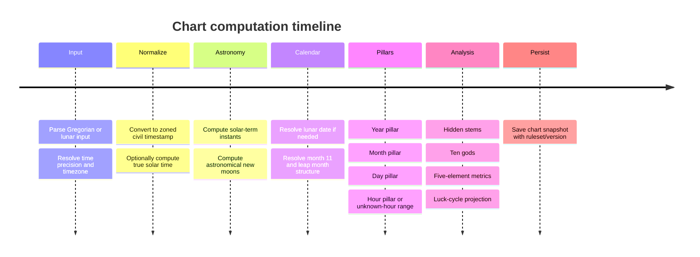

# Fate-Track V1 产品规格与工程计划（中文译文）

> 来源文件：`markdown/reserch/Fate-Track V1 Product Spec and Engineering Plan.md`
>
> 处理口径：本译文保留原报告的产品、算法、数据模型、API、架构、前端、安全、验证与参考资料结构；外部引用标记按原文保留，治理采纳状态以研究纳入台账和 ADR 为准。

## 执行摘要

Fate-Track 应作为一个免费、准确性优先的八字 Web 应用启动。V1 的承诺应刻意收窄为：可靠排盘、克制的结构化分析、可用案例管理、安全脱敏分享和实用万年历助手。项目材料已经把范围聚焦在“免费排盘、分析、记录、分享、日历”，并倾向 QuantPilot 式全量树组织；这是合适的产品管理方式，因为历法边界和解释范围漂移是 V1 的主要风险。

最高杠杆的工程决策是：把排盘当作带版本规则集的确定性历法服务，而不是前端便利功能。东亚节气由太阳黄经定义，NASA/JPL Horizons、JPL DE440、NAOJ、NREL SPA、IANA tzdb 等资料都说明：星历、时间尺度、时区历史、真太阳时都可能影响结果。现代中国历法中，冬至所在月为十一月，闰月由无中气规则确定，UTC+8 是民用历法基准。

Rust 后端推荐 Axum。它适合一个从小服务成长为日历计算、案例保存、公开分享、术语接口和高级规则变体的系统。Actix Web 可作为偏性能和 batteries-included 的替代；Warp 适合小型组合式服务，但业务 API 增大后可读性会下降。

产品策略上，Fate-Track V1 应“计算丰富，说话谨慎”。分析层可以输出五行分布、显/藏干、十神分布、季节支持、合冲、运势叠加等可计算结构，但必须避免确定性人生断言、诊断、咨询或诱导性建议。出生资料和命盘结果应视为敏感个人或敏感衍生数据；日志中禁止记录原始出生资料、分享 token、访问 token 或高敏标识。

## 产品范围与功能清单

### 产品定位与全量功能树

报告建议 V1 采用根式、穷尽式功能树，而不是松散 backlog。原因是八字产品常常不是缺 UI，而是隐藏了规则约定。

```text
Fate-Track
├─ Entry
│  ├─ Home
│  ├─ New chart CTA
│  ├─ Feature overview
│  └─ Disclaimer and glossary entry points
├─ Charting
│  ├─ Birth input
│  │  ├─ Gregorian input
│  │  ├─ Lunar input
│  │  ├─ Leap-month support
│  │  ├─ Precise / approximate / unknown time
│  │  ├─ Time zone
│  │  ├─ Birth location optional
│  │  └─ True solar time toggle
│  ├─ Calendar assist
│  │  ├─ Solar↔lunar conversion
│  │  ├─ Solar terms lookup
│  │  ├─ Gan-Zhi date lookup
│  │  └─ Boundary warnings
│  └─ Chart generation
│     ├─ Four pillars
│     ├─ Hidden stems
│     ├─ Ten gods
│     ├─ Five elements
│     ├─ NaYin optional display
│     └─ Rule/version echo
├─ Chart detail
├─ Cases
├─ Calendar
├─ Glossary
├─ Settings
└─ Platform
```

### 用户画像

| 用户 | 需求 | V1 影响 |
| --- | --- | --- |
| 好奇自助用户 | 快速得到命盘，不一定知道出生时间是否精确 | 输入流程支持精确、近似、未知时间，并解释边界影响 |
| 隐私敏感记录者 | 保存案例、复看结果，但不暴露出生细节 | 案例保存、别名、本地标签、脱敏分享、默认私密 |
| 半专业实践者/内容创作者 | 需要确定性命盘、术语支持、可分享快照 | 规则/版本回显、日历助手、结构卡片、备注和分享 |

### 核心用户故事

- 首次用户可以输入公历或农历出生资料，包括闰月，并得到带规则集和不确定性标记的命盘。
- 立春或节气边界附近出生的用户，可以看到导致命盘变化的具体边界时刻，以及使用民用时还是真太阳时。
- 出生时辰未知的用户可以得到部分命盘，并看到哪些结论在十二时辰中稳定，而不是被强制填入假时间。
- 用户可以把命盘保存为案例、添加备注和标签，并发布默认隐藏姓名与精确出生资料的脱敏快照。
- 用户可以在日历助手中查询公历/农历转换、节气和干支日。

### 交付层级

| 层级 | 包含 |
| --- | --- |
| MVP | 首页、新建命盘、公历输入、精确/未知时辰、四柱、藏干、五行摘要、十神摘要、案例保存、基础术语、免责声明 |
| P0 | 农历输入和闰月、时区选择、可选真太阳时、边界解释卡、大运基础、分享脱敏、日期查询、设置持久化 |
| P1 | 案例搜索/过滤/标签、近似时间、未知时辰稳定/变动摘要、流年叠加、JSON/图片导出、术语深链、民用时与真太阳时比较 |
| P2 | 多命盘比较、流月、高级流派开关、术语编辑、离线缓存、多语言、公开集合/社区 |

### 页面清单

| 路由 | 页面 | 用途 | 状态 |
| --- | --- | --- | --- |
| `/` | 首页 | 入口、信任说明、快速开始 | 默认、加载、API 降级 |
| `/new` | 新建命盘 | 出生输入与排盘 | 初始、校验中、边界警告、提交错误 |
| `/chart/:id` | 命盘详情 | 统一命盘工作台 | 加载、部分命盘、完整命盘、已删除 |
| `/chart/:id/analysis` | 分析 | 五行、十神、结构卡片 | 稳定、未知时辰聚合 |
| `/chart/:id/luck` | 运势 | 大运/流年展示 | 精确、近似范围 |
| `/chart/:id/records` | 记录 | 保存、备注、元数据 | 未保存、已保存、归档 |
| `/cases` | 案例列表 | 浏览记录 | 空、过滤、归档 |
| `/cases/:id` | 案例详情 | 备注、标签、命盘链接、分享预设 | 读、编辑、删除 |
| `/share/:token` | 分享预览 | 公开脱敏快照 | 有效、过期、撤销 |
| `/calendar` | 万年历 | 公农历转换、日/月查询 | 日查询、月视图、非法农历日期 |
| `/settings` | 设置 | 偏好与隐私默认 | 默认、保存、重置 |
| `/glossary` | 术语索引 | 搜索术语 | 结果、空 |
| `/glossary/:slug` | 术语详情 | 术语解释 | 正常、缺失 |

### 表单字段

| 表单 | 字段 |
| --- | --- |
| 新建命盘 | `input_mode`, `calendar_type`, `gregorian_date`, `gregorian_time`, `lunar_year`, `lunar_month`, `lunar_day`, `lunar_is_leap_month`, `time_precision`, `timezone_id`, `birth_location_name`, `longitude`, `latitude`, `use_true_solar_time`, `sex`, `chart_label`, `notes_optional` |
| 案例编辑 | `case_title`, `alias`, `tags[]`, `notes_markdown`, `pinned`, `archived` |
| 分享预设 | `preset_name`, `redact_name`, `redact_exact_time`, `redact_location`, `redact_notes`, `show_true_solar_time`, `show_luck`, `expires_at_optional` |
| 日历查询 | `solar_date` 或 `lunar_date`, `is_leap_month`, `timezone_id`, `query_kind` |
| 设置 | `locale`, `theme`, `default_timezone`, `default_true_solar_time`, `default_time_precision_mode`, `default_redaction_profile`, `glossary_inline`, `analysis_tone` |

### 验收标准与非目标

关键验收标准包括：支持公历/农历创建命盘；节气边界显示精确时刻；每个命盘响应包含 `ruleset_id`、`algo_version`、`timezone_used`、`true_solar_time_applied`；未知时辰不伪造时柱；分享页不暴露内部 ID、私有备注、隐藏字段或私有案例状态；分析文案避免绝对和有害断言。

V1 不应做：付费咨询平台、聊天式算命、社交网络、合婚/婚配确定性服务、医疗/法律/金融建议、原生移动 App、流月/流日/流时解释、公开用户内容、AI 咨询、专业后台 CRM。

## 八字算法与历法规格

### V1 规则选择

稳健做法是分离天文事实与命理约定。天文事实包括节气时刻、朔时刻、时区历史、日界；命理约定包括年柱按春节还是立春、日柱按 00:00 还是 23:00 换日、真太阳时影响哪些柱、大运起运规则等。

| 主题 | 建议默认 | 原因 |
| --- | --- | --- |
| 年柱边界 | 立春 | 符合常见八字实践，避免与农历年混淆 |
| 农历年显示 | 同时显示农历新年标签，但不驱动年柱 | 减少困惑 |
| 月柱边界 | 从立春开始的节气区间 | 标准命理月令口径 |
| 日界 | 默认本地 00:00；高级可选子初 | 默认易懂，可扩展 |
| 时柱 | 选定时间基准下的双小时段 | 对齐时辰映射 |
| 时间基准 | 默认民用时；可选真太阳时 | 主流用户简单，高级用户可用 |
| 未知时辰 | 时柱为空，并生成十二时辰稳定性分析 | 避免伪精确 |
| 农历转换 | UTC+8 中国历法模型 | 匹配当前标准摘要 |

### 算法流程



### 天文基础、农历与闰月

生产级准确性应优先使用星历引擎，而不是只靠近似日期表。JPL Horizons、DE440、NREL SPA、IANA tzdb 分别覆盖星历、太阳位置、时间尺度、时区历史。实现建议：

1. 接收公历本地日期时间 + IANA 时区，或农历日期 + 闰月标记 + 可选时间 + IANA 时区。
2. 使用 IANA tzdb 历史，而不是固定 offset。
3. 转换为 UTC。
4. 若启用真太阳时且有经度，计算时间方程和经度修正，得到地方视太阳时。
5. 解算太阳黄经 `λ = k * 15°` 的节气时刻。
6. 解算日月黄经合朔作为朔。
7. 用冬至所在月定十一月、无中气置闰，构建农历月序。
8. 按规则集解析四柱。
9. 持久化 `algo_version` 和 `ruleset_id`。

报告强调：表可以用于性能优化，但不应成为唯一真源。正确模型是星历派生真源 + 1901–2100 等范围的带 hash/version 黄金表。

闰月属于农历月序，不属于八字月柱。用户输入“农历闰四月”是在指定民用农历日期；月柱仍由节气区间确定。前端应直白显示：“农历日期用于恢复民用时间；月柱按节气计算。”

### 年柱、月柱、日柱、时柱

年柱：按精确立春时刻判定。出生时刻 `< 立春` 用上一干支年，`>= 立春` 用新干支年。若出生日期与立春同日，UI 必须显示“具体时刻敏感”，不能只写“2 月 4 日之后”。

月柱：按节气区间。寅月从立春到惊蛰，卯月从惊蛰到清明，辰月从清明到立夏，依次到丑月从小寒到立春。月干按年干五组起法。

日柱：建议用 JDN + 甲子锚点，而不是散落公式。已知锚点可包括 `1912-02-18 = 甲子日`、`1949-10-01 = 甲子日`。

时柱：用传统双小时段，子时 23:00–01:00，丑时 01:00–03:00，依次到亥时 21:00–23:00。时干由日干组推导。

### 时区、真太阳时与未知时辰

时区不能只用国家固定 offset，因为法律时间会变更。V1 应要求 IANA timezone ID；固定 offset 只能作为降级并给出警告。真太阳时应可选并依赖经度；没有经度时禁用或提示原因。默认策略：真太阳时优先细化时柱，不应静默改变年/月/日柱，除非规则集显式选择。

未知时辰模式：

| 模式 | 存储含义 | 输出行为 |
| --- | --- | --- |
| exact | 时钟时间可信 | 正常命盘 |
| approximate | 有时间但信心低 | 计算可能时辰并标低信心 |
| unknown | 无可靠时辰 | 无时柱，输出十二时辰敏感性摘要 |

### 高置信度测试向量

| 类别 | 输入 | 期望 |
| --- | --- | --- |
| 年界 | `2024-02-04 16:26:59 Asia/Shanghai` | 立春规则下仍为上一干支年 |
| 年界 | `2024-02-04 16:27:00 Asia/Shanghai` | 切到甲辰年 |
| 年界 | `2026-02-04 04:01:59 Asia/Shanghai` | 仍为上一年 |
| 年界 | `2026-02-04 04:02:00 Asia/Shanghai` | 切到新年 |
| 月界 | `2024-04-04 15:01:59 Asia/Shanghai` | 仍为卯月 |
| 月界 | `2024-04-04 15:02:00 Asia/Shanghai` | 切到辰月 |
| 日锚点 | `1912-02-18` | 甲子日 |
| 日锚点 | `1949-10-01` | 甲子日 |
| 时映射 | 任意甲/己日 `23:30` | 甲子时 |
| 未知时辰 | 只有日期无时间 | 时柱为空 + 稳定性聚合 |

### 算法开放问题

本研究没有直接取得 PRC 国家标准全文，相关中国历法规则部分依赖可靠二级摘要。生成最终黄金表前，应以标准原文或官方实现/发布数据验证。大运规则存在明显流派差异，V1 应把它作为可配置规则集，并在结果中回显。

## 领域模型与 API 合约

模型应区分：

1. 输入事实：用户输入了什么。
2. 规范化事实：系统如何解析时间、地点、历法。
3. 派生命盘事实：四柱与统计结果。
4. 展示产物：备注、分享、偏好、术语。

### 隐私级别

| Code | 含义 |
| --- | --- |
| `public` | 匿名可读 |
| `user_private` | 绑定用户/设备但低敏 |
| `sensitive_personal` | 直接或准直接个人信息 |
| `sensitive_derived` | 可识别/画像的命盘衍生数据 |
| `share_redacted` | 允许公开的脱敏快照 |

### 核心实体字段口径

| 实体 | 必要字段摘要 |
| --- | --- |
| `BirthProfile` | `birth_profile_id`, `display_name`, `alias`, `sex`, `calendar_input_type`, `gregorian_date/time`, `lunar_year/month/day/is_leap`, `time_precision`, `timezone_id`, `birth_location_name`, `longitude`, `latitude`, `source_note`, timestamps |
| `ChartRequest` | `chart_request_id`, `birth_profile_id`, `ruleset_id`, `algo_version`, `use_true_solar_time`, `day_boundary_mode`, `resolve_timezone_history`, `request_locale`, `requested_at` |
| `StemBranch` | `stem`, `branch`, `stem_index`, `branch_index`, `label_zh`, `label_en` |
| `HiddenStem` | `stem`, `weight`, `source_branch`, `ten_god_to_day_master` |
| `Pillar` | `kind`, `stem_branch`, `hidden_stems`, `nayin`, `is_estimated`, `confidence` |
| `TenGod` | `code`, `label`, `count_visible`, `count_hidden`, `score` |
| `FiveElementStats` | 五行分值、统计基准、最强/最弱/缺失元素、日主支持指数 |
| `RelationSummary` | 天干合冲、地支合冲、刑害、季节上下文 |
| `LuckCycle` | 序号、干支、起止年龄、起止日期、顺逆、规则说明 |
| `AnnualLuck` | 公历年、干支、所在大运、摘要标记 |
| `BaziChart` | 本地/UTC/真太阳时解析时间、offset、四柱、hour_status、五行、十神、关系、大运、流年预览、ruleset、algo_version |
| `CaseRecord` | 案例 ID、出生资料、最新命盘、标题、标签、备注、归档、时间戳 |
| `SharePreset` | 名称、脱敏开关、是否包含备注/运势、过期时间、`share_token_hash` |
| `UserPreference` | 语言、主题、默认时区、真太阳时默认值、脱敏档、术语开关、分析语气 |
| `GlossaryEntry` | slug、中文/英文术语、短释义、长释义、相关术语、发布状态 |

### REST API 路由目标

| 方法 | 路由 | 用途 |
| --- | --- | --- |
| GET | `/api/v1/health` | 服务健康/版本 |
| GET | `/api/v1/calendar/lunar` | 公历转农历 |
| GET | `/api/v1/calendar/solar` | 农历转公历 |
| GET | `/api/v1/calendar/solar-terms` | 年/范围节气 |
| GET | `/api/v1/calendar/day` | 日期聚合查询：农历、干支、节气 |
| POST | `/api/v1/charts` | 创建命盘 |
| GET | `/api/v1/charts/{chart_id}` | 命盘详情 |
| GET | `/api/v1/charts/{chart_id}/analysis` | 结构化分析 |
| GET | `/api/v1/charts/{chart_id}/luck` | 大运/流年 |
| GET/POST/PATCH/DELETE | `/api/v1/cases...` | 案例管理 |
| POST/GET | `/api/v1/shares...` | 分享创建与读取 |
| GET/PATCH | `/api/v1/settings` | 偏好设置 |
| GET | `/api/v1/glossary...` | 术语检索/详情 |

### 错误与兼容性

错误 envelope：

```json
{
  "error": {
    "code": "INVALID_LUNAR_DATE",
    "message": "The specified lunar leap month does not exist in the resolved year.",
    "details": { "field": "lunar_is_leap_month" },
    "trace_id": "req_01J..."
  }
}
```

推荐错误码：`INVALID_DATETIME`、`INVALID_LUNAR_DATE`、`UNSUPPORTED_TIMEZONE`、`BOUNDARY_AMBIGUITY`、`RULESET_NOT_SUPPORTED`、`CHART_NOT_FOUND`、`CASE_NOT_FOUND`、`SHARE_NOT_FOUND`、`SHARE_EXPIRED`、`VALIDATION_ERROR`、`RATE_LIMITED`、`INTERNAL_ERROR`。

兼容性：URI 版本为 `/api/v1/...`；V1 内只能新增字段，不得重定义枚举；每个命盘响应回显 `ruleset_id` 和 `algo_version`；持久化命盘在后续引擎变更后仍可复现。

## 后端架构

目标 workspace：

```text
fate-track/
├─ crates/
│  ├─ ft-api/
│  ├─ ft-app/
│  ├─ ft-domain/
│  ├─ ft-calendar/
│  ├─ ft-analysis/
│  ├─ ft-luck/
│  ├─ ft-storage/
│  ├─ ft-share/
│  ├─ ft-config/
│  ├─ ft-observability/
│  └─ ft-testkit/
├─ apps/
│  └─ server/
└─ migrations/
```

分层原则：

| 层 | 职责 | 必须避免 |
| --- | --- | --- |
| `ft-domain` | 纯业务类型、值对象、规则 ID | DB、Web |
| `ft-calendar` | 确定性历法数学 | HTTP、持久化 |
| `ft-analysis` / `ft-luck` | 指标、摘要、投影 | 过度 UI 化文案 |
| `ft-app` | 组织用例 | 框架 extractor |
| `ft-storage` | 仓储和数据库适配 | 领域数学 |
| `ft-api` | 路由、校验、DTO、响应 | 业务逻辑 |

错误策略：内部使用 typed errors，边界映射为稳定 API envelope。至少包括 `DomainError`、`InfraError`、`AppError` 三层。

数据层：案例、设置、术语、分享元数据用关系表；`bazi_chart_v1` 用不可变 JSON 快照；可为 `year_pillar`、`day_master`、tags 等字段生成索引列。

## 前端 IA 与结构化分析输出

前端应组织为一个以命盘工作台为核心的单页应用。

```text
App
├─ Home
├─ NewChartPage
│  ├─ InputModeSwitch
│  ├─ DateInput / LunarInput
│  ├─ TimePrecisionSelector
│  ├─ TimezoneSelector
│  ├─ LocationFields
│  ├─ RuleOptions
│  └─ PreviewBoundaryAlert
├─ ChartWorkspace
│  ├─ HeaderSummary
│  ├─ Tabs
│  └─ GlossaryDrawer
├─ CaseListPage
├─ CaseDetailPage
├─ SharePreviewPage
├─ CalendarPage
├─ SettingsPage
└─ GlossaryPage
```

关键组件包括：公历日期时间输入、农历日期输入、时间精度选择、时区选择、真太阳时开关、边界警告卡、四柱卡、五行分布卡、十神摘要卡、未知时辰敏感性卡、大运时间线、案例元数据面板、分享脱敏面板、术语 chip、日历日卡。

交互状态包括：loading skeleton、非法农历输入、接近边界、未知时辰、空案例、分享过期、术语不可用、离线/降级。

可访问性最低要求：全部功能键盘可用、无键盘陷阱、Tab 语义正确、icon-only 按钮有名称、页面语言设置正确、图表有文字替代、焦点可见、时间线有无动效备选。

### 分析表达与安全文案

分析层应为卡片化、指标支撑、非确定性表达。可计算指标包括：显/藏干/季节加权的五行分、日主支持指数、可见十神计数、总十神分、季节上下文、合冲标记、缺失元素标记、未知时辰敏感性、大运/流年叠加。

固定提醒：

> This output describes traditional Bazi structure in a compact, non-deterministic way. It is for reflection and entertainment, not a statement of fact, prediction certainty, or personal advice.

禁止短语类型：命定、必然、保证财富/离婚、必须避孕/结婚/投资、疾病/心理/犯罪倾向证明、命运不可改变、死亡时间、诊断或强制性建议。

## 大运 V1

大运规则差异大，V1 必须显式暴露 `luck_ruleset_id`。设计建议：

- 支持一个默认规则集，引擎可插拔。
- 计算顺逆、起运依据和年龄、十年大运、年度叠加。
- P0 不做流月，因为会显著增加算法解释和移动端信息密度。
- 若出生时辰未知，返回规则相关的起运年龄范围。
- 每个结果标注活动大运规则。

## 隐私、安全、免责声明与验证计划

### 敏感数据分类

出生日期、出生时间、出生地、时区历史、精确命盘输出都应视为敏感个人或敏感衍生数据。日志不得直接记录敏感个人数据、access token、session ID 或高于日志系统允许等级的数据。

### 存储与加密策略

- 全部网络通信使用 TLS。
- 数据库卷至少进行静态加密。
- 若启用服务端持久化，对高敏字段考虑应用层加密。
- 分享 token 只存 hash。
- secrets 与应用配置分离。
- 若未正式登录，则用不透明用户/设备身份做行级归属。

### 日志禁止项

禁止原样记录：出生时间戳、原始出生地点、分享 token、排盘请求 body、私有备注、完整命盘 JSON、数据库凭证或 secrets。

### 保留与删除

案例保留到用户删除；案例和出生资料支持硬删除；分享快照可立即撤销；过期分享不可读且不暴露底层案例是否存在；备份保留策略另行披露。若认证延后，不能暗示不存在的账号迁移能力。

### 分享脱敏规则

公开分享默认：空名或别名；不显示精确出生分钟；不显示精确坐标；不显示私有备注；使用不可变快照，不是私有案例实时视图；`noindex`；高熵随机 token。

### 推荐免责声明

> Fate-Track provides traditional Bazi charting and structured interpretation for reflection and entertainment. It does not provide medical, legal, financial, mental-health, or other professional advice. Results may vary based on birth-time certainty, time-zone history, solar-term boundaries, and selected calculation rules.

边界免责声明：

> If your birth is close to a solar-term boundary or your birth time is uncertain, chart details may change under different valid conventions.

### 验证计划

黄金数据应覆盖 1901–2100：

- UTC 与 UTC+8 本地日期的节气时刻。
- 朔时刻与农历月结构。
- 十一月识别。
- 闰月标记。
- 已知日柱锚点。
- 时辰边界探针。

后端测试分类：

| 分类 | 示例 |
| --- | --- |
| 节气边界 | 2024/2026 立春、2024 清明 |
| 闰月 | 2020 闰月年、2033 异常 |
| 春节前后 vs 立春前后 | 一月/二月边界 |
| 日循环 | 甲子锚点和 +60 日环绕 |
| 时循环 | 十二时辰、真太阳时跨界 |
| 时区历史 | 特定地区历史 offset 变更 |
| 未知时辰 | 稳定性聚合 |
| 分享脱敏 | token 不可重构私有案例 |

CI 示例：`cargo fmt --all --check`、`cargo clippy --workspace --all-targets -- -D warnings`、`cargo test --workspace`、`cargo test -p ft-calendar golden_`、`cargo test -p ft-api api_contract_`、`pnpm lint`、`pnpm test`、`pnpm e2e`。

数据回归流程：

1. 从历法引擎生成黄金表。
2. 用 `algo_version` hash 并提交。
3. CI 运行 diff-aware 回归。
4. 星历或 tzdb 更新导致输出变化时，提升 `algo_version` 并保留旧命盘可复现。
5. 规则集或术语文案变化后，重跑代表性 UI 快照。

## 开放问题与参考

未决项包括：大运规则集选择、国家标准全文验证、2050 后边界样例展开、账号/云同步、保存上限、V1 是否直接开放农历输入、1901–2100 外验证级别、1970 年前时区历史置信度。

优先参考：NASA/JPL Horizons、JPL DE440、NAOJ 二十四节气定义、NREL SPA、IANA tzdb、W3C WCAG 2.2、WAI-ARIA APG、OWASP Logging Cheat Sheet、NIST SP 800-53、NIST SP 800-92、Axum 官方文档、Actix Web、Warp。
