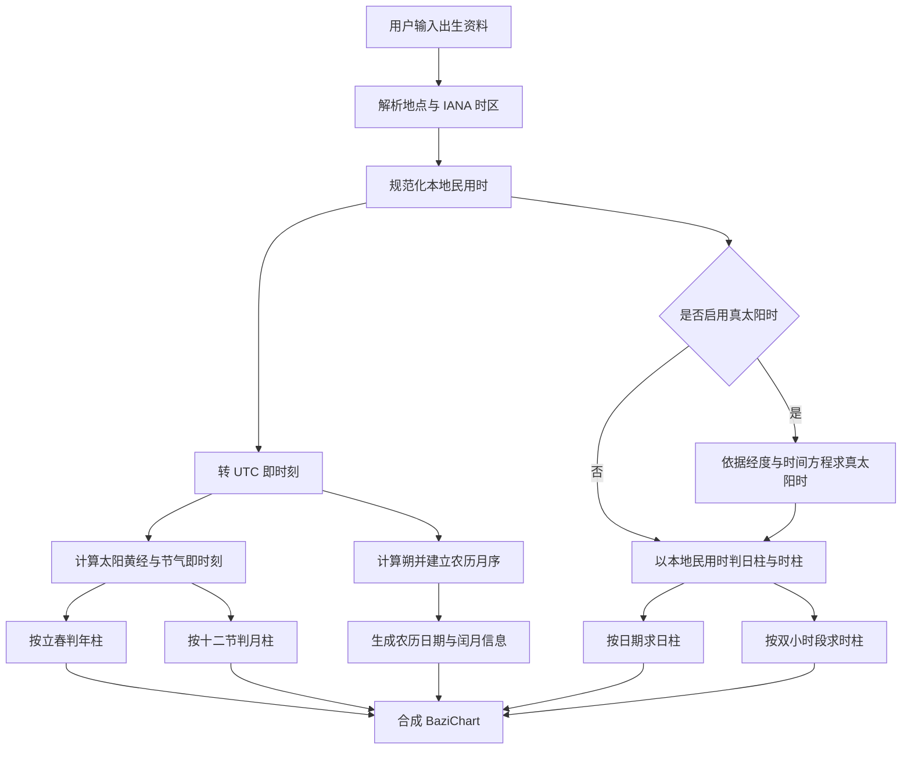
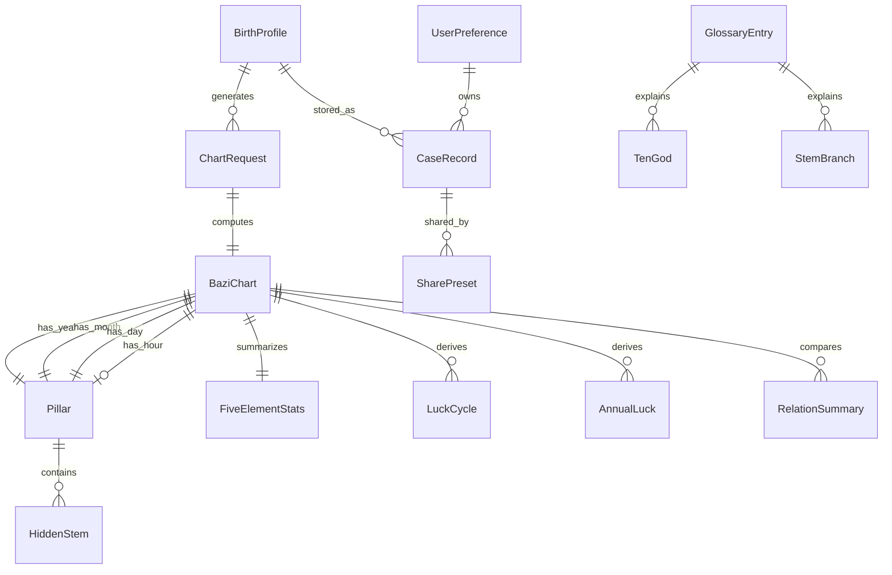

# 命轨 Fate-Track V1 产品需求与八字算法规格研究报告

## 执行摘要

“命轨 Fate-Track”适合被定义为一个**免费、面向大众、以“输入出生信息→得到可解释四柱结果→保存/分享/继续分析”为主链路的 Web 八字排盘产品**。如果目标是先做出一版能公开使用、又尽量避免流派争议与时间算法误差放大的 V1，我建议把产品规则压缩成**一个默认规则档**：年柱、月柱按**精确节气时刻**判定；日柱按**子正换日（00:00）**判定；时柱按**本地民用时**计算，并提供**可选的真太阳时校正模式**；当出生时辰未知时，只输出确定的年/月/日信息，并把小时相关分析降级或隐藏。这样做的理由是：现代农历与节气本身就是基于朔、太阳黄经、UTC+8 标准时和现代天文模型来计算；而八字在“立春分年、节令分月、子时换日、真太阳时是否启用”等处存在真实流派差异，V1 若不先固定规则，结果会失去可复核性。citeturn46view0turn45view0turn38search1turn39search2turn40view0

在功能范围上，V1 的**MVP 应只做一条强闭环**：出生资料录入、排盘、基础解释、个案保存、分享预设、术语解释。大运、流年、关系合盘、案例库管理、偏高级的五行统计和真太阳时模式可以按优先级分层推进；其中“大运”可列为 P1，“流年”和“关系分析”更适合 P2，因为它们会放大规则争议、解释复杂度和前端信息负荷。这个范围也更符合你此前“只做功能方案、不谈付费、仿照 QuantPilot 全量树组织”的方向；本报告已经按“主链路—页面—字段—判定规则—数据实体”的结构组织，后续可直接展开成 QuantPilot 风格的全量树。fileciteturn0file1

在算法与验证上，建议把**“保证可对照验证的官方范围”定义为 1901–2100**，因为香港天文台公开提供了这一范围的公历—农历对照表，并明确说明个别“朔/节气接近午夜”的年份可能出现一天误差；这对 V1 十分重要，因为它意味着你需要把“公式算出来”和“官方对照表可核验”区分开来：算法可扩展更长区间，但**官方基准验证集**最好先锁定 1901–2100。citeturn45view0

如果把这份报告浓缩成一句产品判断，那就是：**V1 不是“什么都能算”的命理平台，而是“规则透明、时间可追溯、结果可复核”的免费八字排盘工具**。这一定义比“堆分析模块”更重要，因为四柱产品最容易失去用户信任的地方，恰恰是时间处理、边界规则和分享隐私。IANA tzdb 会持续更新各地时区和 DST 规则，NASA/JPL Horizons 和 NREL/NOAA 的资料也都强调“时间尺度与历元选择”会直接影响天文结果与太阳时结果；因此 V1 的 API 和结果页必须一起暴露：输入使用的时区、解析后的 UTC、规则档、节气引擎版本、真太阳时偏移量。citeturn15view0turn15view1turn36view0turn13view0turn40view0

## 产品定位与用户

V1 的核心用户建议分成三类。

第一类是**普通排盘用户**。她们通常并不想研究算法，只想快速知道自己的四柱、五行倾向、十神关系和一些可读解释。她们最在意的是输入是否顺手、结果是否清楚、术语是否能看懂。对这类人，产品目标不是“给出最玄的结论”，而是“给出最清晰的结构化结果”。

第二类是**半专业爱好者**。他们会对“立春前后到底算哪一年”“为什么我在别的站点算出来不同”“真太阳时要不要开”非常敏感。对这类人，V1 一定要提供**规则说明与可追溯元数据**，否则一旦结果和其他站点不同，产品会在信任层面吃亏。香港天文台公开说明了 24 节气、朔望与闰月的基本关系，也明确提醒了接近午夜时的日期不确定性；这类信息应该被前端直观展示，而不是埋在后端。citeturn46view0turn45view0

第三类是**内容传播和案例整理用户**。这类用户会保存多个案例、做对比、分享给朋友或客户。他们最关心的是：能不能保存、能不能打标签、能不能分享精简版、能不能隐藏敏感出生信息。因为出生时间与出生地点都属于高度敏感信息，V1 应该把“默认私密、按字段授权分享”作为基本原则，而不是把完整命盘直接暴露给任何拿到链接的人。IANA tzdb 的更新机制也说明了时间计算不是静态常量，因此保存案例时必须同时保存当时使用的 timezone 解析结果与版本元数据。citeturn15view0turn15view1

下面是建议的代表性用户故事。

| 角色 | 用户故事 | V1 价值 |
|---|---|---|
| 普通用户 | 我输入出生年月日时和出生地后，希望立刻看到四柱和基础解释 | 完成核心闭环 |
| 普通用户 | 我看不懂“偏印、劫财、藏干”时，希望悬浮即可解释 | 降低学习门槛 |
| 半专业用户 | 我希望知道这张盘是按立春还是春节分年、按什么时区算的 | 建立可复核性 |
| 半专业用户 | 我开启真太阳时后，希望看到具体偏移分钟数以及哪些柱发生变化 | 建立规则透明度 |
| 案例整理用户 | 我希望保存多张命盘并打标签，例如“自己/家人/客户A” | 形成留存 |
| 分享用户 | 我希望分享结果，但隐藏出生时间和地点 | 控制隐私暴露 |
| 不确定出生时辰用户 | 我只知道生日，不知道时辰，希望至少得到可信的年/月/日分析 | 扩展可用面 |
| 对比用户 | 我希望未来比较两张盘的关系，但不希望这拖慢 V1 上线 | 形成清晰路线图 |

## 功能范围与信息架构

V1 的优先级建议把 **MVP 视为“首个公开可用版本”**，其范围等于所有 P0 项。P1、P2 是结构上预留、实现上延后。

| 优先级 | 功能 | 是否进入首版公开版 | 说明 |
|---|---|---|---|
| MVP / P0 | 出生资料录入 | 是 | 必须支持出生日期、出生时间、时间未知、出生地、时区解析 |
| MVP / P0 | 八字排盘 | 是 | 年/月/日/时四柱、天干地支、藏干、十神、五行基础统计 |
| MVP / P0 | 规则说明与计算元数据 | 是 | 显示时区、UTC、是否启用真太阳时、规则档、歧义提示 |
| MVP / P0 | 术语解释 | 是 | 对天干、地支、十神、节气、藏干给出可读释义 |
| MVP / P0 | 个案保存 | 是 | 至少支持本地保存；云同步是否支持当前未指定 |
| MVP / P0 | 分享预设 | 是 | 允许隐藏出生时分、地点、备注 |
| P1 | 真太阳时模式 | 否，但强烈建议预留 | 会影响小时甚至日期，适合作为高级模式 |
| P1 | 大运 | 否 | 常见需求，但会引入起运算法与顺逆排规则说明 |
| P1 | 农历输入 | 否 | V1 可先只做公历输入，内部保留双历转换能力 |
| P1 | 个案标签、筛选、收藏 | 否 | 对案例库很有价值，但不是排盘主链路必需 |
| P2 | 流年 | 否 | 依赖大运与更多解释层 |
| P2 | 合盘 / 关系分析 | 否 | 解释复杂、争议高、对 UI 压力大 |
| P2 | 高级规则档切换 | 否 | 如子初换日、多流派切换等，V1 不建议开放 |
| P2 | 导出 PDF / 图片长图 | 否 | 可做，但不是信任闭环的关键 |

这套优先级的关键依据是：**八字月柱与部分年柱边界并不跟春节走，而跟节气走；闰月也不决定八字月柱；真太阳时与时区处理会影响小时甚至日期**。因此，V1 先把“输入、边界判定、结果解释、隐私分享”做扎实，比先堆大运、流年更有价值。citeturn46view0turn39search0turn34search0turn40view0

页面建议如下。

| 页面 | 目标 | 关键字段 | 优先级 |
|---|---|---|---|
| 首页 | 说明产品、建立信任、进入排盘 | CTA、规则摘要、示例命盘、隐私说明、术语入口 | P0 |
| 排盘输入页 | 采集出生信息并完成规范化 | 姓名/称呼、性别可选、出生日期、出生时间、`时间未知` 开关、出生地文本、经纬度、IANA 时区、真太阳时开关、备注 | P0 |
| 结果页 | 展示四柱与解释 | 四柱、藏干、十神、五行统计、农历日期、节气上下文、规则元数据、歧义提示、保存/分享 | P0 |
| 个案列表页 | 管理保存案例 | 搜索、标签、排序、收藏、最近查看 | P0（最低可只做简版） |
| 个案详情页 | 查看与编辑某个案例 | 基础信息、最新命盘、历史计算记录、分享设置 | P0 |
| 术语页 | 降低认知门槛 | 术语搜索、分类、短释义、长释义、相关术语跳转 | P0 |
| 设置页 | 记忆用户偏好 | 主题、默认时区策略、默认是否启用真太阳时、术语解释级别 | P1 |

输入页字段建议进一步明确为如下约束。

| 字段 | 类型 | 必填 | 约束 |
|---|---|---|---|
| display_name | string | 否 | 1–80 字；仅用于案例识别 |
| gender | enum | 否 | `male/female/other/unspecified` |
| birth_date_local | date | 是 | 公历；V1 不要求直接农历输入 |
| birth_time_local | time | 条件必填 | `时间未知=false` 时必填，精度到分钟 |
| birth_time_precision | enum | 是 | `minute/hour_only/unknown` |
| birthplace_label | string | 是 | 1–120 字 |
| latitude / longitude | decimal | 是 | 地图解析失败时允许手动修正 |
| timezone_id | string | 是 | 必须为 IANA tzdb ID |
| true_solar_mode | boolean | 是 | 默认关闭 |
| notes | string | 否 | ≤500 字，本地/私密保存 |

验收标准建议至少包含下面这些高权重项。

| 验收对象 | 验收标准 |
|---|---|
| 录入流程 | 用户在一次会话内可完成出生信息录入、校验、排盘、保存，且不会被迫登录 |
| 时区解析 | 系统必须显示解析出的 `timezone_id` 与该出生时刻的 UTC offset |
| 年柱边界 | 对立春日前后案例，系统必须按规则切换年柱并展示“切换原因” |
| 月柱边界 | 对节日（立春、惊蛰、清明等）前后案例，系统必须按节切换月柱 |
| 闰月处理 | 农历闰月不应直接改变八字月柱，结果页必须直观说明“月柱按节气，不按农历月名” |
| 日柱规则 | V1 必须明确写出采用 `子正换日`，不得隐式混用规则 |
| 真太阳时 | 开启后必须显示偏移量（分钟），并高亮哪些柱发生变化 |
| 时间未知 | 小时未知时，系统不得伪造时柱；若年/月/日存在边界歧义，必须返回候选集或歧义提示 |
| 分享隐私 | 分享链接默认不公开敏感字段；是否展示出生时间/地点可单独控制 |
| 结果追溯 | 每张盘必须带有 calculation metadata，包括规则档、时区、UTC、是否真太阳时、节气引擎版本 |

明确非目标也非常重要。V1 **不应**包括：收费订阅、人工大师咨询、商城、择日全功能、紫微斗数/奇门/六爻等其他体系、社交广场、AI 自由聊天算命、多流派换日/分年配置面板、移动原生 App。这些不是因为它们永远不做，而是因为它们会把首版从“可信排盘工具”拉向“功能杂糅平台”。其中多流派规则切换尤其危险：在没有充足文档与测试前，它更容易制造信任问题，而不是解决信任问题。citeturn39search2turn45view0

## 八字算法规格

四柱算法在 V1 中应该被拆成两层：**民用历法层**与**命盘判定层**。前者回答“公历日期如何转农历、闰月如何放”；后者回答“年/月/日/时四柱怎么判”。这两层必须分开，因为现代农历的正式计算规则与八字流派规则并不完全相同：现代农历由朔、冬至所在月、无中气置闰等规则驱动；八字则普遍采用立春分年、节令分月。citeturn46view0turn38search1turn44search0turn39search0



**民用历法层的规范算法**建议如下。

第一步，计算目标年份附近的一系列**朔（new moon）时刻**。香港天文台明确把“农历月初一”与“new moon”绑定，并且提醒未来几十年中，当朔或节气接近午夜时，日期可能因几分钟误差导致一天差异。V1 的后端因此不能把“月初一”写死为查表常量，而应把它建模为天文事件经时区换算后的日期。citeturn45view0

第二步，计算 24 节气。香港天文台说明 24 节气本质上是太阳在黄道上的 24 个等分点，每相隔 15°；其中 12 个为**中气（major solar terms）**。从春分起，中气对应 0°、30°、60°……330°；立春对应 315°，惊蛰对应 345°，冬至对应 270°。citeturn46view0turn41search2

第三步，按现代农历规则确定月序：**包含冬至的农历月定为十一月**；如果从一个“十一月”到下一个“十一月”之间出现 13 个朔月，则需要设闰月；闰月取这一冬至周期内**第一个不含中气的月**，并沿用前一个月的月名。香港天文台说明“没有 major solar term 的月为前一月的 leap month”，而中国国家标准相关解读与 2033 问题讨论也都强调：闰月判断必须在“冬至—冬至”的框架里做，不能只见“无中气”就立即置闰。2033 年正是这一点最经典的反例。citeturn46view0turn32search0turn44search0

第四步，公历→农历转换时，按出生 UTC instant 对应的**本地民用日期**落入哪一个朔月区间来确定 `lunar_month`、`lunar_day` 与 `is_leap_month`。反向农历→公历则相反：先重建该农历年的月表，再按月份名和闰月标记找到对应朔月的起点，加上 `day-1` 天得到公历日期。由于香港天文台公开可核验范围是 1901–2100，建议 V1 把这一段作为“官方验证集覆盖范围”；更长区间可以算，但应与“官方核验可用”分开标识。citeturn45view0

**命盘判定层**建议采用一个明确且单一的规则档。

年柱建议采用**立春精确时刻分年**。这与春节分年的民用农历不同，但它是八字应用中最常见、也最容易和“节令分月”保持内部一致的规则；相关资料普遍把立春视为太阳到达黄经 315° 的时刻，也是一个新节令的开始。结果页必须清楚注明“年柱按立春，不按农历正月初一”。citeturn41search2turn39search0turn46view0

月柱建议按**十二节（minor terms / 节令起点）**切分，而不是按农历月份。映射如下：寅月为立春至惊蛰前一刻，卯月为惊蛰至清明前一刻，辰月为清明至立夏前一刻，依次到丑月为小寒至立春前一刻。这个映射与传统“五虎遁”月干规则合用即可得到完整月柱。月干起法采用传统口诀：甲己年丙寅起，乙庚年戊寅起，丙辛年庚寅起，丁壬年壬寅起，戊癸年甲寅起；之后每月天干顺序推进一位。citeturn34search0turn23search0

日柱建议在 V1 **固定为子正换日（00:00）**。原因不是它“唯一正确”，而是它最接近官方历法日界，并能避免 V1 同时卷入“子初/子正”的流派争议。现有资料明确指出：天文历法上以 0 时分日，而术数界在子初换日和子正换日之间长期存在分歧；因此 V1 最好的做法不是“偷偷选一个”，而是**公开选定一个并写进 metadata**。citeturn39search1turn39search2

日柱公式建议使用**Julian Day Number + 甲子锚点法**，而不是散落在网上的若干特例公式。NREL 的说明给出了从 Gregorian date 计算 JD/JDN 的标准步骤；同时资料显示 1912-02-18 与 1949-10-01 都可作为 `甲子日` 的锚点。工程上推荐做法是：先把“用于分日”的本地日期转成 Gregorian date，再算其 JDN，并以某个固定 `甲子` 锚点取模 60。这样实现最适合 Rust 后端单元测试，也最容易跨语言复核。citeturn13view0turn38search4

时柱建议使用标准双小时段：子 23:00–00:59，丑 01:00–02:59，……，亥 21:00–22:59。时干按“五鼠遁”计算，既可用传统表，也可用紧凑公式：若天干按甲=0、乙=1……癸=9，时支按子=0、丑=1……亥=11，则  
`hourStemIndex = (2 * dayStemIndex + hourBranchIndex) mod 10`。  
这与传统“甲己日甲子时、乙庚日丙子时、丙辛日戊子时、丁壬日庚子时、戊癸日壬子时”完全一致。citeturn25search1turn34search0

时区处理必须遵循三个原则。其一，用户输入的是**本地民用时**，系统必须解析为 `IANA timezone_id + local datetime + UTC instant`；其二，IANA tzdb 是持续更新的，政治实体会变更时区边界、UTC offset 与 DST 规则，因此结果必须带 `tzdb_version`；其三，时区输入不能只存 offset，必须存 zone ID，否则历史时间无法重放。citeturn15view0turn15view1

真太阳时建议做成**显式可选项**，默认关闭。NOAA 的通用公式是：  
`time_offset_minutes = equation_of_time + 4*longitude - 60*timezone_hours`  
`true_solar_time = local_clock_time + time_offset_minutes`。  
其中 `longitude` 取东经为正，`timezone_hours` 为相对 UTC 的小时数。V1 推荐规则是：真太阳时**只改变“用于判日柱/时柱的本地钟面时间”**，不改变太阳节气的天文即时刻本身，所以它可能改变日柱和时柱，但不应改变已经由节气即时刻确定的年柱/月柱。citeturn40view0turn13view0

未知时辰处理不应“默认 12:00”然后假装是精确盘。更稳妥的产品规则是：当 `birth_time_precision=unknown` 时，系统以**整日区间**评估该日期内年/月/日是否稳定。若生日当天恰逢立春、惊蛰、清明等边界，或当地时区/DST 让日期穿越午夜，则年柱、月柱或日柱应返回**候选集**和“歧义原因”；时柱必须为 `null`。同时，真太阳时开关在“未知时辰”模式下应禁用或自动忽略，因为没有具体时刻就无法可靠得到局部太阳时。这个处理比“强行给一个假时柱”要严谨得多。citeturn45view0turn15view1turn40view0

边界与异常情况建议重点覆盖如下。

| 边界情况 | 规范处理 |
|---|---|
| 春节已到、立春未到 | 年柱不切换，仍按上一年柱 |
| 闰月 | 农历显示出现 `is_leap_month=true`，但八字月柱仍按节令，不按农历月名切换 |
| 节气与朔接近午夜 | 允许一天级歧义提示，并在结果页标明“边界案例” |
| 2033 类异常闰月 | 必须按“冬至—冬至”的 11 月锚定与“首个无中气月”规则处理，不能简化为“凡无中气就闰” |
| DST 切换日 | 先解析 IANA 民用时，再转 UTC；不存在的本地时刻应报错，重复时刻要求用户确认 |
| 仅知道出生日期 | 年/月/日按区间求稳定结果，时柱为空 |
| 出生地未知经纬度 | 允许手动时区输入；真太阳时不可用 |
| 结果争议 | 结果页展示规则档：年柱=立春、月柱=节令、日柱=子正、时柱=民用时/真太阳时 |

下面给出一组适合作为单元测试与验收测试的**高置信度测试向量**。这些期望值按本文所定义的规则推导，结合了香港天文台 2024–2026 年对照表、24 节气定义、传统干支纪月/纪时规则、JD 公式与甲子锚点。citeturn27view0turn27view1turn27view2turn46view0turn34search0turn38search4turn13view0turn40view0

| 输入 | 说明 | 期望四柱 |
|---|---|---|
| 2025-01-29 10:00, Asia/Shanghai, 上海 | 当天是农历正月初一，但仍在立春前 | **甲辰 年 丁丑 月 戊戌 日 丁巳 时** |
| 2025-02-04 12:00, Asia/Shanghai, 上海 | 已过 2025 立春日期 | **乙巳 年 戊寅 月 甲辰 日 庚午 时** |
| 2024-02-10 10:30, Asia/Shanghai, 北京 | 春节当天，且已在 2 月 4 日立春之后 | **甲辰 年 丙寅 月 甲辰 日 己巳 时** |
| 1949-10-01 15:00, UTC+8 假定, 北京 | 用于验证日柱锚点与酉月规则 | **己丑 年 癸酉 月 甲子 日 壬申 时** |
| 1912-02-18 12:00, UTC+8 假定, 北京 | 另一组甲子日锚点测试 | **壬子 年 壬寅 月 甲子 日 庚午 时** |
| 2025-02-04 00:30, Europe/Madrid, 马德里，民用时模式 | 立春后，按民用时判日时 | **乙巳 年 戊寅 月 甲辰 日 甲子 时** |
| 2025-02-04 00:30, Europe/Madrid, 马德里，真太阳时模式 | 约因太阳时回拨至前一日 23 点后，日柱变化 | **乙巳 年 戊寅 月 癸卯 日 壬子 时** |

再补一组更适合后端单元测试的**原子断言**。

| 原子断言 | 期望 |
|---|---|
| 1912-02-18 的 sexagenary day | 甲子 |
| 1949-10-01 的 sexagenary day | 甲子 |
| 立春对应太阳黄经 | 315° |
| 冬至对应太阳黄经 | 270° |
| 春分对应太阳黄经 | 0° |
| 无 major solar term 的 lunar month | leap month of the preceding month |
| 24 solar terms spacing | 15° |

## 领域数据模型与 API 约束

下面的数据模型同时服务于 V1 和后续 P1/P2；其中某些实体虽然不会在首版完整开放，但**建议从一开始就进入领域模型**，避免后续重构。



**核心输入与计算实体**

| 实体 | 字段清单 |
|---|---|
| **BirthProfile** | `id: uuid [必填][private]`；`owner_user_id: uuid|null [private]`；`display_name: string(1..80) [private]`；`gender: enum[male,female,other,unspecified] [private]`；`birth_calendar: enum[gregorian,lunar] [required][private]`；`birth_date_local: string<date> [required][sensitive]`；`birth_time_local: string<time>|null [sensitive]`；`birth_time_precision: enum[minute,hour_only,unknown] [required][sensitive]`；`birthplace_label: string(1..120) [required][sensitive]`；`latitude: decimal[-90,90] [required][sensitive]`；`longitude: decimal[-180,180] [required][sensitive]`；`birth_timezone_id: string<IANA> [required][sensitive]`；`notes: string<=500 [private]`；`created_at/updated_at: string<date-time> [system][private]` |
| **ChartRequest** | `id: uuid [required][private]`；`birth_profile_id: uuid [required][private]`；`calculation_mode: enum[civil_time,true_solar] [required][private]`；`year_boundary_rule: enum[lichun_exact] [required][private]`；`month_boundary_rule: enum[jieqi_exact] [required][private]`；`day_boundary_rule: enum[zi_zheng_00] [required][private]`；`timezone_source: enum[user_selected,geocoded,remembered] [private]`；`tzdb_version: string [required][private]`；`ephemeris_version: string [required][private]`；`requested_at: string<date-time> [system][private]`；`locale: string|null [private]` |
| **BaziChart** | `id: uuid [required][private]`；`chart_request_id: uuid [required][private]`；`status: enum[complete,partial,ambiguous,error] [required][private]`；`year_pillar/month_pillar/day_pillar: Pillar [required][sensitive]`；`hour_pillar: Pillar|null [sensitive]`；`lunar_year: int [private]`；`lunar_month: int(1..12) [private]`；`lunar_day: int(1..30) [private]`；`is_leap_month: bool [private]`；`day_master_stem: enum[甲..癸] [private]`；`confidence: enum[high,medium,low] [private]`；`ambiguity_notes: string[] [private]`；`generated_at: string<date-time> [system][private]` |
| **Pillar** | `kind: enum[year,month,day,hour] [required][private]`；`stem: enum[甲..癸] [required][private]`；`branch: enum[子..亥] [required][private]`；`stem_branch_code: string(pattern=干支) [required][private]`；`cycle_index: int(1..60) [private]`；`hidden_stems: HiddenStem[] [private]`；`ten_god_against_day_master: TenGod|null [private]` |
| **StemBranch** | `code: string(pattern=干支) [required][public]`；`stem: enum[甲..癸] [public]`；`branch: enum[子..亥] [public]`；`cycle_index: int(1..60) [public]`；`yin_yang: enum[yin,yang] [public]`；`stem_element: enum[wood,fire,earth,metal,water] [public]`；`branch_primary_element: enum[...] [public]` |
| **HiddenStem** | `branch: enum[子..亥] [required][public/reference]`；`stem: enum[甲..癸] [required][public/reference]`；`position: int(1..3) [public/reference]`；`relative_weight: decimal|null [nullable][public/reference]`。说明：`relative_weight` 在不同流派中不同，V1 可为 `null` 或仅做展示，不参与强解释。 |

**结果分析实体**

| 实体 | 字段清单 |
|---|---|
| **TenGod** | `code: enum[比肩,劫财,食神,伤官,偏财,正财,七杀,正官,偏印,正印] [required][public]`；`day_master_stem: enum[甲..癸] [public/reference]`；`other_stem: enum[甲..癸] [public/reference]`；`relation_polarity: enum[same,opposite] [public/reference]`；`element_relation: enum[same,generate,generated_by,control,controlled_by] [public/reference]` |
| **FiveElementStats** | `chart_id: uuid [required][private]`；`method: enum[count_only,weighted_hidden_stems] [required][private]`；`wood/fire/earth/metal/water: decimal>=0 [private]`；`dominant_element: enum[...]|null [private]`；`lacking_elements: enum[] [private]`；`raw_stem_count: object [private]`；`raw_branch_count: object [private]` |
| **RelationSummary** | `id: uuid [required][private]`；`subject_chart_id: uuid [required][sensitive]`；`target_chart_id: uuid [required][sensitive]`；`relation_type: enum[compatibility,partnership,family,custom] [private]`；`score: decimal(0..100)|null [private]`；`highlights: string[]<=10 [private]`；`conflicts: string[]<=10 [private]`；`basis_version: string [private]`；`status: enum[draft,final] [private]` |
| **LuckCycle** | `id: uuid [required][private]`；`chart_id: uuid [required][sensitive]`；`sequence: int(1..12) [private]`；`pillar_code: string(pattern=干支) [private]`；`direction: enum[forward,reverse] [private]`；`start_age: decimal>=0 [private]`；`end_age: decimal>start_age [private]`；`start_date_estimated: date|null [private]` |
| **AnnualLuck** | `id: uuid [required][private]`；`chart_id: uuid [required][sensitive]`；`gregorian_year: int [required][private]`；`year_pillar_code: string(pattern=干支) [private]`；`linked_luck_cycle_id: uuid|null [private]`；`summary: string<=500 [private]`；`focus_tags: string[]<=10 [private]` |

**存储、分享与参考实体**

| 实体 | 字段清单 |
|---|---|
| **CaseRecord** | `id: uuid [required][private]`；`owner_user_id: uuid|null [private]`；`birth_profile_id: uuid [required][sensitive]`；`latest_chart_id: uuid [required][sensitive]`；`title: string(1..80) [private]`；`tags: string[]<=10 [private]`；`is_favorite: bool [private]`；`visibility: enum[private,shared_link] [private]`；`created_at/updated_at/archived_at: datetime|null [private]` |
| **SharePreset** | `id: uuid [required][private]`；`case_record_id: uuid [required][sensitive]`；`share_token: string(16..64, unique) [required][sensitive]`；`access_mode: enum[public_unlisted,private_link] [private]`；`expires_at: datetime|null [private]`；`allow_birth_time: bool [private]`；`allow_birthplace: bool [private]`；`allow_notes: bool [private]`；`allow_luck_cycles: bool [private]`；`view_count: int>=0 [private]` |
| **UserPreference** | `user_id: uuid [required][private]`；`default_locale: string|null [private]`；`default_timezone_strategy: enum[ask_each_time,auto_from_place,remember_last] [private]`；`default_true_solar_mode: bool [private]`；`default_day_boundary_rule: enum[zi_zheng_00] [private]`；`theme: enum[system,light,dark] [private]`；`glossary_level: enum[brief,standard,advanced] [private]`；`saved_case_limit: int|null [private]`，其中上限当前**未指定** |
| **GlossaryEntry** | `id: uuid [required][public]`；`term: string(1..40, unique) [public]`；`category: enum[pillar,stem,branch,ten_god,five_element,solar_term,luck_cycle] [public]`；`definition_short: string<=160 [public]`；`definition_long: string<=2000 [public]`；`aliases: string[] [public]`；`source_refs: string[] [public]`；`locale: string [public]`；`status: enum[published,draft] [public]` |

下面给出一个**合并版 JSON 示例**，用于说明实体之间的典型关系。它不是实现代码，而是数据契约示意。

```json
{
  "BirthProfile": {
    "id": "bp_01JXYZ",
    "owner_user_id": "user_01JXYZ",
    "display_name": "本人",
    "gender": "unspecified",
    "birth_calendar": "gregorian",
    "birth_date_local": "2025-01-29",
    "birth_time_local": "10:00:00",
    "birth_time_precision": "minute",
    "birthplace_label": "Shanghai, China",
    "latitude": 31.2304,
    "longitude": 121.4737,
    "birth_timezone_id": "Asia/Shanghai",
    "notes": "春节当天出生"
  },
  "ChartRequest": {
    "id": "cr_01JXYZ",
    "birth_profile_id": "bp_01JXYZ",
    "calculation_mode": "civil_time",
    "year_boundary_rule": "lichun_exact",
    "month_boundary_rule": "jieqi_exact",
    "day_boundary_rule": "zi_zheng_00",
    "timezone_source": "geocoded",
    "tzdb_version": "2026b",
    "ephemeris_version": "spa-meeus-v1",
    "requested_at": "2026-06-08T10:00:00+08:00",
    "locale": "zh-CN"
  },
  "BaziChart": {
    "id": "bc_01JXYZ",
    "chart_request_id": "cr_01JXYZ",
    "status": "complete",
    "year_pillar": { "kind": "year", "stem": "甲", "branch": "辰", "stem_branch_code": "甲辰", "cycle_index": 41 },
    "month_pillar": { "kind": "month", "stem": "丁", "branch": "丑", "stem_branch_code": "丁丑", "cycle_index": 14 },
    "day_pillar": { "kind": "day", "stem": "戊", "branch": "戌", "stem_branch_code": "戊戌", "cycle_index": 35 },
    "hour_pillar": { "kind": "hour", "stem": "丁", "branch": "巳", "stem_branch_code": "丁巳", "cycle_index": 54 },
    "lunar_year": 2025,
    "lunar_month": 1,
    "lunar_day": 1,
    "is_leap_month": false,
    "day_master_stem": "戊",
    "confidence": "high",
    "ambiguity_notes": [],
    "generated_at": "2026-06-08T10:00:01+08:00"
  },
  "Pillar": {
    "kind": "day",
    "stem": "戊",
    "branch": "戌",
    "stem_branch_code": "戊戌",
    "cycle_index": 35,
    "hidden_stems": [
      { "branch": "戌", "stem": "戊", "position": 1, "relative_weight": null },
      { "branch": "戌", "stem": "辛", "position": 2, "relative_weight": null },
      { "branch": "戌", "stem": "丁", "position": 3, "relative_weight": null }
    ],
    "ten_god_against_day_master": null
  },
  "StemBranch": {
    "code": "甲辰",
    "stem": "甲",
    "branch": "辰",
    "cycle_index": 41,
    "yin_yang": "yang",
    "stem_element": "wood",
    "branch_primary_element": "earth"
  },
  "HiddenStem": {
    "branch": "辰",
    "stem": "乙",
    "position": 2,
    "relative_weight": null
  },
  "TenGod": {
    "code": "偏财",
    "day_master_stem": "戊",
    "other_stem": "壬",
    "relation_polarity": "same",
    "element_relation": "controlled_by"
  },
  "FiveElementStats": {
    "chart_id": "bc_01JXYZ",
    "method": "count_only",
    "wood": 1,
    "fire": 2,
    "earth": 3,
    "metal": 1,
    "water": 1,
    "dominant_element": "earth",
    "lacking_elements": []
  },
  "RelationSummary": {
    "id": "rs_01JXYZ",
    "subject_chart_id": "bc_01JXYZ",
    "target_chart_id": "bc_partner",
    "relation_type": "compatibility",
    "score": null,
    "highlights": ["同类元素较多"],
    "conflicts": ["日主关系待补充"],
    "basis_version": "v1-draft",
    "status": "draft"
  },
  "LuckCycle": {
    "id": "lc_01JXYZ",
    "chart_id": "bc_01JXYZ",
    "sequence": 1,
    "pillar_code": "戊寅",
    "direction": "forward",
    "start_age": 6.4,
    "end_age": 16.4,
    "start_date_estimated": null
  },
  "AnnualLuck": {
    "id": "al_01JXYZ",
    "chart_id": "bc_01JXYZ",
    "gregorian_year": 2026,
    "year_pillar_code": "丙午",
    "linked_luck_cycle_id": "lc_01JXYZ",
    "summary": "年度摘要示例",
    "focus_tags": ["事业", "关系"]
  },
  "CaseRecord": {
    "id": "case_01JXYZ",
    "owner_user_id": "user_01JXYZ",
    "birth_profile_id": "bp_01JXYZ",
    "latest_chart_id": "bc_01JXYZ",
    "title": "本人主盘",
    "tags": ["自己", "春节"],
    "is_favorite": true,
    "visibility": "private"
  },
  "SharePreset": {
    "id": "share_01JXYZ",
    "case_record_id": "case_01JXYZ",
    "share_token": "shp_7kLm9Qx2Tn",
    "access_mode": "public_unlisted",
    "expires_at": null,
    "allow_birth_time": false,
    "allow_birthplace": false,
    "allow_notes": false,
    "allow_luck_cycles": true,
    "view_count": 0
  },
  "UserPreference": {
    "user_id": "user_01JXYZ",
    "default_locale": "zh-CN",
    "default_timezone_strategy": "remember_last",
    "default_true_solar_mode": false,
    "default_day_boundary_rule": "zi_zheng_00",
    "theme": "system",
    "glossary_level": "standard",
    "saved_case_limit": null
  },
  "GlossaryEntry": {
    "id": "gls_01JXYZ",
    "term": "立春",
    "category": "solar_term",
    "definition_short": "太阳到达黄经315°的节气，是八字常用分年点。",
    "definition_long": "在本产品规则中，年柱以立春精确时刻作为切换边界。",
    "aliases": ["春始", "Spring Commences"],
    "source_refs": ["HKO-24-solar-terms"],
    "locale": "zh-CN",
    "status": "published"
  }
}
```

API 层面建议坚持几个硬约束。第一，**算法必须纯函数化**：给定相同的 `BirthProfile + ChartRequest + tzdb_version + ephemeris_version`，输出必须稳定一致。第二，API 响应必须返回**标准化输入与推导元数据**，包括：`input_local_datetime`、`input_utc_instant`、`timezone_id`、`utc_offset_minutes`、`true_solar_delta_minutes`、`rule_profile`、`ambiguity_flags`。第三，任何与天文或时区有关的版本号都不能省略，因为 NREL 明确强调时间尺度选择会影响结果，而 IANA tzdb 也明确说明了地方时与 DST 规则会被政治实体更改。citeturn13view0turn15view0turn15view1

## 测试策略与参考优先级

单元测试建议分成四层。

| 测试层 | 目标 | 例子 |
|---|---|---|
| 历法基准测试 | 验证朔、农历日期、节气日期 | 1901–2100 抽样比对香港天文台对照表 |
| 干支测试 | 验证年/月/日/时干支推导 | 1912-02-18=甲子日、1949-10-01=甲子日、2025-01-29 年柱仍为甲辰 |
| 边界测试 | 验证立春、惊蛰、午夜、DST、真太阳时 | 2025-02-04 上海、马德里真太阳时跨日前后 |
| 歧义测试 | 验证未知时辰与边界提示 | 节气日未知时辰返回候选年/月柱集合 |

建议至少建立下面这些固定测试集：  
其一，`1901–2100 yearly snapshot tests`，用香港天文台公历—农历表抽样验证年若干随机日的 `lunar_date`、`solar_term_date`；其二，`sexagenary day anchor tests`，固定验证 `1912-02-18` 与 `1949-10-01` 为甲子；其三，`rule profile tests`，固定验证 `2025-01-29` 仍判为甲辰年/丁丑月；其四，`2033 leap-month tests`，确保不因“无中气”误闰；其五，`timezone replay tests`，在同时保存 zone ID 与 UTC 后重复计算结果必须一致。香港天文台已经明确指出，未来某些朔与节气接近午夜会出现一天差异风险，这些年份应进入专门边界回归集。citeturn45view0turn32search0turn38search4turn15view1

参考资料的优先级建议如下。排序原则是：**先官方可复核，再天文算法基础，再学术解释，最后才是命理传统资料**。

| 优先级 | 参考类别 | 适用范围 |
|---|---|---|
| 最高 | 香港天文台《Gregorian-Lunar Calendar Conversion Table》 | 1901–2100 官方核验基准、节气/农历对照、接近午夜的边界警示 |
| 最高 | 香港天文台《The 24 Solar Terms》 | 24 节气、15° 划分、中气与闰月规则 |
| 最高 | IANA Time Zone Database | 时区、DST、历史 offset 重放 |
| 最高 | NASA/JPL Horizons | 高精度天文历表、太阳/月亮天文事件计算基准 |
| 高 | NREL Solar Position Algorithm / NOAA Solar Equations | Julian Day、太阳位置、时间尺度、真太阳时 |
| 高 | 中国现代农历规则相关标准与解读材料 | 现代农历编算规则、UTC+8、朔与中气原则 |
| 中高 | Helmer Aslaksen《The Mathematics of the Chinese Calendar》 | 2033 问题、置闰与历法算法解释 |
| 中高 | Zhang Peiyu / Huang Hongfeng 关于二十四节气计算的论文 | 节气天文计算背景 |
| 中 | Dershowitz & Reingold《Calendrical Calculations》 | 跨历法计算、面向程序设计的历法框架 |
| 中 | 《三命通会》及“五虎遁 / 五鼠遁”传统规则 | 月干、时干传统推导依据 |
| 中 | 传统干支表与现代万年历资料 | 用于对照与人工复核，不宜替代官方/天文基准 |

本次研究中，**最值得直接纳入产品文档与测试说明的来源**其实只有五组：香港天文台历表、香港天文台节气页、IANA tzdb、NREL/NOAA 时间与太阳时公式、JPL Horizons 天文历表服务。它们共同覆盖了 V1 最容易出错的地方：农历月起点、节气、中气、时区、太阳时和时间尺度。citeturn45view0turn46view0turn15view0turn15view1turn13view0turn40view0turn36view0

最后，需要明确几个**未指定项 / 限制项**。其一，UI 支持的语言/地区当前未指定；其二，是否支持账号登录与云同步当前未指定；其三，单用户最大保存案例数当前未指定；其四，V1 是否要直接开放农历输入，建议做成 P1，但你的产品侧尚未正式指定；其五，1901–2100 之外虽然可以继续按天文算法计算，但**官方公开核验基准**在这次研究中主要依赖香港天文台 1901–2100 数据，因此更长范围应单独标记为“扩展支持，验证级别较低”。而对于 1970 年前的时区历史，tzdb 虽保留大量历史信息，但它的建模原则本身是“代表地点自 1970 年以来一致”，所以更早年份的地方时细节建议在产品中作为**低置信度工程推论**处理，而不是默认为绝对权威。citeturn45view0turn15view1