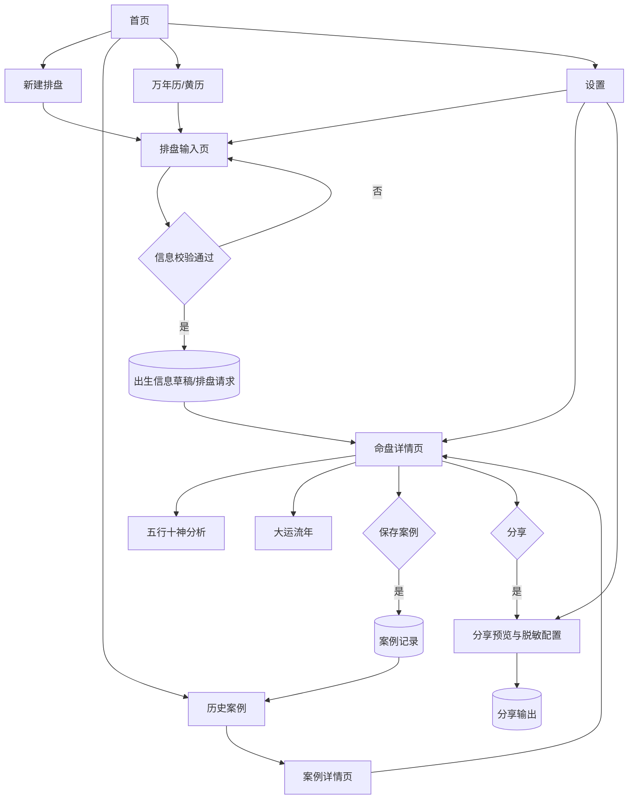

# 命轨全量树 README

## Executive Summary

本 README 将“命轨”定义为一份面向产品评审与需求确认的**功能地图**，而不是实现设计书；组织方式借鉴 QuantPilot 全量树的地图式写法：先说明使用边界，再按根模块展开能力，最后收束到字段、实体、依赖、优先级、验收与交付物，但本文件把对象从“源文件/代码路径”切换为“功能模块/页面/视图/数据实体/测试验收项”。范围以本对话已确认边界为准：**只做功能方案、不谈具体实现、不含任何付费功能**；第一版聚焦八字排盘、命盘详情、五行十神分析、大运流年、案例管理、分享、万年历/黄历、设置与术语解释。参考的 QuantPilot 文档本身就是一份全量树式“地图”，其随附 README 也明确它位于整体文档索引体系内。fileciteturn0file0fileciteturn0file1

## 使用说明与边界

### 本文档回答什么

| 问题 | 在本文如何回答 |
|---|---|
| 命轨 V1 到底包含哪些功能 | 看“全量树总览”与“模块全量树” |
| 某个功能归属哪个页面/模块 | 看对应模块的“页面/视图”与“子功能” |
| 每个模块要收哪些字段 | 看“关键模块字段表” |
| 页面之间、数据之间如何流转 | 看“数据实体、流程与优先级”中的依赖表和 mermaid 图 |
| 哪些先做、哪些后做 | 看优先级标签与优先级矩阵 |
| 如何判定功能达到可评审状态 | 看“验收标准与交付物” |
| 本文不回答什么 | 不回答技术栈、算法细节、数据库设计、接口设计、部署方案 |

### 未指定项与当前假设

| 项目 | 当前状态 | 本文口径 |
|---|---|---|
| 平台 | 未指定 | **假设**为 Web + Mobile responsive |
| 用户身份与登录 | 未指定 | **假设**同时支持匿名保存与账号保存两种路径，但均标记为“未指定待确认” |
| 数据存储方式 | 未指定 | 仅定义“业务实体”和“保存行为”，不定义介质 |
| 导出格式 | 未指定 | 仅定义“可分享/可导出”为能力，不限定具体文件格式 |
| 默认语言 | 未指定 | 本 README 以中文撰写，界面语言策略留待确认 |
| 多角色协作 | 未指定 | 默认按单用户使用场景设计，团队协作不纳入 V1 |
| 云同步 | 未指定 | 不作为 P0 前提 |
| 法域与合规策略 | 未指定 | 先按“最小必要信息、默认脱敏、避免高风险断言”设计 |

### 范围内与范围外

**范围内**

- 八字排盘
- 四柱、十神、藏干、纳音、空亡等核心命盘信息
- 五行十神分析
- 合冲刑害关系提示
- 大运、流年，视情况纳入流月
- 案例保存、备注、标签、历史查看
- 分享预览与脱敏分享
- 万年历/黄历基础工具
- 设置与术语解释

**范围外**

- 会员、订阅、订单、支付、分销、付费报告
- 命理师入驻、咨询撮合、课程、商城
- 社区、帖子流、评论体系
- 紫微斗数、奇门遁甲、六爻、姓名学、风水罗盘
- AI 自动长篇断语或自动咨询式问答
- 合婚深度系统、择日高级系统、出生时间校正高级工具

### 维护口径

1. **功能范围变更必须同步本全量树**。  
2. **树结构跟产品结构走，不跟实现结构走**。  
3. **每个 P0 功能必须能落到页面/字段/实体/验收条件**。  
4. **未指定项保持“未指定”状态，不自行升级为硬需求**。  
5. **可选能力必须明确默认开关与优先级，不混入 P0**。  
6. **隐私高风险字段必须在模块节点中显式标注**。  

### 研究报告纳入状态

| 来源 | 当前处理 | 对本全量树的影响 |
|---|---|---|
| `markdown/reserch/命轨 Fate-Track V1 产品需求与八字算法规格研究报告.md` | 已作为中文源报告纳入 | 强化“规则透明、时间可追溯、结果可复核”的 V1 定位 |
| `markdown/reserch/Fate-Track V1 Design Report.md` | 已生成中文译文并登记治理台账 | 补充命盘工作台、前端 IA、安全解释和目标架构 |
| `markdown/reserch/Fate-Track V1 Product Spec and Engineering Plan.md` | 已生成中文译文并登记治理台账 | 补充目标 API、隐私安全、错误模型和验证计划 |

研究报告中的目标功能不直接等于已支持能力；是否 supported 仍以 Rust 后端、API、测试和 capability 声明为准。

### 开发里程碑状态

| 路线图文件 | 当前作用 |
|---|---|
| `markdown/20-roadmap/00-roadmap-index.md` | 从 M0 到 M9 的开发顺序和不变量 |
| `markdown/20-roadmap/90-decision-gates.md` | 未决问题和代码实现前必须关闭的决策门 |
| `markdown/20-roadmap/91-anti-regression-and-governance-lock.md` | 防回退、防治理脱钩和 supported 误标规则 |
| `markdown/20-roadmap/92-risk-register.md` | S0/P1/P2 风险台账 |
| `markdown/20-roadmap/93-capability-promotion-ledger.md` | 能力晋级 supported 的证据清单 |
| `markdown/20-roadmap/94-closeout-evidence-template.md` | 里程碑关闭证据模板 |
| `markdown/20-roadmap/95-recursive-development-protocol.md` | 递归式开发函数、游标字段和暂停条件 |
| `markdown/20-roadmap/96-recursive-cursor.md` | 当前递归游标，记录允许/禁止范围和下一步 |
| `markdown/20-roadmap/97-loop-closeout-log.md` | 每轮递归返回值和恢复依据 |
| `markdown/20-roadmap/25-milestone-08-preflight.md` | M8 release validation 预检 |
| `markdown/20-roadmap/26-milestone-08-closeout.md` | M8 release candidate 关闭证据 |
| `markdown/20-roadmap/27-milestone-09-preflight.md` | M9 星历升级预检与并行引擎策略 |
| `markdown/20-roadmap/35-milestone-09-replay-policy-dry-run.md` | M9 replay policy dry-run 证据 |
| `markdown/20-roadmap/36-milestone-09-pre-closeout-audit.md` | M9 full closeout blocked / preflight ready 审计证据 |
| `markdown/20-roadmap/37-milestone-09-generated-data-implementation-plan.md` | M9 generated-data implementation planning 证据 |
| `markdown/20-roadmap/38-milestone-09-generator-contract.md` | M9 generator contract 证据 |
| `markdown/20-roadmap/39-milestone-09-source-adapter-contract.md` | M9 source adapter contract 证据 |
| `markdown/20-roadmap/40-milestone-09-artifact-writer-dry-run.md` | M9 artifact writer dry-run 证据 |
| `markdown/20-roadmap/41-milestone-09-comparison-runner-dry-run.md` | M9 comparison runner dry-run 证据 |
| `markdown/20-roadmap/42-milestone-09-golden-row-readiness.md` | M9 golden-row materialization readiness 证据 |
| `markdown/20-roadmap/43-milestone-09-replay-test-readiness.md` | M9 replay-test materialization readiness 证据 |
| `markdown/20-roadmap/44-milestone-09-preflight-closeout.md` | M9 preflight-only closeout 证据 |
| `markdown/20-roadmap/45-milestone-10-generated-astronomy-implementation.md` | M10 generated astronomy implementation 里程碑 |
| `markdown/20-roadmap/46-milestone-10-generator-entry.md` | M10 guarded generator implementation entry 证据 |
| `markdown/20-roadmap/47-milestone-10-source-snapshot-boundary.md` | M10 source snapshot manifest boundary 证据 |
| `markdown/20-roadmap/48-milestone-10-source-snapshot-manifest.md` | M10 source snapshot manifest metadata 证据 |
| `markdown/20-roadmap/49-milestone-10-source-payload-policy.md` | M10 source payload materialization policy 证据 |
| `markdown/20-roadmap/50-milestone-10-source-payload-schemas.md` | M10 per-source payload schema-only 证据 |
| `markdown/20-roadmap/51-milestone-10-source-capture-procedure.md` | M10 source capture procedure-only 证据 |
| `markdown/20-roadmap/52-milestone-10-first-source-payload-decision.md` | M10 first source payload materialization decision-only 证据 |
| `markdown/20-roadmap/53-milestone-10-selected-source-payload-preflight.md` | M10 selected-source payload materialization preflight-only 证据 |
| `markdown/20-roadmap/54-milestone-10-selected-source-payload-materialization.md` | M10 selected-source payload materialization 证据 |
| `markdown/20-roadmap/55-milestone-10-remaining-source-payload-strategy.md` | M10 remaining source payload strategy-decision-only 证据 |
| `markdown/20-roadmap/56-milestone-10-selected-iau-sofa-payload-preflight.md` | M10 selected IAU SOFA payload materialization preflight-only 证据 |
| `markdown/20-roadmap/57-milestone-10-selected-iau-sofa-payload-materialization.md` | M10 selected IAU SOFA payload materialization 证据 |
| `markdown/20-roadmap/58-milestone-10-post-iau-remaining-source-payload-strategy.md` | M10 post-IAU remaining source payload strategy-decision-only 证据 |
| `markdown/20-roadmap/59-milestone-10-selected-jpl-horizons-payload-preflight.md` | M10 selected JPL Horizons payload materialization preflight-only 证据 |
| `markdown/20-roadmap/60-milestone-10-selected-jpl-horizons-payload-materialization.md` | M10 selected JPL Horizons validation-query snapshot boundary payload materialization 证据 |
| `markdown/20-roadmap/61-milestone-10-selected-gb-t-payload-preflight.md` | M10 selected GB/T 33661 rule-reference payload materialization preflight-only 证据 |
| `markdown/20-roadmap/62-milestone-10-selected-gb-t-payload-materialization.md` | M10 selected GB/T 33661 rule-reference boundary payload materialization 证据 |
| `docs/release/v1-release-candidate.md` | V1 release candidate 能力冻结、验证命令和降级规则 |
| `docs/decisions/0015-m9-astronomy-parallel-strategy.md` | DG-008 并行优先、替换后置的星历升级决策 |
| `docs/decisions/0016-m9-astronomy-source-stack.md` | M9 星历源栈决策 |
| `docs/decisions/0017-m9-generated-data-implementation-path.md` | M9 generated-data 后续实现路径决策 |

落实代码前必须先选择对应里程碑；里程碑关闭前必须同步 capability 状态、模块树、工程树和 closeout 证据。

递归游标处于 `design_only` 时，只能优化流程和治理文档，不得推进业务代码、API 行为、前端功能或能力晋级。

当前 M8 口径：`release-candidate` 是治理/交付能力，表示 V1 已冻结当前 supported/restricted/planned 边界；它不新增后端业务 API，也不把大运、星历、真太阳时、云同步或持久分享升级为 supported。

当前 M9 口径：星历升级 preflight 已通过 LOOP-037 关闭为 preflight-only 里程碑，并通过 ADR 0015 选择“并行优先、替换后置”；ADR 0016 选择 GB/T 33661、JPL Horizons、IAU SOFA、NAIF CSPICE/SPICE 作为源栈；ADR 0017 选择继续 generated-data planning；`astronomy-engine` 仍是 target，source policy、schema/template、comparison/golden/replay dry-run、pre-closeout audit、implementation plan、generator/source adapter contract、artifact/comparison runner dry-run、golden-row readiness、replay-test readiness 和 preflight closeout decision 不能被当作已生成黄金表或已支持真太阳时、时区历史、扩展日期范围的证据。真实生成数据实施转入 M10。

当前 M10 口径：`tools/generate-astronomy-tables.ps1 -PrepareImplementation` 已提供 guarded non-dry-run entry shape，但它仍然阻断生成：source snapshot manifest 缺失、无 artifact 写入、hashes=0、manifest acceptance 不变、runtime 不变、`astronomy-engine` 不晋级。

当前 M10 source snapshot 口径：source snapshot manifest schema/plan 已定义，且 `data/generated/astronomy/source-snapshots/source-snapshot-manifest.json` 已作为 metadata-only 清单存在；NAIF CSPICE、IAU SOFA、JPL Horizons 和 GB/T 只有 source-boundary payload/hash 已物化，不是已生成天文数据、运行时 routine、在线 JPL 查询、已复制标准正文或默认替换证据。

当前 M10 source payload 口径：`source-payload-materialization-policy.json` 已记录 selected-source-only 物化状态；`naif-cspice-kernel-boundary.json`、`iau-sofa-routine-version.json`、`jpl-horizons-validation-samples.json` 和 `gb-t-33661-2017-rule-reference.json` 是已存在的四个 source-boundary payload。JPL payload 不含 response body，GB/T payload 不复制标准正文且不实现历法算法；generated artifact、generated artifact hash、manifest acceptance、运行时能力变化和 `astronomy-engine` 晋级仍不存在。

当前 M10 source payload schema 口径：`data/generated/astronomy/source-payload-schemas/*.schema.json` 已定义 GB/T、JPL Horizons、IAU SOFA、NAIF CSPICE 四类未来 payload 的 schema-only 形状；这些 schema 不是 payload 文件、source hash、generated artifact、runtime integration 或 `astronomy-engine` 晋级证据。

当前 M10 source capture 口径：`data/generated/astronomy/source-capture-procedure.json` 已记录 `naif-cspice`、`iau-sofa-ansi-c`、`jpl-horizons-api` 和 `gb-t-33661-2017` source-boundary payload 完成和 hash。它不是 external full-gate call、JPL response-body capture、GB/T 标准正文复制、generated artifact、runtime integration 或 `astronomy-engine` 晋级证据。

当前 M10 first source payload decision 口径：`data/generated/astronomy/source-payload-materialization-decision.json` 仅选择 `naif-cspice` 作为首个单源 payload 候选；payload 目录和选中 payload 文件仍不存在，source hash、external full-gate call、generated artifact、runtime integration 和 `astronomy-engine` 晋级证据仍不存在。

当前 M10 selected source payload preflight 口径：`data/generated/astronomy/selected-source-payload-materialization-preflight.json` 是 LOOP-045 的 preflight-only 历史证据；它本身不证明 payload 存在，但 LOOP-046 已通过独立 materialization evidence 关闭该预检。

当前 M10 selected source payload materialization 口径：`data/generated/astronomy/selected-source-payload-materialization.json` 和 `source-snapshots/payloads/naif-cspice-kernel-boundary.json` 只证明一个 `naif-cspice` source-boundary payload 与 source hash 已物化；它不是 SPICE kernel、CSPICE toolkit、generated astronomy artifact、accepted manifest、runtime integration、Android baseline replacement 或 `astronomy-engine` supported 证据。

当前 M10 remaining source payload strategy 口径：`data/generated/astronomy/remaining-source-payload-strategy.json` 只决定剩余源顺序：下一候选为 `iau-sofa-ansi-c` preflight-only，之后是 JPL Horizons，再之后是 GB/T。它不写第二个 payload、不计算新 source hash、不调用外网、不生成 artifact、不接受 manifest、不改变 runtime，也不晋级 `astronomy-engine`。

当前 M10 selected IAU SOFA payload preflight 口径：`data/generated/astronomy/selected-iau-sofa-payload-materialization-preflight.json` 只把下一轮范围收束到 `iau-sofa-ansi-c` local routine/version boundary payload；LOOP-048 内 `iau-sofa-routine-version.json` 仍不存在，不计算新 source hash，不调用外网，不生成 artifact，不接受 manifest，不改变 runtime，也不晋级 `astronomy-engine`。

当前 M10 selected IAU SOFA payload materialization 口径：`data/generated/astronomy/selected-iau-sofa-payload-materialization.json` 和 `source-snapshots/payloads/iau-sofa-routine-version.json` 只证明一个 `iau-sofa-ansi-c` routine/version boundary payload 与 source hash 已物化；它不是 SOFA source vendoring、routine compilation/linking、runtime integration、generated astronomy artifact、accepted manifest、Android baseline replacement 或 `astronomy-engine` supported 证据。

当前 M10 post-IAU remaining source payload strategy 口径：`data/generated/astronomy/post-iau-remaining-source-payload-strategy.json` 只决定 IAU 之后的剩余源顺序：下一候选为 `jpl-horizons-api` selected-source-only preflight，之后是 GB/T。它不写 JPL/GB payload、不计算新 source hash、不调用外网、不生成 artifact、不接受 manifest、不改变 runtime，也不晋级 `astronomy-engine`。

当前 M10 selected JPL Horizons payload preflight 口径：`data/generated/astronomy/selected-jpl-horizons-payload-materialization-preflight.json` 只把下一轮范围收束到 `jpl-horizons-api` validation-query snapshot payload；LOOP-051 内 JPL payload 仍不存在，不执行 full-gate 在线 JPL query，不计算新 source hash，不生成 artifact，不接受 manifest，不改变 runtime，也不晋级 `astronomy-engine`。

当前 M10 selected JPL Horizons payload materialization 口径：`data/generated/astronomy/selected-jpl-horizons-payload-materialization.json` 和 `data/generated/astronomy/source-snapshots/payloads/jpl-horizons-validation-samples.json` 只记录离线 validation-query 参数快照边界和 sha256 `acddbee906bd4540795993a828b9308af5ab964c002739929e44e28249b444f9`；不包含 JPL response body，不执行 full-gate 在线 JPL query，不生成 artifact，不接受 manifest，不改变 runtime，不替换 Android 基线，也不晋级 `astronomy-engine`。

当前 M10 selected GB/T payload materialization 口径：`data/generated/astronomy/selected-gb-t-payload-materialization.json` 和 `data/generated/astronomy/source-snapshots/payloads/gb-t-33661-2017-rule-reference.json` 只记录 GB/T 33661-2017 rule-reference boundary 和 sha256 `7145ecb921d55580eac71d266b31f961b1b9e497cda805c942647737aa764f31`；不复制标准正文，不实现历法算法，不生成 artifact，不接受 manifest，不改变 runtime，不替换 Android 基线，也不晋级 `astronomy-engine`。

### 节点标注规范

- `P0`：第一版必须具备  
- `P1`：第一版建议具备  
- `P2`：后续迭代  
- `必做`：当前范围内必须交付  
- `可选`：可开关、可折叠、可后置  
- `默认开` / `默认关` / `跟随设置`：展示或功能开关口径  
- `隐私高` / `隐私中` / `隐私低`：对个人信息敏感度的业务分级  

## 全量树总览

| 根模块 | 一句话职责 | 核心页面/视图 | 主要实体 | 优先级 |
|---|---|---|---|---|
| 产品入口与导航 | 提供首页、入口聚合与跨模块跳转 | 首页、历史案例入口、工具入口、设置入口 | 页面导航态 | P0 |
| 排盘输入 | 录入出生信息并生成排盘请求 | 新建排盘页 | 出生信息草稿、排盘请求 | P0 |
| 命盘详情 | 统一承载命盘展示与基础关系分析 | 命盘详情页、命盘总览 Tab | 命盘结果 | P0 |
| 五行十神分析 | 输出结构化命理分析摘要 | 分析 Tab、关系卡片 | 分析快照 | P0 |
| 大运流年 | 提供时间维度推演与当前运势节点 | 运势 Tab | 大运/流年快照 | P0 |
| 案例管理 | 保存、查看、组织命盘案例 | 历史案例页、案例详情页 | 案例记录、标签、备注 | P0 |
| 分享 | 输出可脱敏的分享视图 | 分享预览页 | 分享预设、分享卡片 | P1 |
| 万年历与黄历 | 提供公农历、干支、节气查询 | 万年历/黄历页 | 日期查询记录 | P0 |
| 设置 | 管理展示、分析、隐私默认值 | 设置页 | 用户偏好 | P0 |
| 术语解释 | 解释术语并提供跨模块帮助 | 术语页、悬浮解释 | 术语词条 | P0 |

## 模块全量树

本节中所有与历法、时辰、八字相关的模块，统一采用香港天文台对**天干地支、八字、时辰、二十四节气、闰月**的解释口径：十天干与十二地支组合成六十干支循环；年月日时的干支合成“八字”；二十四节气由十二中气与十二节气构成，黄道被均分为二十四段，每段相差黄经十五度；农历规定每月必须包含一个中气，无中气的月份为前一个月的闰月。关于“五行”，本文采用权威百科对 **wuxing** 作为“五相/五种变化关系”的解释，再在产品内约束为结构化分析维度，而不是物理元素概念。citeturn16view1turn16view0turn15view0

### 产品入口与导航

**职责**：承载首页入口、跨模块跳转与最近使用路径。  
**关键数据流**：首页动作 → 新建排盘 / 历史案例 / 万年历 / 设置。  
**主要边界**：不承载排盘规则，不承载分析结论。

- 页面/视图
  - 首页 `[P0][必做][默认开]`
    - 新建排盘入口
    - 历史案例入口
    - 万年历/黄历入口
    - 设置入口
  - 最近访问入口 `[P1][可选][默认开]`
  - 空状态页 `[P0][必做]`
- 子功能
  - 首页快捷入口 `[P0]`
  - 最近查看案例回流 `[P1]`
  - 从万年历跳转新建排盘 `[P0]`
  - 从案例列表返回命盘详情 `[P0]`
- 输入字段
  - 最近访问模块标记
  - 最近查看案例 ID
  - 首页快捷操作项
- 输出项
  - 页面跳转动作
  - 最近访问上下文
- 用户交互点
  - 点击功能入口
  - 点击最近访问
  - 空状态引导按钮
- 配置开关
  - 是否展示最近访问 `[P1][跟随设置]`
  - 是否展示工具卡片 `[P1][跟随设置]`
- 数据实体与字段
  - `NavigationState`：当前入口、最近入口、回跳来源
- 依赖关系
  - 依赖设置模块提供默认首页布局
  - 下游连接全部业务模块
- 优先级与可选性
  - 首页四入口必须为 P0
  - 最近访问可后置
- 隐私影响说明
  - 模块本身隐私低，但会暴露最近查看行为
- 术语说明链接
  - [术语口径](#glossary)

### 排盘输入

**职责**：采集出生信息并发起排盘。  
**关键数据流**：出生信息录入 → 信息校验 → 排盘请求 → 命盘详情。  
**主要边界**：只定义需要采集的业务字段与校验结果，不定义具体计算实现。

- 页面/视图
  - 新建排盘页 `[P0][必做][默认开]`
  - 输入校验提示层 `[P0][必做]`
  - 草稿恢复提示 `[P1][可选]`
- 子功能
  - 阳历/农历输入切换 `[P0][必做]`
  - 闰月选择 `[P0][必做]`
  - 出生日期选择 `[P0][必做]`
  - 出生时间选择 `[P0][必做]`
  - 性别选择 `[P0][必做]`
  - 出生地录入 `[P1][可选]`
  - 真太阳时开关 `[P1][可选][默认关]`
  - 时辰未知模式 `[P1][可选]`
  - 备注与标签预填 `[P1][可选]`
  - 从万年历带入日期 `[P1][可选]`
- 输入字段
  - 姓名/代号
  - 性别
  - 历法类型
  - 出生日期
  - 闰月标记
  - 出生时间
  - 时间精度
  - 出生地
  - 真太阳时开关
  - 备注
  - 标签
- 输出项
  - 标准化出生信息
  - 排盘请求摘要
  - 输入校验结果
- 用户交互点
  - 日历选择器
  - 时间选择器
  - 历法切换
  - 闰月切换
  - 一键生成命盘
  - 重置表单
- 配置开关
  - 默认历法 `[P0][跟随设置]`
  - 默认真太阳时 `[P1][跟随设置]`
  - 是否显示专业字段 `[P1][跟随设置]`
- 数据实体与字段
  - `ChartDraft`：草稿标题、出生信息、来源入口、最近编辑时间
  - `BirthProfile`：历法类型、出生时间、地点、性别、备注
  - `ChartRequest`：标准化出生信息、展示模式、开关集合
- 依赖关系
  - 上游依赖设置模块提供默认值
  - 下游依赖命盘详情承接结果
  - 历法规则依赖二十四节气、干支与时辰口径
- 优先级与可选性
  - 基础录入与生成命盘是 P0
  - 真太阳时、出生地、时辰未知是 P1
- 隐私影响说明
  - 出生日期、出生时刻、出生地均属高敏信息，整体为**隐私高**
- 验收关注
  - 缺失必填字段时不能进入命盘详情
  - 农历 + 闰月场景必须可录入
- 术语说明链接
  - [术语口径](#glossary)

### 命盘详情

**职责**：统一展示排盘结果、基础命盘信息与关系摘要。  
**关键数据流**：命盘请求 → 四柱结果 → 命盘总览 → 细分分析/运势/记录。  
**主要边界**：命盘详情负责“呈现与组织”，不替代深入专项分析。

- 页面/视图
  - 命盘详情页 `[P0][必做]`
    - 命盘总览 Tab `[P0]`
    - 分析 Tab `[P0]`
    - 运势 Tab `[P0]`
    - 记录 Tab `[P0]`
    - 神煞 Tab `[P1][可选][默认折叠]`
- 子功能
  - 基础信息摘要 `[P0][必做]`
  - 四柱展示 `[P0][必做]`
  - 天干地支展示 `[P0][必做]`
  - 藏干展示 `[P0][必做]`
  - 十神映射展示 `[P0][必做]`
  - 纳音展示 `[P1][可选][默认开]`
  - 空亡展示 `[P1][可选][默认开]`
  - 合冲刑害摘要 `[P0][必做]`
  - 神煞汇总 `[P1][可选][默认关]`
  - 十二长生 `[P1][可选][默认关]`
  - 胎元 / 命宫 / 身宫 `[P2][可选]`
- 输入字段
  - 命盘结果
  - 展示模式
  - 开关状态
- 输出项
  - 命盘卡片
  - 关系摘要
  - 可保存的命盘视图
- 用户交互点
  - Tab 切换
  - 展开/折叠某柱细节
  - 点击术语查看解释
  - 跳转分享/保存
- 配置开关
  - 显示纳音
  - 显示空亡
  - 显示神煞
  - 显示十二长生
- 数据实体与字段
  - `BaziChart`：四柱、藏干、十神、纳音、空亡、生肖、节气节点
  - `ChartViewState`：当前 Tab、展开状态、术语高亮状态
- 依赖关系
  - 上游依赖排盘输入
  - 下游连接五行十神、大运流年、案例管理、分享
- 优先级与可选性
  - 命盘总览与关系摘要是 P0
  - 神煞与长生是 P1
  - 胎元/命宫/身宫是 P2
- 隐私影响说明
  - 继承出生信息高敏属性，整体为**隐私高**
- 验收关注
  - 命盘总览必须在一个页面内完整展示四柱核心信息
  - 命盘详情必须可回流到保存和分享入口
- 术语说明链接
  - [术语口径](#glossary)

### 五行十神分析

**职责**：把命盘结果转为结构化分析视图。  
**关键数据流**：命盘结果 → 五行统计 / 十神分布 → 日主与关系摘要。  
**主要边界**：提供**结构化分析**，不提供“绝对断语”和长篇自动咨询。

- 页面/视图
  - 分析 Tab `[P0][必做]`
  - 关系卡片区 `[P0][必做]`
  - 专项分析区 `[P2][可选]`
  - 四专项结构信号摘要区 `[Post-preview][restricted]`
  - 四专项完整报告页 `[Post-preview][restricted]`
- 子功能
  - 五行数量统计 `[P0][必做]`
  - 天干五行统计 `[P0][必做]`
  - 地支五行统计 `[P0][必做]`
  - 藏干五行统计 `[P0][必做]`
  - 十神分布 `[P0][必做]`
  - 日主分析 `[P0][必做]`
  - 身强弱倾向 `[P0][必做]`
  - 格局参考 `[P1][可选]`
  - 喜用/忌神倾向 `[P1][可选]`
  - 性格/事业/财运/感情/健康/学业专项卡 `[P2][可选]`
  - 情感、金钱、家庭、事业四专项结构信号 `[Post-preview][restricted]`
  - 情感、金钱、家庭、事业四专项完整报告 `[Post-preview][restricted]`
- 输入字段
  - 四柱结果
  - 藏干结果
  - 月令信息
  - 关系标签
- 输出项
  - 五行分布摘要
  - 十神摘要
  - 日主结论卡
  - 结构参考卡
  - 四专项结构信号摘要
  - 四专项完整报告章节
- 用户交互点
  - 点击某五行查看来源
  - 点击某十神查看解释
  - 展开“为何如此判断”
  - 点击四专项按钮查看结构信号
  - 点击“查看专项报告”进入当前选中专题的完整报告页
- 配置开关
  - 简洁模式 / 专业模式 `[P0]`
  - 是否显示格局参考 `[P1]`
  - 是否显示专项分析 `[P2]`
- 数据实体与字段
  - `AnalysisSnapshot`：五行分布、十神分布、日主摘要、关系标记、结构性结论
- 依赖关系
  - 上游依赖命盘详情提供基础结果
  - 下游供分享、案例保存引用分析摘要
- 优先级与可选性
  - 五行、十神、日主是 P0
  - 格局、喜用忌、专项分析分层后置
- 隐私影响说明
  - 继承命盘高敏属性；分析文本本身为**隐私中**
- 验收关注
  - 必须能看见五行与十神的来源与数量分布
  - 分析输出应是结构化摘要，而非无法核对的抽象结论
- 术语说明链接
  - [术语口径](#glossary)

### 大运流年

**职责**：提供命盘的时间维度推演视图。  
**当前实现口径**：M13 已支持 `luck-cycles` raw 大运排盘，只返回顺逆、起运和大运列表；M36 已支持主盘大运解释，用户显式传入 `reading_year` 后，可在主盘报告和工作台短摘要中查看当年落入的大运阶段、结构信号和自然解释；M37 已支持显式年份引动解释，用户显式传入 `year` 后，可在主盘报告中查看年柱与原局、当前大运的结构关系；M38 已支持四专项大运流年叠加，用户显式传入 `topic` 和 `year` 后，可在完整专项报告中查看共享 timeline 信号经专题 lens 过滤后的章节；M39 已支持主盘/专项报告页时间解释导航、显式年份控件、可展开证据和工作台短摘要；M40 已完成质量门禁收口，覆盖 golden samples、禁用词、no-score、no-overclaim、bounded-output、browser samples 和治理同步；LOOP-105 已完成前端质量修正，重新起盘会清空旧专项栏，报告页可见内部英文标识转为中文；LOOP-106 已完成 timeline 词典文案质量门禁；LOOP-107 已完成大规模 timeline 词典优化，词典扩展到 28 个组合式条目并加严自然中文、解释密度和内部标识门禁；LOOP-108 已完成报告级强约束，主盘报告与四专项完整报告最终 API 正文统一纳入可见文案门禁；LOOP-109 已完成情感报告单切面叙事打磨，情感完整报告正文固定为六块，并将专题时间叠加合入“年度情感引动”；LOOP-110 已完成 M42 情感真实输出文案门禁，按实际样本压下标记、筛选、提取、等号计数和潜在英文口吻；LOOP-111 已完成 M43 剩余报告真实输出文案门禁，主盘、情感、金钱、家庭、事业五份 assembled report 样本均为 0 禁用命中、0 ASCII word；LOOP-112 已完成 M44 情感真实输出二次门禁，消除固定开头复读，并要求 `被"冲"牵动`、`形成"六冲"` 这类术语引号化表达；LOOP-113 已完成 M45 五份真实报告系统口吻清理，压下 `当前算法`、`系统给出`、`综合评分`、`相关信号共`、`未见明显显性信号` 和大运标签粘连；LOOP-114 已完成 M46 五份真实报告清单口吻叙事化，压下 `盘中可用的时间线索`、`关键牵动是`、`出现 4 处`、`这张命盘里的` 和 `结构上被点亮`；LOOP-115 已完成 M47 情感报告黄金样例基线，情感伴侣星、表达和安全感摘要不再露出 `不作主线` / `有一处落点` 等计数字段；LOOP-116 已完成 M48 三专项计数字段叙事基线，金钱、家庭、事业十神摘要不再露出 `不作主线` / `有一处落点` / `参与这组结构` 等中间层字段；LOOP-117 已完成 M49 年度/大运流年叙事基线，主盘年度引动与三专项大运流年不再露出 `主要牵动如下` / `盘面上先看这几股牵动` / 项目符号证据；LOOP-118 已完成 M50 三专项解盘凝聚，金钱、家庭、事业不再露出 `日常读法` / `日常看` / `这些牵动提醒您` 等说明书口吻，并以总断、专题入口和关键词结论收束；LOOP-119 已完成 M51 主盘报告语气凝聚；LOOP-120 已完成 M52 报告收束连续性，主盘旧列表/排序口吻继续压实，金钱、家庭、事业的大运流年置于结论前并以专题结论收尾；LOOP-121 已完成 M53 报告密度与专题化，主盘五行解释改为分组读法，金钱、家庭、事业时间段改成 `落到2026年` 的专题建议；LOOP-122 已完成 M54 时间细节叙事暖化，主盘年度引动和三专项大运流年改成年度节奏读法；LOOP-123 已完成 M55 当前大运口径一致与年度段落拆解，topic-report 使用真实起运上下文，并按选定年份取当前大运；LOOP-124 已完成 M56 报告结论去复读与切面个性化，情感结论压缩复述，金钱、家庭、事业结论改成贴题收束；LOOP-125 已完成 M57 时间线正文去舞台化，主盘年度引动和三专项大运流年压下教学式舞台口吻；LOOP-126 已完成 M58 主盘长段压缩，主盘 `十神关系`、`大运走势`、`年度引动` 保留 trace/evidence 但可见正文压成读盘摘要。M29-M58/LOOP-126 均不等于完整流年/流月系统。
**M53-M61 补充口径**：主盘报告已完成语气凝聚、收束连续性、五行解释密度收束和长段压缩，命盘结构、十神摘要、大运说明与年度引动不再以说明书式桥接、十神计数、逐条小词典、专业/白话双层堆叠、优先级列表、僵硬年份句式或逐项重复弱项解释呈现；金钱、家庭、事业报告必须保持大运流年章节在 `结论` 前，最终可见章节为专题结论，专题时间段必须保持直接读 2026 年专题节奏，中段必须把十神翻译成金钱、家庭、事业自己的读盘语境，不得回到术语教材、标签冒号或 `从「...」专项来看` / `十神与五行这一层` 等层级说明；2025/2026 早年样本必须按年龄语境保护，不得按成人恋爱、收入、投资、岗位或职业结果呈现；M29-M61/LOOP-129 均不等于完整流年/流月系统。
**M34-M40 规划口径**：DG-012 已由 ADR 0022 关闭；M35 已完成内部组合式 timeline foundation；M36 已完成主盘大运解释；M37 已完成显式年份引动解释；M38 已完成四专项时间叠加；M39 已完成 UI/readability；M40 已完成质量门禁收口。
**关键数据流**：命盘结果 + 性别 + 时间口径 → raw 大运；主盘解释层为 原局 + 当前大运 + 显式观察年/引动年 → timeline signals/evidence/readings；四专项叠加为 topic-report + explicit year → shared timeline evidence → topic lens → 专题时间正文；其中情感报告在 M41 后合入 `年度情感引动`，在 M42 后增加真实输出文案门禁，并在 M44 后要求非复读开头和合冲刑害术语引号化，在 M47 后把伴侣星、表达和安全感计数字段转成关系质感叙事；金钱/家庭/事业在 M43 后保留既有专题时间章节，在 M48 后把十神计数字段转成专题气质叙事，在 M49 后把专题年度证据清单改成连贯读盘顺序，在 M50 后把开场、专题入口、年度引动和结论改成更接近情感黄金样例的解盘凝聚结构，在 M52 后把专题时间章节前置到结论前并以专题结论收尾，在 M53 后把专题时间段进一步改成 `落到2026年` 的具体专题建议，在 M54 后把专题时间细节改成年度节奏读法，在 M55 后改用真实起运上下文和选定年份当前大运，在 M56 后结论改成贴题收束，在 M57 后专题大运流年压下 `年度本身先露出的` / `推到台前` / `不是罗列符号` 等教学式口吻，在 M59 后中段压下 `财星分正财和偏财` / `传统上会把` / `官杀代表责任` / `技能表达：` / `同辈边界：` 等术语教材口吻，在 M60 后专题大运流年压下 `从「...」专项来看` / `把2026年放进` / `十神与五行这一层` / `本段把它作为阶段背景参考` 等层级说明口吻，在 M61 后 2025/2026 早年样本改用情绪回应、资源感、稳定照护、学习任务、规则感和表达训练，不再按成人恋爱、收入、投资、岗位或职业结果呈现；主盘报告在 M51 后把教学式桥接、十神台账和年度引动旧句式改成直接读盘语气，在 M52 后继续压下列表/排序/泛化年份口吻，在 M53 后把五行解释合并为分组读法，在 M54 后把年度引动细节改成 `2026年靠近命盘时` 的年度节奏读法，在 M55 后把年度证据拆成十神/五行与藏干/原局/当前大运两段，在 M57 后把年度引动中的舞台化表达改成直接读盘口吻，在 M58 后把十神、大运、年度引动的可见长段压成摘要但保留 trace/evidence；五份真实报告在 M45 后统一压下算法、系统、评分、计数表口吻和大运标签粘连，在 M46 后进一步压下锚点清单、时间线统计和“出现几处”台账。
**主要边界**：以时间线和关系提示为主，不扩展为“运势社区”、每日推送、择日、流月/流日或事件预测系统。

- 页面/视图
  - 运势 Tab `[P0][必做]`
    - 大运列表区 `[P0]`
    - 流年列表区 `[P0]`
    - 当前节点高亮 `[P0]`
    - 流月区 `[P1][可选]`
- 子功能
  - 起运年龄/时间展示 `[P0][已实现 raw]`
  - 大运列表 `[P0][已实现 raw]`
  - 当前大运高亮 `[P0][M36 restricted]`
  - 主盘大运白话解释 `[P1][M36 restricted]`
  - 显式年份引动解释 `[P1][M37 restricted]`
  - 四专项大运流年叠加 `[P1][M38 restricted；relationship 在 M41 合入年度情感引动]`
  - 报告页时间解释导航与证据折叠 `[P1][M39 UI/readability]`
  - 时间解释质量门禁 `[治理][M40 closed]`
  - 流年列表 `[P1][planned，不等同完整流年系统]`
  - 当前流年高亮 `[P1][planned，需要显式 year 口径]`
  - 大运与原局关系提示 `[P1][M36 restricted]`
  - 流年与原局/大运关系提示 `[P1][M37 restricted annual-trigger only]`
  - 流月列表 `[P2][另开门禁]`
  - 事件时间线叠加 `[P2][可选]`
- 输入字段
  - 命盘结果
  - 性别
  - 查询年份
  - 查询模式
- 输出项
  - 大运时间线
  - 当前节点提示
  - timeline signals `[M35 internal foundation / M36 luck-reading / M37 annual-trigger / M38 topic-timeline]`
  - 主盘大运白话报告 `[M36 restricted]`
  - 显式年份引动报告 `[M37 restricted]`
  - 四专项时间叠加章节 `[M38 restricted；relationship 在 M41 作为年度情感引动正文]`
  - 显式年份控件与可展开证据 `[M39 UI/readability]`
  - forbidden/no-score/no-overclaim/bounded-output 质量门禁 `[M40 closed]`
- 用户交互点
  - 选择年份
  - 展开某步大运
  - 点击某流年查看关系摘要
  - 切换流年/流月
- 配置开关
  - 是否显示关系细节 `[P1][跟随设置]`
  - 是否显示流月 `[P2][需另开门禁]`
- 数据实体与字段
  - `LuckCycleSnapshot`：起运信息、大运列表、流年列表、当前节点、关系提示
  - `TimelineSignal` `[M35 internal foundation]`：信号类别、来源、主题适用性、风险标签
    - `TimelineEvidence` `[M35 internal foundation]`：原局、大运、显式年份、合冲刑害、十神/五行依据
    - `PlainReading` `[M35 internal foundation / M36 luck-reading / M37 annual-trigger / LOOP-107 dictionary gate / LOOP-108 report body gate / LOOP-109 relationship narrative gate / LOOP-110 relationship human-copy gate / LOOP-111 remaining-report human-copy gate / LOOP-112 relationship second-pass gate / LOOP-113 report system-tone gate / LOOP-114 report narrative-list gate / LOOP-115 relationship golden-sample gate / LOOP-116 topic count-field narrative gate / LOOP-117 annual timeline narrative gate / LOOP-118 topic advice-cohesion gate / LOOP-119 main-report tone-cohesion gate / LOOP-120 report closeout-continuity gate / LOOP-121 density-topic-specificity gate / LOOP-122 timeline-detail warmth gate / LOOP-123 current-luck consistency gate / LOOP-124 conclusion de-duplication / LOOP-125 timeline prose de-staging gate / LOOP-126 main long-section condensation gate]`：结构读法、日常落点、边界提醒；主盘大运报告、年度引动报告、专题叠加章节和 M39 证据折叠均已可见；情感报告在 M41 后只把 timeline 证据并入年度情感引动正文；生成文本和最终报告正文不得出现僵硬标签、泛化年份病句、`用户` 口吻、后端/前端说明、内部引擎名、public score 或机器化表达；LOOP-107 要求词典原文和生成读法同时保持足够解释密度，LOOP-108 要求主盘/四专项完整报告最终 API response 同步受检，LOOP-109 要求情感正文保持六块叙事结构，LOOP-110 要求情感真实输出不得出现标记/筛选/提取、等号计数或潜在英文口吻，LOOP-111 要求主盘、金钱、家庭、事业真实输出不得出现内部英文、pipe-form 证据、等号证据、半角年龄段或可见后端变量，LOOP-112 要求情感真实输出不得回到固定开头复读或裸露 `被冲牵动` 这类术语表达，LOOP-113 要求五份真实报告不得回到算法、系统、评分、计数表口吻或大运标签粘连，LOOP-114 要求五份真实报告不得回到锚点清单、时间线统计、`出现几处` 台账或双重模板冒号，LOOP-115 要求情感报告不得回到 `不作主线` / `有一处落点` 等计数字段，LOOP-116 要求金钱、家庭、事业不得回到 `不作主线` / `有一处落点` / `参与这组结构` / `这组结构说明` 等中间层字段，LOOP-117 要求主盘年度引动和专题大运流年不得回到 `主要牵动如下` / `盘面上先看这几股牵动` / 项目符号证据，LOOP-118 要求金钱、家庭、事业不得回到 `日常读法` / `日常看` / `这些牵动提醒您` / 说明书式重复提醒，LOOP-119 要求主盘报告不得回到 `这一章看的是` / `这一章先把` / `放到日常理解里` / `最适合当作` / `可以先这样理解` / 十神计数摘要，LOOP-120 要求主盘和专题正文不得回到 `基本脉络如下` / `第一优先` / `第二优先` / `原局引动主要看` / `先看这几层关系` / `不能只看流年` / `不必急着找事件结论` / `这一章只说明` / `时间气候可以按这个顺序读` / `当前资料可以按完整四柱合参` / `这一年`，并要求金钱、家庭、事业以专题结论收尾；LOOP-121 要求主盘五行解释不得回到 `偏弱表示这类倾向`，金钱、家庭、事业不得回到 `哪里需要放慢` / `哪里需要承接` / `读2026年这一层`；LOOP-122 要求主盘年度引动和三专项大运流年不得回到 `这一章会把` / `牵动会先落在这些位置` / `2026年的时间气候` / `先从这些层次落下去看` / `先看天干` / `再看五行关系`；LOOP-123 要求专题报告不得回到 `大运首段`、固定 `年龄段约为1至10岁` / `约在 1 至 10 岁`、`天干处先露出`、`月支这一处`、`日支这一处`，并保持选定年份当前大运口径和年度段落拆解；LOOP-124 要求情感结论不得回到长段复述，金钱、家庭、事业不得回到 `在这份金钱专项里` / `在这份家庭专项里` / `在这份事业专项里` / `表达与安全感则落在日常相处里` / `以目前资料来看，这份情感专项可以把重点放在` / `在同一张桌上慢慢理清`；LOOP-125 要求主盘年度引动和三专项大运流年不得回到 `年度本身先露出的` / `流年天干把十神主题推到台前` / `五行关系继续说明力量怎样靠近` / `不是罗列符号` / `推到台前` / `走到台前` / `拿到台前`；LOOP-126 要求主盘十神、大运和年度引动不得回到 `读这一章时` / `这条线已经进入命盘视野` / `这条十神线索` / `命理结构上，当前阶段大运` / 专业白话双层堆叠
- 依赖关系
  - 强依赖排盘结果与性别字段
  - 可选依赖案例时间线叠加
- 优先级与可选性
  - raw 大运和当前节点是 P0
  - 主盘大运解释是 M36 restricted P1；年度引动是 M37 restricted P1；四专项叠加是 M38 restricted P1；报告页时间解释导航是 M39 UI/readability P1；M40 仅为质量门禁 closeout；LOOP-108 仅为最终报告正文强约束 closeout；LOOP-109 仅为情感报告单切面叙事打磨 closeout；LOOP-110 仅为情感真实输出文案门禁 closeout；LOOP-111 仅为剩余报告真实输出文案门禁 closeout；LOOP-112 仅为情感真实输出二次文案门禁 closeout；LOOP-113 仅为五份真实报告系统口吻清理 closeout；LOOP-114 仅为五份真实报告清单口吻叙事化 closeout；LOOP-115 仅为情感报告黄金样例基线 closeout；LOOP-116 仅为三专项计数字段叙事基线 closeout；LOOP-117 仅为年度/大运流年叙事基线 closeout；LOOP-118 仅为三专项解盘凝聚 closeout；LOOP-119 仅为主盘报告语气凝聚 closeout；LOOP-120 仅为报告收束连续性 closeout；LOOP-121 仅为报告密度与专题化 closeout；LOOP-122 仅为时间细节叙事暖化 closeout；LOOP-123 仅为当前大运口径一致与年度段落拆解 closeout；LOOP-124 仅为报告结论去复读与切面个性化 closeout；LOOP-125 仅为时间线正文去舞台化 closeout；LOOP-126 仅为主盘长段压缩 closeout；LOOP-127 仅为三专项中段个性化 closeout；LOOP-128 仅为三专项大运流年读者口吻 closeout；LOOP-129 仅为早年年龄语境报告打磨 closeout
  - 流月、流日、择日和事件预测不在当前里程碑内
- 隐私影响说明
  - 继承命盘高敏属性；时间线叠加后隐私风险更高
- 验收关注
  - 同一命盘必须能稳定查看大运列表；年度解释必须使用显式年份口径
  - 年份切换不得破坏原局视图
  - 显式年份请求不得静默回退到当前年
  - `score_internal`、0-100 运势分、确定性成败断言不得进入公开报告
- 术语说明链接
  - [术语口径](#glossary)

### 案例管理

**职责**：沉淀命盘、备注、标签与后续验证材料。  
**关键数据流**：命盘详情 → 保存案例 → 历史案例列表 → 案例详情。  
**主要边界**：只做案例库，不做咨询工单、不做客户管理 CRM。

- 页面/视图
  - 历史案例页 `[P0][必做]`
  - 案例详情页 `[P0][必做]`
  - 案例编辑页 `[P1][可选]`
- 子功能
  - 保存案例 `[P0][必做]`
  - 查看历史案例 `[P0][必做]`
  - 标签管理 `[P0][必做]`
  - 备注管理 `[P0][必做]`
  - 最近查看 `[P1][可选]`
  - 收藏/置顶 `[P1][可选]`
  - 搜索与筛选 `[P1][可选]`
  - 事件时间线 `[P2][可选]`
  - 删除/归档 `[P1][可选]`
- 输入字段
  - 案例标题
  - 标签
  - 备注
  - 是否收藏
  - 隐私等级
- 输出项
  - 历史案例列表
  - 案例详情
  - 备注摘要
  - 标签聚类视图
- 用户交互点
  - 保存按钮
  - 编辑备注
  - 添加标签
  - 搜索案例
  - 筛选列表
- 配置开关
  - 列表默认排序 `[P1][跟随设置]`
  - 是否展示最近查看 `[P1][跟随设置]`
- 数据实体与字段
  - `CaseRecord`：案例标题、命盘引用、备注、标签、隐私级别、创建时间、更新时间
  - `CaseEvent`：事件时间、事件类型、描述、关联年份
- 依赖关系
  - 上游依赖命盘详情
  - 下游为分享、对照验证、历史回看提供来源
  - 保存模式受“身份与登录未指定”影响
- 优先级与可选性
  - 保存、历史、备注、标签是 P0
  - 搜索、收藏、删除归档是 P1
  - 时间线是 P2
- 隐私影响说明
  - 案例库集中持有高敏出生信息与个人备注，整体为**隐私高**
- 验收关注
  - 一个已生成命盘必须可保存为案例并再次打开
  - 标签与备注必须在重新查看时保持一致
- 术语说明链接
  - [术语口径](#glossary)

### 分享

**职责**：把命盘与分析转换成可控、可脱敏的分享视图。  
**关键数据流**：命盘/案例 → 分享预览 → 脱敏配置 → 输出分享结果。  
**主要边界**：不承担外部传播平台规则，不做公开社区帖文系统。

- 页面/视图
  - 分享预览页 `[P1][可选]`
  - 脱敏配置面板 `[P1][可选]`
- 子功能
  - 简洁版分享 `[P1][可选]`
  - 专业版分享 `[P1][可选]`
  - 匿名化处理 `[P1][可选]`
  - 隐藏出生地 `[P1][可选]`
  - 隐藏精确出生时间 `[P1][可选]`
  - 仅分享命盘 / 同时分享分析 `[P1][可选]`
  - 分享链接 `[P2][可选]`
- 输入字段
  - 分享类型
  - 分享范围
  - 匿名开关
  - 脱敏项
- 输出项
  - 分享预览
  - 分享卡片
  - 分享摘要
- 用户交互点
  - 勾选脱敏项
  - 切换简洁/专业
  - 复制/导出/发送
- 配置开关
  - 默认匿名分享 `[P1][跟随设置]`
  - 默认隐藏出生地 `[P1][跟随设置]`
  - 默认隐藏精确时间 `[P1][跟随设置]`
- 数据实体与字段
  - `SharePreset`：分享模式、脱敏规则、是否含分析
  - `ShareArtifact`：分享输出内容、标题、摘要
- 依赖关系
  - 上游依赖命盘详情或案例详情
  - 依赖设置模块提供默认隐私策略
- 优先级与可选性
  - 全部分享能力建议列为 P1
  - 分享链接放在 P2
- 隐私影响说明
  - 若默认不脱敏，风险极高；因此应按**隐私高**设计
- 验收关注
  - 分享前必须可预览最终展示内容
  - 脱敏项关闭后不得在分享结果中泄露原字段
- 术语说明链接
  - [术语口径](#glossary)

### 万年历与黄历

**职责**：提供服务排盘的基础日期工具。  
**关键数据流**：日期查询 → 公农历/干支/节气结果 → 跳转排盘。  
**主要边界**：优先服务排盘，不扩展成独立生活服务类黄历 App。

- 页面/视图
  - 万年历/黄历页 `[P0][必做]`
  - 查询结果区 `[P0][必做]`
- 子功能
  - 公历转农历 `[P0][必做]`
  - 农历转公历 `[P0][必做]`
  - 查询某日干支 `[P0][必做]`
  - 查询节气 `[P0][必做]`
  - 查询生肖 `[P1][可选]`
  - 查询宜忌 `[P2][可选]`
  - 从查询结果跳转新建排盘 `[P0][必做]`
- 输入字段
  - 查询日期
  - 历法类型
  - 是否显示节气
- 输出项
  - 公农历转换结果
  - 干支结果
  - 节气结果
  - 跳转排盘上下文
- 用户交互点
  - 选择日期
  - 切换历法
  - 点击“用于排盘”
- 配置开关
  - 默认显示节气 `[P0][跟随设置]`
  - 默认展示黄历扩展项 `[P2][跟随设置]`
- 数据实体与字段
  - `CalendarQuery`：查询日期、查询模式、结果摘要、最近查询时间
- 依赖关系
  - 与排盘输入共享历法口径
  - 可向新建排盘回填日期
- 优先级与可选性
  - 转换、干支、节气为 P0
  - 黄历宜忌为 P2
- 隐私影响说明
  - 单独使用时隐私低；与排盘联动时继承命盘隐私级别
- 验收关注
  - 查询结果必须能直接跳转到新建排盘
  - 公农历与节气结果必须在同一页收敛展示
- 术语说明链接
  - [术语口径](#glossary)

### 设置

**职责**：统一管理展示偏好、分析偏好与隐私默认值。  
**关键数据流**：设置值 → 影响排盘输入、命盘展示、分享与工具展示。  
**主要边界**：只定义业务开关，不涉及技术配置。

- 页面/视图
  - 设置页 `[P0][必做]`
- 子功能
  - 默认历法设置 `[P0][必做]`
  - 默认真太阳时 `[P1][可选]`
  - 简洁/专业模式 `[P0][必做]`
  - 是否显示藏干 `[P0][必做]`
  - 是否显示纳音 `[P1][可选]`
  - 是否显示空亡 `[P1][可选]`
  - 是否显示神煞 `[P1][可选]`
  - 是否显示十二长生 `[P1][可选]`
  - 分享隐私默认值 `[P1][可选]`
  - 术语解释方式 `[P0][必做]`
- 输入字段
  - 展示偏好
  - 分析偏好
  - 隐私偏好
- 输出项
  - 用户偏好集
  - 全局展示默认值
- 用户交互点
  - 开关切换
  - 模式切换
  - 默认值重置
- 配置开关
  - 本模块即全局配置源
- 数据实体与字段
  - `UserPreference`：历法偏好、显示偏好、分享偏好、术语偏好
- 依赖关系
  - 横向影响全部模块
- 优先级与可选性
  - 展示模式、术语解释方式、默认历法是 P0
  - 神煞、长生、隐私默认值是 P1
- 隐私影响说明
  - 设置本身隐私低，但会控制其他高敏模块的默认暴露程度
- 验收关注
  - 设置变更后应能在相关页面看到一致的展示变化
- 术语说明链接
  - [术语口径](#glossary)

### 术语解释

**职责**：为新手与专业用户提供统一术语说明层。  
**关键数据流**：模块内点击术语 → 术语卡片/术语页 → 相关术语跳转。  
**主要边界**：只做释义，不做流派争论裁判。

- 页面/视图
  - 术语页 `[P0][必做]`
  - 内嵌术语卡 `[P0][必做]`
  - 相关术语跳转 `[P1][可选]`
- 子功能
  - 十神解释 `[P0][必做]`
  - 五行解释 `[P0][必做]`
  - 天干地支解释 `[P0][必做]`
  - 合冲刑害解释 `[P0][必做]`
  - 神煞解释 `[P1][可选]`
  - 大运流年解释 `[P0][必做]`
  - 搜索术语 `[P1][可选]`
- 输入字段
  - 术语名
  - 术语分类
- 输出项
  - 简短定义
  - 展开解释
  - 相关术语
- 用户交互点
  - 点击术语标签
  - 搜索术语
  - 跳转相关术语
- 配置开关
  - 悬浮提示 / 页内展开 / 独立术语页 `[P0][跟随设置]`
- 数据实体与字段
  - `GlossaryItem`：术语名、类别、短定义、长解释、相关术语、来源层级
- 依赖关系
  - 横向服务全部模块
- 优先级与可选性
  - 基础术语解释为 P0
  - 搜索与神煞术语为 P1
- 隐私影响说明
  - 隐私低
- 验收关注
  - 用户在命盘页点击术语后必须能看到定义
- 术语说明链接
  - [术语口径](#glossary)

## 关键模块字段表

下面的字段表是**业务字段口径**，用于产品评审与需求确认，不等同于接口或数据库设计。

### 排盘输入字段表

| 字段名 | 是否必填 | 说明 | 示例值 | 数据类型 |
|---|---|---|---|---|
| 案例标题 | 否 | 用于保存案例时的标识名称 | 张三 / 朋友A / 001号样本 | string |
| 性别 | 是 | 影响大运推演口径 | 男 | enum |
| 历法类型 | 是 | 输入使用阳历或农历 | 农历 | enum |
| 出生日期 | 是 | 用户输入的出生日期 | 1998-08-16 | date |
| 闰月标记 | 条件必填 | 仅在农历且遇闰月时出现 | 闰四月 | enum |
| 出生时间 | 是 | 支持精确时分或按时辰选择 | 23:40 | time |
| 时间精度 | 否 | 标识精确到分钟或仅时辰 | 时辰 | enum |
| 出生地 | 否 | 供地点记录或真太阳时选项使用 | 上海市 | string |
| 真太阳时 | 否 | 是否使用真太阳时口径 | 关闭 | boolean |
| 备注 | 否 | 记录背景信息 | “用于验证事业节点” | text |
| 标签 | 否 | 保存前预设标签 | 家人, 事业 | array<string> |

### 命盘详情字段表

| 字段名 | 是否必填 | 说明 | 示例值 | 数据类型 |
|---|---|---|---|---|
| 公历生日摘要 | 是 | 命盘页展示的公历信息 | 1998-09-06 23:40 | string |
| 农历生日摘要 | 是 | 命盘页展示的农历信息 | 戊寅年七月十六子时 | string |
| 年柱 | 是 | 年柱干支 | 戊寅 | string |
| 月柱 | 是 | 月柱干支 | 庚申 | string |
| 日柱 | 是 | 日柱干支 | 丁酉 | string |
| 时柱 | 是 | 时柱干支 | 庚子 | string |
| 藏干 | 是 | 各地支所含藏干 | 庚壬戊 | array<string> |
| 十神总览 | 是 | 相对日主的十神显示 | 偏财 / 正官 / 比肩 | array<string> |
| 纳音 | 否 | 纳音信息 | 城头土 | string |
| 空亡 | 否 | 空亡信息 | 辰巳 | string |
| 合冲刑害摘要 | 是 | 命局内部主要关系 | 子酉破、寅申冲 | array<string> |

### 五行十神分析字段表

| 字段名 | 是否必填 | 说明 | 示例值 | 数据类型 |
|---|---|---|---|---|
| 日主 | 是 | 分析中心点 | 丁火 | string |
| 五行数量 | 是 | 木火土金水分布 | 木1 火2 土1 金3 水1 | object |
| 天干五行统计 | 是 | 天干层五行分布 | 火1 金2 土1 | object |
| 地支五行统计 | 是 | 地支层五行分布 | 木1 金2 水1 | object |
| 藏干五行统计 | 是 | 藏干层五行分布 | 木1 火1 土2 金2 水2 | object |
| 十神分布 | 是 | 十神数量与位置 | 偏财2、正官1 | object |
| 身强弱倾向 | 是 | 对日主强弱的结构化提示 | 中和偏弱 | enum |
| 格局参考 | 否 | 非唯一结论的参考标签 | 偏财格参考 | string |
| 喜用倾向 | 否 | 喜用与忌神的参考方向 | 喜木火，忌金水 | string |
| 关系提示 | 是 | 合冲刑害与组合提醒 | 金旺火弱，需关注平衡 | text |

### 大运流年字段表

| 字段名 | 是否必填 | 说明 | 示例值 | 数据类型 |
|---|---|---|---|---|
| 起运年龄 | 是 | 大运开始年龄 | 6 | number |
| 起运年份 | 是 | 大运开始年份 | 2004 | number |
| 大运列表 | 是 | 各步大运及起止时间 | 辛酉(2004-2013) | array<object> |
| 当前大运 | 是 | 当前所在大运 | 甲子大运 | string |
| 流年列表 | 是 | 某大运中的逐年列表 | 2026 丙午 | array<object> |
| 当前流年 | 是 | 当前年份对应流年 | 丙午年 | string |
| 流月列表 | 否 | 当前流年下的月度列表 | 丁未月、戊申月 | array<object> |
| 关系提示 | 否 | 大运/流年与原局的关系摘要 | 午子冲、财星被引动 | text |

### 案例管理字段表

| 字段名 | 是否必填 | 说明 | 示例值 | 数据类型 |
|---|---|---|---|---|
| 案例 ID | 是 | 业务层唯一识别 | CASE-20260608-001 | string |
| 案例名称 | 是 | 历史列表展示名称 | 表姐婚恋案例 | string |
| 保存模式 | 是 | 匿名保存或账号保存 | 匿名保存 | enum |
| 标签 | 否 | 用于检索和分类 | 婚恋, 已验证 | array<string> |
| 备注 | 否 | 自定义分析记录 | “2023 年有工作变动” | text |
| 事件时间线 | 否 | 人生节点记录 | 2020-分手 | array<object> |
| 隐私等级 | 是 | 控制展示与分享范围 | 高 | enum |
| 最近查看时间 | 否 | 历史排序辅助 | 2026-06-08 13:20 | datetime |
| 收藏状态 | 否 | 是否置顶/收藏 | 已收藏 | boolean |

### 分享字段表

| 字段名 | 是否必填 | 说明 | 示例值 | 数据类型 |
|---|---|---|---|---|
| 分享模式 | 是 | 简洁版或专业版 | 简洁版 | enum |
| 分享范围 | 是 | 仅命盘或命盘+分析 | 仅命盘 | enum |
| 匿名显示名 | 否 | 代替真实姓名 | A某 | string |
| 隐藏出生地 | 否 | 是否隐藏地点 | 是 | boolean |
| 隐藏精确时间 | 否 | 是否只显示时辰 | 是 | boolean |
| 包含分析 | 否 | 是否带五行十神摘要 | 否 | boolean |
| 包含神煞 | 否 | 是否带神煞信息 | 否 | boolean |
| 分享说明 | 否 | 自定义说明文本 | “仅作学习交流” | text |

### 万年历与黄历字段表

| 字段名 | 是否必填 | 说明 | 示例值 | 数据类型 |
|---|---|---|---|---|
| 查询日期 | 是 | 目标日期 | 2026-06-08 | date |
| 输入历法 | 是 | 公历或农历 | 公历 | enum |
| 转换后公历 | 条件必填 | 农历转公历结果 | 2026-07-22 | date |
| 转换后农历 | 条件必填 | 公历转农历结果 | 丙午年六月初九 | string |
| 当日干支 | 是 | 日柱查询结果 | 乙卯日 | string |
| 节气 | 否 | 日期对应节气或相邻节气 | 芒种后 | string |
| 生肖 | 否 | 年份生肖 | 马 | string |
| 宜忌 | 否 | 黄历扩展项 | 宜出行 忌动土 | object |
| 排盘跳转参数 | 否 | 跳去新建排盘时带入日期 | 2026-06-08 | object |

### 设置字段表

| 字段名 | 是否必填 | 说明 | 示例值 | 数据类型 |
|---|---|---|---|---|
| 默认历法 | 是 | 新建排盘默认值 | 阳历 | enum |
| 默认真太阳时 | 否 | 新建排盘默认开关 | 关闭 | boolean |
| 展示模式 | 是 | 简洁或专业模式 | 专业 | enum |
| 显示藏干 | 是 | 命盘页默认显示藏干 | 是 | boolean |
| 显示纳音 | 否 | 命盘页默认显示纳音 | 是 | boolean |
| 显示空亡 | 否 | 命盘页默认显示空亡 | 是 | boolean |
| 显示神煞 | 否 | 命盘页默认显示神煞 | 否 | boolean |
| 显示十二长生 | 否 | 命盘页默认显示长生 | 否 | boolean |
| 分享隐私默认值 | 否 | 分享时默认脱敏集合 | 隐藏地点+隐藏分钟 | object |
| 术语解释方式 | 是 | 悬浮/页内/独立页 | 悬浮解释 | enum |

### 术语解释字段表

| 字段名 | 是否必填 | 说明 | 示例值 | 数据类型 |
|---|---|---|---|---|
| 术语名 | 是 | 词条名称 | 十神 | string |
| 术语分类 | 是 | 历法/排盘/分析/运势/神煞 | 分析 | enum |
| 简短定义 | 是 | 一句话释义 | 以日主为中心的关系分类 | string |
| 展开解释 | 否 | 完整说明 | 含定义、应用与注意事项 | text |
| 示例 | 否 | 帮助理解的样例 | 正财透出于天干 | string |
| 相关术语 | 否 | 可继续跳转的词条 | 日主, 比肩, 正官 | array<string> |
| 来源层级 | 是 | 权威历法/哲学权威/产品口径 | 产品口径 | enum |
| 展示模块 | 否 | 术语出现的位置 | 命盘详情, 分析页 | array<string> |

## 数据实体、流程与优先级

### 数据实体总表

| 实体 | 作用 | 核心字段 | 来源模块 | 隐私等级 |
|---|---|---|---|---|
| `ChartDraft` | 暂存新建排盘输入 | 标题、出生信息、最近编辑时间 | 排盘输入 | 高 |
| `BirthProfile` | 标准化出生信息 | 日期、时间、历法、性别、地点 | 排盘输入 | 高 |
| `ChartRequest` | 发起排盘的业务请求 | 标准化信息、展示模式、开关集合 | 排盘输入 | 高 |
| `BaziChart` | 命盘展示主实体 | 四柱、藏干、十神、纳音、空亡、节气 | 命盘详情 | 高 |
| `AnalysisSnapshot` | 结构化分析结果 | 五行、十神、日主、关系摘要 | 五行十神分析 | 中 |
| `LuckCycleSnapshot` | 大运流年结果 | 起运、大运、流年、流月、关系提示 | 大运流年 | 中 |
| `CaseRecord` | 保存后的案例主实体 | 标题、命盘引用、标签、备注、隐私级别 | 案例管理 | 高 |
| `CaseEvent` | 案例验证事件 | 年月、事件类型、描述 | 案例管理 | 中 |
| `SharePreset` | 分享默认配置 | 模式、脱敏规则、范围 | 分享/设置 | 中 |
| `ShareArtifact` | 分享输出实体 | 标题、内容摘要、脱敏后视图 | 分享 | 中 |
| `CalendarQuery` | 日期工具查询记录 | 日期、历法、转换结果、节气 | 万年历与黄历 | 低 |
| `UserPreference` | 全局偏好集合 | 展示、分析、隐私默认值 | 设置 | 低 |
| `GlossaryItem` | 术语词条 | 术语名、定义、来源层级、相关术语 | 术语解释 | 低 |

### 依赖关系总表

| 模块 | 上游依赖 | 下游输出 | 阻断级依赖 |
|---|---|---|---|
| 产品入口与导航 | 设置、最近访问上下文 | 跳转到各业务模块 | 首页入口配置 |
| 排盘输入 | 设置默认值、历法口径 | 命盘请求 | 出生信息完整性 |
| 命盘详情 | 排盘输入 | 分析、大运流年、保存、分享 | 命盘结果完整性 |
| 五行十神分析 | 命盘详情 | 分析摘要、分享摘要、案例备注引用 | 日主与关系映射存在 |
| 大运流年 | 命盘详情、性别 | 运势时间线、当前节点提示 | 基础命盘与时间口径存在 |
| 案例管理 | 命盘详情、分析摘要 | 历史案例、案例详情 | 至少存在一份可保存命盘 |
| 分享 | 命盘详情或案例详情、隐私默认值 | 分享预览与分享卡 | 脱敏规则可预览 |
| 万年历与黄历 | 历法口径 | 日期转换/节气结果/排盘回填 | 查询日期有效 |
| 设置 | 无 | 全局默认值 | 偏好项可持久存在 |
| 术语解释 | 术语库 | 全模块帮助层 | 基础词条存在 |

### 主要数据流与页面跳转

### 优先级矩阵

| 模块 | P0 | P1 | P2 |
|---|---|---|---|
| 产品入口与导航 | 首页四入口、基础跳转 | 最近访问 | 个性化首页 |
| 排盘输入 | 历法切换、日期时间、性别、闰月、生成命盘 | 出生地、真太阳时、时辰未知 | 输入模板/批量导入 |
| 命盘详情 | 四柱、十神、藏干、合冲刑害、详情页组织 | 纳音、空亡、神煞、长生 | 胎元/命宫/身宫 |
| 五行十神分析 | 五行统计、十神、日主、身强弱 | 格局参考、喜用忌 | 专项分析卡 |
| 大运流年 | 大运、流年、当前节点 | 流月、深度关系提示 | 事件叠加 |
| 案例管理 | 保存、历史、备注、标签 | 搜索、筛选、删除、收藏 | 时间线强化 |
| 分享 | — | 分享预览、脱敏分享、简洁/专业视图 | 链接分享 |
| 万年历与黄历 | 公农历转换、干支、节气、跳转排盘 | 生肖 | 宜忌扩展 |
| 设置 | 默认历法、展示模式、术语解释方式 | 神煞/长生/隐私默认值 | 细粒度偏好模板 |
| 术语解释 | 基础术语词条、点击解释 | 搜索、相关术语 | 个人收藏术语 |

### 术语口径

本 README 对历法类术语采用**香港天文台**口径：十天干与十二地支合称干支，组合成以甲子为首的六十循环；年、月、日、时的干支合成八字；十二时辰与现代时间存在固定对应，例如子时为 23 时至 01 时；二十四节气由十二中气和十二节气构成，黄道被均分为二十四段，每段相差十五度；农历每月必须包含一个中气，没有中气的月份属于前一个月的闰月。citeturn16view1turn16view0

本 README 对“五行”采用《大英百科全书》对 **wuxing** 的解释口径，即木、火、土、金、水是一套用于说明变化关系的“五相/五种基本阶段”，不是现代物理学意义上的元素；在命轨中，它被进一步约束为**分析维度**，用于统计、分类和提示，不直接等价于绝对结论。citeturn15view0

| 术语 | 本文口径 | 来源层级 |
|---|---|---|
| 干支 | 十天干与十二地支组合成的循环记法 | 权威历法口径 |
| 八字 | 年、月、日、时四组干支的合称 | 权威历法口径 |
| 节气 | 二十四节气中的节与气两类节点 | 权威历法口径 |
| 中气 | 农历月份必须包含的节点，决定闰月 | 权威历法口径 |
| 闰月 | 没有中气的农历月，归前一个月 | 权威历法口径 |
| 时辰 | 与十二地支对应的时间区间 | 权威历法口径 |
| 五行 | 木火土金水五类变化关系 | 哲学权威口径 |
| 十神 | 以日主为中心建立的关系分类 | 产品分析口径 |
| 格局参考 | 对命盘结构的参考标签，不是唯一结论 | 产品分析口径 |
| 用神/忌神 | 分析性的趋向标签，用于辅助阅读 | 产品分析口径 |
| 真太阳时 | 作为可选的排盘时间口径 | 产品配置口径 |
| 神煞 | 辅助观察项，不能替代命盘结构判断 | 产品分析口径 |

## 验收标准与交付物

### P0 功能验收标准

| P0 功能 | 至少一条可验证验收条件 | 验证方式 |
|---|---|---|
| 首页入口 | 首页能看到“新建排盘、历史案例、万年历/黄历、设置”四个入口 | 人工浏览 |
| 新建排盘 | 填完必填字段后，可进入命盘详情页；缺失必填字段时，页面必须阻断并提示 | 人工操作 |
| 阳历/农历切换 | 用户切换历法后，输入组件与校验口径同步变化 | 人工操作 |
| 闰月输入 | 农历场景下可显式选择闰月，生成结果中保留闰月信息 | 边界场景校验 |
| 四柱展示 | 命盘详情页必须完整显示年柱、月柱、日柱、时柱 | 页面检查 |
| 十神与藏干 | 命盘详情页必须可查看藏干与十神对应关系 | 页面检查 |
| 五行统计 | 分析页必须展示木火土金水五类统计结果 | 页面检查 |
| 日主分析 | 分析页必须展示日主与身强弱倾向 | 页面检查 |
| 合冲刑害 | 命盘详情或分析页必须展示关系摘要，不可完全缺失 | 页面检查 |
| 大运列表 | 运势页必须展示起运信息与大运列表 | 页面检查 |
| 流年列表 | 运势页必须展示流年列表与当前流年高亮 | 页面检查 |
| 保存案例 | 命盘详情页执行“保存案例”后，历史案例中可再次找到该案例 | 人工回归 |
| 历史案例 | 历史案例页可打开已保存案例，回到案例详情 | 人工回归 |
| 备注与标签 | 案例添加备注与标签后，再次打开仍可查看 | 人工回归 |
| 万年历转换 | 同一页面内可完成公农历转换，并展示干支或节气结果 | 页面检查 |
| 设置生效 | 修改默认历法或展示模式后，回到相关页面可见对应变化 | 人工回归 |
| 术语解释 | 用户点击术语后，必须能看到该术语的解释内容 | 页面检查 |

### 测试用例示例

| 用例名称 | 前置条件 | 操作 | 预期结果 |
|---|---|---|---|
| 阳历精确时间排盘 | 无 | 输入阳历生日与具体分钟，点击生成命盘 | 进入命盘详情，显示四柱与基础分析 |
| 农历闰月排盘 | 无 | 选择农历、选择闰月并完成输入 | 命盘结果保留闰月信息，且可保存案例 |
| 子时场景校验 | 无 | 输入 23:30 或选择子时 | 结果按时辰口径生成，页面显示为子时 |
| 保存后再查看案例 | 已生成命盘 | 保存案例并添加标签/备注，再进入历史案例 | 可查看同一案例，标签和备注未丢失 |
| 分享脱敏预览 | 已有命盘或案例 | 打开分享预览并勾选隐藏地点与具体时间 | 预览中不显示被隐藏字段 |
| 万年历回流排盘 | 无 | 在万年历查询某日后点击“用于排盘” | 新建排盘页自动带入日期信息 |

### 交付物清单

| 交付物 | 内容 | 格式 | 用途 |
|---|---|---|---|
| README | 本文完整全量树文档 | Markdown | 产品评审、范围对齐 |
| 功能清单表 | 模块、子功能、优先级、可选性总表 | Markdown 表格 | 范围确认 |
| 字段表 | 关键模块字段口径 | Markdown 表格 | 需求细化 |
| Mermaid 图 | 核心页面跳转与数据流 | Mermaid 代码块 | 页面链路评审 |
| 优先级矩阵 | P0/P1/P2 收敛表 | Markdown 表格 | 版本切分 |
| 测试用例示例 | 核心业务场景样例 | Markdown 表格 | 测试设计起点 |

## 下一步决策点

1. **真太阳时是否进入第一版默认流程**  
   建议：先作为 `P1` 可选开关，默认关闭。

2. **“时辰未知”是否进入第一版**  
   建议：若你更看重覆盖率，可升为 `P0`；若更看重准确性，可保留 `P1`。

3. **神煞是否纳入第一版并默认展示**  
   建议：纳入 `P1`，默认折叠或默认关闭。

4. **流月是否进入第一版**  
   建议：若资源紧，保留 `P1`；若你希望工具更完整，可提升但不建议压过大运/流年。

5. **分享是否只做“分享预览 + 脱敏输出”，还是还要做“分享链接”**  
   建议：第一版先做前者，链接分享后置为 `P2`。

6. **万年历/黄历是否只服务排盘，还是也包含宜忌**  
   建议：第一版只做公农历、干支、节气、跳转排盘；宜忌后置。

7. **案例管理的第一版基线是“匿名保存”还是“匿名 + 账号保存并列”**  
   建议：需求文档中保持“未指定”，先以“至少有一种稳定保存路径”作为验收基线。

8. **专项分析卡是否进入第一版**  
   建议：性格、事业、财运、感情、健康、学业统一列为 `P2`，待排盘与运势基础能力稳定后再决定是否前移。
